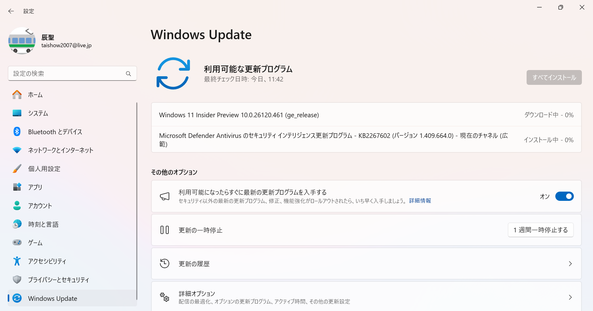

# トップページ

##  ダイジェスト
**毎週日曜日に更新**

  [最新ダイジェスト（2024/4/29～5/5）](https://note.com/taishow2020/n/n96df21872cf3)/
  [一覧](./digest/digestList.md)

##  創作物
**知識を形にする**
- [Tauriデスクトップアプリケーション](./design/tauriApp/index.md)
- [課題整理 with Dioxus](./design/dioxusApp/system.md)
##  OS
**独学環境の情報**
- [Windows Insider](https://aka.ms/DevLatest)
  - Dev Channel for Next of Windows 11 24H2 (Build 26xxx)
    - Build 26120 (Enablement Package) <span style="color: red;">*<<2024/05/04 updated from 26100>>*</span> 
      - 右下のバージョン情報はない（今後復活する）ため、代わりに「システム > バージョン情報」で確認
        
      - ダウンロード中 <span><<2024/05/04>></span>
        
    - [履歴](./history/Windows.md)
  - [Canary Channel](https://aka.ms/CanaryLatest)
- [WSL2](https://learn.microsoft.com/ja-jp/windows/wsl/install)
  - [Ubuntu 24.04](https://www.releases.ubuntu.com/noble/) <span style="color: red;">*<<2024/04/26 updated from 24.04-beta>>*</span>
    <details>
    <summary>ディストリビューション・バージョン情報 on IdeaPad</summary>

    ```
    PRETTY_NAME="Ubuntu 24.04 LTS"
    NAME="Ubuntu"
    VERSION_ID="24.04"
    VERSION="24.04 LTS (Noble Numbat)"
    VERSION_CODENAME=noble
    ID=ubuntu
    ID_LIKE=debian
    HOME_URL="https://www.ubuntu.com/"
    SUPPORT_URL="https://help.ubuntu.com/"
    BUG_REPORT_URL="https://bugs.launchpad.net/ubuntu/"
    PRIVACY_POLICY_URL="https://www.ubuntu.com/legal/terms-and-policies/privacy-policy"
    UBUNTU_CODENAME=noble
    LOGO=ubuntu-logo
    ```
    </details>
  - [Ubuntu 22.04.4](https://www.releases.ubuntu.com/jammy/) <span style="color: red;">*<<2024/02/29 updated from 22.04.3>>*</span>
    <details>
    <summary>ディストリビューション・バージョン情報 on Mini-S12</summary>

    ```
    PRETTY_NAME="Ubuntu 22.04.4 LTS"
    NAME="Ubuntu"
    VERSION_ID="22.04"
    VERSION="22.04.4 LTS (Jammy Jellyfish)"
    VERSION_CODENAME=jammy
    ID=ubuntu
    ID_LIKE=debian
    HOME_URL="https://www.ubuntu.com/"
    SUPPORT_URL="https://help.ubuntu.com/"
    BUG_REPORT_URL="https://bugs.launchpad.net/ubuntu/"
    PRIVACY_POLICY_URL="https://www.ubuntu.com/legal/terms-and-policies/privacy-policy"
    UBUNTU_CODENAME=jammy
    ```
    </details>
  - [履歴](./history/Wsl.md)
- [Chrome OS Flex](https://chromereleases.googleblog.com/search/label/ChromeOS%20Flex)
  - バージョン 124.0.6367.122 <span style="color: red;">*<<2024/05/01 updated from 123.0.6312.134>>*</span>
    <BR />
    
  - [履歴](./history/Chrome.md)
- [Oracle Cloud](./knowhow/OracleCloud.md)

## ツール
**OS/言語を問わず利用するツールの情報**
- [Visual Studio Code 1.89.1](https://code.visualstudio.com/) <span style="color: red;">*<<2024/05/10 updated from 1.89>>*</span> <BR />
  開発環境はVisual Studio Codeを中心に使っており、インストールしている拡張機能の一覧は、[VSCode拡張機能](./sub/vscodeExtensions.md)にまとめてあります。<BR />
  - 1.82で発生していたデバッグコンソールがクリアできなくなった問題は、1.82.2で解消
- [Git 2.45](https://git-scm.com/download) <span style="color: red;">*<<2024/05/01 updated from 2.44>>*</span>
- [GitHub Desktop 3.3.14](https://desktop.github.com/release-notes/) <span style="color: red;">*<<2024/05/01 updated from 3.3.11>>*</span>
  - サイトでのリリース通知があってから、アップデートできるまでにはタイムラグがありそう
- [PowerShell 7.4.2](https://github.com/PowerShell/PowerShell)
- [Docker](./knowhow/Docker.md)

##  サービス
- [Penpot 2.0](https://design.penpot.app/)

#  プログラミング言語
**独学で取り組んでいる言語／データベース／ドキュメント作成に関するノウハウは、各ページに蓄積**
- 言語共通
  - [Database & SQL](./knowhow/Database.md)
  - [Documentation](./knowhow/Documentation.md)
  - [Exercism](./knowhow/Exercism.md)
- [.NET](./knowhow/NET.md)
- [Rust](./knowhow/Rust.md)
- [Kotlin](./knowhow/Kotlin.md)
- [Java](./knowhow/Java.md)  
- [Dart/Flutter](./knowhow/Flutter.md)
- [TypeScript/JavaScript](./knowhow/TypeScript.md)
- [PHP](./knowhow/Php.md)
- [Go](./knowhow/Go.md)
- [Python](./knowhow/Python.md)
- [Pascal](./knowhow/Others.md#pascal)
- [Swift](./knowhow/Others.md#swift)
- [Carbon](./knowhow/Carbon.md)
- [LLVM](./knowhow/Others.md#llvm)
- [Unity](./knowhow/Unity.md)

# ノウハウ
**OSやツールのノウハウは、以下を参照**
- Windows
  - [USBメモリの復旧](https://jp.easeus.com/partition-manager/fix-usb-drive-incorrect-size.html)
  - [Dev Channelへの変更](https://mitomoha.hatenablog.com/entry/2023/08/11/010623)
  - [システムロケールの変更](./windows/systemLocale.md)
  - [フォントの変更](./windows/font.md)
- WSL
  - WSLバージョンを確認する
    ```
    wsl --version
    ```
  - WSLを更新する
    ```
    wsl --update
    ``` 
  - ディストリビューションのバージョンを確認する
    ```
    cat /etc/os-release
    ```
    ```
    lsb_release -a
    ```
  - [Ubuntu Upgrade to 24.04 Noble Numbat: A step by step howto guide](https://linuxconfig.org/ubuntu-upgrade-to-24-04-noble-numbat-a-step-by-step-howto-guide)
  - [【WSL2】Ubuntu 20.04.4 LTS を 22.04 LTS へアップグレードした](https://zenn.dev/ryuu/articles/upgrade-ubuntu2204-wsl)
- Chrome OS Flex
  - セットアップ
    - [インストールガイド](https://support.google.com/chromeosflex/answer/11552529?hl=ja)
    - Linux開発環境
      - [ChromebookのLinux環境(日本語)セットアップ](https://3nmt.com/chromebook_linux_japanese/)
      - [fcitx.confについて](https://qiita.com/suzuki_sh/items/1319b050ba41e03890f5)
      - github
        ```
        git config --global user.name
        git config --global user.email
        sudo apt install gnome-keyring
        ```
      - gcc
        ```
        sudo apt install build-essential
        sudo apt install gcc
        ```
      - [VS Codeで日本語入力できるようにする](https://gotoblog.org/chromebook-vscode-japanese/)
  - アップデート
    - Visual Studio Code
      
  - カスタマイズ
    - 追加された「IPAmj明朝フォント」をVisual Studio Codeで使ってみた
      
    - キーボードのショートカットのカスタマイズ
      
      
      
    - マウスボタンのカスタマイズ
      
      
  - トラブルシューティング
    - Could not create Moklist: Volume Full と出て起動できない
      - 何らかの原因でSecure Bootできなくなったことから、Bios / Secure Boot menuで、Delete all Secure Boot variablesを選択する
      - 起動できた後、安易にEnroll all Factory Default Keys しないほうが良い。 
- Git
  - Windowsでの更新
    ```
    git update-git-for-windows
    ```
  - ユーザ設定
    ```
    $ git config --global user.name "John Doe"
    $ git config --global user.email johndoe@example.com
    ```
- PowerShell
  - インストール
    ```
    winget install --id Microsoft.Powershell --source winget
    ```
  - 環境変数の確認
    ```shell
    $env:Path.Split(";")
    ```
  - [文字エンコードについて](https://learn.microsoft.com/ja-jp/powershell/module/microsoft.powershell.core/about/about_character_encoding?view=powershell-7.3)
    - PowerShell上でUTF-8(BOMなし)に変更する
      ```shell
      $PSDefaultParameterValues['Out-File:Encoding'] = 'utf8'
      ```
- PenPot
  - 日本語表示に切り替える<BR />
    
  - パーツをまとめるには、レイヤーを活用する<BR />
    
  - ファイルに出力する<BR />
    
    - ファイル名は、小文字がよい。Next.JSには、SVGがよい。
---
[プロフィール](./sub/Profile.md)
