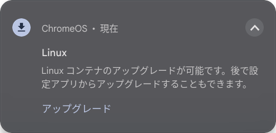
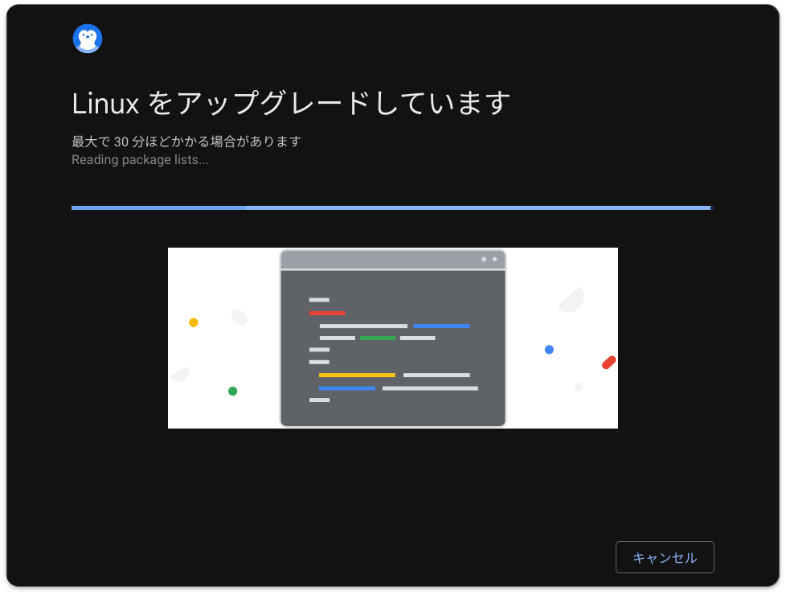
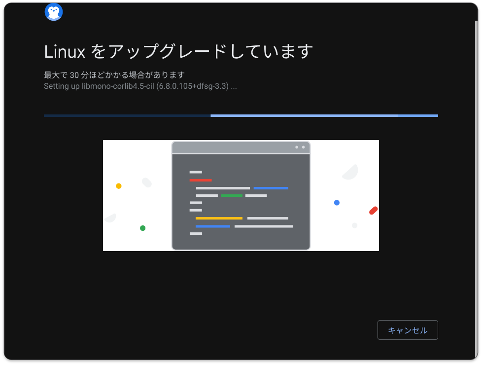
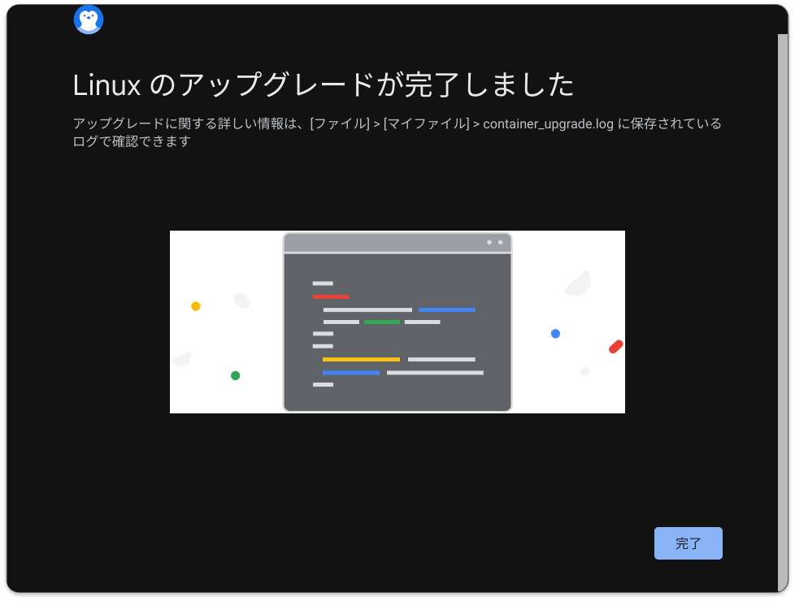

# リスキリング（プログラミング）
##  プラットフォーム
### OS
  - [Windows Insider Dev Channel](https://aka.ms/DevLatest)
    - for Windows 11 24H2 (Build 26xxx)
      - Build 26058 <span style="color: red;">*<<2024/02/22 updated from 26052>>*</span>
        
    - [履歴](./windows/history.md)
  - [WSL2](https://learn.microsoft.com/ja-jp/windows/wsl/install)
    - WSLバージョンを確認する
      ```
      wsl --version
      ```
    - WSLを更新する
      ```
      wsl --update
      ``` 
    - [Ubuntu 22.04.3](https://www.releases.ubuntu.com/jammy/)
      
      - [履歴](./wsl/history.md)
      - ディストリビューションのバージョンを確認する
        ```
        lsb_release -a
        ```
  - [Chrome OS Flex 121.0.6177.188](https://chromereleases.googleblog.com/search/label/ChromeOS%20Flex) <span style="color: red;">*<<2024/02/27 updated from 120.0.6099.275>>*</span>
    
    - Linux コンテナ（Debianアップグレード（Debian 11 -> 12 へ変更））
      
      
      
      
      
      
      - 確認
        ```
        cat /etc/os-release
        ```
        ```
        PRETTY_NAME="Debian GNU/Linux 12 (bookworm)"
        NAME="Debian GNU/Linux"
        VERSION_ID="12"
        VERSION="12 (bookworm)"
        VERSION_CODENAME=bookworm
        ID=debian
        HOME_URL="https://www.debian.org/"
        SUPPORT_URL="https://www.debian.org/support"
        BUG_REPORT_URL="https://bugs.debian.org/"
        ```
    - [履歴](./chrome/history.md)
  - [Oracle Cloud](https://github.com/Tatsukiyoshi/Weekend_Programming/wiki/OracleCloud)
### ツール
  1.  Visual Studio Code
      - [Visual Studio Code 1.87](https://code.visualstudio.com/) <span style="color: red;">*<<2024/02/29 updated from 1.86.2>>*</span> <BR />
        開発環境はVisual Studio Codeを中心に使っており、インストールしている拡張機能の一覧は、[VSCode拡張機能](_sub/vscodeExtensions.md)にまとめてあります。<BR />
        - Chrome OS Flexではコマンドでアップデート
        
        - 1.82で発生していたデバッグコンソールがクリアできなくなった問題は、1.82.2で解消
  1.  Git
      - [Git 2.43](https://git-scm.com/download) <span style="color: red;">*<<2023/11/30 updated from 2.42>>*</span>
        - Windowsでの更新
          ```
          git update-git-for-windows
          ```
      - [GitHub Desktop 3.3.8](https://desktop.github.com/release-notes/) <span style="color: red;">*<<2024/01/20 updated from 3.3.6>>*</span>
        - サイトでのリリース通知があってから、アップデートできるまでにはタイムラグがありそう
      - ユーザ設定
##  ノウハウ
### Windows
  - [USBメモリの復旧](https://jp.easeus.com/partition-manager/fix-usb-drive-incorrect-size.html)
  - [Dev Channelへの変更](https://mitomoha.hatenablog.com/entry/2023/08/11/010623)
  - システムロケールの変更 <BR>
    VSCodeでターミナル等の出力が化ける場合、システムロケールとしてUTF-8を使用する設定を有効にする
    1.  設定アプリで言語と地域を開き、管理用の言語の設定をクリック
        
    1.  地域ダイアログの「システムロケールの変更」をクリック
        
    1.  地域の設定ダイアログの「ベータ：ワールドワイド言語サポートでUnicode UTF-8を使用」にチェック
        
    1.  再起動するまで変更が有効にならないので、再起動する
  - PowerShell
    - 環境変数の確認
      ```shell
      $env:Path.Split(";")
      ```
    - [文字エンコードについて](https://learn.microsoft.com/ja-jp/powershell/module/microsoft.powershell.core/about/about_character_encoding?view=powershell-7.3)
      - PowerShell上でUTF-8(BOMなし)に変更する
        ```shell
        $PSDefaultParameterValues['Out-File:Encoding'] = 'utf8'
        ```
        $ git config --global user.name "John Doe"
        $ git config --global user.email johndoe@example.com
        ```

##  プログラミング言語
1.  言語共通
    1.  [Database & SQL](https://github.com/Tatsukiyoshi/Weekend_Programming/wiki/Database)
    1.  [Documentation](https://github.com/Tatsukiyoshi/Weekend_Programming/wiki/Documentation)
    1.  [Docker](https://github.com/Tatsukiyoshi/Weekend_Programming/wiki/Docker)
    1.  [Exercism](https://github.com/Tatsukiyoshi/Weekend_Programming/wiki/Exercism)
1.  [.NET](https://github.com/Tatsukiyoshi/Weekend_Programming/wiki/.NET)
1.  [Rust](https://github.com/Tatsukiyoshi/Weekend_Programming/wiki/Rust)
1.  [Kotlin](https://github.com/Tatsukiyoshi/Weekend_Programming/wiki/Kotlin)
1.  [Java](https://github.com/Tatsukiyoshi/Weekend_Programming/wiki/Java)
1.  [Dart/flutter](https://github.com/Tatsukiyoshi/Weekend_Programming/wiki/Flutter)
1.  [TypeScript/JavaScript](https://github.com/Tatsukiyoshi/Weekend_Programming/wiki/TypeScript)
1.  [PHP](https://github.com/Tatsukiyoshi/Weekend_Programming/wiki/Php)
1.  [Go](https://github.com/Tatsukiyoshi/Weekend_Programming/wiki/Go)
1.  [Python](https://github.com/Tatsukiyoshi/Weekend_Programming/wiki/Python)
1.  [Pascal](https://github.com/Tatsukiyoshi/Weekend_Programming/wiki/Others#pascal)
1.  [Swift](https://github.com/Tatsukiyoshi/Weekend_Programming/wiki/Others#swift)
1.  [Carbon](https://github.com/Tatsukiyoshi/Weekend_Programming/wiki/Carbon)
1.  [LLVM](https://github.com/Tatsukiyoshi/Weekend_Programming/wiki/Others#llvm)
1.  フレームワーク
    1.  [Unity](https://github.com/Tatsukiyoshi/Weekend_Programming/wiki/Unity)

---
[プロフィール](_sub/Profile.md)
