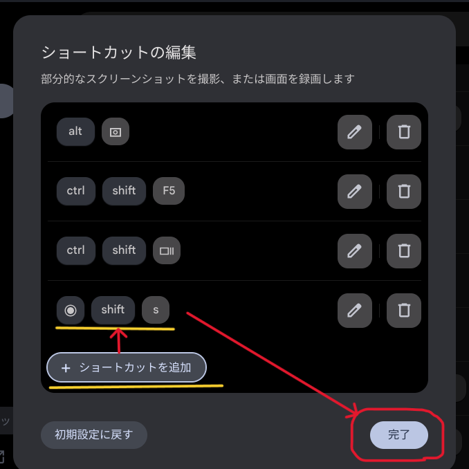

# トップページ

##  ダイジェスト
**毎週日曜日に更新**

  [最新ダイジェスト：2024/9/30～10/6](https://note.com/taishow2020/n/n0079e465ebae) / [一覧](./digest/digestList.md)

##  創作物
**知識を形にする**
- [Tauriデスクトップアプリケーション](./design/tauriApp/index.md)
- [Reactアプリ](./design/reactApp/index.md) / [詳細検討](./design/reactApp/detail.md)
- [課題整理 with Dioxus](./design/dioxusApp/system.md)

##  OS
**独学環境の情報**
- [Windows Insider](https://blogs.windows.com/windows-insider/)
  - [Dev Channel for Next of Windows 11 24H2 (Build 26100)](https://aka.ms/DevLatest)
    - Build 26120.1930 (Cumulative Update) <span style="color: red;">*<<2024/10/05 updated from 26120.1912>>*</span>
      
      - 右下のバージョン情報はない（今後復活する）ため、代わりに「システム > バージョン情報」で確認
        
    - [履歴](./history/Windows.md)
  - [Canary Channel](https://aka.ms/CanaryLatest)
- [WSL2](https://learn.microsoft.com/ja-jp/windows/wsl/install)
  1.  IdeaPad
      - [WSL 2.3.24.0](https://github.com/microsoft/WSL) <span style="color: red;">*<<2024/10/01 updated from 2.3.22.0>>*</span>

        <details>
        <summary>カーネルバージョン: 5.15.153.1-2</summary>

        ```
        WSL バージョン: 2.3.24.0
        カーネル バージョン: 5.15.153.1-2
        WSLg バージョン: 1.0.65
        MSRDC バージョン: 1.2.5620
        Direct3D バージョン: 1.611.1-81528511
        DXCore バージョン: 10.0.26100.1-240331-1435.ge-release
        Windows バージョン: 10.0.26120.1912        ```
        </details>

      - [Ubuntu 24.04.1](https://www.releases.ubuntu.com/noble/) <span style="color: red;">*<<2024/08/23 updated from 24.04>>*</span>

        <details>
        <summary>ディストリビューション・バージョン情報</summary>

        ```
        PRETTY_NAME="Ubuntu 24.04.1 LTS"
        NAME="Ubuntu"
        VERSION_ID="24.04"
        VERSION="24.04.1 LTS (Noble Numbat)"
        VERSION_CODENAME=noble
        ID=ubuntu
        ID_LIKE=debian
        HOME_URL="https://www.ubuntu.com/"
        SUPPORT_URL="https://help.ubuntu.com/"
        BUG_REPORT_URL="https://bugs.launchpad.net/ubuntu/"
        PRIVACY_POLICY_URL="https://www.ubuntu.com/legal/terms-and-policies/privacy-policy"
        UBUNTU_CODENAME=noble
        LOGO=ubuntu-logo
        ```
        </details>

  1.  Mini-S12
      - [WSL 2.3.24.0](https://github.com/microsoft/WSL) <span style="color: red;">*<<2024/10/04 updated from 2.2.4.0>>*</span>

        <details>
        <summary>カーネルバージョン: 5.15.153.1-2</summary>

        ```
        WSL バージョン: 2.3.24.0
        カーネル バージョン: 5.15.153.1-2
        WSLg バージョン: 1.0.65
        MSRDC バージョン: 1.2.5620
        Direct3D バージョン: 1.611.1-81528511
        DXCore バージョン: 10.0.26100.1-240331-1435.ge-release
        Windows バージョン: 10.0.22631.4249
        ```
        </details>

      - Ubuntu 24.04.1 <span style="color: red;">*<<2024/08/23 updated from 24.04>>*</span>

        <details>
        <summary>ディストリビューション・バージョン情報</summary>

        ```
        PRETTY_NAME="Ubuntu 24.04.1 LTS"
        NAME="Ubuntu"
        VERSION_ID="24.04"
        VERSION="24.04.1 LTS (Noble Numbat)"
        VERSION_CODENAME=noble
        ID=ubuntu
        ID_LIKE=debian
        HOME_URL="https://www.ubuntu.com/"
        SUPPORT_URL="https://help.ubuntu.com/"
        BUG_REPORT_URL="https://bugs.launchpad.net/ubuntu/"
        PRIVACY_POLICY_URL="https://www.ubuntu.com/legal/terms-and-policies/privacy-policy"
        UBUNTU_CODENAME=noble
        LOGO=ubuntu-logo
        ```
        </details>

        - [履歴](./history/Wsl.md)
- [Mac OS](https://www.apple.com/jp/macos/)
  - [Sequoia 15.0](https://www.apple.com/jp/macos/macos-sequoia/)
    <span style="color: red;">*<<2024/09/19 updated from Sonoma 14.7>>*</span>
    
    - iPhoneミラーリング
      - iOS18アップデートが必要
        
      - iOS18アップデートしました
        
        
- [Chrome OS Flex](https://chromereleases.googleblog.com/search/label/ChromeOS%20Flex)
  - バージョン 129.0.6668.80 <span style="color: red;">*<<2024/10/04 updated from 128.0.6613.163>>*</span>
    
    - 更新中
    
    - 再起動後メッセージ
      
    - 新しいシェルフ（Gマーク）
      
  - [履歴](./history/Chrome.md)
- [Oracle Cloud](./knowhow/OracleCloud.md)

## ツール
**OS/言語を問わず利用するツールの情報**
- [Visual Studio Code 1.94.0](https://code.visualstudio.com/) <span style="color: red;">*<<2024/10/04 updated from 1.93.1>>*</span>
  - [以前の新機能](./history/VSCode.md)
  - 開発環境は、Visual Studio Codeを中心に使っている。
  - インストールしている拡張機能の一覧は、[VSCode拡張機能](./sub/vscodeExtensions.md)にまとめている。<BR />
- [Git 2.46](https://git-scm.com/download) <span style="color: red;">*<<2024/08/07 updated from 2.45.1>>*</span>
- [GitHub Desktop 3.4.5](https://desktop.github.com/release-notes/) <span style="color: red;">*<<2024/09/11 updated from 3.4.2>>*</span>
  - サイトでのリリース通知があってから、アップデートできるまでにはタイムラグがありそう
  - バージョンのギャップがあれば、起動したGitHub Desktopでアップデートできるみたい
    - 3.4.0 -> 3.4.5 OK
    - 3.4.2 -> 3.4.5 NG
- [Docker](./knowhow/Docker.md)

**Windows**
- [PowerShell 7.4.5](https://github.com/PowerShell/PowerShell)<span style="color: red;">*<<2024/08/24 updated from 7.4.4>>*</span>
  - 製品版では、ストアアプリとして自動更新される
  - Insider Preview環境では、ストアで更新できない。
    - Windowsターミナルに表示されたリンクからインストーラをダウンロードする
      
    - インストーラを起動して、セットアップする
      

**Mac**
- [XCode 16.0](https://developer.apple.com/jp/xcode/) <span style="color: red;">*<<2024/09/17 Updated from 15.4>>*</span>
- [CocoaPods 1.15.2_1](https://github.com/CocoaPods/CocoaPods) <span style="color: red;">*<<2024/10/04 Updated from 1.15.2>>*</span>
- [Zed 0.152.3](https://zed.dev) <span style="color: red;">*<<2024/09/10 installed>>*</span>

##  サービス
- [Penpot 2.1](https://design.penpot.app/) <span style="color: red;">*<<2024/07/10 released>>*</span>

#  プログラミング言語
**独学で取り組んでいる言語／データベース／ドキュメント作成に関するノウハウは、各ページに蓄積**
- 言語共通
  - [Database & SQL](./knowhow/Database.md)
  - [Documentation](./knowhow/Documentation.md)
  - [Exercism](./knowhow/Exercism.md)
- [.NET](./knowhow/NET.md)
- [Rust](./knowhow/Rust.md)
- [Kotlin](./knowhow/Kotlin.md)
- [Java](./knowhow/Java.md)  
- [Dart/Flutter](./knowhow/Flutter.md)
- [TypeScript/JavaScript](./knowhow/TypeScript.md)
- [PHP](./knowhow/Php.md)
- [Go](./knowhow/Go.md)
- [Python](./knowhow/Python.md)
- [Pascal](./knowhow/Others.md#pascal)
- [Swift](./knowhow/Others.md#swift)
- [Carbon](./knowhow/Carbon.md)
- [LLVM](./knowhow/Others.md#llvm)
- [Unity](./knowhow/Unity.md)

# ノウハウ
**OSやツールのノウハウは、以下を参照**
- Windows
  - [USBメモリの復旧](https://jp.easeus.com/partition-manager/fix-usb-drive-incorrect-size.html)
  - [Dev Channelへの変更](https://mitomoha.hatenablog.com/entry/2023/08/11/010623)
  - [システムロケールの変更](./windows/systemLocale.md)
  - [フォントの変更](./windows/font.md)
- Mac
  - gitを有効化するには、コマンドラインデベロッパーツールをインストールする
    - [コマンドラインデベロッパツールのインストール](https://tracpath.com/bootcamp/git-install-to-mac.html)
      
  - gitを最新化するには、[homebrew](https://brew.sh)を使って、gitをインストールする
  - gitには、PAT(Personal Access Token)を使ってPushする
    -> [アクセストークンがないとGitHubでpushができない](https://qiita.com/masa_code/items/bb935c499f20d0fae7b0)
- WSL
  - WSLバージョンを確認する
    ```
    wsl --version
    ```
  - WSLを更新する
    ```
    wsl --update
    ``` 
  - ディストリビューションのバージョンを確認する
    ```
    cat /etc/os-release
    ```
    ```
    lsb_release -a
    ```
  - [Ubuntu Upgrade to 24.04 Noble Numbat: A step by step howto guide](https://linuxconfig.org/ubuntu-upgrade-to-24-04-noble-numbat-a-step-by-step-howto-guide)
  - [【WSL2】Ubuntu 20.04.4 LTS を 22.04 LTS へアップグレードした](https://zenn.dev/ryuu/articles/upgrade-ubuntu2204-wsl)
- Chrome OS Flex
  - セットアップ
    - [インストールガイド](https://support.google.com/chromeosflex/answer/11552529?hl=ja)
    - Linux開発環境
      - [ChromebookのLinux環境(日本語)セットアップ](https://3nmt.com/chromebook_linux_japanese/)
      - [fcitx.confについて](https://qiita.com/suzuki_sh/items/1319b050ba41e03890f5)
      - github
        ```
        git config --global user.name
        git config --global user.email
        sudo apt install gnome-keyring
        ```
      - gcc
        ```
        sudo apt install build-essential
        sudo apt install gcc
        ```
      - [VS Codeで日本語入力できるようにする](https://gotoblog.org/chromebook-vscode-japanese/)
  - アップデート
    - Visual Studio Code
      
  - カスタマイズ
    - 追加された「IPAmj明朝フォント」をVisual Studio Codeで使ってみた
      
    - キーボードのショートカットのカスタマイズ
      
      
      
    - マウスボタンのカスタマイズ
      
      
  - トラブルシューティング
    - Could not create Moklist: Volume Full と出て起動できない
      - 何らかの原因でSecure Bootできなくなったことから、Bios / Secure Boot menuで、Delete all Secure Boot variablesを選択する
      - 起動できた後、安易にEnroll all Factory Default Keys しないほうが良い。 
- Git
  - ユーザ設定
    ```
    $ git config --global user.name "John Doe"
    $ git config --global user.email johndoe@example.com
    ```
  - [ssh接続について](https://docs.github.com/ja/authentication/connecting-to-github-with-ssh/generating-a-new-ssh-key-and-adding-it-to-the-ssh-agent)
  - Windowsでの更新
    ```
    git update-git-for-windows
    ```
  - ブランチ確認
    ```
    git branch --contains
    ```
  - ブランチ変更
    ```
    git checkout <ブランチ名>
    ```
- PowerShell
  - インストール
    ```
    winget install --id Microsoft.Powershell --source winget
    ```
  - 環境変数の確認
    ```shell
    $env:Path.Split(";")
    ```
  - 一覧を時間順で出力
    - 昇順
      ```
      Get-ChildItem . | Sort-Object LastWriteTime
      ```
    - 降順
      ```
      Get-ChildItem . | Sort-Object LastWriteTime -Descending
      ```
  - [文字エンコードについて](https://learn.microsoft.com/ja-jp/powershell/module/microsoft.powershell.core/about/about_character_encoding?view=powershell-7.3)
    - PowerShell上でUTF-8(BOMなし)に変更する
      ```shell
      $PSDefaultParameterValues['Out-File:Encoding'] = 'utf8'
      ```
- PenPot
  - 日本語表示に切り替える<BR />
    
  - パーツをまとめるには、レイヤーを活用する<BR />
    
  - ファイルに出力する<BR />
    
    - ファイル名は、小文字がよい。Next.JSには、SVGがよい。
---
[プロフィール](./sub/Profile.md)
