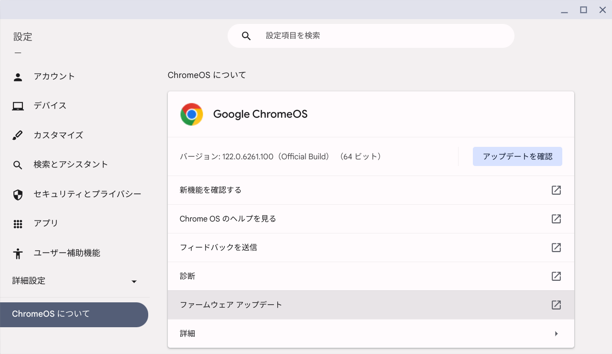

# リスキリング（プログラミング）
##  プラットフォーム
### OS
- [Windows Insider Dev Channel](https://aka.ms/DevLatest)
  - for Windows 11 24H2 (Build 26xxx)
    - Build 26080 <span style="color: red;">*<<2024/03/14 updated from 26058>>*</span>
      
    - [履歴](./windows/history.md)
- [WSL2](https://learn.microsoft.com/ja-jp/windows/wsl/install)
  - WSLバージョンを確認する
    ```
    wsl --version
    ```
  - WSLを更新する
    ```
    wsl --update
    ``` 
  - [Ubuntu 22.04.4](https://www.releases.ubuntu.com/jammy/) <span style="color: red;">*<<2024/02/29 updated from 22.04.3>>*</span>
    ```
    cat /etc/os-release
    ```
    ```
    PRETTY_NAME="Ubuntu 22.04.4 LTS"
    NAME="Ubuntu"
    VERSION_ID="22.04"
    VERSION="22.04.4 LTS (Jammy Jellyfish)"
    VERSION_CODENAME=jammy
    ID=ubuntu
    ID_LIKE=debian
    HOME_URL="https://www.ubuntu.com/"
    SUPPORT_URL="https://help.ubuntu.com/"
    BUG_REPORT_URL="https://bugs.launchpad.net/ubuntu/"
    PRIVACY_POLICY_URL="https://www.ubuntu.com/legal/terms-and-policies/privacy-policy"
    UBUNTU_CODENAME=jammy
    ```
    - [履歴](./wsl/history.md)
    - ディストリビューションのバージョンを確認する
      ```
      lsb_release -a
      ```
- [Chrome OS Flex 122.0.6261.100](https://chromereleases.googleblog.com/search/label/ChromeOS%20Flex) <span style="color: red;">*<<2024/03/09 updated from 121.0.6167.212>>*</span>
  
  - [履歴](./chrome/history.md)
- [Oracle Cloud](https://github.com/Tatsukiyoshi/Weekend_Programming/wiki/OracleCloud)

### ツール
- Visual Studio Code
  - [Visual Studio Code 1.87.2](https://code.visualstudio.com/) <span style="color: red;">*<<2024/03/13 updated from 1.87.1>>*</span> <BR />
    開発環境はVisual Studio Codeを中心に使っており、インストールしている拡張機能の一覧は、[VSCode拡張機能](_sub/vscodeExtensions.md)にまとめてあります。<BR />
    - Chrome OS Flexではコマンドでアップデート
      
    - 1.82で発生していたデバッグコンソールがクリアできなくなった問題は、1.82.2で解消
- Git
  - [Git 2.44](https://git-scm.com/download) <span style="color: red;">*<<2024/03/10 updated from 2.43>>*</span>
    - Windowsでの更新
      ```
      git update-git-for-windows
      ```
  - [GitHub Desktop 3.3.11](https://desktop.github.com/release-notes/) <span style="color: red;">*<<2024/03/10 updated from 3.3.8>>*</span>
    - サイトでのリリース通知があってから、アップデートできるまでにはタイムラグがありそう
    - ユーザ設定
- PowerShell 7.4.1
  - インストール
    ```
    winget install --id Microsoft.Powershell --source winget
    ```
  - 環境変数の確認
    ```shell
    $env:Path.Split(";")
    ```
  - [文字エンコードについて](https://learn.microsoft.com/ja-jp/powershell/module/microsoft.powershell.core/about/about_character_encoding?view=powershell-7.3)
    - PowerShell上でUTF-8(BOMなし)に変更する
      ```shell
      $PSDefaultParameterValues['Out-File:Encoding'] = 'utf8'
      ```
      $ git config --global user.name "John Doe"
      $ git config --global user.email johndoe@example.com
      ```

##  ノウハウ
### Windows
  - [USBメモリの復旧](https://jp.easeus.com/partition-manager/fix-usb-drive-incorrect-size.html)
  - [Dev Channelへの変更](https://mitomoha.hatenablog.com/entry/2023/08/11/010623)
  - システムロケールの変更 <BR>
    VSCodeでターミナル等の出力が化ける場合、システムロケールとしてUTF-8を使用する設定を有効にする
    1.  設定アプリで言語と地域を開き、管理用の言語の設定をクリック
        
    1.  地域ダイアログの「システムロケールの変更」をクリック
        
    1.  地域の設定ダイアログの「ベータ：ワールドワイド言語サポートでUnicode UTF-8を使用」にチェック
        
    1.  再起動するまで変更が有効にならないので、再起動する

##  プログラミング言語
- 言語共通
  - [Database & SQL](https://github.com/Tatsukiyoshi/Weekend_Programming/wiki/Database)
  - [Documentation](https://github.com/Tatsukiyoshi/Weekend_Programming/wiki/Documentation)
  - [Docker](https://github.com/Tatsukiyoshi/Weekend_Programming/wiki/Docker)
  - [Exercism](https://github.com/Tatsukiyoshi/Weekend_Programming/wiki/Exercism)
- [.NET](https://github.com/Tatsukiyoshi/Weekend_Programming/wiki/.NET)
- [Rust](https://github.com/Tatsukiyoshi/Weekend_Programming/wiki/Rust)
- [Kotlin](https://github.com/Tatsukiyoshi/Weekend_Programming/wiki/Kotlin)
- [Java](https://github.com/Tatsukiyoshi/Weekend_Programming/wiki/Java)
- [Dart/Flutter](https://github.com/Tatsukiyoshi/Weekend_Programming/wiki/Flutter)
- [TypeScript/JavaScript](https://github.com/Tatsukiyoshi/Weekend_Programming/wiki/TypeScript)
- [PHP](https://github.com/Tatsukiyoshi/Weekend_Programming/wiki/Php)
- [Go](https://github.com/Tatsukiyoshi/Weekend_Programming/wiki/Go)
- [Python](https://github.com/Tatsukiyoshi/Weekend_Programming/wiki/Python)
- [Pascal](https://github.com/Tatsukiyoshi/Weekend_Programming/wiki/Others#pascal)
- [Swift](https://github.com/Tatsukiyoshi/Weekend_Programming/wiki/Others#swift)
- [Carbon](https://github.com/Tatsukiyoshi/Weekend_Programming/wiki/Carbon)
- [LLVM](https://github.com/Tatsukiyoshi/Weekend_Programming/wiki/Others#llvm)
- [Unity](https://github.com/Tatsukiyoshi/Weekend_Programming/wiki/Unity)

---
[プロフィール](_sub/Profile.md)
