# トップページ <a id="Top"></a>
[ダイジェスト](#Digest) | [環境(OS/ツール/サービス)](#Environment) | [ノウハウ](#Knowhow)

---
##  ダイジェスト <a id="Digest"></a>
```
毎週日曜日に更新
```
[最新ダイジェスト（2025/5/18～2025/5/24）](/digest/digest_3rd_May2025.md) / [一覧](/digest/digestList.md)

##  創作物
```
知識を形にする
```
- [全角入力対応コンポーネント](./design/fullWidthInputField/design.md)
- [Tauriデスクトップアプリケーション](./design/tauriApp/index.md)
- [Reactアプリ](./design/reactApp/index.md) / [詳細検討](./design/reactApp/detail.md)
- [課題整理 with Dioxus](./design/dioxusApp/system.md)

##  環境 <a id="Environment"></a>
```
独学環境の情報
```
[OS](#os) | [ツール](#Tools) | [サービス](#Service)

OS                                 |Hardware            |Language                                          |Link
-----------------------------------|--------------------|--------------------------------------------------|--
[Windows](#Windows)                |Mini-S12            |.NET / Rust / TypeScript                          |[<*>](#WindowsKnowhow)
[Windows on Arm](#WindowsArm)      |OmniBook X          |                                                  |↑
[Windows Insider](#WindowsInsider) |OmniBook Ultra Flip |.NET / Rust / Kotlin / Java / Flutter / TypeScript|↑
[Mac OS](#Mac)                     |MacBook Air         |Rust / Flutter                                    |[<*>](#MacKnowhow)
[Chrome OS Flex](#ChromeOSFlex)    |IdeaPad             |Rust / Flutter / Python / Go / PHP                |[<*>](#ChromeKnowhow)
[Ubuntu Desktop](#UbuntuDesktop)   |TransBook           |Carbon                                            |[<*>](#UbuntuKnowhow)

- 移行計画
  - (v) Windows Insider環境 を OmniBook Ultra Flip に構築
  - (v) Windows on Arm環境追加（OmniBook X）
  - (v) Chrome OS Flex環境を IdeaPad に再構築
  - (v) Ubuntu Desktop環境を構築

### OS <a id="OS"></a>
- [Windows 11](https://www.microsoft.com/ja-jp/windows/?r=1)<a id="Windows"></a>
  - Windows 11 24H2 <span style="color: red;">*<<2024/11/23 updated from 23H2(10.0.22631.4460)>>*</span>
    - ついに、24H2が降臨
      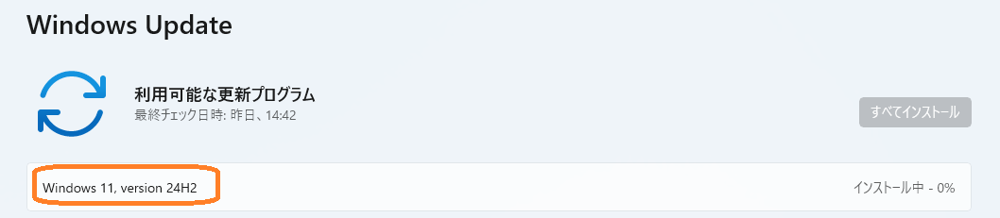
    - しかし、空き容量不足のため、WSL2アンインストールで何とか準備OK！
      
    - インストール中に謎のフォルダ出現（2025年？）
      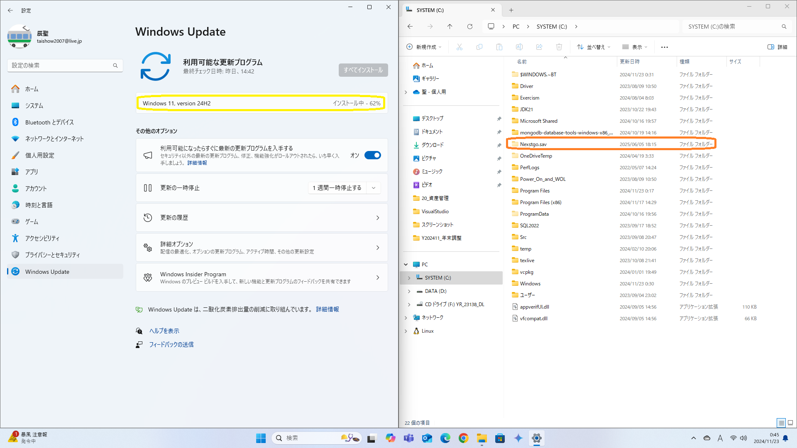
    - 更新完了後のバージョン情報
      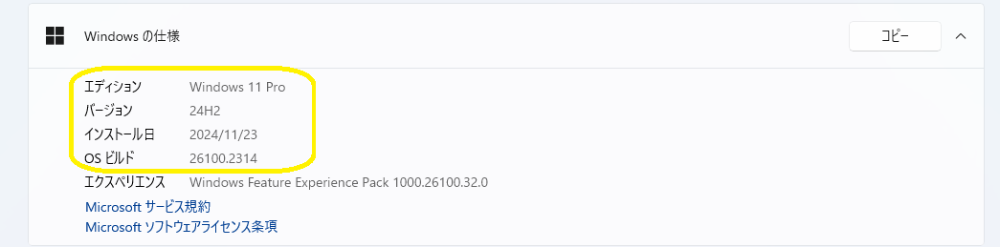
  - Windows 11 on Arm 24H2 Build 26100.3476 <span style="color: red;">*<<2025/03/13 updated>>*</span><a id="WindowsArm"></a>
    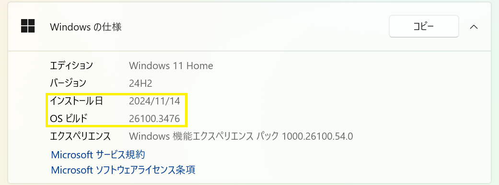
  - Updated to Windows Insider Dev Channel
    - Windows 11 24H2 <span style="color: red;">*<<2024/11/14 setup>>*</span>
      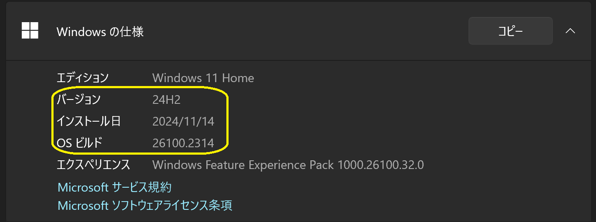

- [Windows Insider](https://blogs.windows.com/windows-insider/)<a id="WindowsInsider"></a>
  - [Dev Channel for Windows 11 25H2 (Build 26200 / Next of Windows 11 24H2)](https://aka.ms/DevLatest)
    - Build 26200.5603 (Cumulative Update) <span style="color: red;">*<<2025/05/20 updated from Build 26200.5600 >>*</span>
      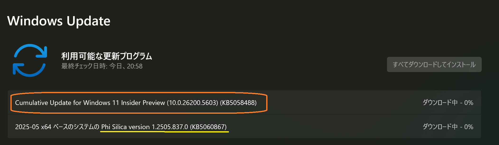
      - ウォーターマーク（右下のバージョン情報：今後復活予定）の代わりに「システム > バージョン情報」で確認
        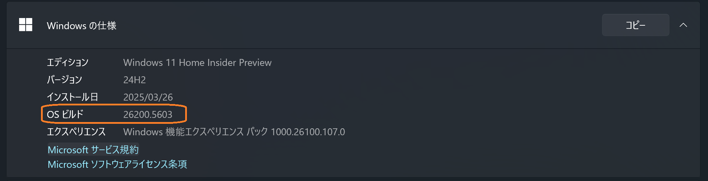
      - AIコンポーネントも更新
        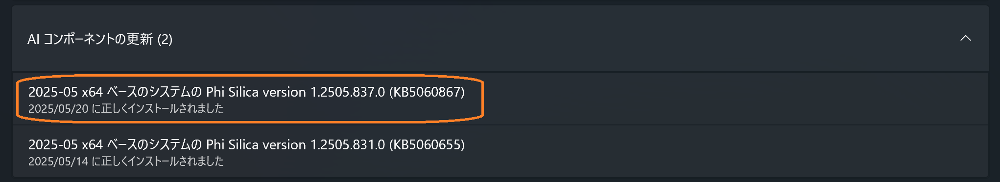
    - [履歴](./history/Windows.md)
  - [Canary Channel](https://aka.ms/CanaryLatest)

  - [WSL2](https://learn.microsoft.com/ja-jp/windows/wsl/install)
    - [WSL 2.5.6.0](https://github.com/microsoft/WSL) <span style="color: red;">*<<2025/04/09 auto updated from 2.5.4.0>>*</span>

      <details>
      <summary>カーネルバージョン: 6.6.84.1-1</summary>

      ```
      WSL バージョン: 2.5.6.0
      カーネル バージョン: 6.6.84.1-1
      WSLg バージョン: 1.0.66
      MSRDC バージョン: 1.2.6074
      Direct3D バージョン: 1.611.1-81528511
      DXCore バージョン: 10.0.26100.1-240331-1435.ge-release
      Windows バージョン: 10.0.26200.5518
      ```
      </details>

    - [Ubuntu 24.04.2](https://www.releases.ubuntu.com/noble/) <span style="color: red;">*<<2025/02/06 updated from Ubuntu 24.04.1>>*</span>
      - [Upgrade@2025/02/01](./sub/Ubuntu/20250201_Upgrade.md)

      <details>
      <summary>ディストリビューション・バージョン情報</summary>

      ```
      PRETTY_NAME="Ubuntu 24.04.2 LTS"
      NAME="Ubuntu"
      VERSION_ID="24.04"
      VERSION="24.04.2 LTS (Noble Numbat)"
      VERSION_CODENAME=noble
      ID=ubuntu
      ID_LIKE=debian
      HOME_URL="https://www.ubuntu.com/"
      SUPPORT_URL="https://help.ubuntu.com/"
      BUG_REPORT_URL="https://bugs.launchpad.net/ubuntu/"
      PRIVACY_POLICY_URL="https://www.ubuntu.com/legal/terms-and-policies/privacy-policy"
      UBUNTU_CODENAME=noble
      LOGO=ubuntu-logo
      ```
      </details>

    - [履歴](./history/Wsl.md)

- [Mac OS](https://www.apple.com/jp/macos/)<a id="Mac"></a>
  - [Sequoia 15.5](https://www.apple.com/jp/macos/macos-sequoia/)
    <span style="color: red;">*<<2025/05/16 updated from Sequoia 15.4.1>>*</span>
    - ソフトウェアアップデート
      
    - バージョン情報
      
  - [履歴](./history/Mac.md)

- [Chrome OS Flex](https://chromereleases.googleblog.com/search/label/ChromeOS%20Flex)<a id="ChromeOSFlex"></a>
  - バージョン 136.0.7103.142 <span style="color: red;">*<<2025/05/25 updated from 136.0.7103.102>>*</span>
    
      - 更新中
        
      - [Debian 12.11](https://www.debian.org/) <span style="color: red;">*<<2025/05/25 updated from 12.10>>*</span>
        [Update Log](/sub/Chrome/20250525_Update.md)
        <details>
        <summary>ディストリビューション・バージョン情報</summary>

        ```
        PRETTY_NAME="Debian GNU/Linux 12 (bookworm)"
        NAME="Debian GNU/Linux"
        VERSION_ID="12"
        VERSION="12 (bookworm)"
        VERSION_CODENAME=bookworm
        ID=debian
        HOME_URL="https://www.debian.org/"
        SUPPORT_URL="https://www.debian.org/support"
        BUG_REPORT_URL="https://bugs.debian.org/"
        ```
  - [履歴](./history/Chrome.md)

- [Ubuntu Desktop 25.04](https://jp.ubuntu.com/download) <span style="color: red;">*<<2025/04/23 updated from 24.10>>*</span><a id="UbuntuDesktop"></a>
  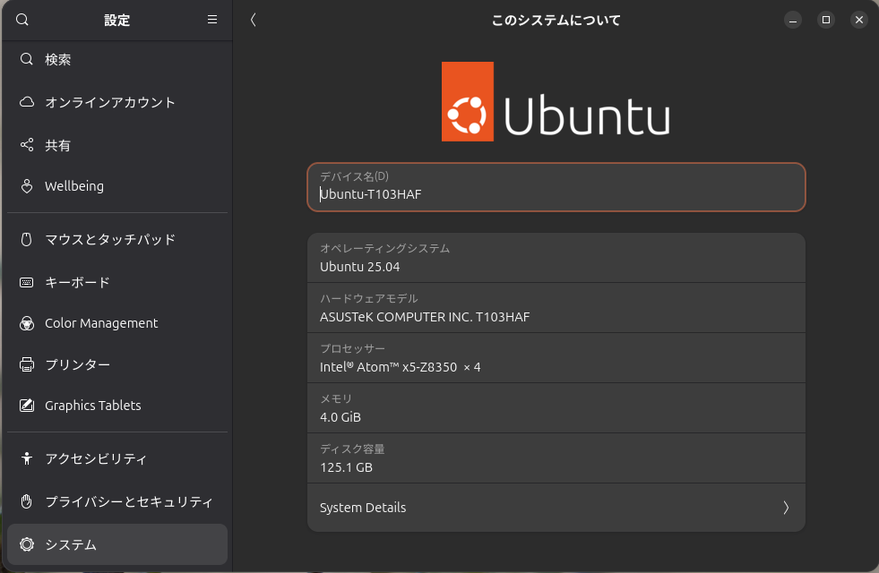
  - [Upgrade Log](./sub/Ubuntu/20250423_Upgrade.md)

  <details>
  <summary>System Details</summary>

  ```
  # System Details Report
  ---

  ## Report details
  - **Date generated:**                              2025-04-23 21:46:18

  ## Hardware Information:
  - **Hardware Model:**                              ASUSTeK COMPUTER INC. T103HAF
  - **Memory:**                                      4.0 GiB
  - **Processor:**                                   Intel® Atom™ x5-Z8350  × 4
  - **Graphics:**                                    Intel® HD Graphics (CHV)
  - **Disk Capacity:**                               125.1 GB

  ## Software Information:
  - **Firmware Version:**                            T103HAF.307
  - **OS Name:**                                     Ubuntu 25.04
  - **OS Build:**                                    (null)
  - **OS Type:**                                     64-bit
  - **GNOME Version:**                               48
  - **Windowing System:**                            Wayland
  - **Kernel Version:**                              Linux 6.14.0-15-generic
  ```
  </details>

  <details>
  <summary>ディストリビューション・バージョン情報</summary>

  ```
  PRETTY_NAME="Ubuntu 25.04"
  NAME="Ubuntu"
  VERSION_ID="25.04"
  VERSION="25.04 (Plucky Puffin)"
  VERSION_CODENAME=plucky
  ID=ubuntu
  ID_LIKE=debian
  HOME_URL="https://www.ubuntu.com/"
  SUPPORT_URL="https://help.ubuntu.com/"
  BUG_REPORT_URL="https://bugs.launchpad.net/ubuntu/"
  PRIVACY_POLICY_URL="https://www.ubuntu.com/legal/terms-and-policies/privacy-policy"
  UBUNTU_CODENAME=plucky
  LOGO=ubuntu-logo
  ```
  </details>

  - カーネルバージョン
    - 6.14.0-15 / Ubuntu 25.04
    - 6.11.0-13 / Ubuntu 24.10
    - 6.8.0-51 / Ubuntu 24.04

  - [履歴](./history/Ubuntu%20Desktop.md)

- [Oracle Cloud](./knowhow/OracleCloud.md)

### ツール <a id="Tools"></a>
```
OS/言語を問わず利用するツールの情報
```
- [Visual Studio Code 1.100.2](https://code.visualstudio.com/) <span style="color: red;">*<<2025/05/16 updated from 1.100.1>>*</span>
  - [以前の新機能](./history/VSCode.md)
  - 開発環境は、Visual Studio Codeを中心に使っている。
  - インストールしている拡張機能の一覧は、[VSCode拡張機能](./sub/vscodeExtensions.md)にまとめている。<BR />
- [Git](https://git-scm.com/download)
  - Windows
    - Git 2.49.0 <span style="color: red;">*<<2025/03/18 updated from 2.48.1>>*</span>
  - Mac OS
    - Git 2.49.0 <span style="color: red;">*<<2025/03/18 updated from 2.48.1>>*</span>

**Windows**
- [PowerShell 7.5.1](https://github.com/PowerShell/PowerShell)<span style="color: red;">*<<2025/04/28 updated from 7.5.0>>*</span>
  - 製品版では、ストアアプリとして自動更新される
    ```
    2025/1/25 ストアアプリにて更新できないため、PowerShellの起動時に出るアップデートを通知するメッセージ内のリンクからダウンロード
    ```
  - Windows Insider 環境では、ストアで更新できない。
    - Windowsターミナルに表示されたリンクからインストーラをダウンロードする
      
    - インストーラを起動して、セットアップする
      
- [GitHub Desktop 3.4.16](https://desktop.github.com/release-notes/) <span style="color: red;">*<<2025/02/23 updated from 3.4.8>>*</span>
  - サイトでのリリース通知があってから、アップデートできるまでにはタイムラグがありそう
  - 起動したGitHub Desktopでアップデートできる場合とできない場合があるみたい
    - 3.4.5 -> 3.4.6 OK
    - 3.4.0 -> 3.4.5 OK
    - 3.4.2 -> 3.4.5 NG
- [Docker](./knowhow/Docker.md)

**Mac**
- [Xcode 16.3](https://developer.apple.com/jp/xcode/) <span style="color: red;">*<<2025/04/01 Updated from 16.2>>*</span>
  
- [CocoaPods 1.16.2](https://github.com/CocoaPods/CocoaPods) <span style="color: red;">*<<2025/01/09 Updated from 1.16.1>>*</span>
- [Zed 0.152.3](https://zed.dev) <span style="color: red;">*<<2024/09/10 installed>>*</span>
- [GIMP 3.0](https://www.gimp.org/) <span style="color: red;">*<<2025/03/18 updated from 3.0.0 RC1>>*</span>

### サービス <a id="Service"></a>
- [Penpot 2.1](https://design.penpot.app/) <span style="color: red;">*<<2024/07/10 released>>*</span>

[トップへ戻る](#Top)

##  ノウハウ <a id="Knowhow"></a>
### プログラミング言語 <a id="ProgrammingLanguage"></a>
```
独学で取り組んでいる言語／データベース／ドキュメント作成に関するノウハウは、各ページに蓄積
```
言語                                 |最新トピック||
-------------------------------------|----------|--------
[.NET](./knowhow/NET.md)             |2025/05/14|Update: Visual Studio 2022 17.14.0 / .NET 8.0.16 / .NET 9.0.5
[Rust](./knowhow/Rust.md)            |2025/05/14|Update: RustRover 2025.1.2
[Kotlin](./knowhow/Kotlin.md)        |2025/05/16|Update: Android Studio Narwhal 2025.1.1 Canary 10 / IntelliJ IDEA 2025.1.1.1 / Kotlin 2.1.21
[Java](./knowhow/Java.md)            |2025/03/21|Setup: Pleiades 2025-03
[Flutter](./knowhow/Flutter.md)      |2025/03/05|Update: Flutter 3.29.0
[TypeScript](./knowhow/TypeScript.md)|2025/05/22|Update: Bun 1.2.14
[Python](./knowhow/Python.md)        |2025/03/08|Setup: Python 3.13.2
[Carbon & LLVM](./knowhow/Carbon.md) |2025/04/27|Update: carbon on Ubuntu Desktop 25.04
[Go](./knowhow/Go.md)                |2025/05/04|Setup: Go 1.24.2 / GoLand 2025.1
[PHP](./knowhow/Php.md)              |2025/05/04|Setup: PHP 8.2.8 / PhpStorm 2025.1

言語共通                                    |日付      |トピック
-------------------------------------------|----------|--------
[Database & SQL](./knowhow/Database.md)    |2025/05/17|Update: PostgreSQL 17.5
[Documentation](./knowhow/Documentation.md)|-
[Exercism](./knowhow/Exercism.md)          |2024/08/03|tournament@Rust finished

その他（更新停滞）                          |日付      |トピック
-------------------------------------------|----------|--------
[Pascal](./knowhow/Others.md#pascal)
[Swift](./knowhow/Others.md#swift)
[Unity](./knowhow/Unity.md)

### OS／ツール
```
OSやツールのノウハウは、以下を参照
```
- Windows <a id="WindowsKnowhow"></a>
  - [USBメモリの復旧](https://jp.easeus.com/partition-manager/fix-usb-drive-incorrect-size.html)
  - [Dev Channelへの変更](https://mitomoha.hatenablog.com/entry/2023/08/11/010623)
  - [システムロケールの変更](./windows/systemLocale.md)
  - [フォントの変更](./windows/font.md)
- Mac <a id="MacKnowhow"></a>
  - gitを有効化するには、コマンドラインデベロッパーツールをインストールする
    - [コマンドラインデベロッパツールのインストール](https://tracpath.com/bootcamp/git-install-to-mac.html)
      
  - gitを最新化するには、[homebrew](https://brew.sh)を使って、gitをインストールする
  - gitには、PAT(Personal Access Token)を使ってPushする
    -> [アクセストークンがないとGitHubでpushができない](https://qiita.com/masa_code/items/bb935c499f20d0fae7b0)
  - iOS Simulatorの更新
    - [Xcodeを使用してiOS simulatorを追加する方法](https://qiita.com/shint_1/items/656044190516a3926364)
    - XCodeで新しいバージョンをダウンロードする
    - XCodeで古いバージョンは削除し、単一のバージョンのみとすること（複数存在するとシミュレータでの実行時にエラーとなる模様）
    
    
  - CocoaPods
    - Homebrew / CocoaPodsのインストール
      ```
      /bin/bash -c "$(curl -fsSL https://raw.githubusercontent.com/Homebrew/install/HEAD/install.sh)"
      ```
      ```
      brew install cocoapods
      ```
    - バージョンを確認する
      ```
      pod --version
      ```
    - 最新に更新する(CocoaPods/Ruby/Git)
      ```
      brew update
      brew upgrade
      ```
- WSL
  - WSLバージョンを確認する
    ```
    wsl --version
    ```
  - WSLを更新する
    ```
    wsl --update
    ``` 
  - ディストリビューションのバージョンを確認する
    ```
    cat /etc/os-release
    ```
    ```
    lsb_release -a
    ```
  - [Ubuntu Upgrade to 24.04 Noble Numbat: A step by step howto guide](https://linuxconfig.org/ubuntu-upgrade-to-24-04-noble-numbat-a-step-by-step-howto-guide)
  - [【WSL2】Ubuntu 20.04.4 LTS を 22.04 LTS へアップグレードした](https://zenn.dev/ryuu/articles/upgrade-ubuntu2204-wsl)
- Chrome OS Flex <a id="ChromeKnowhow"></a>
  - セットアップ
    - [インストールガイド](https://support.google.com/chromeosflex/answer/11552529?hl=ja)
    - Linux開発環境
      - [ChromebookのLinux環境(日本語)セットアップ](https://3nmt.com/chromebook_linux_japanese/)
      - [fcitx.confについて](https://qiita.com/suzuki_sh/items/1319b050ba41e03890f5)
      - github
        ```
        git config --global user.name
        git config --global user.email
        sudo apt install gnome-keyring
        ```
      - gcc
        ```
        sudo apt install build-essential
        sudo apt install gcc
        ```
      - [VS Codeで日本語入力できるようにする](https://gotoblog.org/chromebook-vscode-japanese/)
      - Debianのバージョンを確認する方法
        ```
        cat /etc/debian_version
        ```
  - アップデート
    - Visual Studio Code
      
  - カスタマイズ
    - 追加された「IPAmj明朝フォント」をVisual Studio Codeで使ってみた
      
    - キーボードのショートカットのカスタマイズ
      
      
      
    - マウスボタンのカスタマイズ
      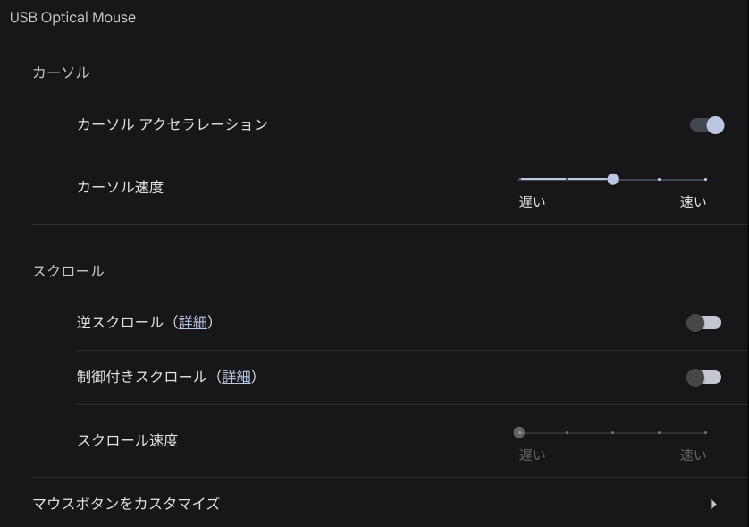
      
  - トラブルシューティング
    - Could not create Moklist: Volume Full と出て起動できない
      - 何らかの原因でSecure Bootできなくなったことから、Bios / Secure Boot menuで、Delete all Secure Boot variablesを選択する
      - 起動できた後、安易にEnroll all Factory Default Keys しないほうが良い。
- Ubuntu <a id="UbuntuKnowhow"></a>
  - ISOイメージを作成する
    - [balenaEtcher - Flash OS images to SD cards & USB drives](https://etcher.balena.io/)
  - スクリーンショット
    - 既定値では、SHIFT+CTRL+ALT+Rで撮ることが可能
- GitHub
  - GitHub Copilot Free
    
  - GitHub Pages
    - コンテンツを更新したにもかかわらず、更新した内容を表示できない
      - ビルドエラーとなっていることが考えられるので、GitHub Actionsが完了しているかを確認する
    - Liquid Error
      - コード例を引用している場合、記述によってLiquidによるパースがエラーとなるため、パース対象から除外する
        ```js
        ...
        
        sx={{ '& .MuiTextField-root': { m: 1, width: '25ch' }, p: 3 }}
        
        ...
        ```
  - GitHub Issue
    - GitHubも改良が進んでおり、Issueを作成すると、そのIssueのためのBranchを作成し、そのBranchをGitHub Desktopで開くとかもできる
      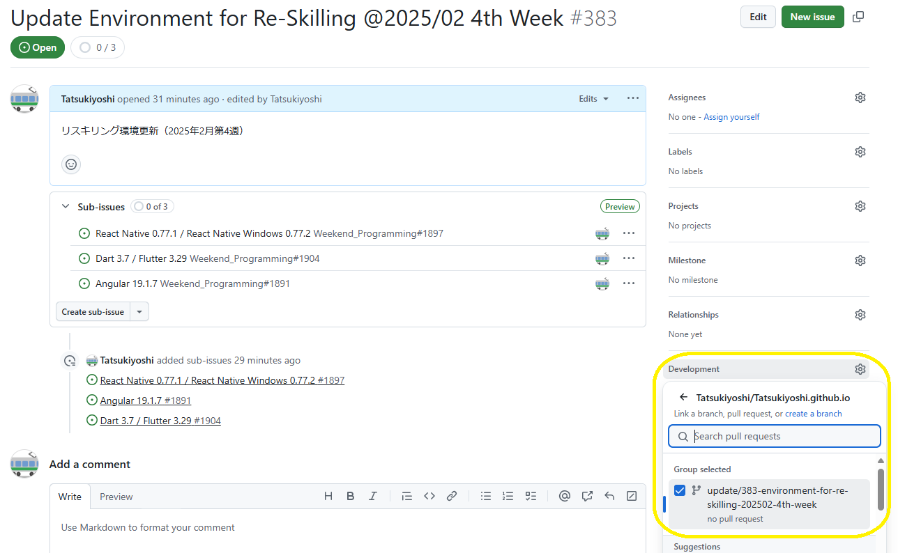
    - BranchからのMerge Requestを作成すると、Issueに関連付けられる
      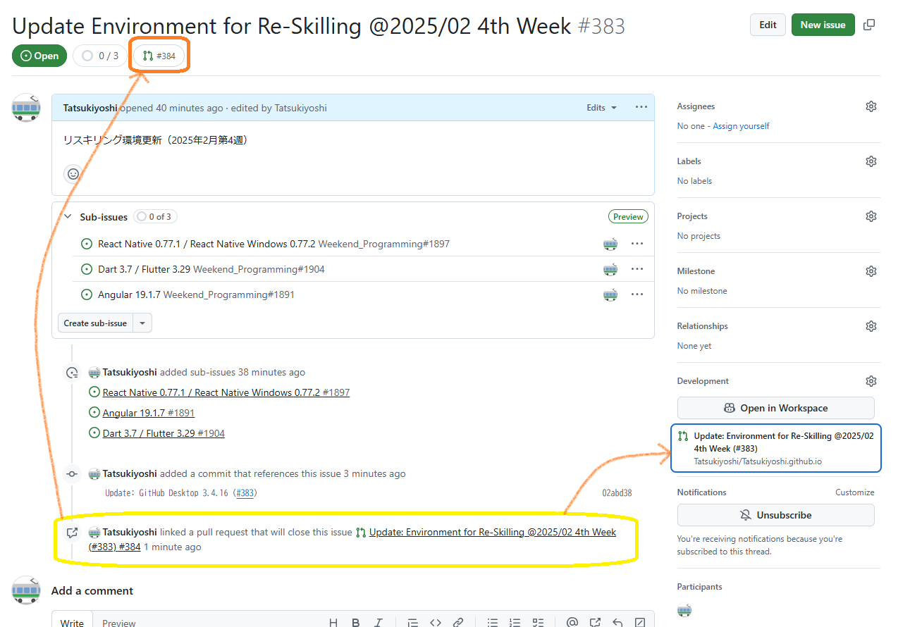
    - Sub Issueの並び替え（Issueにカーソルを合わせるとカーソルが手になって並び替えできる）
      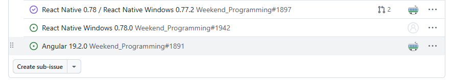
      - Windows Insider 環境のEdgeではできない模様（カーソルが手に変わらない！）
        
  - GitHub ProjectsでBoard作成してみた
    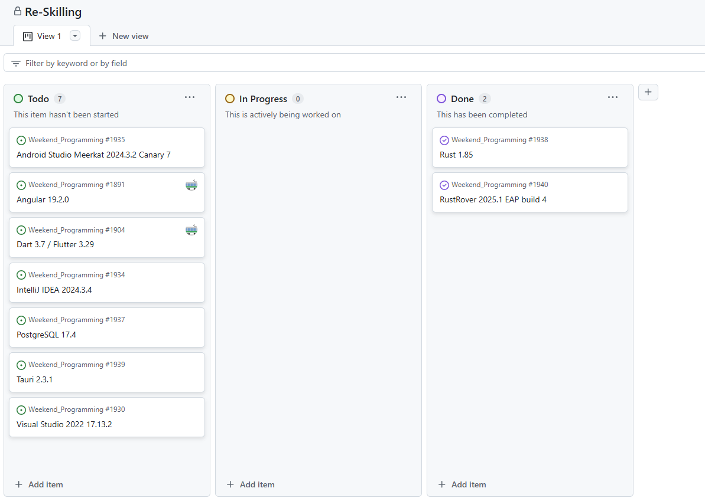
- Git
  - ユーザ設定
    ```
    $ git config --global user.name "John Doe"
    $ git config --global user.email johndoe@example.com
    ```
  - [ssh接続について](https://docs.github.com/ja/authentication/connecting-to-github-with-ssh/generating-a-new-ssh-key-and-adding-it-to-the-ssh-agent)
  - Windowsでの更新
    ```
    git update-git-for-windows
    ```
  - Macでの更新
    ```
    brew upgrade git
    ```
    <details>
    <summary>Update Log</summary>

    ```
    ==> Auto-updating Homebrew...
    Adjust how often this is run with HOMEBREW_AUTO_UPDATE_SECS or disable with
    HOMEBREW_NO_AUTO_UPDATE. Hide these hints with HOMEBREW_NO_ENV_HINTS (see `man brew`).
    ==> Auto-updated Homebrew!
    Updated 2 taps (homebrew/core and homebrew/cask).
    ==> New Formulae
    ab-av1                                   libcdio-paranoia
    ad                                       libgoa
    adapterremoval                           libgudev
    adaptivecpp                              libpostal
    algolia                                  libpostal-rest
    alloy                                    ludusavi
    anyquery                                 lume
    aqtinstall                               mac
    aqua                                     martin
    arelo                                    md2pdf
    astroterm                                mdq
    async_simple                             mox
    babelfish                                mummer
    bacon-ls                                 nak
    bagels                                   netfetch
    bazel@7                                  nmstatectl
    behaviortree.cpp                         node-red
    bombardier                               nom
    bpmnlint                                 nping
    catgirl                                  nuitka
    cf-terraforming                          org-formation
    cfnctl                                   otel-cli
    chiko                                    ov
    cloud-provider-kind                      pdfly
    cloudfoundry-cli                         pgbackrest
    code2prompt                              pgrx
    comrak                                   pivy
    cot                                      pkl-lsp
    cspell                                   postgresql-hll
    dbg-macro                                precious
    decompose                                projectable
    dockcheck                                protobuf@29
    dockerfilegraph                          punktf
    dtsroll                                  ra-multiplex
    dud                                      ramalama
    dvr-scan                                 rasterio
    dyff                                     ratarmount
    evans                                    rattler-index
    evil-helix                               redocly-cli
    excalidraw-converter                     restish
    exomizer                                 reuse
    falcosecurity-libs                       rhai
    fancy-cat                                rink
    fastly                                   rpds-py
    feluda                                   ruby-lsp
    fiona                                    rustic
    flow-control                             rustywind
    fortitude                                sby
    foundry                                  scryer-prolog
    fpm                                      sdl3
    fricas                                   sdl3_image
    garnet                                   sdl3_ttf
    gauth                                    semver
    gcr                                      sentry-native
    gdtoolkit                                sequoia-sqv
    gersemi                                  shuttle
    ggh                                      sitefetch
    git-graph                                snowflake-cli
    git-mob                                  soft-serve
    globstar                                 sql-formatter
    gnome-builder                            sttr
    gnome-online-accounts                    sv2v
    go@1.23                                  symfony-cli
    goimports                                taskflow
    gomi                                     terraform-cleaner
    gotz                                     terraform-iam-policy-validator
    gowall                                   text-embeddings-inference
    grafana-alloy                            tf-summarize
    gtree                                    tfprovidercheck
    gut                                      tgpt
    havener                                  threatcl
    hcledit                                  tml
    hishtory                                 todoist
    hk                                       trdsql
    hl                                       typioca
    hypopg                                   ubi
    i686-elf-grub                            umka-lang
    icann-rdap                               umockdev
    icu4c@77                                 unciv
    identme                                  vfkit
    iguana                                   visidata
    immich-go                                vscli
    infisical                                wfa2-lib
    jaguar                                   x86_64-elf-grub
    jenkins-cli                              xeyes
    jira-cli                                 xk6
    jsrepo                                   xlsclients
    jupytext                                 xprop
    kafkactl                                 xwininfo
    kapp                                     yalantinglibs
    kbld                                     yamlfix
    keeper-commander                         yices2
    keyutils                                 yoke
    kirimase                                 yor
    koji                                     ytt
    krep                                     zimfw
    largetifftools                           zlib-ng-compat
    lazyjj                                   zlib-rs
    lazyjournal                              zns
    lazysql
    ==> New Casks
    autogram                                 granola
    automounterhelper                        ik-product-manager
    badgeify                                 imaging-edge-webcam
    batfi                                    irpf2025
    block-goose                              istatistica-core
    browser-actions                          jumpcloud-password-manager
    candy-crisis                             kate
    charles@4                                kunkun
    chatwise                                 leader-key
    cherry-studio                            linearmouse@beta
    cloudflare-warp@beta                     losslessswitcher
    consul                                   luanti
    coterm                                   macskk
    dana-dex                                 mitti
    desktime                                 mouseless@preview
    dockfix                                  muteme
    flashspace                               nvidia-nsight-compute
    focu                                     obscura-vpn
    font-aporetic                            open-eid
    font-big-shoulders                       opera-air
    font-big-shoulders-inline                oracle-jdk-javadoc@21
    font-big-shoulders-stencil               pairpods
    font-bitcount                            pareto-security
    font-bitcount-prop-single-ink            pdl
    font-bitcount-single-ink                 pinwheel
    font-boldonse                            precize
    font-bytesized                           qobuz-downloader
    font-comic-relief                        qt-design-studio
    font-maple-mono-cn                       sokim
    font-maple-mono-nf-cn                    soundanchor
    font-monomakh                            startupfolder
    font-playpen-sans-arabic                 structuredlogviewer
    font-playpen-sans-hebrew                 thumbhost3mf
    font-sf-mono-nerd-font-ligaturized       trae
    font-source-han-code-jp                  trae-cn
    font-special-gothic-condensed-one        turbotax-2024
    font-special-gothic-expanded-one         ua-midi-control
    font-webdings                            ui-tars
    font-winky-rough                         valhalla-freq-echo
    font-winky-sans                          valhalla-space-modulator
    freelens                                 veracrypt-fuse-t
    fuse-t                                   vernier-spectral-analysis
    gologin                                  vezer
    gpt4all                                  windsurf@next

    You have 7 outdated formulae installed.

    ==> Upgrading 1 outdated package:
    git 2.48.1 -> 2.49.0
    ==> Downloading https://ghcr.io/v2/homebrew/core/git/manifests/2.49.0
    ######################################################################### 100.0%
    ==> Fetching dependencies for git: gettext
    ==> Downloading https://ghcr.io/v2/homebrew/core/gettext/manifests/0.24
    ######################################################################### 100.0%
    ==> Fetching gettext
    ==> Downloading https://ghcr.io/v2/homebrew/core/gettext/blobs/sha256:be3555b4d0
    ######################################################################### 100.0%
    ==> Fetching git
    ==> Downloading https://ghcr.io/v2/homebrew/core/git/blobs/sha256:83df6cf802d005
    ######################################################################### 100.0%
    ==> Upgrading git
      2.48.1 -> 2.49.0 
    ==> Installing dependencies for git: gettext
    ==> Installing git dependency: gettext
    ==> Downloading https://ghcr.io/v2/homebrew/core/gettext/manifests/0.24
    Already downloaded: /Users/taishow2024/Library/Caches/Homebrew/downloads/8abb4a73a097ce307663b52d2da2d1d9b10df035244eb566425042eee157d0b3--gettext-0.24.bottle_manifest.json
    ==> Pouring gettext--0.24.arm64_sequoia.bottle.tar.gz
    🍺  /opt/homebrew/Cellar/gettext/0.24: 2,189 files, 19.9MB
    ==> Installing git
    ==> Pouring git--2.49.0.arm64_sequoia.bottle.tar.gz
    ==> Caveats
    The Tcl/Tk GUIs (e.g. gitk, git-gui) are now in the `git-gui` formula.
    Subversion interoperability (git-svn) is now in the `git-svn` formula.

    zsh completions and functions have been installed to:
      /opt/homebrew/share/zsh/site-functions
    ==> Summary
    🍺  /opt/homebrew/Cellar/git/2.49.0: 1,731 files, 55.1MB
    ==> Running `brew cleanup git`...
    Disable this behaviour by setting HOMEBREW_NO_INSTALL_CLEANUP.
    Hide these hints with HOMEBREW_NO_ENV_HINTS (see `man brew`).
    Removing: /opt/homebrew/Cellar/git/2.48.1... (1,699 files, 54.8MB)
    Removing: /Users/taishow2024/Library/Caches/Homebrew/git_bottle_manifest--2.48.1... (14.9KB)
    Removing: /Users/taishow2024/Library/Caches/Homebrew/git--2.48.1... (19.4MB)
    ==> `brew cleanup` has not been run in the last 30 days, running now...
    Disable this behaviour by setting HOMEBREW_NO_INSTALL_CLEANUP.
    Hide these hints with HOMEBREW_NO_ENV_HINTS (see `man brew`).
    Removing: /opt/homebrew/Cellar/gettext/0.23.1... (2,052 files, 22.2MB)
    Removing: /Users/taishow2024/Library/Caches/Homebrew/gettext_bottle_manifest--0.23.1... (11.9KB)
    Removing: /Users/taishow2024/Library/Caches/Homebrew/gettext--0.23.1... (8.9MB)
    Removing: /Users/taishow2024/Library/Caches/Homebrew/libimobiledevice-glue_bottle_manifest--1.3.1... (8.0KB)
    Removing: /Users/taishow2024/Library/Caches/Homebrew/libimobiledevice-glue--1.3.1... (74KB)
    Removing: /Users/taishow2024/Library/Caches/Homebrew/openssl@3_bottle_manifest--3.4.0... (8.9KB)
    Removing: /Users/taishow2024/Library/Caches/Homebrew/openssl@3--3.4.0... (9.7MB)
    Removing: /Users/taishow2024/Library/Caches/Homebrew/portable-ruby-3.3.5.arm64_big_sur.bottle.tar.gz... (11.2MB)
    Removing: /Users/taishow2024/Library/Logs/Homebrew/ruby... (64B)
    ==> Caveats
    ==> git
    The Tcl/Tk GUIs (e.g. gitk, git-gui) are now in the `git-gui` formula.
    Subversion interoperability (git-svn) is now in the `git-svn` formula.

    zsh completions and functions have been installed to:
      /opt/homebrew/share/zsh/site-functions
    ```
    </details>
  - ブランチ確認
    ```
    git branch --contains
    ```
  - ブランチ変更
    ```
    git checkout <ブランチ名>
    ```
- PowerShell
  - インストール
    ```
    winget install --id Microsoft.Powershell --source winget
    ```
  - 環境変数の確認
    ```shell
    $env:Path.Split(";")
    ```
  - 一覧を時間順で出力
    - 昇順
      ```
      Get-ChildItem . | Sort-Object LastWriteTime
      ```
    - 降順
      ```
      Get-ChildItem . | Sort-Object LastWriteTime -Descending
      ```
  - [文字エンコードについて](https://learn.microsoft.com/ja-jp/powershell/module/microsoft.powershell.core/about/about_character_encoding?view=powershell-7.3)
    - PowerShell上でUTF-8(BOMなし)に変更する
      ```shell
      $PSDefaultParameterValues['Out-File:Encoding'] = 'utf8'
      ```
- PenPot
  - 日本語表示に切り替える<BR />
    
  - パーツをまとめるには、レイヤーを活用する<BR />
    
  - ファイルに出力する<BR />
    
    - ファイル名は、小文字がよい。Next.JSには、SVGがよい。
---
[プロフィール](./sub/Profile.md) | [トップへ戻る](#Top)
