# Chrome OS Flex
- 120.0.6099.275 *<<2024/02/27 updated from 120.0.6099.235>>*
  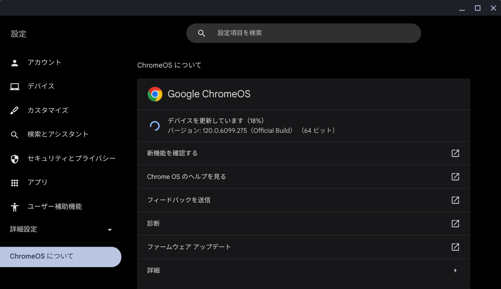
- 120.0.6099.235 *<<2024/01/11 updated from 119.0.6099.203>>*
  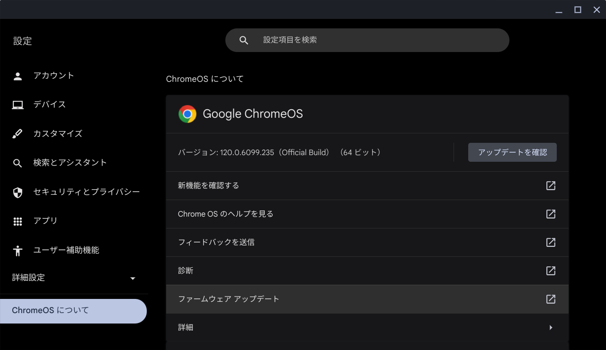
- 120.0.6099.203 *<<2024/01/11 updated from 119.0.6045.214>>*
  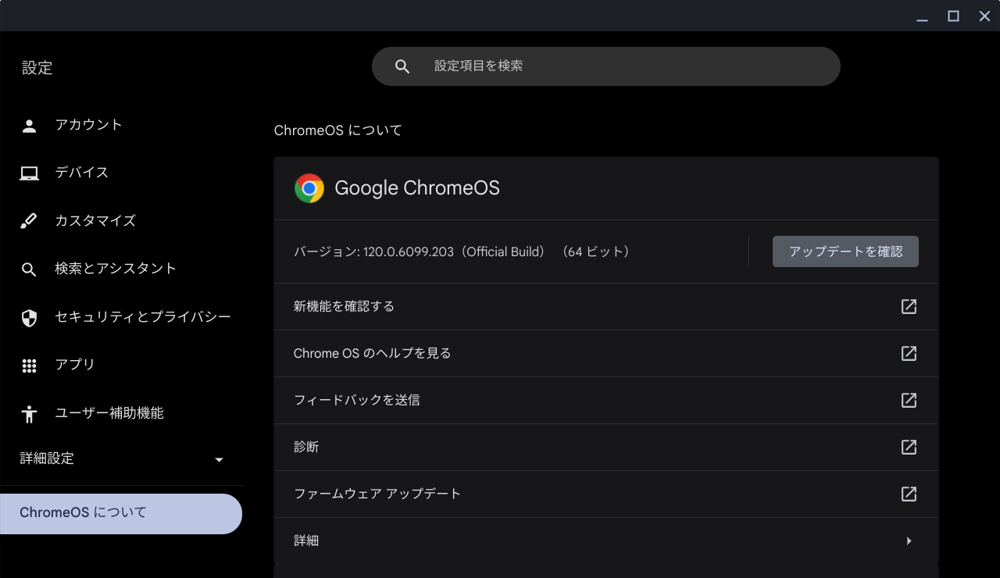
- 119.0.6045.214 *<<2023/12/28 updated from 119.0.6045.212>>*
  
- 119.0.6045.212 *<<2023/12/16 updated from 119.0.6045.209>>*
  
- 119.0.6045.209 *<<2023/12/08 updated from 119.0.6045.192>>*
  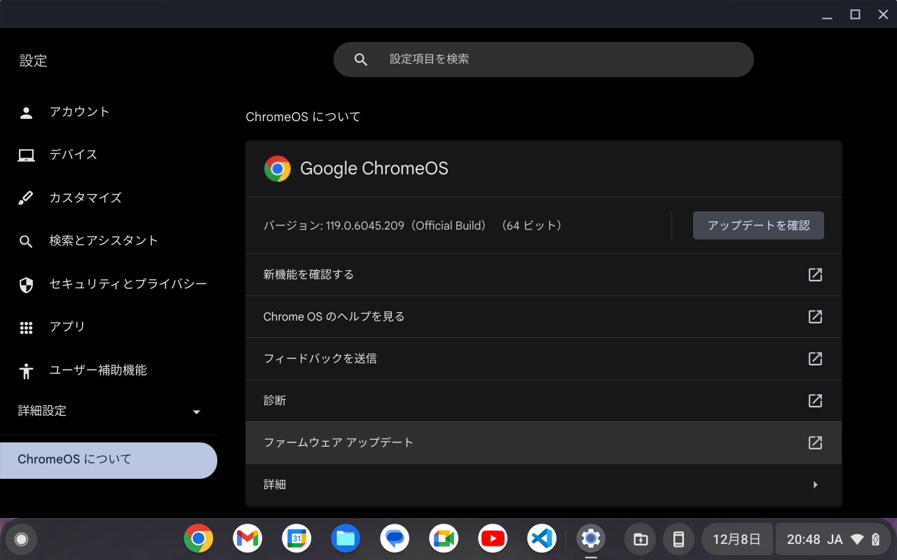
- 119.0.6045.192 *<<2023/11/30 updated from 119.0.6045.158>>*
  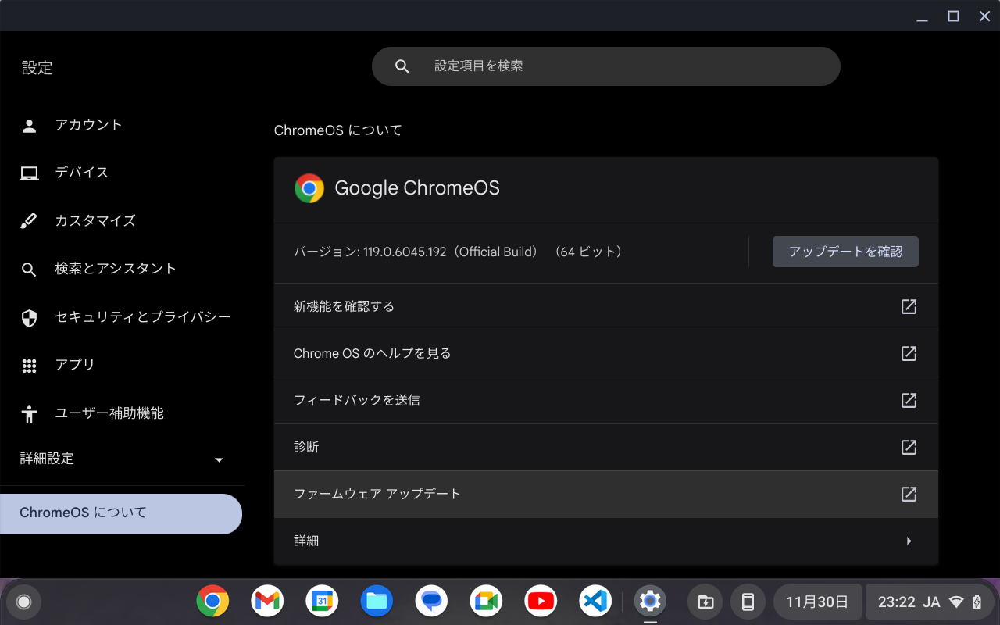
- 119.0.6045.158 *<<2023/11/16 updated from 118.0.5993.124>>*
  
- 118.0.5993.124 *<<2023/11/02 updated from 118.0.5993.86>>*
  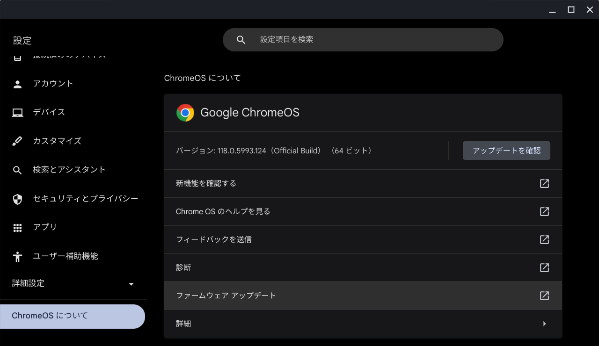
- 118.0.5993.86 *<<2023/10/20 updated from 117.0.5938.157>>*
  
- 117.0.5938.157 *<<2023/10/07 updated from 117.0.5938.144>>*
  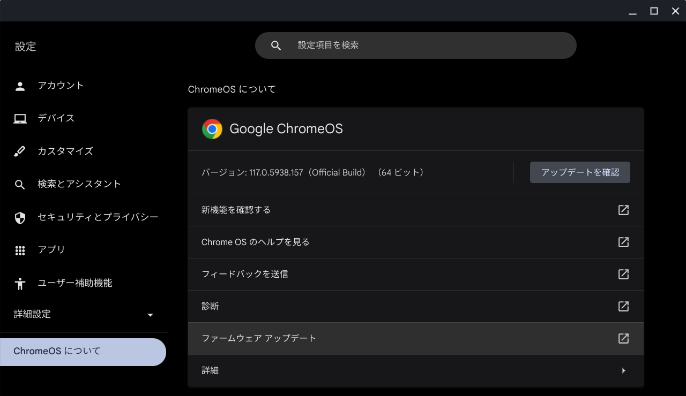
- 117.0.5938.144 *<<2023/10/06 updated from 117.0.5938.115>>*
  
- 117.0.5938.115 *<<2023/9/27 updated from 116.0.5845.210>>*
  
- 116.0.5845.210 *<<2023/9/16 updated from 116.0.5845.168>>*
  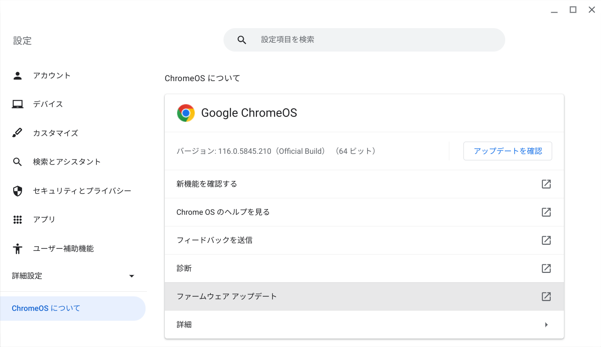
- 116.0.5845.168 *<<2023/9/10 updated from 116.0.5845.120>>*
  
- 116.0.5845.120 *<<2023/8/26 updated from 115.0.5790.182>>*
  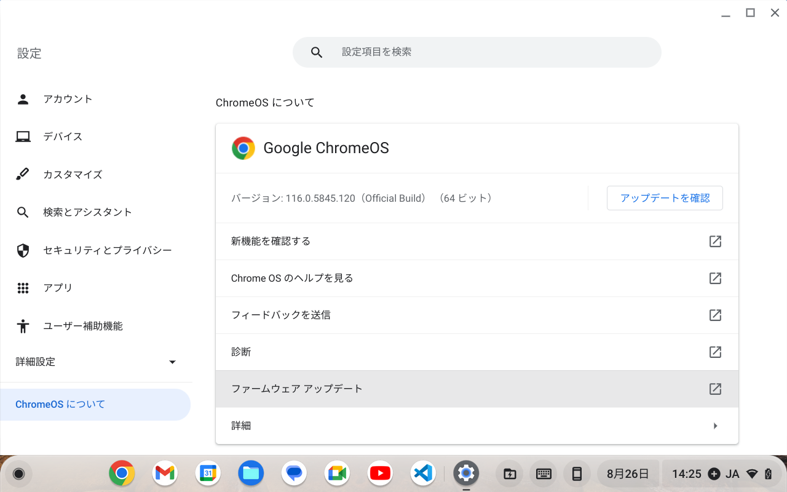
  - メニューからVimを起動できるようになった
    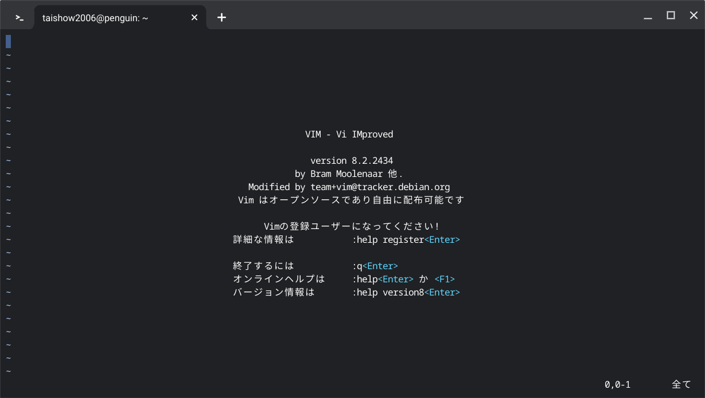
- 115.0.5790.182
  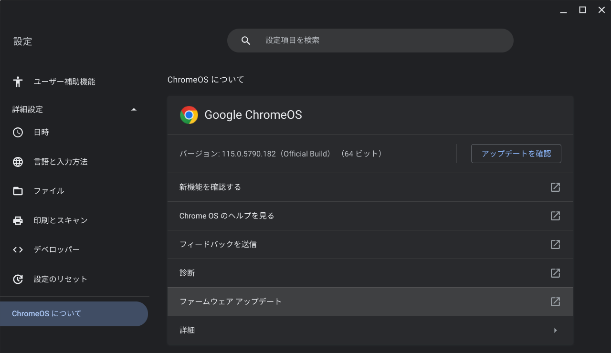
  - スマートフォンハブが使える
    
