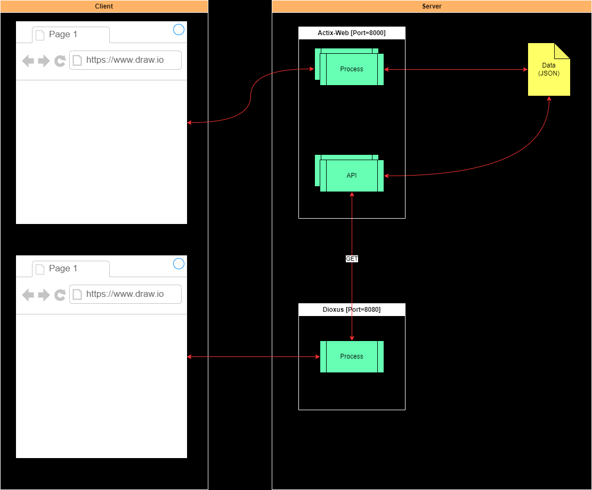

# System Overview (システム構成)
As a framework for building web applications in Rust, he refers to a series of articles about Actix-Web and Dioxus.
In this series, we need to call an API provided by an application in the same domain (built with Actix-Web) from a web application (built with Dioxus).
However, since it is the same domain, when the process of calling is implemented after removing the constraint of CORS, a runtime exception occurs and the call cannot be made well.

```
RustでWebアプリケーションを構築するフレームワークとして、Actix-WebやDioxusに関する連載記事を参照している。
その連載の中で、あるWebアプリケーション（Dioxusで構築）から同一ドメインにあるアプリケーション（Actix-Webで構築）が提供するAPIを呼び出す必要がある。
しかし、同一ドメインであるため、CORSの制約を外したうえで、呼び出す処理を実装したところ、実行時例外が発生し、呼び出しがうまくできない状況。
```



##  Implementation (実装)

1.  Calling API (API呼出)

    ```rust
    static BASE_API_URL: &str = "http://localhost:8000/api/posts";

    pub async fn call_index() -> Result<ApiResponse, reqwest::Error> {
      let url = format!("{}", BASE_API_URL);
      reqwest::Client::new()
        .get(&url)
        .fetch_mode_no_cors()
        .send()
        .await
        .unwrap()
        .json::<ApiResponse>()
        .await
    }
    ```

1.  Provided API (API提供)

    ```rust
    #[get("/posts")]
    pub async fn api_index(query: web::Query<Queries>) -> impl Responder {
      info!("Called index API");
      let param = query.into_inner();
      let posts = data::get_all();
      let mut ary = Vec::new();
      for item in &posts {
        ary.push(item.clone());
      }
      let response = ApiResponse {
        status: "OK".to_string(),
        result: ResponseContent::Items(ary),
      };
      build_response(&param.format, &response)
    }
    ```

##  Output Message (出力メッセージ)

1.  Calling API (API呼出)

    ```log
    Uncaught Error: url parse
        at imports.wbg.__wbindgen_throw (dioxus-posts.js:1514:15)
        at wasm_bindgen::throw_str::h98dd5fad0a7aa6aa (dioxus-posts_bg.wasm:0x4045b7)
        at <core::result::Result<T,E> as wasm_bindgen::UnwrapThrowExt<T>>::expect_throw::h8bf1f712d43f2da6 (dioxus-posts_bg.wasm:0x28ade0)
        at reqwest::wasm::client::fetch::{{closure}}::h52c37b8d8f401144 (dioxus-posts_bg.wasm:0x8f145)
        at reqwest::wasm::request::RequestBuilder::send::{{closure}}::hac8ab4d8e1c2241f (dioxus-posts_bg.wasm:0x1c3deb)
        at dioxus_posts5::data::call_index::{{closure}}::h41f15c75796fadc5 (dioxus-posts_bg.wasm:0x100066)
        at dioxus_posts5::app::{{closure}}::{{closure}}::h015a59997d1d4e2a (dioxus-posts_bg.wasm:0x1aa99f)
        at <core::pin::Pin<P> as core::future::future::Future>::poll::h74e93854bbd5d8cf (dioxus-posts_bg.wasm:0x3d09c3)
        at futures_util::future::future::FutureExt::poll_unpin::h34fb8f04c51ec5bb (dioxus-posts_bg.wasm:0x3e4e0e)
        at dioxus_hooks::use_resource::use_resource::{{closure}}::{{closure}}::{{closure}}::{{closure}}::hac33ce44fbd069af (dioxus-posts_bg.wasm:0x3f0e29)
    ```

1.  Provided API (API提供)

    ```log
    [2024-05-01T01:46:23Z INFO  actix_sample::handler] Called index API
    [2024-05-01T01:46:23Z INFO  actix_web::middleware::logger] 127.0.0.1 "GET /api/posts HTTP/1.1" 200 1119 "http://localhost:8080/" "Mozilla/5.0 (Windows NT 10.0; Win64; x64) AppleWebKit/537.36 (KHTML, like Gecko) Chrome/124.0.0.0 Safari/537.36 Edg/124.0.0.0" 0.005452
    ```
