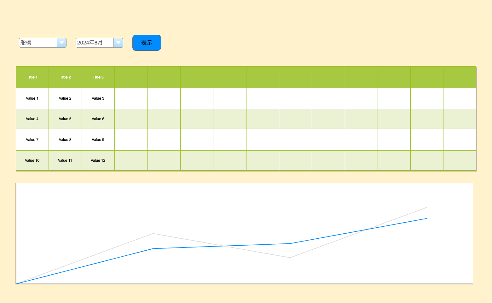
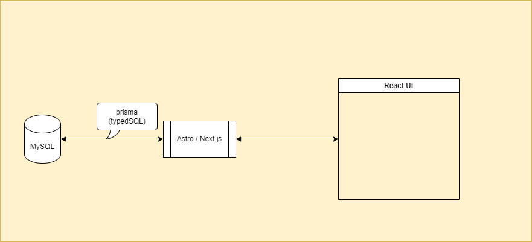

1.  概要

    Reactで表形式とグラフ（折れ線、棒）を使ってデータを表示するアプリを作る

1.  目的

    概要のアプリを実装するとした場合のアーキテクチャやコードを検証するため

1.  検証対象とするフレームワーク
    - [Astro](https://astro.build/) @4.15.1/@5.0
    - [Next.js](https://nextjs.org/)

1.  機能

    都市と年月を選択し、表示ボタンをクリックすると、選択した都市の気象データが表形式で表示され、変化がグラフでわかる

    

1.  アーキテクチャ

    

1.  参考
    - [Use Bun with Astro](https://docs.astro.build/en/recipes/bun/)
    - [Build an app with Next.js and Bun](https://bun.sh/guides/ecosystem/nextjs)
    - [Prisma](https://www.prisma.io/)
