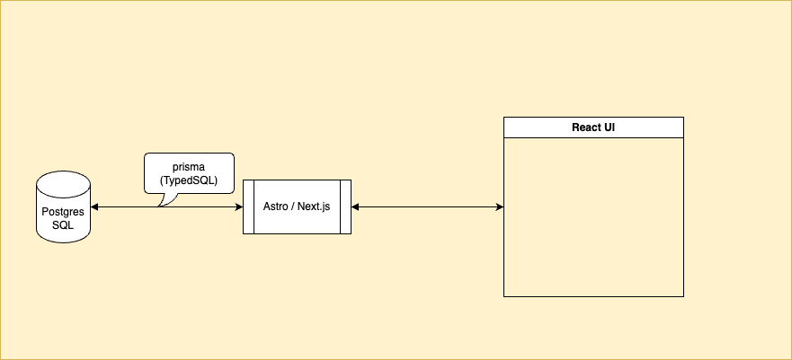

1.  概要

	Reactで表形式とグラフ（折れ線、棒）を使ってデータを表示するアプリを作る

1.  目的

	概要のアプリを実装するとした場合のアーキテクチャやコードを検証するため

1.  検証対象とするフレームワーク
	- [Astro](https://astro.build/) @4.15.1/@5.0
	- [Next.js](https://nextjs.org/)

1.  機能

	都市と年月を選択し、表示ボタンをクリックすると、選択した都市の気象データが表形式で表示され、変化がグラフでわかる

	

1.  アーキテクチャ

	データベースは、PostgresSQLを利用し、Prismaを介して接続する

	

1.  参考
	-	Astro
		- [Use Bun with Astro](https://docs.astro.build/en/recipes/bun/)
		-	[Add Integrations](https://docs.astro.build/ja/guides/integrations-guide/)
		-	[@astrojs/react](https://docs.astro.build/en/guides/integrations-guide/react/)
	-	Next.js
		- [Build an app with Next.js and Bun](https://bun.sh/guides/ecosystem/nextjs)
	-	PostgresSQL
		-	[Vercal Postgres](https://vercel.com/docs/storage/vercel-postgres)
		-	[@vercel/postgres](https://vercel.com/docs/storage/vercel-postgres/sdk)
	- [Prisma](https://www.prisma.io/)
		-	[TypedSQL](https://www.prisma.io/docs/orm/prisma-client/using-raw-sql/typedsql)
	-	MySQL
		-	[Next.js Prisma Azure MySQL Starter](https://vercel.com/templates/next.js/nextjs-prisma-azure-mysql-starter)
		-	[MySQL Connector](https://www.prisma.io/docs/orm/overview/databases/mysql)
