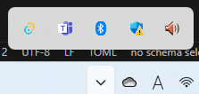
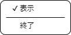

# 仕様
**Tauriで開発するアプリケーションの仕様をまとめる**

##  起動

- 起動時にスプラッシュスクリーンを表示する
- 起動直後は、メインウィンドウは表示せず、トレイのアイコンのみとする 
  

##  表示切換

- メインウィンドウのクローズボタンでは終了せず、最小化する
- トレイのアイコンからメインウィンドウを表示できる
- トレイのアイコンから表示されているメインウィンドウを最小化できる  

##  トレイ

- アイコンを左クリックすることでメニューを呼び出す 
  

- メニューからは、以下の操作を可能とする
  - メインウィンドウの表示／非表示（最小化）を切り替える
  - アプリケーションを終了する

##  終了

- トレイのアイコンから終了する
