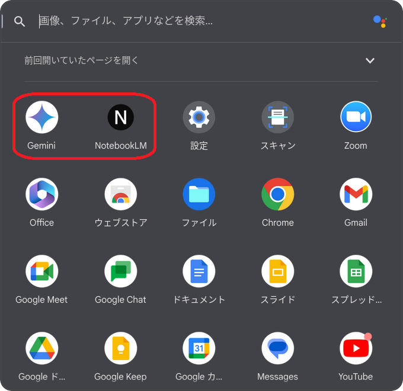

# Chrome OS Flex
- バージョン 126.0.6478.222  <span style="color: red;">*<<2024/08/03 updated from 126.0.6478.214>>*</span>
  
  
  
- バージョン 126.0.6478.214  <span style="color: red;">*<<2024/08/03 updated from 126.0.6478.178>>*</span>
  
  
- バージョン 126.0.6478.178  <span style="color: red;">*<<2024/07/21 updated from 126.0.6478.132>>*</span>
  
  - 更新中
    
- バージョン 126.0.6478.132  <span style="color: red;">*<<2024/06/28 updated from 125.0.6422.197>>*</span>
  
  - 更新中
    
- Debian 12.6 <span style="color: red;">*<<2024/07/13 updated from 12.5>>*</span>
  
- バージョン 125.0.6422.197  <span style="color: red;">*<<2024/06/26 updated from 125.0.6422.140>>*</span>
  
  - 更新中
    
  - Gemini等が追加
    
- バージョン 125.0.6422.140 <span style="color: red;">*<<2024/05/31 updated from 124.0.6367.225>>*</span>

  - 新機能紹介
    - ゲームダッシュボード
      
    - ToDoリスト
      
    - GIF形式でのスクリーンキャプチャ
      
    - マウスボタンのカスタマイズ（124系から）
      
    - キーボードショートカット（124系から）
      
- バージョン 124.0.6367.225 <span style="color: red;">*<<2024/05/26 updated from 124.0.6367.219>>*</span>
  
- バージョン 124.0.6367.219 <span style="color: red;">*<<2024/05/16 updated from 124.0.6367.154>>*</span>
  
- バージョン 124.0.6367.154 <span style="color: red;">*<<2024/05/10 updated from 124.0.6367.122>>*</span>
  
- バージョン 124.0.6367.122 <span style="color: red;">*<<2024/05/01 updated from 123.0.6312.134>>*</span>
  <BR />
  
- バージョン 123.0.6312.134 <span style="color: red;">*<<2024/04/27 updated from 123.0.6312.112>>*</span>
  <BR />
  
  - [変更点](https://note.com/taishow2020/n/n2ca56abe2139)
    - フォントに「IPAmj明朝フォント」が追加
    - キーボードのショートカットやマウスボタンのカスタマイズが可能
- バージョン 123.0.6312.112 <span style="color: red;">*<<2024/04/13 updated from 123.0.6312.111>>*</span>
  
- バージョン 123.0.6312.111 <span style="color: red;">*<<2024/04/06 updated from 122.0.6261.137>>*</span>
  
- バージョン 122.0.6261.137 <span style="color: red;">*<<2024/03/23 updated from 122.0.6261.118>>*</span>
  
- バージョン 122.0.6261.118 <span style="color: red;">*<<2024/03/17 updated from 122.0.6261.100>>*</span>
  
- 122.0.6261.100 <span style="color: red;">*<<2024/03/09 updated from 121.0.6167.212>>*</span>
  
- 121.0.6167.212 <span style="color: red;">*<<2024/02/29 updated from 121.0.6167.188>>*</span>
  
  - Linux コンテナ（Debianアップグレード（Debian 11 -> 12 へ変更））
    
    
    
    
    
    
    - 確認
      ```
      cat /etc/os-release
      ```
      ```
      PRETTY_NAME="Debian GNU/Linux 12 (bookworm)"
      NAME="Debian GNU/Linux"
      VERSION_ID="12"
      VERSION="12 (bookworm)"
      VERSION_CODENAME=bookworm
      ID=debian
      HOME_URL="https://www.debian.org/"
      SUPPORT_URL="https://www.debian.org/support"
      BUG_REPORT_URL="https://bugs.debian.org/"
      ```
- 121.0.6177.188 <span style="color: red;">*<<2024/02/27 updated from 120.0.6099.275>>*</span>
  
- 120.0.6099.275 <span style="color: red;">*<<2024/02/27 updated from 120.0.6099.235>>*</span>
  
- 120.0.6099.235 <span style="color: red;">*<<2024/01/11 updated from 119.0.6099.203>>*</span>
  
- 120.0.6099.203 <span style="color: red;">*<<2024/01/11 updated from 119.0.6045.214>>*</span>
  
- 119.0.6045.214 <span style="color: red;">*<<2023/12/28 updated from 119.0.6045.212>>*</span>
  
- 119.0.6045.212 <span style="color: red;">*<<2023/12/16 updated from 119.0.6045.209>>*</span>
  
- 119.0.6045.209 <span style="color: red;">*<<2023/12/08 updated from 119.0.6045.192>>*</span>
  
- 119.0.6045.192 <span style="color: red;">*<<2023/11/30 updated from 119.0.6045.158>>*</span>
  
- 119.0.6045.158 <span style="color: red;">*<<2023/11/16 updated from 118.0.5993.124>>*</span>
  
- 118.0.5993.124 <span style="color: red;">*<<2023/11/02 updated from 118.0.5993.86>>*</span>
  
- 118.0.5993.86 <span style="color: red;">*<<2023/10/20 updated from 117.0.5938.157>>*</span>
  
- 117.0.5938.157 <span style="color: red;">*<<2023/10/07 updated from 117.0.5938.144>>*</span>
  
- 117.0.5938.144 <span style="color: red;">*<<2023/10/06 updated from 117.0.5938.115>>*</span>
  
- 117.0.5938.115 <span style="color: red;">*<<2023/9/27 updated from 116.0.5845.210>>*</span>
  
- 116.0.5845.210 <span style="color: red;">*<<2023/9/16 updated from 116.0.5845.168>>*</span>
  
- 116.0.5845.168 <span style="color: red;">*<<2023/9/10 updated from 116.0.5845.120>>*</span>
  
- 116.0.5845.120 <span style="color: red;">*<<2023/8/26 updated from 115.0.5790.182>>*</span>
  
  - メニューからVimを起動できるようになった
    
- 115.0.5790.182
  
  - スマートフォンハブが使える
    
