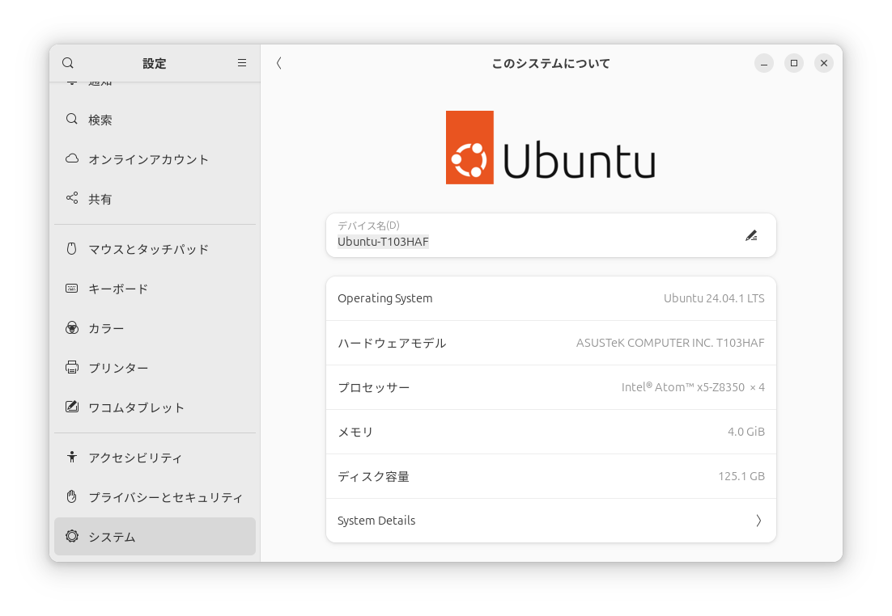

- [Ubuntu Desktop 24.04.1](https://jp.ubuntu.com/download) <span style="color: red;">*<<2025/01/04 installed>>*</span>
  
  
  

  <details>
  <summary>ディストリビューション・バージョン情報</summary>

  ```
  PRETTY_NAME="Ubuntu 24.04.1 LTS"
  NAME="Ubuntu"
  VERSION_ID="24.04"
  VERSION="24.04.1 LTS (Noble Numbat)"
  VERSION_CODENAME=noble
  ID=ubuntu
  ID_LIKE=debian
  HOME_URL="https://www.ubuntu.com/"
  SUPPORT_URL="https://help.ubuntu.com/"
  BUG_REPORT_URL="https://bugs.launchpad.net/ubuntu/"
  PRIVACY_POLICY_URL="https://www.ubuntu.com/legal/terms-and-policies/privacy-policy"
  UBUNTU_CODENAME=noble
  LOGO=ubuntu-logo
  ```
  </details>
