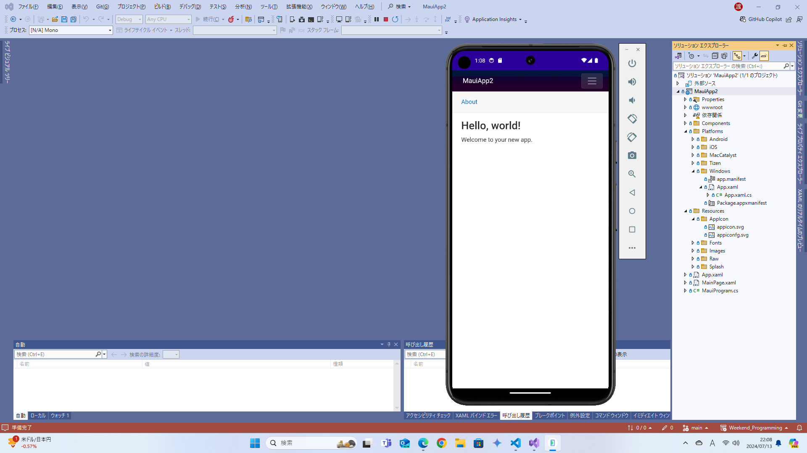
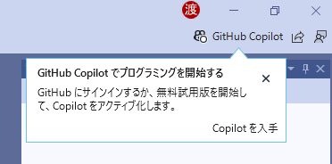
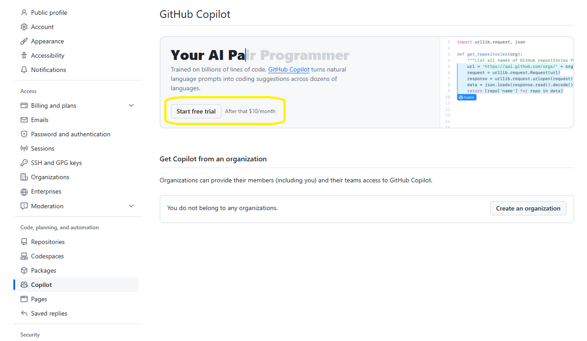
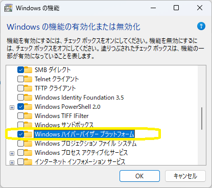

##  Visual Studio 2022
  - Visual Studio 2022 17.13.0
    
  - 17.13 Preview 5.0
    
  - 17.12.4 / Windows Updateで更新
  - 17.12.3
    
  - 17.12 / MAUI 9.0.10 / Pixel 9 Pro API 35(Android 15)
    
    <details>
    <summary>ビルドログ</summary>

    ```
    18:43 でビルドが開始されました...
    1>------ ビルド開始: プロジェクト: MauiApp9, 構成: Debug Any CPU ------
    1>ビルドの速度を上げるために、アナライザーをスキップしています。'ビルド' または '再ビルド' コマンドを実行してアナライザーを実行できます。
    1>Including assemblies for Hot Reload support
    1>MauiApp9 -> D:\Repository\Weekend_Programming\net\MAUI\MauiApp9\MauiApp9\bin\Debug\net9.0-android\MauiApp9.dll
    2>------ 配置開始: プロジェクト: MauiApp9, 構成: Debug Any CPU ------
    2>Pixel_9_Pro_API_35 に対する配置を開始しています...
    2>エミュレーターの準備ができるまで待機しています...
    2>Pixel_9_Pro_API_35 に配置しています...
    ビルドを開始しました。
    プロジェクト "MauiApp9.csproj" (Install ターゲット):
    指定された RuntimeIdentifier 'android-arm64' で利用できるアプリケーション ホストはありません。
    指定された RuntimeIdentifier 'android-x64' で利用できるアプリケーション ホストはありません。
    Found Java SDK version 17.0.12.
    Looking for Android NDK...
    Looking for Android SDK...
    Found Xamarin.Android 13.2.99.932
    MonoAndroid Tools: C:\Program Files\dotnet\packs\Microsoft.Android.Sdk.Windows\35.0.7\tools\
    Android Platform API level: 35
    TargetFrameworkVersion: v9.0
    Android NDK: 
    Android SDK: C:\Program Files (x86)\Android\android-sdk\
    Android SDK Build Tools: C:\Program Files (x86)\Android\android-sdk\build-tools\35.0.0\
    Java SDK: C:\Program Files (x86)\Android\openjdk\jdk-17.0.12\
    Application Java class: android.app.Application
    _OuterIntermediateOutputPath: 
    IntermediateOutputPath: obj\Debug
    et9.0-android\
    "obj\Debug
    et9.0-android\staticwebassets.references.upToDateCheck.txt" の 'WriteOnlyWhenDifferent' 属性は、'Overwrite="true"' の場合にのみ有効になります。
    すべての出力ファイルが入力ファイルに対して最新なので、ターゲット "_ProcessScopedCssFiles" を省略します。
    Accepted compressed asset 'D:\Repository\Weekend_Programming
    et\MAUI\MauiApp9\MauiApp9\obj\Debug
    et9.0-android\compressed\quqdvlarqf-e5tk7yf482.gz' for 'D:\Repository\Weekend_Programming
    et\MAUI\MauiApp9\MauiApp9\wwwroot\css\app.css'.
    Accepted compressed asset 'D:\Repository\Weekend_Programming
    et\MAUI\MauiApp9\MauiApp9\obj\Debug
    et9.0-android\compressed\7ezkn64cgu-6gzpyzhau4.gz' for 'D:\Repository\Weekend_Programming
    et\MAUI\MauiApp9\MauiApp9\wwwroot\css\bootstrap\bootstrap.min.css'.
    Accepted compressed asset 'D:\Repository\Weekend_Programming
    et\MAUI\MauiApp9\MauiApp9\obj\Debug
    et9.0-android\compressed\w1cn9yk6jz-8inm30yfxf.gz' for 'D:\Repository\Weekend_Programming
    et\MAUI\MauiApp9\MauiApp9\wwwroot\css\bootstrap\bootstrap.min.css.map'.
    Accepted compressed asset 'D:\Repository\Weekend_Programming
    et\MAUI\MauiApp9\MauiApp9\obj\Debug
    et9.0-android\compressed\09ivkjf474-knq8i9ludi.gz' for 'D:\Repository\Weekend_Programming
    et\MAUI\MauiApp9\MauiApp9\wwwroot\index.html'.
    Accepted compressed asset 'D:\Repository\Weekend_Programming
    et\MAUI\MauiApp9\MauiApp9\obj\Debug
    et9.0-android\compressed\at5bgn53p2-u4z5qnisnb.gz' for 'D:\Repository\Weekend_Programming
    et\MAUI\MauiApp9\MauiApp9\obj\Debug
    et9.0-android\scopedcss\bundle\MauiApp9.styles.css'.
    Accepted compressed asset 'D:\Repository\Weekend_Programming
    et\MAUI\MauiApp9\MauiApp9\obj\Debug
    et9.0-android\compressed\tshj81g4um-u4z5qnisnb.gz' for 'D:\Repository\Weekend_Programming
    et\MAUI\MauiApp9\MauiApp9\obj\Debug
    et9.0-android\scopedcss\projectbundle\MauiApp9.bundle.scp.css'.
    Resolved 6 compressed assets for 6 candidate assets.
    Processing compressed asset: D:\Repository\Weekend_Programming
    et\MAUI\MauiApp9\MauiApp9\obj\Debug
    et9.0-android\compressed\quqdvlarqf-e5tk7yf482.gz
    Processing compressed asset: D:\Repository\Weekend_Programming
    et\MAUI\MauiApp9\MauiApp9\obj\Debug
    et9.0-android\compressed\7ezkn64cgu-6gzpyzhau4.gz
    Processing compressed asset: D:\Repository\Weekend_Programming
    et\MAUI\MauiApp9\MauiApp9\obj\Debug
    et9.0-android\compressed\w1cn9yk6jz-8inm30yfxf.gz
    Processing compressed asset: D:\Repository\Weekend_Programming
    et\MAUI\MauiApp9\MauiApp9\obj\Debug
    et9.0-android\compressed\09ivkjf474-knq8i9ludi.gz
    Processing compressed asset: D:\Repository\Weekend_Programming
    et\MAUI\MauiApp9\MauiApp9\obj\Debug
    et9.0-android\compressed\at5bgn53p2-u4z5qnisnb.gz
    Processing compressed asset: D:\Repository\Weekend_Programming
    et\MAUI\MauiApp9\MauiApp9\obj\Debug
    et9.0-android\compressed\tshj81g4um-u4z5qnisnb.gz
    出力がないため、ターゲット "_BuildCopyStaticWebAssetsPreserveNewest" を省略しています。
    出力がないため、ターゲット "_BuildCopyStaticWebAssetsPreserveNewest" を省略しています。
    The asset 'D:\Repository\Weekend_Programming
    et\MAUI\MauiApp9\MauiApp9\obj\Debug
    et9.0-android\compressed\09ivkjf474-knq8i9ludi.gz' with related asset 'D:\Repository\Weekend_Programming
    et\MAUI\MauiApp9\MauiApp9\wwwroot\index.html' was detected as already compressed with format 'gzip'.
    The asset 'D:\Repository\Weekend_Programming
    et\MAUI\MauiApp9\MauiApp9\obj\Debug
    et9.0-android\compressed\7ezkn64cgu-6gzpyzhau4.gz' with related asset 'D:\Repository\Weekend_Programming
    et\MAUI\MauiApp9\MauiApp9\wwwroot\css\bootstrap\bootstrap.min.css' was detected as already compressed with format 'gzip'.
    The asset 'D:\Repository\Weekend_Programming
    et\MAUI\MauiApp9\MauiApp9\obj\Debug
    et9.0-android\compressed\at5bgn53p2-u4z5qnisnb.gz' with related asset 'D:\Repository\Weekend_Programming
    et\MAUI\MauiApp9\MauiApp9\obj\Debug
    et9.0-android\scopedcss\bundle\MauiApp9.styles.css' was detected as already compressed with format 'gzip'.
    The asset 'D:\Repository\Weekend_Programming
    et\MAUI\MauiApp9\MauiApp9\obj\Debug
    et9.0-android\compressed\quqdvlarqf-e5tk7yf482.gz' with related asset 'D:\Repository\Weekend_Programming
    et\MAUI\MauiApp9\MauiApp9\wwwroot\css\app.css' was detected as already compressed with format 'gzip'.
    The asset 'D:\Repository\Weekend_Programming
    et\MAUI\MauiApp9\MauiApp9\obj\Debug
    et9.0-android\compressed\tshj81g4um-u4z5qnisnb.gz' with related asset 'D:\Repository\Weekend_Programming
    et\MAUI\MauiApp9\MauiApp9\obj\Debug
    et9.0-android\scopedcss\projectbundle\MauiApp9.bundle.scp.css' was detected as already compressed with format 'gzip'.
    The asset 'D:\Repository\Weekend_Programming
    et\MAUI\MauiApp9\MauiApp9\obj\Debug
    et9.0-android\compressed\w1cn9yk6jz-8inm30yfxf.gz' with related asset 'D:\Repository\Weekend_Programming
    et\MAUI\MauiApp9\MauiApp9\wwwroot\css\bootstrap\bootstrap.min.css.map' was detected as already compressed with format 'gzip'.
    Ignoring asset 'D:\Repository\Weekend_Programming
    et\MAUI\MauiApp9\MauiApp9\obj\Debug
    et9.0-android\scopedcss\bundle\MauiApp9.styles.css' because it was already resolved with format 'gzip'.
    Ignoring asset 'D:\Repository\Weekend_Programming
    et\MAUI\MauiApp9\MauiApp9\obj\Debug
    et9.0-android\scopedcss\projectbundle\MauiApp9.bundle.scp.css' because it was already resolved with format 'gzip'.
    Ignoring asset 'D:\Repository\Weekend_Programming
    et\MAUI\MauiApp9\MauiApp9\wwwroot\css\app.css' because it was already resolved with format 'gzip'.
    Ignoring asset 'D:\Repository\Weekend_Programming
    et\MAUI\MauiApp9\MauiApp9\wwwroot\css\bootstrap\bootstrap.min.css' because it was already resolved with format 'gzip'.
    Ignoring asset 'D:\Repository\Weekend_Programming
    et\MAUI\MauiApp9\MauiApp9\wwwroot\css\bootstrap\bootstrap.min.css.map' because it was already resolved with format 'gzip'.
    Ignoring asset 'D:\Repository\Weekend_Programming
    et\MAUI\MauiApp9\MauiApp9\wwwroot\index.html' because it was already resolved with format 'gzip'.
    Accepted compressed asset 'D:\Repository\Weekend_Programming
    et\MAUI\MauiApp9\MauiApp9\obj\Debug
    et9.0-android\compressed\publish\at5bgn53p2-u4z5qnisnb.br' for 'D:\Repository\Weekend_Programming
    et\MAUI\MauiApp9\MauiApp9\obj\Debug
    et9.0-android\scopedcss\bundle\MauiApp9.styles.css'.
    Accepted compressed asset 'D:\Repository\Weekend_Programming
    et\MAUI\MauiApp9\MauiApp9\obj\Debug
    et9.0-android\compressed\publish\tshj81g4um-u4z5qnisnb.br' for 'D:\Repository\Weekend_Programming
    et\MAUI\MauiApp9\MauiApp9\obj\Debug
    et9.0-android\scopedcss\projectbundle\MauiApp9.bundle.scp.css'.
    Accepted compressed asset 'D:\Repository\Weekend_Programming
    et\MAUI\MauiApp9\MauiApp9\obj\Debug
    et9.0-android\compressed\publish\quqdvlarqf-e5tk7yf482.br' for 'D:\Repository\Weekend_Programming
    et\MAUI\MauiApp9\MauiApp9\wwwroot\css\app.css'.
    Accepted compressed asset 'D:\Repository\Weekend_Programming
    et\MAUI\MauiApp9\MauiApp9\obj\Debug
    et9.0-android\compressed\publish\7ezkn64cgu-6gzpyzhau4.br' for 'D:\Repository\Weekend_Programming
    et\MAUI\MauiApp9\MauiApp9\wwwroot\css\bootstrap\bootstrap.min.css'.
    Accepted compressed asset 'D:\Repository\Weekend_Programming
    et\MAUI\MauiApp9\MauiApp9\obj\Debug
    et9.0-android\compressed\publish\w1cn9yk6jz-8inm30yfxf.br' for 'D:\Repository\Weekend_Programming
    et\MAUI\MauiApp9\MauiApp9\wwwroot\css\bootstrap\bootstrap.min.css.map'.
    Accepted compressed asset 'D:\Repository\Weekend_Programming
    et\MAUI\MauiApp9\MauiApp9\obj\Debug
    et9.0-android\compressed\publish\09ivkjf474-knq8i9ludi.br' for 'D:\Repository\Weekend_Programming
    et\MAUI\MauiApp9\MauiApp9\wwwroot\index.html'.
    Resolved 6 compressed assets for 6 candidate assets.
    C:\Program Files\dotnet\dotnet.exe "C:\Program Files\dotnet\sdk\9.0.100\Sdks\Microsoft.NET.Sdk.StaticWebAssets\targets\..\tools
    et9.0\Microsoft.NET.Sdk.StaticWebAssets.Tool.dll" brotli

    Processing compressed asset: D:\Repository\Weekend_Programming
    et\MAUI\MauiApp9\MauiApp9\obj\Debug
    et9.0-android\compressed\09ivkjf474-knq8i9ludi.gz
    Processing compressed asset: D:\Repository\Weekend_Programming
    et\MAUI\MauiApp9\MauiApp9\obj\Debug
    et9.0-android\compressed\7ezkn64cgu-6gzpyzhau4.gz
    Processing compressed asset: D:\Repository\Weekend_Programming
    et\MAUI\MauiApp9\MauiApp9\obj\Debug
    et9.0-android\compressed\at5bgn53p2-u4z5qnisnb.gz
    Processing compressed asset: D:\Repository\Weekend_Programming
    et\MAUI\MauiApp9\MauiApp9\obj\Debug
    et9.0-android\compressed\quqdvlarqf-e5tk7yf482.gz
    Processing compressed asset: D:\Repository\Weekend_Programming
    et\MAUI\MauiApp9\MauiApp9\obj\Debug
    et9.0-android\compressed\tshj81g4um-u4z5qnisnb.gz
    Processing compressed asset: D:\Repository\Weekend_Programming
    et\MAUI\MauiApp9\MauiApp9\obj\Debug
    et9.0-android\compressed\w1cn9yk6jz-8inm30yfxf.gz
    Processing compressed asset: D:\Repository\Weekend_Programming
    et\MAUI\MauiApp9\MauiApp9\obj\Debug
    et9.0-android\compressed\publish\at5bgn53p2-u4z5qnisnb.br
    Processing compressed asset: D:\Repository\Weekend_Programming
    et\MAUI\MauiApp9\MauiApp9\obj\Debug
    et9.0-android\compressed\publish\tshj81g4um-u4z5qnisnb.br
    Processing compressed asset: D:\Repository\Weekend_Programming
    et\MAUI\MauiApp9\MauiApp9\obj\Debug
    et9.0-android\compressed\publish\quqdvlarqf-e5tk7yf482.br
    Processing compressed asset: D:\Repository\Weekend_Programming
    et\MAUI\MauiApp9\MauiApp9\obj\Debug
    et9.0-android\compressed\publish\7ezkn64cgu-6gzpyzhau4.br
    Processing compressed asset: D:\Repository\Weekend_Programming
    et\MAUI\MauiApp9\MauiApp9\obj\Debug
    et9.0-android\compressed\publish\w1cn9yk6jz-8inm30yfxf.br
    Processing compressed asset: D:\Repository\Weekend_Programming
    et\MAUI\MauiApp9\MauiApp9\obj\Debug
    et9.0-android\compressed\publish\09ivkjf474-knq8i9ludi.br
    すべての出力ファイルが入力ファイルに対して最新なので、ターゲット "ProcessMauiSplashScreens" を省略します。
    すべての出力ファイルが入力ファイルに対して最新なので、ターゲット "ProcessMauiFonts" を省略します。
    すべての出力ファイルが入力ファイルに対して最新なので、ターゲット "ResizetizeImages" を省略します。
    すべての出力ファイルが入力ファイルに対して最新なので、ターゲット "_ResolveLibraryProjectImports" を省略します。
    すべての出力ファイルが入力ファイルに対して最新なので、ターゲット "_BuildLibraryImportsCache" を省略します。
    すべての出力ファイルが入力ファイルに対して最新なので、ターゲット "_GenerateResourceCaseMap" を省略します。
    すべての出力ファイルが入力ファイルに対して最新なので、ターゲット "_GenerateResourceDesignerIntermediateClass" を省略します。
    出力がないため、ターゲット "_GenerateLayoutBindings" を省略しています。
    すべての出力ファイルが入力ファイルに対して最新なので、ターゲット "_ConvertResourcesCases" を省略します。
    すべての出力ファイルが入力ファイルに対して最新なので、ターゲット "_CompileResources" を省略します。
    すべての出力ファイルが入力ファイルに対して最新なので、ターゲット "_PrepareUpdateAndroidResgen" を省略します。
    すべての出力ファイルが入力ファイルに対して最新なので、ターゲット "_UpdateAndroidResgen" を省略します。
    プロジェクト "MauiApp9.csproj" (_ComputeFilesToPublishForRuntimeIdentifiers ターゲット):
    _OuterIntermediateOutputPath: obj\Debug
    et9.0-android\
    IntermediateOutputPath: obj\Debug
    et9.0-android\android-x64\
    プロジェクト "MauiApp9.csproj" のビルドが終了しました。
    すべての出力ファイルが入力ファイルに対して最新なので、ターゲット "_LinkAssembliesNoShrink" を省略します。
    すべての出力ファイルが入力ファイルに対して最新なので、ターゲット "_GenerateJavaStubs" を省略します。
    すべての出力ファイルが入力ファイルに対して最新なので、ターゲット "_ManifestMerger" を省略します。
    すべての出力ファイルが入力ファイルに対して最新なので、ターゲット "_ConvertCustomView" を省略します。
    すべての出力ファイルが入力ファイルに対して最新なので、ターゲット "_AddStaticResources" を省略します。
    すべての出力ファイルが入力ファイルに対して最新なので、ターゲット "_GenerateEmptyAndroidRemapNativeCode" を省略します。
    すべての出力ファイルが入力ファイルに対して最新なので、ターゲット "_GeneratePackageManagerJava" を省略します。
    すべての出力ファイルが入力ファイルに対して最新なので、ターゲット "_GenerateAndroidAssetsDir" を省略します。
    すべての出力ファイルが入力ファイルに対して最新なので、ターゲット "_PrepareCreateBaseApk" を省略します。
    すべての出力ファイルが入力ファイルに対して最新なので、ターゲット "_CreateBaseApk" を省略します。
    すべての出力ファイルが入力ファイルに対して最新なので、ターゲット "_CompileJava" を省略します。
    すべての出力ファイルが入力ファイルに対して最新なので、ターゲット "_CompileNativeAssemblySources" を省略します。
    すべての出力ファイルが入力ファイルに対して最新なので、ターゲット "_CreateApplicationSharedLibraries" を省略します。
    すべての出力ファイルが入力ファイルに対して最新なので、ターゲット "_CompileToDalvik" を省略します。
    "D:\Repository\Weekend_Programming
    et\MAUI\MauiApp9\MauiApp9\obj\Debug
    et9.0-android\android\bin\com.companyname.mauiapp9.apk" から "D:\Repository\Weekend_Programming
    et\MAUI\MauiApp9\MauiApp9\bin\Debug
    et9.0-android\com.companyname.mauiapp9.apk" へファイルをコピーしています。
    "AlwaysCreate" が指定されたため "obj\Debug
    et9.0-android\android_debug_keystore.flag" を作成しています。
    "obj\Debug
    et9.0-android\android_debug_keystore.flag" のタッチ タスクを実行しています。
    C:\Program Files (x86)\Android\android-sdk\build-tools\35.0.0\zipalign.exe -p 16 "obj\Debug
    et9.0-android\android\bin\com.companyname.mauiapp9.apk" "bin\Debug
    et9.0-android\\com.companyname.mauiapp9-Signed.apk" 
    C:\Program Files (x86)\Android\openjdk\jdk-17.0.12\bin\java.exe -jar "C:\Program Files (x86)\Android\android-sdk\build-tools\35.0.0\lib\apksigner.jar" sign --ks "C:\Users\taish\AppData\Local\Xamarin\Mono for Android\debug.keystore" --ks-pass pass:android --ks-key-alias androiddebugkey --key-pass pass:android --min-sdk-version 24 --max-sdk-version 35  bin\Debug
    et9.0-android\com.companyname.mauiapp9-Signed.apk 
    Signed android package 'bin\Debug
    et9.0-android\com.companyname.mauiapp9-Signed.apk'
    ディレクトリ "obj\Debug
    et9.0-android\diagnostics" を作成しています。
    Using cached value from RegisterTaskObject
    Found device: emulator-5554
    "AlwaysCreate" が指定されたため "obj\Debug
    et9.0-android\upload.flag" を作成しています。
    2>Pixel_9_Pro_API_35 に対する配置に成功しました。
    "obj\Debug
    et9.0-android\upload.flag" のタッチ タスクを実行しています。
    ディレクトリ "obj\.cache\" を作成しています。
    プロジェクト "MauiApp9.csproj" のビルドが終了しました。
    ビルドに成功しました。
    ========== ビルド: 成功 1、失敗 0、最新の状態 0、スキップ 0 ==========
    =========== ビルド は 18:46 で完了し、02:48.869 分 掛かりました ==========
    ========== 展開: 1 正常終了、0 失敗、0 スキップ ==========
    ```
  - 17.12 Preview 2.1 / MAUI 9.0.0-rc.2 / Pixel 8 API 35(Android 15)
    
    - デバイスマネージャではエラーとなっているにもかかわらず、デバッグ実行できている
      
  - 17.11.5 
    - MAUI 8.0.91 / Pixel 5 API 34(Android 14)
      
  - 17.10.4 / MAUI 8.0.61(SR6.1) / Pixel 8 API 34(Android 14)
    
  - 17.10.3
    - GitHub Copilotの利用
      - 早速、無料試用版の利用開始を促される <BR />
        
      - GitHub側でGitHub Copilotの利用を開始することで、Visual Studioで利用できるらしい！
        
  - 17.10.3 / MAUI 8.0.40(SR5)
    - 8.0.40同梱で、Androidエミュレータでの実行確認
      
  - 17.9.6
    - エミュレータを動作させるには、Hyper-Vの有効化が必要 <BR />
      
      
    - デバイスマネージャーでAndroid Studioで作成したイメージは使えず、新たにイメージを作成
      
    - サンプルコードのままでは、Androidターゲットはビルドできない (*2024/04/12*)
