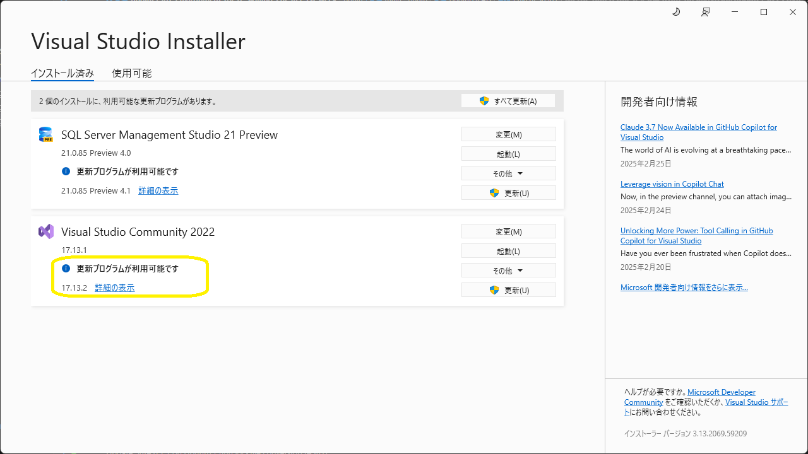
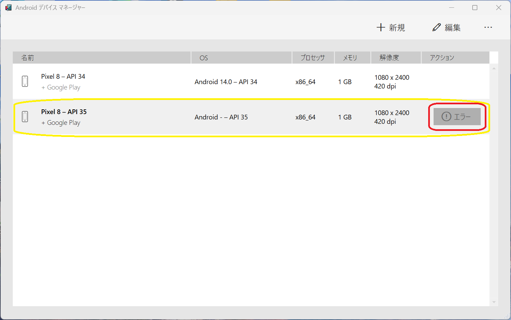
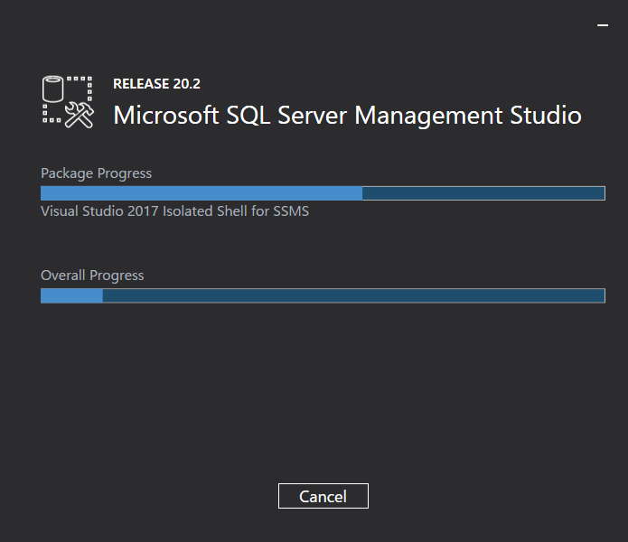

##  Visual Studio 2022
  - Visual Studio 2022 17.14 Preview 7.0
    
  - SSMS 21.0.0 Preview 7.0 / Visual Studio 2022 17.14.0
    
  - Visual Studio 2022 17.14 Preview 6.0
    
  - SSMS 21.0.0 Preview 6.0 <BR />
    
    - 接続ダイアログが更新、なのにエラーメッセージが出たうえで、新しいダイアログが出る事態
      
      
      
  - Visual Studio 2022 17.14 Preview 5.0
    
  - Visual Studio 2022 17.14 Preview 2.0
    
    - 17.14 Preview 2.0 / MAUI 10.0.0-preview.2.25165.1 / Pixel 9 API 35(Android 15)
      
      - ワークロードを更新するも、デプロイしたアプリが更新されず、デバッガ異常終了
        - エミュレータ上のアプリをアンインストール
        - 今後に備え、アプリ画面にバージョンを表記するように修正
    - 17.14 Preview 2.0 / MAUI 10.0.0-preview.1.25122.6 / Pixel 9 API 35(Android 15)
      
      - ワークロードを更新しないと、デバッガが異常終了
        
  - 17.14 Preview 1.1 / MAUI 10.0.0-preview.1.25122.6 / Pixel 9 API 35(Android 15)
    
  - 17.14 Preview 1.1
    
    - MAUIワークロードの更新（インストール済ワークロードの更新）
      ```
      dotnet workload update --from-previous-sdk
      ```
      <details>
      <summary>MAUI Update Log</summary>

      ```

      .NET 10.0 へようこそ!
      ---------------------
      SDK バージョン: 10.0.100-preview.1.25120.13

      テレメトリ
      ---------
      .NET ツールは、エクスペリエンスの向上のために利用状況データを収集します。データは Microsoft によって収集され、コミュニティと共有されます。テレメトリをオプトアウトするには、好みのシェルを使用して、DOTNET_CLI_TELEMETRY_OPTOUT 環境変数を '1' または 'true' に設定できます。

      .NET CLI ツールのテレメトリの詳細をご覧ください: https://aka.ms/dotnet-cli-telemetry

      ----------------
      ASP.NET Core HTTPS 開発証明書をインストールしました。
      証明書を信頼するには、'dotnet dev-certs https --trust' を実行します
      HTTPS の詳細情報: https://aka.ms/dotnet-https

      ----------------
      最初のアプリを作成するには、https://aka.ms/dotnet-hello-world を参照してください
      最新情報については、https://aka.ms/dotnet-whats-new を参照してください
      ドキュメントを探すには、https://aka.ms/dotnet-docs を参照してください
      GitHub で問題の報告とソースの検索を行うには、https://github.com/dotnet/core を参照してください
      'dotnet --help' を使用して使用可能なコマンドを確認するか、https://aka.ms/dotnet-cli にアクセスしてください
      --------------------------------------------------------------------------------------

      広告マニフェスト microsoft.net.workload.emscripten.net7 を更新しました。
      広告マニフェスト microsoft.net.sdk.maui を更新しました。
      広告マニフェスト microsoft.net.workload.emscripten.net6 を更新しました。
      広告マニフェスト microsoft.net.sdk.android を更新しました。
      広告マニフェスト microsoft.net.workload.emscripten.current を更新しました。
      広告マニフェスト microsoft.net.workload.mono.toolchain.current を更新しました。
      広告マニフェスト microsoft.net.workload.emscripten.net9 を更新しました。
      広告マニフェスト microsoft.net.sdk.macos を更新しました。
      広告マニフェスト microsoft.net.workload.mono.toolchain.net7 を更新しました。
      広告マニフェスト microsoft.net.sdk.maccatalyst を更新しました。
      広告マニフェスト microsoft.net.workload.mono.toolchain.net9 を更新しました。
      広告マニフェスト microsoft.net.workload.mono.toolchain.net6 を更新しました。
      広告マニフェスト microsoft.net.sdk.ios を更新しました。
      広告マニフェスト microsoft.net.sdk.tvos を更新しました。
      広告マニフェスト microsoft.net.workload.emscripten.net8 を更新しました。
      広告マニフェスト microsoft.net.sdk.aspire を更新しました。
      広告マニフェスト microsoft.net.workload.mono.toolchain.net8 を更新しました。
      Downloading microsoft.net.sdk.android.manifest-10.0.100-preview.1.msi.x64 (35.99.0-preview.1.140)
      microsoft.net.sdk.android.manifest-10.0.100-preview.1.msi.x64 をインストールしています ..... Done
      Downloading microsoft.net.sdk.ios.manifest-10.0.100-preview.1.msi.x64 (18.2.10322-net10-p1)
      microsoft.net.sdk.ios.manifest-10.0.100-preview.1.msi.x64 をインストールしています .... Done
      Downloading microsoft.net.sdk.maccatalyst.manifest-10.0.100-preview.1.msi.x64 (18.2.10322-net10-p1)
      microsoft.net.sdk.maccatalyst.manifest-10.0.100-preview.1.msi.x64 をインストールしています ..... Done
      Downloading microsoft.net.sdk.macos.manifest-10.0.100-preview.1.msi.x64 (15.2.10322-net10-p1)
      microsoft.net.sdk.macos.manifest-10.0.100-preview.1.msi.x64 をインストールしています ..... Done
      Downloading microsoft.net.sdk.maui.manifest-10.0.100-preview.1.msi.x64 (10.0.0-preview.1.25122.6)
      microsoft.net.sdk.maui.manifest-10.0.100-preview.1.msi.x64 をインストールしています ..... Done
      Downloading microsoft.net.sdk.tvos.manifest-10.0.100-preview.1.msi.x64 (18.2.10322-net10-p1)
      microsoft.net.sdk.tvos.manifest-10.0.100-preview.1.msi.x64 をインストールしています ..... Done
      Downloading Microsoft.Android.Sdk.Windows.Msi.x64 (35.99.0-preview.1.140)
      Microsoft.Android.Sdk.Windows.Msi.x64 をインストールしています ................ Done
      Downloading Microsoft.Android.Ref.35.Msi.x64 (35.99.0-preview.1.140)
      Microsoft.Android.Ref.35.Msi.x64 をインストールしています ...... Done
      Downloading Microsoft.Android.Runtime.Mono.35.android-arm.Msi.x64 (35.99.0-preview.1.140)
      Microsoft.Android.Runtime.Mono.35.android-arm.Msi.x64 をインストールしています ....... Done
      Downloading Microsoft.Android.Runtime.Mono.35.android-arm64.Msi.x64 (35.99.0-preview.1.140)
      Microsoft.Android.Runtime.Mono.35.android-arm64.Msi.x64 をインストールしています ....... Done
      Downloading Microsoft.Android.Runtime.Mono.35.android-x86.Msi.x64 (35.99.0-preview.1.140)
      Microsoft.Android.Runtime.Mono.35.android-x86.Msi.x64 をインストールしています ....... Done
      Downloading Microsoft.Android.Runtime.Mono.35.android-x64.Msi.x64 (35.99.0-preview.1.140)
      Microsoft.Android.Runtime.Mono.35.android-x64.Msi.x64 をインストールしています ...... Done
      Downloading Microsoft.Android.Templates.Msi.x64 (35.99.0-preview.1.140)
      Microsoft.Android.Templates.Msi.x64 をインストールしています ..... Done
      Downloading Microsoft.NETCore.App.Runtime.Mono.android-arm.Msi.x64 (9.0.0)
      Microsoft.NETCore.App.Runtime.Mono.android-arm.Msi.x64 をインストールしています ........ Done
      Downloading Microsoft.NETCore.App.Runtime.Mono.android-arm64.Msi.x64 (9.0.0)
      Microsoft.NETCore.App.Runtime.Mono.android-arm64.Msi.x64 をインストールしています ......... Done
      Downloading Microsoft.NETCore.App.Runtime.Mono.android-x64.Msi.x64 (9.0.0)
      Microsoft.NETCore.App.Runtime.Mono.android-x64.Msi.x64 をインストールしています ........ Done
      Downloading Microsoft.NETCore.App.Runtime.Mono.android-x86.Msi.x64 (9.0.0)
      Microsoft.NETCore.App.Runtime.Mono.android-x86.Msi.x64 をインストールしています ........ Done
      Downloading Microsoft.NET.Runtime.MonoAOTCompiler.Task.Msi.x64 (9.0.0)
      Microsoft.NET.Runtime.MonoAOTCompiler.Task.Msi.x64 をインストールしています ..... Done
      Downloading Microsoft.NET.Runtime.MonoTargets.Sdk.Msi.x64 (9.0.0)
      Microsoft.NET.Runtime.MonoTargets.Sdk.Msi.x64 をインストールしています ..... Done
      Downloading Microsoft.NETCore.App.Runtime.AOT.win-x64.Cross.android-x86.Msi.x64 (9.0.0)
      Microsoft.NETCore.App.Runtime.AOT.win-x64.Cross.android-x86.Msi.x64 をインストールしています ........ Done
      Downloading Microsoft.NETCore.App.Runtime.AOT.win-x64.Cross.android-x64.Msi.x64 (9.0.0)
      Microsoft.NETCore.App.Runtime.AOT.win-x64.Cross.android-x64.Msi.x64 をインストールしています ....... Done
      Downloading Microsoft.NETCore.App.Runtime.AOT.win-x64.Cross.android-arm.Msi.x64 (9.0.0)
      Microsoft.NETCore.App.Runtime.AOT.win-x64.Cross.android-arm.Msi.x64 をインストールしています ....... Done
      Downloading Microsoft.NETCore.App.Runtime.AOT.win-x64.Cross.android-arm64.Msi.x64 (9.0.0)
      Microsoft.NETCore.App.Runtime.AOT.win-x64.Cross.android-arm64.Msi.x64 をインストールしています ....... Done
      Downloading Microsoft.NETCore.App.Runtime.Mono.android-arm.Msi.x64 (10.0.0-preview.1.25080.5)
      Microsoft.NETCore.App.Runtime.Mono.android-arm.Msi.x64 をインストールしています ......... Done
      Downloading Microsoft.NETCore.App.Runtime.Mono.android-arm64.Msi.x64 (10.0.0-preview.1.25080.5)
      Microsoft.NETCore.App.Runtime.Mono.android-arm64.Msi.x64 をインストールしています ......... Done
      Downloading Microsoft.NETCore.App.Runtime.Mono.android-x64.Msi.x64 (10.0.0-preview.1.25080.5)
      Microsoft.NETCore.App.Runtime.Mono.android-x64.Msi.x64 をインストールしています ......... Done
      Downloading Microsoft.NETCore.App.Runtime.Mono.android-x86.Msi.x64 (10.0.0-preview.1.25080.5)
      Microsoft.NETCore.App.Runtime.Mono.android-x86.Msi.x64 をインストールしています ........ Done
      Downloading Microsoft.NET.Runtime.MonoAOTCompiler.Task.Msi.x64 (10.0.0-preview.1.25080.5)
      Microsoft.NET.Runtime.MonoAOTCompiler.Task.Msi.x64 をインストールしています ..... Done
      Downloading Microsoft.NET.Runtime.MonoTargets.Sdk.Msi.x64 (10.0.0-preview.1.25080.5)
      Microsoft.NET.Runtime.MonoTargets.Sdk.Msi.x64 をインストールしています ..... Done
      Downloading Microsoft.NETCore.App.Runtime.AOT.win-x64.Cross.android-x86.Msi.x64 (10.0.0-preview.1.25080.5)
      Microsoft.NETCore.App.Runtime.AOT.win-x64.Cross.android-x86.Msi.x64 をインストールしています ....... Done
      Downloading Microsoft.NETCore.App.Runtime.AOT.win-x64.Cross.android-x64.Msi.x64 (10.0.0-preview.1.25080.5)
      Microsoft.NETCore.App.Runtime.AOT.win-x64.Cross.android-x64.Msi.x64 をインストールしています ....... Done
      Downloading Microsoft.NETCore.App.Runtime.AOT.win-x64.Cross.android-arm.Msi.x64 (10.0.0-preview.1.25080.5)
      Microsoft.NETCore.App.Runtime.AOT.win-x64.Cross.android-arm.Msi.x64 をインストールしています ....... Done
      Downloading Microsoft.NETCore.App.Runtime.AOT.win-x64.Cross.android-arm64.Msi.x64 (10.0.0-preview.1.25080.5)
      Microsoft.NETCore.App.Runtime.AOT.win-x64.Cross.android-arm64.Msi.x64 をインストールしています ....... Done
      Downloading Microsoft.iOS.Sdk.net10.0_18.2.Msi.x64 (18.2.10322-net10-p1)
      Microsoft.iOS.Sdk.net10.0_18.2.Msi.x64 をインストールしています ......... Done
      Downloading Microsoft.iOS.Sdk.net8.0_18.0.Msi.x64 (18.0.8314)
      Microsoft.iOS.Sdk.net8.0_18.0.Msi.x64 をインストールしています ........ Done
      Downloading Microsoft.iOS.Windows.Sdk.net10.0_18.2.Msi.x64 (18.2.10322-net10-p1)
      Microsoft.iOS.Windows.Sdk.net10.0_18.2.Msi.x64 をインストールしています ........ Done
      Downloading Microsoft.iOS.Windows.Sdk.net8.0_18.0.Msi.x64 (18.0.8314)
      Microsoft.iOS.Windows.Sdk.net8.0_18.0.Msi.x64 をインストールしています ......... Done
      Downloading Microsoft.iOS.Ref.net10.0_18.2.Msi.x64 (18.2.10322-net10-p1)
      Microsoft.iOS.Ref.net10.0_18.2.Msi.x64 をインストールしています ..... Done
      Downloading Microsoft.iOS.Runtime.ios-arm64.net10.0_18.2.Msi.x64 (18.2.10322-net10-p1)
      Microsoft.iOS.Runtime.ios-arm64.net10.0_18.2.Msi.x64 をインストールしています ....... Done
      Downloading Microsoft.iOS.Runtime.iossimulator-x64.net10.0_18.2.Msi.x64 (18.2.10322-net10-p1)
      Microsoft.iOS.Runtime.iossimulator-x64.net10.0_18.2.Msi.x64 をインストールしています ....... Done
      Downloading Microsoft.iOS.Runtime.iossimulator-arm64.net10.0_18.2.Msi.x64 (18.2.10322-net10-p1)
      Microsoft.iOS.Runtime.iossimulator-arm64.net10.0_18.2.Msi.x64 をインストールしています ....... Done
      Downloading Microsoft.iOS.Templates.Msi.x64 (18.2.10322-net10-p1)
      Microsoft.iOS.Templates.Msi.x64 をインストールしています ..... Done
      Downloading Microsoft.NETCore.App.Runtime.Mono.ios-arm64.Msi.x64 (10.0.0-preview.1.25080.5)
      Microsoft.NETCore.App.Runtime.Mono.ios-arm64.Msi.x64 をインストールしています ......... Done
      Downloading Microsoft.NETCore.App.Runtime.Mono.iossimulator-arm64.Msi.x64 (10.0.0-preview.1.25080.5)
      Microsoft.NETCore.App.Runtime.Mono.iossimulator-arm64.Msi.x64 をインストールしています ......... Done
      Downloading Microsoft.NETCore.App.Runtime.Mono.iossimulator-x64.Msi.x64 (10.0.0-preview.1.25080.5)
      Microsoft.NETCore.App.Runtime.Mono.iossimulator-x64.Msi.x64 をインストールしています ......... Done
      Downloading Microsoft.NETCore.App.Runtime.Mono.ios-arm64.Msi.x64 (8.0.8)
      Microsoft.NETCore.App.Runtime.Mono.ios-arm64.Msi.x64 をインストールしています .......... Done
      Downloading Microsoft.NETCore.App.Runtime.Mono.iossimulator-arm64.Msi.x64 (8.0.8)
      Microsoft.NETCore.App.Runtime.Mono.iossimulator-arm64.Msi.x64 をインストールしています ........... Done
      Downloading Microsoft.NETCore.App.Runtime.Mono.iossimulator-x64.Msi.x64 (8.0.8)
      Microsoft.NETCore.App.Runtime.Mono.iossimulator-x64.Msi.x64 をインストールしています ......... Done
      Downloading Microsoft.NET.Runtime.MonoAOTCompiler.Task.Msi.x64 (8.0.8)
      Microsoft.NET.Runtime.MonoAOTCompiler.Task.Msi.x64 をインストールしています ..... Done
      Downloading Microsoft.NET.Runtime.MonoTargets.Sdk.Msi.x64 (8.0.8)
      Microsoft.NET.Runtime.MonoTargets.Sdk.Msi.x64 をインストールしています ..... Done
      Downloading Microsoft.MacCatalyst.Sdk.net10.0_18.2.Msi.x64 (18.2.10322-net10-p1)
      Microsoft.MacCatalyst.Sdk.net10.0_18.2.Msi.x64 をインストールしています ...... Done
      Downloading Microsoft.MacCatalyst.Sdk.net8.0_18.0.Msi.x64 (18.0.8314)
      Microsoft.MacCatalyst.Sdk.net8.0_18.0.Msi.x64 をインストールしています ...... Done
      Downloading Microsoft.MacCatalyst.Ref.net10.0_18.2.Msi.x64 (18.2.10322-net10-p1)
      Microsoft.MacCatalyst.Ref.net10.0_18.2.Msi.x64 をインストールしています ..... Done
      Downloading Microsoft.MacCatalyst.Runtime.maccatalyst-x64.net10.0_18.2.Msi.x64 (18.2.10322-net10-p1)
      Microsoft.MacCatalyst.Runtime.maccatalyst-x64.net10.0_18.2.Msi.x64 をインストールしています ...... Done
      Downloading Microsoft.MacCatalyst.Runtime.maccatalyst-arm64.net10.0_18.2.Msi.x64 (18.2.10322-net10-p1)
      Microsoft.MacCatalyst.Runtime.maccatalyst-arm64.net10.0_18.2.Msi.x64 をインストールしています ....... Done
      Downloading Microsoft.MacCatalyst.Templates.Msi.x64 (18.2.10322-net10-p1)
      Microsoft.MacCatalyst.Templates.Msi.x64 をインストールしています .... Done
      Downloading Microsoft.NETCore.App.Runtime.Mono.maccatalyst-arm64.Msi.x64 (10.0.0-preview.1.25080.5)
      Microsoft.NETCore.App.Runtime.Mono.maccatalyst-arm64.Msi.x64 をインストールしています ......... Done
      Downloading Microsoft.NETCore.App.Runtime.Mono.maccatalyst-x64.Msi.x64 (10.0.0-preview.1.25080.5)
      Microsoft.NETCore.App.Runtime.Mono.maccatalyst-x64.Msi.x64 をインストールしています ......... Done
      Downloading Microsoft.NETCore.App.Runtime.Mono.maccatalyst-arm64.Msi.x64 (8.0.8)
      Microsoft.NETCore.App.Runtime.Mono.maccatalyst-arm64.Msi.x64 をインストールしています ......... Done
      Downloading Microsoft.NETCore.App.Runtime.Mono.maccatalyst-x64.Msi.x64 (8.0.8)
      Microsoft.NETCore.App.Runtime.Mono.maccatalyst-x64.Msi.x64 をインストールしています .......... Done
      Downloading Microsoft.Maui.Graphics.Win2D.WinUI.Desktop.Msi.x64 (10.0.0-preview.1.25122.6)
      Microsoft.Maui.Graphics.Win2D.WinUI.Desktop.Msi.x64 をインストールしています ..... Done
      Downloading Microsoft.AspNetCore.Components.WebView.Maui.Msi.x64 (10.0.0-preview.1.25122.6)
      Microsoft.AspNetCore.Components.WebView.Maui.Msi.x64 をインストールしています ..... Done
      Downloading Microsoft.Maui.Sdk.Msi.x64 (10.0.0-preview.1.25122.6)
      Microsoft.Maui.Sdk.Msi.x64 をインストールしています ..... Done
      Downloading Microsoft.Maui.Sdk.Msi.x64 (9.0.0)
      Microsoft.Maui.Sdk.Msi.x64 をインストールしています ..... Done
      Downloading Microsoft.Maui.Graphics.Msi.x64 (10.0.0-preview.1.25122.6)
      Microsoft.Maui.Graphics.Msi.x64 をインストールしています ..... Done
      Downloading Microsoft.Maui.Resizetizer.Msi.x64 (10.0.0-preview.1.25122.6)
      Microsoft.Maui.Resizetizer.Msi.x64 をインストールしています ...... Done
      Downloading Microsoft.Maui.Templates.net10.Msi.x64 (10.0.0-preview.1.25122.6)
      Microsoft.Maui.Templates.net10.Msi.x64 をインストールしています ..... Done
      Downloading Microsoft.Maui.Templates.net9.Msi.x64 (9.0.0)
      Microsoft.Maui.Templates.net9.Msi.x64 をインストールしています ..... Done
      Downloading Microsoft.Maui.Core.Msi.x64 (10.0.0-preview.1.25122.6)
      Microsoft.Maui.Core.Msi.x64 をインストールしています ..... Done
      Downloading Microsoft.Maui.Controls.Msi.x64 (10.0.0-preview.1.25122.6)
      Microsoft.Maui.Controls.Msi.x64 をインストールしています ..... Done
      Downloading Microsoft.Maui.Controls.Build.Tasks.Msi.x64 (10.0.0-preview.1.25122.6)
      Microsoft.Maui.Controls.Build.Tasks.Msi.x64 をインストールしています ..... Done
      Downloading Microsoft.Maui.Controls.Core.Msi.x64 (10.0.0-preview.1.25122.6)
      Microsoft.Maui.Controls.Core.Msi.x64 をインストールしています ..... Done
      Downloading Microsoft.Maui.Controls.Xaml.Msi.x64 (10.0.0-preview.1.25122.6)
      Microsoft.Maui.Controls.Xaml.Msi.x64 をインストールしています ..... Done
      Downloading Microsoft.Maui.Controls.Compatibility.Msi.x64 (10.0.0-preview.1.25122.6)
      Microsoft.Maui.Controls.Compatibility.Msi.x64 をインストールしています ..... Done
      Downloading Microsoft.Maui.Essentials.Msi.x64 (10.0.0-preview.1.25122.6)
      Microsoft.Maui.Essentials.Msi.x64 をインストールしています ..... Done
      Microsoft.NET.Sdk.iOS.Manifest-9.0.100.Msi.x64 を削除しています ..... Done
      Microsoft.NET.Sdk.MacCatalyst.Manifest-9.0.100.Msi.x64 を削除しています ..... Done
      Microsoft.NET.Sdk.macOS.Manifest-9.0.100.Msi.x64 を削除しています ..... Done
      Microsoft.NET.Sdk.tvOS.Manifest-9.0.100.Msi.x64 を削除しています ..... Done
      Microsoft.Android.Ref.35.Msi.x64 を削除しています ..... Done
      Microsoft.Android.Ref.35.Msi.x64 を削除しています ..... Done
      Microsoft.Android.Runtime.35.android-arm.Msi.x64 を削除しています ..... Done
      Microsoft.Android.Runtime.35.android-arm64.Msi.x64 を削除しています ..... Done
      Microsoft.Android.Runtime.35.android-x64.Msi.x64 を削除しています ..... Done
      Microsoft.Android.Runtime.35.android-x86.Msi.x64 を削除しています ..... Done
      Microsoft.Android.Runtime.Mono.35.android-arm.Msi.x64 を削除しています ..... Done
      Microsoft.Android.Runtime.Mono.35.android-arm64.Msi.x64 を削除しています ..... Done
      Microsoft.Android.Runtime.Mono.35.android-x64.Msi.x64 を削除しています ..... Done
      Microsoft.Android.Runtime.Mono.35.android-x86.Msi.x64 を削除しています ..... Done
      Microsoft.Android.Sdk.Windows.Msi.x64 を削除しています ......... Done
      Microsoft.Android.Sdk.Windows.Msi.x64 を削除しています .......... Done
      Microsoft.Android.Sdk.Windows.Msi.x64 を削除しています ........ Done
      Microsoft.Android.Templates.Msi.x64 を削除しています ..... Done
      Microsoft.Android.Templates.Msi.x64 を削除しています ..... Done
      Microsoft.AspNetCore.Components.WebView.Maui.Msi.x64 を削除しています ..... Done
      Microsoft.iOS.Ref.net10.0_18.2.Msi.x64 を削除しています ..... Done
      Microsoft.iOS.Ref.net9.0_18.2.Msi.x64 を削除しています ..... Done
      Microsoft.iOS.Runtime.ios-arm64.net10.0_18.2.Msi.x64 を削除しています ..... Done
      Microsoft.iOS.Runtime.ios-arm64.net9.0_18.2.Msi.x64 を削除しています ..... Done
      Microsoft.iOS.Runtime.iossimulator-arm64.net10.0_18.2.Msi.x64 を削除しています ..... Done
      Microsoft.iOS.Runtime.iossimulator-arm64.net9.0_18.2.Msi.x64 を削除しています ..... Done
      Microsoft.iOS.Runtime.iossimulator-x64.net10.0_18.2.Msi.x64 を削除しています ..... Done
      Microsoft.iOS.Runtime.iossimulator-x64.net9.0_18.2.Msi.x64 を削除しています ..... Done
      Microsoft.iOS.Sdk.net10.0_18.2.Msi.x64 を削除しています ....... Done
      Microsoft.iOS.Sdk.net8.0_18.0.Msi.x64 を削除しています ....... Done
      Microsoft.iOS.Sdk.net9.0_18.2.Msi.x64 を削除しています ........ Done
      Microsoft.iOS.Templates.Msi.x64 を削除しています ..... Done
      Microsoft.iOS.Templates.Msi.x64 を削除しています ..... Done
      Microsoft.iOS.Windows.Sdk.net10.0_18.2.Msi.x64 を削除しています ...... Done
      Microsoft.iOS.Windows.Sdk.net8.0_18.0.Msi.x64 を削除しています ....... Done
      Microsoft.iOS.Windows.Sdk.net9.0_18.2.Msi.x64 を削除しています ....... Done
      Microsoft.MacCatalyst.Ref.net10.0_18.2.Msi.x64 を削除しています ..... Done
      Microsoft.MacCatalyst.Ref.net9.0_18.2.Msi.x64 を削除しています ..... Done
      Microsoft.MacCatalyst.Runtime.maccatalyst-arm64.net10.0_18.2.Msi.x64 を削除しています ..... Done
      Microsoft.MacCatalyst.Runtime.maccatalyst-arm64.net9.0_18.2.Msi.x64 を削除しています ..... Done
      Microsoft.MacCatalyst.Runtime.maccatalyst-x64.net10.0_18.2.Msi.x64 を削除しています ..... Done
      Microsoft.MacCatalyst.Runtime.maccatalyst-x64.net9.0_18.2.Msi.x64 を削除しています ..... Done
      Microsoft.MacCatalyst.Sdk.net10.0_18.2.Msi.x64 を削除しています ...... Done
      Microsoft.MacCatalyst.Sdk.net8.0_18.0.Msi.x64 を削除しています ..... Done
      Microsoft.MacCatalyst.Sdk.net9.0_18.2.Msi.x64 を削除しています ....... Done
      Microsoft.MacCatalyst.Templates.Msi.x64 を削除しています .... Done
      Microsoft.MacCatalyst.Templates.Msi.x64 を削除しています ..... Done
      Microsoft.Maui.Controls.Msi.x64 を削除しています .... Done
      Microsoft.Maui.Controls.Build.Tasks.Msi.x64 を削除しています ..... Done
      Microsoft.Maui.Controls.Compatibility.Msi.x64 を削除しています ..... Done
      Microsoft.Maui.Controls.Core.Msi.x64 を削除しています .... Done
      Microsoft.Maui.Controls.Xaml.Msi.x64 を削除しています .... Done
      Microsoft.Maui.Core.Msi.x64 を削除しています .... Done
      Microsoft.Maui.Essentials.Msi.x64 を削除しています .... Done
      Microsoft.Maui.Graphics.Msi.x64 を削除しています ..... Done
      Microsoft.Maui.Graphics.Win2D.WinUI.Desktop.Msi.x64 を削除しています .... Done
      Microsoft.Maui.Resizetizer.Msi.x64 を削除しています ..... Done
      Microsoft.Maui.Sdk.Msi.x64 を削除しています ..... Done
      Microsoft.Maui.Sdk.Msi.x64 を削除しています ..... Done
      Microsoft.Maui.Templates.net10.Msi.x64 を削除しています ..... Done
      Microsoft.Maui.Templates.net9.Msi.x64 を削除しています .... Done
      Microsoft.NET.Runtime.MonoAOTCompiler.Task.Msi.x64 を削除しています ..... Done
      Microsoft.NET.Runtime.MonoAOTCompiler.Task.Msi.x64 を削除しています ..... Done
      Microsoft.NET.Runtime.MonoAOTCompiler.Task.Msi.x64 を削除しています ..... Done
      Microsoft.NET.Runtime.MonoAOTCompiler.Task.Msi.x64 を削除しています ..... Done
      Microsoft.NET.Runtime.MonoAOTCompiler.Task.Msi.x64 を削除しています ..... Done
      Microsoft.NET.Runtime.MonoTargets.Sdk.Msi.x64 を削除しています ..... Done
      Microsoft.NET.Runtime.MonoTargets.Sdk.Msi.x64 を削除しています ..... Done
      Microsoft.NET.Runtime.MonoTargets.Sdk.Msi.x64 を削除しています ..... Done
      Microsoft.NET.Runtime.MonoTargets.Sdk.Msi.x64 を削除しています ..... Done
      Microsoft.NET.Runtime.MonoTargets.Sdk.Msi.x64 を削除しています ..... Done
      Microsoft.NETCore.App.Runtime.AOT.win-x64.Cross.android-arm.Msi.x64 を削除しています ..... Done
      Microsoft.NETCore.App.Runtime.AOT.win-x64.Cross.android-arm.Msi.x64 を削除しています ..... Done
      Microsoft.NETCore.App.Runtime.AOT.win-x64.Cross.android-arm.Msi.x64 を削除しています ..... Done
      Microsoft.NETCore.App.Runtime.AOT.win-x64.Cross.android-arm.Msi.x64 を削除しています ..... Done
      Microsoft.NETCore.App.Runtime.AOT.win-x64.Cross.android-arm64.Msi.x64 を削除しています ..... Done
      Microsoft.NETCore.App.Runtime.AOT.win-x64.Cross.android-arm64.Msi.x64 を削除しています ..... Done
      Microsoft.NETCore.App.Runtime.AOT.win-x64.Cross.android-arm64.Msi.x64 を削除しています ..... Done
      Microsoft.NETCore.App.Runtime.AOT.win-x64.Cross.android-arm64.Msi.x64 を削除しています ..... Done
      Microsoft.NETCore.App.Runtime.AOT.win-x64.Cross.android-x64.Msi.x64 を削除しています .... Done
      Microsoft.NETCore.App.Runtime.AOT.win-x64.Cross.android-x64.Msi.x64 を削除しています ..... Done
      Microsoft.NETCore.App.Runtime.AOT.win-x64.Cross.android-x64.Msi.x64 を削除しています ..... Done
      Microsoft.NETCore.App.Runtime.AOT.win-x64.Cross.android-x64.Msi.x64 を削除しています ..... Done
      Microsoft.NETCore.App.Runtime.AOT.win-x64.Cross.android-x86.Msi.x64 を削除しています .... Done
      Microsoft.NETCore.App.Runtime.AOT.win-x64.Cross.android-x86.Msi.x64 を削除しています ..... Done
      Microsoft.NETCore.App.Runtime.AOT.win-x64.Cross.android-x86.Msi.x64 を削除しています .... Done
      Microsoft.NETCore.App.Runtime.AOT.win-x64.Cross.android-x86.Msi.x64 を削除しています ..... Done
      Microsoft.NETCore.App.Runtime.Mono.android-arm.Msi.x64 を削除しています ......... Done
      Microsoft.NETCore.App.Runtime.Mono.android-arm.Msi.x64 を削除しています ......... Done
      Microsoft.NETCore.App.Runtime.Mono.android-arm.Msi.x64 を削除しています ........ Done
      Microsoft.NETCore.App.Runtime.Mono.android-arm.Msi.x64 を削除しています ........ Done
      Microsoft.NETCore.App.Runtime.Mono.android-arm64.Msi.x64 を削除しています ........ Done
      Microsoft.NETCore.App.Runtime.Mono.android-arm64.Msi.x64 を削除しています ........ Done
      Microsoft.NETCore.App.Runtime.Mono.android-arm64.Msi.x64 を削除しています ........ Done
      Microsoft.NETCore.App.Runtime.Mono.android-arm64.Msi.x64 を削除しています .......... Done
      Microsoft.NETCore.App.Runtime.Mono.android-x64.Msi.x64 を削除しています ........ Done
      Microsoft.NETCore.App.Runtime.Mono.android-x64.Msi.x64 を削除しています ......... Done
      Microsoft.NETCore.App.Runtime.Mono.android-x64.Msi.x64 を削除しています .......... Done
      Microsoft.NETCore.App.Runtime.Mono.android-x64.Msi.x64 を削除しています ......... Done
      Microsoft.NETCore.App.Runtime.Mono.android-x86.Msi.x64 を削除しています ........ Done
      Microsoft.NETCore.App.Runtime.Mono.android-x86.Msi.x64 を削除しています ........ Done
      Microsoft.NETCore.App.Runtime.Mono.android-x86.Msi.x64 を削除しています ........... Done
      Microsoft.NETCore.App.Runtime.Mono.android-x86.Msi.x64 を削除しています ........... Done
      Microsoft.NETCore.App.Runtime.Mono.ios-arm64.Msi.x64 を削除しています ......... Done
      Microsoft.NETCore.App.Runtime.Mono.ios-arm64.Msi.x64 を削除しています .......... Done
      Microsoft.NETCore.App.Runtime.Mono.ios-arm64.Msi.x64 を削除しています ......... Done
      Microsoft.NETCore.App.Runtime.Mono.ios-arm64.Msi.x64 を削除しています ........... Done
      Microsoft.NETCore.App.Runtime.Mono.iossimulator-arm64.Msi.x64 を削除しています .......... Done
      Microsoft.NETCore.App.Runtime.Mono.iossimulator-arm64.Msi.x64 を削除しています ......... Done
      Microsoft.NETCore.App.Runtime.Mono.iossimulator-arm64.Msi.x64 を削除しています .......... Done
      Microsoft.NETCore.App.Runtime.Mono.iossimulator-arm64.Msi.x64 を削除しています ......... Done
      Microsoft.NETCore.App.Runtime.Mono.iossimulator-x64.Msi.x64 を削除しています ........ Done
      Microsoft.NETCore.App.Runtime.Mono.iossimulator-x64.Msi.x64 を削除しています .......... Done
      Microsoft.NETCore.App.Runtime.Mono.iossimulator-x64.Msi.x64 を削除しています ........... Done
      Microsoft.NETCore.App.Runtime.Mono.iossimulator-x64.Msi.x64 を削除しています .......... Done
      Microsoft.NETCore.App.Runtime.Mono.maccatalyst-arm64.Msi.x64 を削除しています ......... Done
      Microsoft.NETCore.App.Runtime.Mono.maccatalyst-arm64.Msi.x64 を削除しています .......... Done
      Microsoft.NETCore.App.Runtime.Mono.maccatalyst-arm64.Msi.x64 を削除しています .......... Done
      Microsoft.NETCore.App.Runtime.Mono.maccatalyst-arm64.Msi.x64 を削除しています ......... Done
      Microsoft.NETCore.App.Runtime.Mono.maccatalyst-x64.Msi.x64 を削除しています ......... Done
      Microsoft.NETCore.App.Runtime.Mono.maccatalyst-x64.Msi.x64 を削除しています ........ Done
      Microsoft.NETCore.App.Runtime.Mono.maccatalyst-x64.Msi.x64 を削除しています ........ Done
      Microsoft.NETCore.App.Runtime.Mono.maccatalyst-x64.Msi.x64 を削除しています ........ Done

      ワークロード android ios maccatalyst maui-windows が正常に更新されました。
      ```
      </details>


  - 17.14 Preview 1.0 / MAUI 9.0.40 / Pixel 9 API 35(Android 15)
    
  - 17.14 Preview 1.0
    
  - 17.13.2
    
  - 17.13.0
    
  - 17.13 Preview 5.0
    
  - 17.12.4 / Windows Updateで更新
  - 17.12.3
    
  - 17.12 / MAUI 9.0.10 / Pixel 9 Pro API 35(Android 15)
    
    <details>
    <summary>ビルドログ</summary>

    ```
    18:43 でビルドが開始されました...
    1>------ ビルド開始: プロジェクト: MauiApp9, 構成: Debug Any CPU ------
    1>ビルドの速度を上げるために、アナライザーをスキップしています。'ビルド' または '再ビルド' コマンドを実行してアナライザーを実行できます。
    1>Including assemblies for Hot Reload support
    1>MauiApp9 -> D:\Repository\Weekend_Programming\net\MAUI\MauiApp9\MauiApp9\bin\Debug\net9.0-android\MauiApp9.dll
    2>------ 配置開始: プロジェクト: MauiApp9, 構成: Debug Any CPU ------
    2>Pixel_9_Pro_API_35 に対する配置を開始しています...
    2>エミュレーターの準備ができるまで待機しています...
    2>Pixel_9_Pro_API_35 に配置しています...
    ビルドを開始しました。
    プロジェクト "MauiApp9.csproj" (Install ターゲット):
    指定された RuntimeIdentifier 'android-arm64' で利用できるアプリケーション ホストはありません。
    指定された RuntimeIdentifier 'android-x64' で利用できるアプリケーション ホストはありません。
    Found Java SDK version 17.0.12.
    Looking for Android NDK...
    Looking for Android SDK...
    Found Xamarin.Android 13.2.99.932
    MonoAndroid Tools: C:\Program Files\dotnet\packs\Microsoft.Android.Sdk.Windows\35.0.7\tools\
    Android Platform API level: 35
    TargetFrameworkVersion: v9.0
    Android NDK: 
    Android SDK: C:\Program Files (x86)\Android\android-sdk\
    Android SDK Build Tools: C:\Program Files (x86)\Android\android-sdk\build-tools\35.0.0\
    Java SDK: C:\Program Files (x86)\Android\openjdk\jdk-17.0.12\
    Application Java class: android.app.Application
    _OuterIntermediateOutputPath: 
    IntermediateOutputPath: obj\Debug
    et9.0-android\
    "obj\Debug
    et9.0-android\staticwebassets.references.upToDateCheck.txt" の 'WriteOnlyWhenDifferent' 属性は、'Overwrite="true"' の場合にのみ有効になります。
    すべての出力ファイルが入力ファイルに対して最新なので、ターゲット "_ProcessScopedCssFiles" を省略します。
    Accepted compressed asset 'D:\Repository\Weekend_Programming
    et\MAUI\MauiApp9\MauiApp9\obj\Debug
    et9.0-android\compressed\quqdvlarqf-e5tk7yf482.gz' for 'D:\Repository\Weekend_Programming
    et\MAUI\MauiApp9\MauiApp9\wwwroot\css\app.css'.
    Accepted compressed asset 'D:\Repository\Weekend_Programming
    et\MAUI\MauiApp9\MauiApp9\obj\Debug
    et9.0-android\compressed\7ezkn64cgu-6gzpyzhau4.gz' for 'D:\Repository\Weekend_Programming
    et\MAUI\MauiApp9\MauiApp9\wwwroot\css\bootstrap\bootstrap.min.css'.
    Accepted compressed asset 'D:\Repository\Weekend_Programming
    et\MAUI\MauiApp9\MauiApp9\obj\Debug
    et9.0-android\compressed\w1cn9yk6jz-8inm30yfxf.gz' for 'D:\Repository\Weekend_Programming
    et\MAUI\MauiApp9\MauiApp9\wwwroot\css\bootstrap\bootstrap.min.css.map'.
    Accepted compressed asset 'D:\Repository\Weekend_Programming
    et\MAUI\MauiApp9\MauiApp9\obj\Debug
    et9.0-android\compressed\09ivkjf474-knq8i9ludi.gz' for 'D:\Repository\Weekend_Programming
    et\MAUI\MauiApp9\MauiApp9\wwwroot\index.html'.
    Accepted compressed asset 'D:\Repository\Weekend_Programming
    et\MAUI\MauiApp9\MauiApp9\obj\Debug
    et9.0-android\compressed\at5bgn53p2-u4z5qnisnb.gz' for 'D:\Repository\Weekend_Programming
    et\MAUI\MauiApp9\MauiApp9\obj\Debug
    et9.0-android\scopedcss\bundle\MauiApp9.styles.css'.
    Accepted compressed asset 'D:\Repository\Weekend_Programming
    et\MAUI\MauiApp9\MauiApp9\obj\Debug
    et9.0-android\compressed\tshj81g4um-u4z5qnisnb.gz' for 'D:\Repository\Weekend_Programming
    et\MAUI\MauiApp9\MauiApp9\obj\Debug
    et9.0-android\scopedcss\projectbundle\MauiApp9.bundle.scp.css'.
    Resolved 6 compressed assets for 6 candidate assets.
    Processing compressed asset: D:\Repository\Weekend_Programming
    et\MAUI\MauiApp9\MauiApp9\obj\Debug
    et9.0-android\compressed\quqdvlarqf-e5tk7yf482.gz
    Processing compressed asset: D:\Repository\Weekend_Programming
    et\MAUI\MauiApp9\MauiApp9\obj\Debug
    et9.0-android\compressed\7ezkn64cgu-6gzpyzhau4.gz
    Processing compressed asset: D:\Repository\Weekend_Programming
    et\MAUI\MauiApp9\MauiApp9\obj\Debug
    et9.0-android\compressed\w1cn9yk6jz-8inm30yfxf.gz
    Processing compressed asset: D:\Repository\Weekend_Programming
    et\MAUI\MauiApp9\MauiApp9\obj\Debug
    et9.0-android\compressed\09ivkjf474-knq8i9ludi.gz
    Processing compressed asset: D:\Repository\Weekend_Programming
    et\MAUI\MauiApp9\MauiApp9\obj\Debug
    et9.0-android\compressed\at5bgn53p2-u4z5qnisnb.gz
    Processing compressed asset: D:\Repository\Weekend_Programming
    et\MAUI\MauiApp9\MauiApp9\obj\Debug
    et9.0-android\compressed\tshj81g4um-u4z5qnisnb.gz
    出力がないため、ターゲット "_BuildCopyStaticWebAssetsPreserveNewest" を省略しています。
    出力がないため、ターゲット "_BuildCopyStaticWebAssetsPreserveNewest" を省略しています。
    The asset 'D:\Repository\Weekend_Programming
    et\MAUI\MauiApp9\MauiApp9\obj\Debug
    et9.0-android\compressed\09ivkjf474-knq8i9ludi.gz' with related asset 'D:\Repository\Weekend_Programming
    et\MAUI\MauiApp9\MauiApp9\wwwroot\index.html' was detected as already compressed with format 'gzip'.
    The asset 'D:\Repository\Weekend_Programming
    et\MAUI\MauiApp9\MauiApp9\obj\Debug
    et9.0-android\compressed\7ezkn64cgu-6gzpyzhau4.gz' with related asset 'D:\Repository\Weekend_Programming
    et\MAUI\MauiApp9\MauiApp9\wwwroot\css\bootstrap\bootstrap.min.css' was detected as already compressed with format 'gzip'.
    The asset 'D:\Repository\Weekend_Programming
    et\MAUI\MauiApp9\MauiApp9\obj\Debug
    et9.0-android\compressed\at5bgn53p2-u4z5qnisnb.gz' with related asset 'D:\Repository\Weekend_Programming
    et\MAUI\MauiApp9\MauiApp9\obj\Debug
    et9.0-android\scopedcss\bundle\MauiApp9.styles.css' was detected as already compressed with format 'gzip'.
    The asset 'D:\Repository\Weekend_Programming
    et\MAUI\MauiApp9\MauiApp9\obj\Debug
    et9.0-android\compressed\quqdvlarqf-e5tk7yf482.gz' with related asset 'D:\Repository\Weekend_Programming
    et\MAUI\MauiApp9\MauiApp9\wwwroot\css\app.css' was detected as already compressed with format 'gzip'.
    The asset 'D:\Repository\Weekend_Programming
    et\MAUI\MauiApp9\MauiApp9\obj\Debug
    et9.0-android\compressed\tshj81g4um-u4z5qnisnb.gz' with related asset 'D:\Repository\Weekend_Programming
    et\MAUI\MauiApp9\MauiApp9\obj\Debug
    et9.0-android\scopedcss\projectbundle\MauiApp9.bundle.scp.css' was detected as already compressed with format 'gzip'.
    The asset 'D:\Repository\Weekend_Programming
    et\MAUI\MauiApp9\MauiApp9\obj\Debug
    et9.0-android\compressed\w1cn9yk6jz-8inm30yfxf.gz' with related asset 'D:\Repository\Weekend_Programming
    et\MAUI\MauiApp9\MauiApp9\wwwroot\css\bootstrap\bootstrap.min.css.map' was detected as already compressed with format 'gzip'.
    Ignoring asset 'D:\Repository\Weekend_Programming
    et\MAUI\MauiApp9\MauiApp9\obj\Debug
    et9.0-android\scopedcss\bundle\MauiApp9.styles.css' because it was already resolved with format 'gzip'.
    Ignoring asset 'D:\Repository\Weekend_Programming
    et\MAUI\MauiApp9\MauiApp9\obj\Debug
    et9.0-android\scopedcss\projectbundle\MauiApp9.bundle.scp.css' because it was already resolved with format 'gzip'.
    Ignoring asset 'D:\Repository\Weekend_Programming
    et\MAUI\MauiApp9\MauiApp9\wwwroot\css\app.css' because it was already resolved with format 'gzip'.
    Ignoring asset 'D:\Repository\Weekend_Programming
    et\MAUI\MauiApp9\MauiApp9\wwwroot\css\bootstrap\bootstrap.min.css' because it was already resolved with format 'gzip'.
    Ignoring asset 'D:\Repository\Weekend_Programming
    et\MAUI\MauiApp9\MauiApp9\wwwroot\css\bootstrap\bootstrap.min.css.map' because it was already resolved with format 'gzip'.
    Ignoring asset 'D:\Repository\Weekend_Programming
    et\MAUI\MauiApp9\MauiApp9\wwwroot\index.html' because it was already resolved with format 'gzip'.
    Accepted compressed asset 'D:\Repository\Weekend_Programming
    et\MAUI\MauiApp9\MauiApp9\obj\Debug
    et9.0-android\compressed\publish\at5bgn53p2-u4z5qnisnb.br' for 'D:\Repository\Weekend_Programming
    et\MAUI\MauiApp9\MauiApp9\obj\Debug
    et9.0-android\scopedcss\bundle\MauiApp9.styles.css'.
    Accepted compressed asset 'D:\Repository\Weekend_Programming
    et\MAUI\MauiApp9\MauiApp9\obj\Debug
    et9.0-android\compressed\publish\tshj81g4um-u4z5qnisnb.br' for 'D:\Repository\Weekend_Programming
    et\MAUI\MauiApp9\MauiApp9\obj\Debug
    et9.0-android\scopedcss\projectbundle\MauiApp9.bundle.scp.css'.
    Accepted compressed asset 'D:\Repository\Weekend_Programming
    et\MAUI\MauiApp9\MauiApp9\obj\Debug
    et9.0-android\compressed\publish\quqdvlarqf-e5tk7yf482.br' for 'D:\Repository\Weekend_Programming
    et\MAUI\MauiApp9\MauiApp9\wwwroot\css\app.css'.
    Accepted compressed asset 'D:\Repository\Weekend_Programming
    et\MAUI\MauiApp9\MauiApp9\obj\Debug
    et9.0-android\compressed\publish\7ezkn64cgu-6gzpyzhau4.br' for 'D:\Repository\Weekend_Programming
    et\MAUI\MauiApp9\MauiApp9\wwwroot\css\bootstrap\bootstrap.min.css'.
    Accepted compressed asset 'D:\Repository\Weekend_Programming
    et\MAUI\MauiApp9\MauiApp9\obj\Debug
    et9.0-android\compressed\publish\w1cn9yk6jz-8inm30yfxf.br' for 'D:\Repository\Weekend_Programming
    et\MAUI\MauiApp9\MauiApp9\wwwroot\css\bootstrap\bootstrap.min.css.map'.
    Accepted compressed asset 'D:\Repository\Weekend_Programming
    et\MAUI\MauiApp9\MauiApp9\obj\Debug
    et9.0-android\compressed\publish\09ivkjf474-knq8i9ludi.br' for 'D:\Repository\Weekend_Programming
    et\MAUI\MauiApp9\MauiApp9\wwwroot\index.html'.
    Resolved 6 compressed assets for 6 candidate assets.
    C:\Program Files\dotnet\dotnet.exe "C:\Program Files\dotnet\sdk\9.0.100\Sdks\Microsoft.NET.Sdk.StaticWebAssets\targets\..\tools
    et9.0\Microsoft.NET.Sdk.StaticWebAssets.Tool.dll" brotli

    Processing compressed asset: D:\Repository\Weekend_Programming
    et\MAUI\MauiApp9\MauiApp9\obj\Debug
    et9.0-android\compressed\09ivkjf474-knq8i9ludi.gz
    Processing compressed asset: D:\Repository\Weekend_Programming
    et\MAUI\MauiApp9\MauiApp9\obj\Debug
    et9.0-android\compressed\7ezkn64cgu-6gzpyzhau4.gz
    Processing compressed asset: D:\Repository\Weekend_Programming
    et\MAUI\MauiApp9\MauiApp9\obj\Debug
    et9.0-android\compressed\at5bgn53p2-u4z5qnisnb.gz
    Processing compressed asset: D:\Repository\Weekend_Programming
    et\MAUI\MauiApp9\MauiApp9\obj\Debug
    et9.0-android\compressed\quqdvlarqf-e5tk7yf482.gz
    Processing compressed asset: D:\Repository\Weekend_Programming
    et\MAUI\MauiApp9\MauiApp9\obj\Debug
    et9.0-android\compressed\tshj81g4um-u4z5qnisnb.gz
    Processing compressed asset: D:\Repository\Weekend_Programming
    et\MAUI\MauiApp9\MauiApp9\obj\Debug
    et9.0-android\compressed\w1cn9yk6jz-8inm30yfxf.gz
    Processing compressed asset: D:\Repository\Weekend_Programming
    et\MAUI\MauiApp9\MauiApp9\obj\Debug
    et9.0-android\compressed\publish\at5bgn53p2-u4z5qnisnb.br
    Processing compressed asset: D:\Repository\Weekend_Programming
    et\MAUI\MauiApp9\MauiApp9\obj\Debug
    et9.0-android\compressed\publish\tshj81g4um-u4z5qnisnb.br
    Processing compressed asset: D:\Repository\Weekend_Programming
    et\MAUI\MauiApp9\MauiApp9\obj\Debug
    et9.0-android\compressed\publish\quqdvlarqf-e5tk7yf482.br
    Processing compressed asset: D:\Repository\Weekend_Programming
    et\MAUI\MauiApp9\MauiApp9\obj\Debug
    et9.0-android\compressed\publish\7ezkn64cgu-6gzpyzhau4.br
    Processing compressed asset: D:\Repository\Weekend_Programming
    et\MAUI\MauiApp9\MauiApp9\obj\Debug
    et9.0-android\compressed\publish\w1cn9yk6jz-8inm30yfxf.br
    Processing compressed asset: D:\Repository\Weekend_Programming
    et\MAUI\MauiApp9\MauiApp9\obj\Debug
    et9.0-android\compressed\publish\09ivkjf474-knq8i9ludi.br
    すべての出力ファイルが入力ファイルに対して最新なので、ターゲット "ProcessMauiSplashScreens" を省略します。
    すべての出力ファイルが入力ファイルに対して最新なので、ターゲット "ProcessMauiFonts" を省略します。
    すべての出力ファイルが入力ファイルに対して最新なので、ターゲット "ResizetizeImages" を省略します。
    すべての出力ファイルが入力ファイルに対して最新なので、ターゲット "_ResolveLibraryProjectImports" を省略します。
    すべての出力ファイルが入力ファイルに対して最新なので、ターゲット "_BuildLibraryImportsCache" を省略します。
    すべての出力ファイルが入力ファイルに対して最新なので、ターゲット "_GenerateResourceCaseMap" を省略します。
    すべての出力ファイルが入力ファイルに対して最新なので、ターゲット "_GenerateResourceDesignerIntermediateClass" を省略します。
    出力がないため、ターゲット "_GenerateLayoutBindings" を省略しています。
    すべての出力ファイルが入力ファイルに対して最新なので、ターゲット "_ConvertResourcesCases" を省略します。
    すべての出力ファイルが入力ファイルに対して最新なので、ターゲット "_CompileResources" を省略します。
    すべての出力ファイルが入力ファイルに対して最新なので、ターゲット "_PrepareUpdateAndroidResgen" を省略します。
    すべての出力ファイルが入力ファイルに対して最新なので、ターゲット "_UpdateAndroidResgen" を省略します。
    プロジェクト "MauiApp9.csproj" (_ComputeFilesToPublishForRuntimeIdentifiers ターゲット):
    _OuterIntermediateOutputPath: obj\Debug
    et9.0-android\
    IntermediateOutputPath: obj\Debug
    et9.0-android\android-x64\
    プロジェクト "MauiApp9.csproj" のビルドが終了しました。
    すべての出力ファイルが入力ファイルに対して最新なので、ターゲット "_LinkAssembliesNoShrink" を省略します。
    すべての出力ファイルが入力ファイルに対して最新なので、ターゲット "_GenerateJavaStubs" を省略します。
    すべての出力ファイルが入力ファイルに対して最新なので、ターゲット "_ManifestMerger" を省略します。
    すべての出力ファイルが入力ファイルに対して最新なので、ターゲット "_ConvertCustomView" を省略します。
    すべての出力ファイルが入力ファイルに対して最新なので、ターゲット "_AddStaticResources" を省略します。
    すべての出力ファイルが入力ファイルに対して最新なので、ターゲット "_GenerateEmptyAndroidRemapNativeCode" を省略します。
    すべての出力ファイルが入力ファイルに対して最新なので、ターゲット "_GeneratePackageManagerJava" を省略します。
    すべての出力ファイルが入力ファイルに対して最新なので、ターゲット "_GenerateAndroidAssetsDir" を省略します。
    すべての出力ファイルが入力ファイルに対して最新なので、ターゲット "_PrepareCreateBaseApk" を省略します。
    すべての出力ファイルが入力ファイルに対して最新なので、ターゲット "_CreateBaseApk" を省略します。
    すべての出力ファイルが入力ファイルに対して最新なので、ターゲット "_CompileJava" を省略します。
    すべての出力ファイルが入力ファイルに対して最新なので、ターゲット "_CompileNativeAssemblySources" を省略します。
    すべての出力ファイルが入力ファイルに対して最新なので、ターゲット "_CreateApplicationSharedLibraries" を省略します。
    すべての出力ファイルが入力ファイルに対して最新なので、ターゲット "_CompileToDalvik" を省略します。
    "D:\Repository\Weekend_Programming
    et\MAUI\MauiApp9\MauiApp9\obj\Debug
    et9.0-android\android\bin\com.companyname.mauiapp9.apk" から "D:\Repository\Weekend_Programming
    et\MAUI\MauiApp9\MauiApp9\bin\Debug
    et9.0-android\com.companyname.mauiapp9.apk" へファイルをコピーしています。
    "AlwaysCreate" が指定されたため "obj\Debug
    et9.0-android\android_debug_keystore.flag" を作成しています。
    "obj\Debug
    et9.0-android\android_debug_keystore.flag" のタッチ タスクを実行しています。
    C:\Program Files (x86)\Android\android-sdk\build-tools\35.0.0\zipalign.exe -p 16 "obj\Debug
    et9.0-android\android\bin\com.companyname.mauiapp9.apk" "bin\Debug
    et9.0-android\\com.companyname.mauiapp9-Signed.apk" 
    C:\Program Files (x86)\Android\openjdk\jdk-17.0.12\bin\java.exe -jar "C:\Program Files (x86)\Android\android-sdk\build-tools\35.0.0\lib\apksigner.jar" sign --ks "C:\Users\taish\AppData\Local\Xamarin\Mono for Android\debug.keystore" --ks-pass pass:android --ks-key-alias androiddebugkey --key-pass pass:android --min-sdk-version 24 --max-sdk-version 35  bin\Debug
    et9.0-android\com.companyname.mauiapp9-Signed.apk 
    Signed android package 'bin\Debug
    et9.0-android\com.companyname.mauiapp9-Signed.apk'
    ディレクトリ "obj\Debug
    et9.0-android\diagnostics" を作成しています。
    Using cached value from RegisterTaskObject
    Found device: emulator-5554
    "AlwaysCreate" が指定されたため "obj\Debug
    et9.0-android\upload.flag" を作成しています。
    2>Pixel_9_Pro_API_35 に対する配置に成功しました。
    "obj\Debug
    et9.0-android\upload.flag" のタッチ タスクを実行しています。
    ディレクトリ "obj\.cache\" を作成しています。
    プロジェクト "MauiApp9.csproj" のビルドが終了しました。
    ビルドに成功しました。
    ========== ビルド: 成功 1、失敗 0、最新の状態 0、スキップ 0 ==========
    =========== ビルド は 18:46 で完了し、02:48.869 分 掛かりました ==========
    ========== 展開: 1 正常終了、0 失敗、0 スキップ ==========
    ```
  - 17.12 Preview 2.1 / MAUI 9.0.0-rc.2 / Pixel 8 API 35(Android 15)
    
    - デバイスマネージャではエラーとなっているにもかかわらず、デバッグ実行できている
      
  - 17.11.5 
    - MAUI 8.0.91 / Pixel 5 API 34(Android 14)
      
  - SSMS 20.2.3
    
  - 17.10.4 / MAUI 8.0.61(SR6.1) / Pixel 8 API 34(Android 14)
    
  - 17.10.3
    - GitHub Copilotの利用
      - 早速、無料試用版の利用開始を促される <BR />
        
      - GitHub側でGitHub Copilotの利用を開始することで、Visual Studioで利用できるらしい！
        
  - 17.10.3 / MAUI 8.0.40(SR5)
    - 8.0.40同梱で、Androidエミュレータでの実行確認
      
  - 17.9.6
    - エミュレータを動作させるには、Hyper-Vの有効化が必要 <BR />
      
      
    - デバイスマネージャーでAndroid Studioで作成したイメージは使えず、新たにイメージを作成
      
    - サンプルコードのままでは、Androidターゲットはビルドできない (*2024/04/12*)
