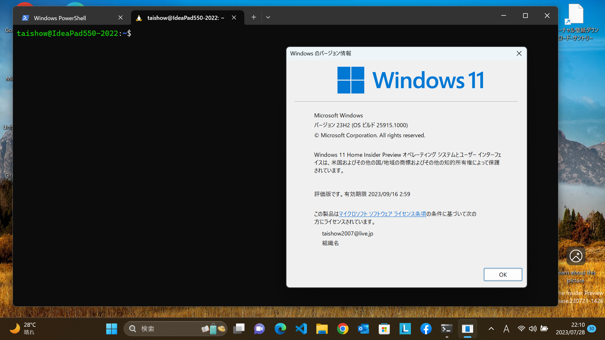
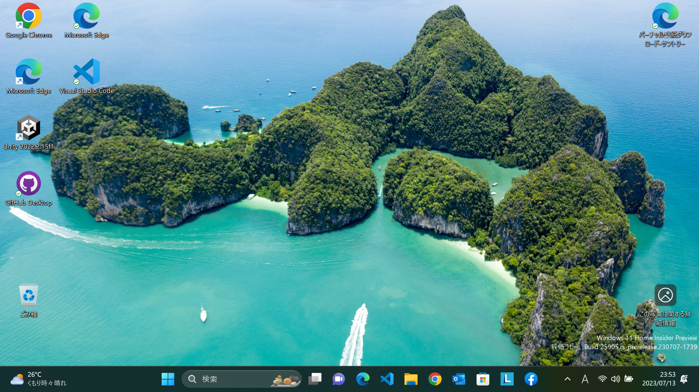
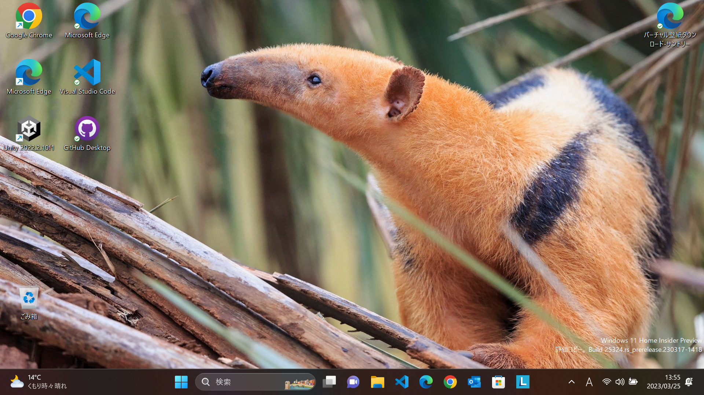

- Windows Insider History
  - [Dev Channel](https://aka.ms/DevLatest)
    - for Windows 11 24H2 (Build 26xxx)
      - Build 26090 *<<2024/03/29 updated from 26085>>*
        - 右下のバージョン情報はない（今後復活する）ため、代わりに「システム > バージョン情報」で確認
        
      - Build 26085 *<<2024/03/21 updated from 26080>>*
        
      - Build 26080 *<<2024/03/14 updated from 26058>>*
        
      - Build 26058 *<<2024/02/22 updated from 26052>>*
        
      - Build 26052 *<<2024/02/11 updated from 23620>>*
        
        
        
    - Build 23620 *<<2024/01/26 updated from 23619>>*
      
    - Build 23619 *<<2024/01/19 updated from 23615>>*
      
    - Build 23615 *<<2024/01/12 updated from 23612>>*
      
    - Build 23612 *<<2024/01/05 updated from 23606>>*
      
    - Build 23606 *<<2023/12/14 updated from 23601>>*
      
    - Build 23601 *<<2023/12/08 updated from 23595>>*
      
    - Build 23595 *<<2023/11/30 updated from 23590>>*
      
    - Build 23590 *<<2023/11/16 updated from 23585>>*
      
    - Build 23585 *<<2023/11/10 updated from 23580>>*
      
    - Build 23580 *<<2023/11/02 updated from 23575>>*
      
    - Build 23575 *<<2023/10/28 updated from 23570>>*
      
    - Build 23570 *<<2023/10/20 updated from 23565>>*
      
    - Build 23565 *<<2023/10/12 updated from 23560>>*
      
      - Windowsアップデートと並行して、Visual StudioのPreviewもアップデートしていたら、完了後再起動したにもかかわらず、背景の表記は古いまま（アップデート失敗した模様。しかし、履歴は完了になっていた）
        
    - Build 23560 *<<2023/10/06 updated from 23555>>*
      
    - Build 23555 *<<2023/09/29 updated from 23550>>*
      
    - Build 23550 *<<2023/09/24 updated from 23545>>*
      
    - Build 23545 *<<2023/09/14 updated from 23541>>*
      
    - Build 23541 *<<2023/09/09 updated from 23536>>*
      
    - Build 23536 *<<2023/09/01 updated from 23531>>*
      
    - Build 23531 *<<2023/08/26 updated from 23526>>*
      
      - Build 23531適用前に表示されたオンラインサービスエクスペリエンスパックって何？
        
    - Build 23526 *<<2023/08/19 updated from 23521>>*
      
    - Build 23521 *<<2023/08/17 installed>>*
      
  - Canary Channel
    - Build 25926 *<<2023/08/11 updated from 25921>>*
      
    - Build 25921 *<<2023/08/06 updated from 25915>>*
      
    - Build 25915 *<<2023/7/28 updated from 25905>>*
      
      - WSLが起動できない問題解消
        
    - Build 25905 *<<2023/7/13 updated from 25393>>*
      
      - WSL起動できない問題発生
      
      
    - Build 25393 *<<2023/6/17 updated from 25389>>*
      
    - Build 25387 *<<2023/6/11 updated from 25375>>*
      
      - 更新直後は、背景画像が初期状態になったので、再度スポットライトを選択。
        
    - Build 25375
      
      - Facebookのウィジェットが追加できた！
      
    - Build 25370
      
    - Build 25357
      
    - FacebookMessengerのウィジェットがプレビュー公開
      
    - Build 25352
      
    - iPhoneとのスマートフォン連携が公開
      
    - Build 25346
      
    - Build 25336
      
    - Build 25330
      
    - Build 25324
      
    - Build 25314
      
  - Dev Channel
    - Build 25309
      
      - 音量ミキサーが新しくなった（Windows＋CTRL＋Vというショートカットも）
        
      - アプリの色を自動的に管理
        
      - iPhoneとリンクできるようになる（予告）
        
    - Build 25300
      
    - Build 25295
      
      
    - Build 25290
      
      - ウイジェットにSportifyやPhoneLinkが追加
      
    - Build 25284
      
    - Build 25281
      - 背景にWindowsスポットライトを設定してみた！
      - メモ帳にタブがついた！
      
