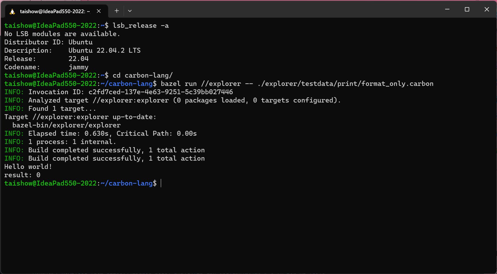

#   Carbon

##  環境
  |端末       |環境／FW     |日付
  |-----------|-------------|----------
  |IdeaPad    |Carbon       |2024/03/16

##  概要
-   [carbon language](https://github.com/carbon-language/carbon-lang)
    *   [公式Dockerfile](https://github.com/carbon-language/carbon-lang/blob/trunk/docker/ubuntu2204/base/Dockerfile)

##  導入
### 環境更新
1.  carbon-explorerを実行
    -   gitからクローン
        *   コマンド
            ```
            git clone https://github.com/carbon-language/carbon-lang
            ```
            <details>
            <summary>ログ</summary>

            ```
            Cloning into 'carbon-lang'...
            remote: Enumerating objects: 53359, done.
            remote: Counting objects: 100% (3589/3589), done.
            remote: Compressing objects: 100% (1299/1299), done.
            remote: Total 53359 (delta 2892), reused 2778 (delta 2288), pack-reused 49770
            Receiving objects: 100% (53359/53359), 18.23 MiB | 18.76 MiB/s, done.
            Resolving deltas: 100% (42073/42073), done.
            ```
            </details>
    -   実行
        *   コマンド
            ```
            cd carbon-lang
            bazel run //explorer -- ./explorer/testdata/print/format_only.carbon
            ```
            <details>
            <summary>ログ</summary>
            
            ```
            2024/03/16 19:08:57 Downloading https://releases.bazel.build/7.1.0/release/bazel-7.1.0-linux-x86_64...
            Extracting Bazel installation...
            Starting local Bazel server and connecting to it...
            INFO: Invocation ID: 6491b086-f4e5-4225-97e0-2028f257c3dd
            INFO: Analyzed target //explorer:explorer (109 packages loaded, 2101 targets configured).
            INFO: Found 1 target...
            Target //explorer:explorer up-to-date:
            bazel-bin/explorer/explorer
            INFO: Elapsed time: 179.582s, Critical Path: 57.60s
            INFO: 591 processes: 159 internal, 432 linux-sandbox.
            INFO: Build completed successfully, 591 total actions
            INFO: Running command line: bazel-bin/explorer/explorer ./explorer/testdata/print/format_only.carbon
            Hello world!
            result: 0    
            ```
            </details>

### 環境構築（３回目）[on ubuntu 22.04 **@2023/09/02** <span style="color: red;">*Installed!*</span>]
1.  HomeBrewインストール
    *   コマンド
        ```
        /bin/bash -c "$(curl -fsSL https://raw.githubusercontent.com/Homebrew/install/HEAD/install.sh)"
        ```
        <details>
        <summary>ログ</summary>

        ```
        taishow@Ideapad550-2023:~$ /bin/bash -c "$(curl -fsSL https://raw.githubusercontent.com/Homebrew/install/HEAD/install.sh)"
        ==> Checking for `sudo` access (which may request your password)...
        [sudo] password for taishow:
        ==> This script will install:
        /home/linuxbrew/.linuxbrew/bin/brew
        /home/linuxbrew/.linuxbrew/share/doc/homebrew
        /home/linuxbrew/.linuxbrew/share/man/man1/brew.1
        /home/linuxbrew/.linuxbrew/share/zsh/site-functions/_brew
        /home/linuxbrew/.linuxbrew/etc/bash_completion.d/brew
        /home/linuxbrew/.linuxbrew/Homebrew
        ==> The following new directories will be created:
        /home/linuxbrew/.linuxbrew/bin
        /home/linuxbrew/.linuxbrew/etc
        /home/linuxbrew/.linuxbrew/include
        /home/linuxbrew/.linuxbrew/lib
        /home/linuxbrew/.linuxbrew/sbin
        /home/linuxbrew/.linuxbrew/share
        /home/linuxbrew/.linuxbrew/var
        /home/linuxbrew/.linuxbrew/opt
        /home/linuxbrew/.linuxbrew/share/zsh
        /home/linuxbrew/.linuxbrew/share/zsh/site-functions
        /home/linuxbrew/.linuxbrew/var/homebrew
        /home/linuxbrew/.linuxbrew/var/homebrew/linked
        /home/linuxbrew/.linuxbrew/Cellar
        /home/linuxbrew/.linuxbrew/Caskroom
        /home/linuxbrew/.linuxbrew/Frameworks

        Press RETURN/ENTER to continue or any other key to abort:
        ==> /usr/bin/sudo /usr/bin/install -d -o taishow -g taishow -m 0755 /home/linuxbrew/.linuxbrew
        ==> /usr/bin/sudo /bin/mkdir -p /home/linuxbrew/.linuxbrew/bin /home/linuxbrew/.linuxbrew/etc /home/linuxbrew/.linuxbrew/include /home/linuxbrew/.linuxbrew/lib /home/linuxbrew/.linuxbrew/sbin /home/linuxbrew/.linuxbrew/share /home/linuxbrew/.linuxbrew/var /home/linuxbrew/.linuxbrew/opt /home/linuxbrew/.linuxbrew/share/zsh /home/linuxbrew/.linuxbrew/share/zsh/site-functions /home/linuxbrew/.linuxbrew/var/homebrew /home/linuxbrew/.linuxbrew/var/homebrew/linked /home/linuxbrew/.linuxbrew/Cellar /home/linuxbrew/.linuxbrew/Caskroom /home/linuxbrew/.linuxbrew/Frameworks
        ==> /usr/bin/sudo /bin/chmod ug=rwx /home/linuxbrew/.linuxbrew/bin /home/linuxbrew/.linuxbrew/etc /home/linuxbrew/.linuxbrew/include /home/linuxbrew/.linuxbrew/lib /home/linuxbrew/.linuxbrew/sbin /home/linuxbrew/.linuxbrew/share /home/linuxbrew/.linuxbrew/var /home/linuxbrew/.linuxbrew/opt /home/linuxbrew/.linuxbrew/share/zsh /home/linuxbrew/.linuxbrew/share/zsh/site-functions /home/linuxbrew/.linuxbrew/var/homebrew /home/linuxbrew/.linuxbrew/var/homebrew/linked /home/linuxbrew/.linuxbrew/Cellar /home/linuxbrew/.linuxbrew/Caskroom /home/linuxbrew/.linuxbrew/Frameworks
        ==> /usr/bin/sudo /bin/chmod go-w /home/linuxbrew/.linuxbrew/share/zsh /home/linuxbrew/.linuxbrew/share/zsh/site-functions
        ==> /usr/bin/sudo /bin/chown taishow /home/linuxbrew/.linuxbrew/bin /home/linuxbrew/.linuxbrew/etc /home/linuxbrew/.linuxbrew/include /home/linuxbrew/.linuxbrew/lib /home/linuxbrew/.linuxbrew/sbin /home/linuxbrew/.linuxbrew/share /home/linuxbrew/.linuxbrew/var /home/linuxbrew/.linuxbrew/opt /home/linuxbrew/.linuxbrew/share/zsh /home/linuxbrew/.linuxbrew/share/zsh/site-functions /home/linuxbrew/.linuxbrew/var/homebrew /home/linuxbrew/.linuxbrew/var/homebrew/linked /home/linuxbrew/.linuxbrew/Cellar /home/linuxbrew/.linuxbrew/Caskroom /home/linuxbrew/.linuxbrew/Frameworks
        ==> /usr/bin/sudo /bin/chgrp taishow /home/linuxbrew/.linuxbrew/bin /home/linuxbrew/.linuxbrew/etc /home/linuxbrew/.linuxbrew/include /home/linuxbrew/.linuxbrew/lib /home/linuxbrew/.linuxbrew/sbin /home/linuxbrew/.linuxbrew/share /home/linuxbrew/.linuxbrew/var /home/linuxbrew/.linuxbrew/opt /home/linuxbrew/.linuxbrew/share/zsh /home/linuxbrew/.linuxbrew/share/zsh/site-functions /home/linuxbrew/.linuxbrew/var/homebrew /home/linuxbrew/.linuxbrew/var/homebrew/linked /home/linuxbrew/.linuxbrew/Cellar /home/linuxbrew/.linuxbrew/Caskroom /home/linuxbrew/.linuxbrew/Frameworks
        ==> /usr/bin/sudo /bin/mkdir -p /home/linuxbrew/.linuxbrew/Homebrew
        ==> /usr/bin/sudo /bin/chown -R taishow:taishow /home/linuxbrew/.linuxbrew/Homebrew
        ==> Downloading and installing Homebrew...
        remote: Enumerating objects: 246592, done.
        remote: Counting objects: 100% (876/876), done.
        remote: Compressing objects: 100% (542/542), done.
        remote: Total 246592 (delta 382), reused 763 (delta 306), pack-reused 245716
        Receiving objects: 100% (246592/246592), 72.63 MiB | 25.49 MiB/s, done.
        Resolving deltas: 100% (180206/180206), done.
        From https://github.com/Homebrew/brew
        * [new branch]          dependabot/bundler/Library/Homebrew/rubocop-sorbet-0.7.3 -> origin/dependabot/bundler/Library/Homebrew/rubocop-sorbet-0.7.3
        * [new branch]          master                               -> origin/master
        * [new branch]          sponsors-maintainers-man-completions -> origin/sponsors-maintainers-man-completions
        * [new tag]             0.1                                  -> 0.1
        * [new tag]             0.2                                  -> 0.2
        * [new tag]             0.3                                  -> 0.3
        * [new tag]             0.4                                  -> 0.4
        * [new tag]             0.5                                  -> 0.5
        * [new tag]             0.6                                  -> 0.6
        * [new tag]             0.7                                  -> 0.7
        * [new tag]             0.7.1                                -> 0.7.1
        * [new tag]             0.8                                  -> 0.8
        * [new tag]             0.8.1                                -> 0.8.1
        * [new tag]             0.9                                  -> 0.9
        * [new tag]             0.9.1                                -> 0.9.1
        * [new tag]             0.9.2                                -> 0.9.2
        * [new tag]             0.9.3                                -> 0.9.3
        * [new tag]             0.9.4                                -> 0.9.4
        * [new tag]             0.9.5                                -> 0.9.5
        * [new tag]             0.9.8                                -> 0.9.8
        * [new tag]             0.9.9                                -> 0.9.9
        * [new tag]             1.0.0                                -> 1.0.0
        * [new tag]             1.0.1                                -> 1.0.1
        * [new tag]             1.0.2                                -> 1.0.2
        * [new tag]             1.0.3                                -> 1.0.3
        * [new tag]             1.0.4                                -> 1.0.4
        * [new tag]             1.0.5                                -> 1.0.5
        * [new tag]             1.0.6                                -> 1.0.6
        * [new tag]             1.0.7                                -> 1.0.7
        * [new tag]             1.0.8                                -> 1.0.8
        * [new tag]             1.0.9                                -> 1.0.9
        * [new tag]             1.1.0                                -> 1.1.0
        * [new tag]             1.1.1                                -> 1.1.1
        * [new tag]             1.1.10                               -> 1.1.10
        * [new tag]             1.1.11                               -> 1.1.11
        * [new tag]             1.1.12                               -> 1.1.12
        * [new tag]             1.1.13                               -> 1.1.13
        * [new tag]             1.1.2                                -> 1.1.2
        * [new tag]             1.1.3                                -> 1.1.3
        * [new tag]             1.1.4                                -> 1.1.4
        * [new tag]             1.1.5                                -> 1.1.5
        * [new tag]             1.1.6                                -> 1.1.6
        * [new tag]             1.1.7                                -> 1.1.7
        * [new tag]             1.1.8                                -> 1.1.8
        * [new tag]             1.1.9                                -> 1.1.9
        * [new tag]             1.2.0                                -> 1.2.0
        * [new tag]             1.2.1                                -> 1.2.1
        * [new tag]             1.2.2                                -> 1.2.2
        * [new tag]             1.2.3                                -> 1.2.3
        * [new tag]             1.2.4                                -> 1.2.4
        * [new tag]             1.2.5                                -> 1.2.5
        * [new tag]             1.2.6                                -> 1.2.6
        * [new tag]             1.3.0                                -> 1.3.0
        * [new tag]             1.3.1                                -> 1.3.1
        * [new tag]             1.3.2                                -> 1.3.2
        * [new tag]             1.3.3                                -> 1.3.3
        * [new tag]             1.3.4                                -> 1.3.4
        * [new tag]             1.3.5                                -> 1.3.5
        * [new tag]             1.3.6                                -> 1.3.6
        * [new tag]             1.3.7                                -> 1.3.7
        * [new tag]             1.3.8                                -> 1.3.8
        * [new tag]             1.3.9                                -> 1.3.9
        * [new tag]             1.4.0                                -> 1.4.0
        * [new tag]             1.4.1                                -> 1.4.1
        * [new tag]             1.4.2                                -> 1.4.2
        * [new tag]             1.4.3                                -> 1.4.3
        * [new tag]             1.5.0                                -> 1.5.0
        * [new tag]             1.5.1                                -> 1.5.1
        * [new tag]             1.5.10                               -> 1.5.10
        * [new tag]             1.5.11                               -> 1.5.11
        * [new tag]             1.5.12                               -> 1.5.12
        * [new tag]             1.5.13                               -> 1.5.13
        * [new tag]             1.5.14                               -> 1.5.14
        * [new tag]             1.5.2                                -> 1.5.2
        * [new tag]             1.5.3                                -> 1.5.3
        * [new tag]             1.5.4                                -> 1.5.4
        * [new tag]             1.5.5                                -> 1.5.5
        * [new tag]             1.5.6                                -> 1.5.6
        * [new tag]             1.5.7                                -> 1.5.7
        * [new tag]             1.5.8                                -> 1.5.8
        * [new tag]             1.5.9                                -> 1.5.9
        * [new tag]             1.6.0                                -> 1.6.0
        * [new tag]             1.6.1                                -> 1.6.1
        * [new tag]             1.6.10                               -> 1.6.10
        * [new tag]             1.6.11                               -> 1.6.11
        * [new tag]             1.6.12                               -> 1.6.12
        * [new tag]             1.6.13                               -> 1.6.13
        * [new tag]             1.6.14                               -> 1.6.14
        * [new tag]             1.6.15                               -> 1.6.15
        * [new tag]             1.6.16                               -> 1.6.16
        * [new tag]             1.6.17                               -> 1.6.17
        * [new tag]             1.6.2                                -> 1.6.2
        * [new tag]             1.6.3                                -> 1.6.3
        * [new tag]             1.6.4                                -> 1.6.4
        * [new tag]             1.6.5                                -> 1.6.5
        * [new tag]             1.6.6                                -> 1.6.6
        * [new tag]             1.6.7                                -> 1.6.7
        * [new tag]             1.6.8                                -> 1.6.8
        * [new tag]             1.6.9                                -> 1.6.9
        * [new tag]             1.7.0                                -> 1.7.0
        * [new tag]             1.7.1                                -> 1.7.1
        * [new tag]             1.7.2                                -> 1.7.2
        * [new tag]             1.7.3                                -> 1.7.3
        * [new tag]             1.7.4                                -> 1.7.4
        * [new tag]             1.7.5                                -> 1.7.5
        * [new tag]             1.7.6                                -> 1.7.6
        * [new tag]             1.7.7                                -> 1.7.7
        * [new tag]             1.8.0                                -> 1.8.0
        * [new tag]             1.8.1                                -> 1.8.1
        * [new tag]             1.8.2                                -> 1.8.2
        * [new tag]             1.8.3                                -> 1.8.3
        * [new tag]             1.8.4                                -> 1.8.4
        * [new tag]             1.8.5                                -> 1.8.5
        * [new tag]             1.8.6                                -> 1.8.6
        * [new tag]             1.9.0                                -> 1.9.0
        * [new tag]             1.9.1                                -> 1.9.1
        * [new tag]             1.9.2                                -> 1.9.2
        * [new tag]             1.9.3                                -> 1.9.3
        * [new tag]             2.0.0                                -> 2.0.0
        * [new tag]             2.0.1                                -> 2.0.1
        * [new tag]             2.0.2                                -> 2.0.2
        * [new tag]             2.0.3                                -> 2.0.3
        * [new tag]             2.0.4                                -> 2.0.4
        * [new tag]             2.0.5                                -> 2.0.5
        * [new tag]             2.0.6                                -> 2.0.6
        * [new tag]             2.1.0                                -> 2.1.0
        * [new tag]             2.1.1                                -> 2.1.1
        * [new tag]             2.1.10                               -> 2.1.10
        * [new tag]             2.1.11                               -> 2.1.11
        * [new tag]             2.1.12                               -> 2.1.12
        * [new tag]             2.1.13                               -> 2.1.13
        * [new tag]             2.1.14                               -> 2.1.14
        * [new tag]             2.1.15                               -> 2.1.15
        * [new tag]             2.1.16                               -> 2.1.16
        * [new tag]             2.1.2                                -> 2.1.2
        * [new tag]             2.1.3                                -> 2.1.3
        * [new tag]             2.1.4                                -> 2.1.4
        * [new tag]             2.1.5                                -> 2.1.5
        * [new tag]             2.1.6                                -> 2.1.6
        * [new tag]             2.1.7                                -> 2.1.7
        * [new tag]             2.1.8                                -> 2.1.8
        * [new tag]             2.1.9                                -> 2.1.9
        * [new tag]             2.2.0                                -> 2.2.0
        * [new tag]             2.2.1                                -> 2.2.1
        * [new tag]             2.2.10                               -> 2.2.10
        * [new tag]             2.2.11                               -> 2.2.11
        * [new tag]             2.2.12                               -> 2.2.12
        * [new tag]             2.2.13                               -> 2.2.13
        * [new tag]             2.2.14                               -> 2.2.14
        * [new tag]             2.2.15                               -> 2.2.15
        * [new tag]             2.2.16                               -> 2.2.16
        * [new tag]             2.2.17                               -> 2.2.17
        * [new tag]             2.2.2                                -> 2.2.2
        * [new tag]             2.2.3                                -> 2.2.3
        * [new tag]             2.2.4                                -> 2.2.4
        * [new tag]             2.2.5                                -> 2.2.5
        * [new tag]             2.2.6                                -> 2.2.6
        * [new tag]             2.2.7                                -> 2.2.7
        * [new tag]             2.2.8                                -> 2.2.8
        * [new tag]             2.2.9                                -> 2.2.9
        * [new tag]             2.3.0                                -> 2.3.0
        * [new tag]             2.4.0                                -> 2.4.0
        * [new tag]             2.4.1                                -> 2.4.1
        * [new tag]             2.4.10                               -> 2.4.10
        * [new tag]             2.4.11                               -> 2.4.11
        * [new tag]             2.4.12                               -> 2.4.12
        * [new tag]             2.4.13                               -> 2.4.13
        * [new tag]             2.4.14                               -> 2.4.14
        * [new tag]             2.4.15                               -> 2.4.15
        * [new tag]             2.4.16                               -> 2.4.16
        * [new tag]             2.4.2                                -> 2.4.2
        * [new tag]             2.4.3                                -> 2.4.3
        * [new tag]             2.4.4                                -> 2.4.4
        * [new tag]             2.4.5                                -> 2.4.5
        * [new tag]             2.4.6                                -> 2.4.6
        * [new tag]             2.4.7                                -> 2.4.7
        * [new tag]             2.4.8                                -> 2.4.8
        * [new tag]             2.4.9                                -> 2.4.9
        * [new tag]             2.5.0                                -> 2.5.0
        * [new tag]             2.5.1                                -> 2.5.1
        * [new tag]             2.5.10                               -> 2.5.10
        * [new tag]             2.5.11                               -> 2.5.11
        * [new tag]             2.5.12                               -> 2.5.12
        * [new tag]             2.5.2                                -> 2.5.2
        * [new tag]             2.5.3                                -> 2.5.3
        * [new tag]             2.5.4                                -> 2.5.4
        * [new tag]             2.5.5                                -> 2.5.5
        * [new tag]             2.5.6                                -> 2.5.6
        * [new tag]             2.5.7                                -> 2.5.7
        * [new tag]             2.5.8                                -> 2.5.8
        * [new tag]             2.5.9                                -> 2.5.9
        * [new tag]             2.6.0                                -> 2.6.0
        * [new tag]             2.6.1                                -> 2.6.1
        * [new tag]             2.6.2                                -> 2.6.2
        * [new tag]             2.7.0                                -> 2.7.0
        * [new tag]             2.7.1                                -> 2.7.1
        * [new tag]             2.7.2                                -> 2.7.2
        * [new tag]             2.7.3                                -> 2.7.3
        * [new tag]             2.7.4                                -> 2.7.4
        * [new tag]             2.7.5                                -> 2.7.5
        * [new tag]             2.7.6                                -> 2.7.6
        * [new tag]             2.7.7                                -> 2.7.7
        * [new tag]             3.0.0                                -> 3.0.0
        * [new tag]             3.0.1                                -> 3.0.1
        * [new tag]             3.0.10                               -> 3.0.10
        * [new tag]             3.0.11                               -> 3.0.11
        * [new tag]             3.0.2                                -> 3.0.2
        * [new tag]             3.0.3                                -> 3.0.3
        * [new tag]             3.0.4                                -> 3.0.4
        * [new tag]             3.0.5                                -> 3.0.5
        * [new tag]             3.0.6                                -> 3.0.6
        * [new tag]             3.0.7                                -> 3.0.7
        * [new tag]             3.0.8                                -> 3.0.8
        * [new tag]             3.0.9                                -> 3.0.9
        * [new tag]             3.1.0                                -> 3.1.0
        * [new tag]             3.1.1                                -> 3.1.1
        * [new tag]             3.1.10                               -> 3.1.10
        * [new tag]             3.1.11                               -> 3.1.11
        * [new tag]             3.1.12                               -> 3.1.12
        * [new tag]             3.1.2                                -> 3.1.2
        * [new tag]             3.1.3                                -> 3.1.3
        * [new tag]             3.1.4                                -> 3.1.4
        * [new tag]             3.1.5                                -> 3.1.5
        * [new tag]             3.1.6                                -> 3.1.6
        * [new tag]             3.1.7                                -> 3.1.7
        * [new tag]             3.1.8                                -> 3.1.8
        * [new tag]             3.1.9                                -> 3.1.9
        * [new tag]             3.2.0                                -> 3.2.0
        * [new tag]             3.2.1                                -> 3.2.1
        * [new tag]             3.2.10                               -> 3.2.10
        * [new tag]             3.2.11                               -> 3.2.11
        * [new tag]             3.2.12                               -> 3.2.12
        * [new tag]             3.2.13                               -> 3.2.13
        * [new tag]             3.2.14                               -> 3.2.14
        * [new tag]             3.2.15                               -> 3.2.15
        * [new tag]             3.2.16                               -> 3.2.16
        * [new tag]             3.2.17                               -> 3.2.17
        * [new tag]             3.2.2                                -> 3.2.2
        * [new tag]             3.2.3                                -> 3.2.3
        * [new tag]             3.2.4                                -> 3.2.4
        * [new tag]             3.2.5                                -> 3.2.5
        * [new tag]             3.2.6                                -> 3.2.6
        * [new tag]             3.2.7                                -> 3.2.7
        * [new tag]             3.2.8                                -> 3.2.8
        * [new tag]             3.2.9                                -> 3.2.9
        * [new tag]             3.3.0                                -> 3.3.0
        * [new tag]             3.3.1                                -> 3.3.1
        * [new tag]             3.3.10                               -> 3.3.10
        * [new tag]             3.3.11                               -> 3.3.11
        * [new tag]             3.3.12                               -> 3.3.12
        * [new tag]             3.3.13                               -> 3.3.13
        * [new tag]             3.3.14                               -> 3.3.14
        * [new tag]             3.3.15                               -> 3.3.15
        * [new tag]             3.3.16                               -> 3.3.16
        * [new tag]             3.3.2                                -> 3.3.2
        * [new tag]             3.3.3                                -> 3.3.3
        * [new tag]             3.3.4                                -> 3.3.4
        * [new tag]             3.3.5                                -> 3.3.5
        * [new tag]             3.3.6                                -> 3.3.6
        * [new tag]             3.3.7                                -> 3.3.7
        * [new tag]             3.3.8                                -> 3.3.8
        * [new tag]             3.3.9                                -> 3.3.9
        * [new tag]             3.4.0                                -> 3.4.0
        * [new tag]             3.4.1                                -> 3.4.1
        * [new tag]             3.4.10                               -> 3.4.10
        * [new tag]             3.4.11                               -> 3.4.11
        * [new tag]             3.4.2                                -> 3.4.2
        * [new tag]             3.4.3                                -> 3.4.3
        * [new tag]             3.4.4                                -> 3.4.4
        * [new tag]             3.4.5                                -> 3.4.5
        * [new tag]             3.4.6                                -> 3.4.6
        * [new tag]             3.4.7                                -> 3.4.7
        * [new tag]             3.4.8                                -> 3.4.8
        * [new tag]             3.4.9                                -> 3.4.9
        * [new tag]             3.5.0                                -> 3.5.0
        * [new tag]             3.5.1                                -> 3.5.1
        * [new tag]             3.5.10                               -> 3.5.10
        * [new tag]             3.5.2                                -> 3.5.2
        * [new tag]             3.5.3                                -> 3.5.3
        * [new tag]             3.5.4                                -> 3.5.4
        * [new tag]             3.5.5                                -> 3.5.5
        * [new tag]             3.5.6                                -> 3.5.6
        * [new tag]             3.5.7                                -> 3.5.7
        * [new tag]             3.5.8                                -> 3.5.8
        * [new tag]             3.5.9                                -> 3.5.9
        * [new tag]             3.6.0                                -> 3.6.0
        * [new tag]             3.6.1                                -> 3.6.1
        * [new tag]             3.6.10                               -> 3.6.10
        * [new tag]             3.6.11                               -> 3.6.11
        * [new tag]             3.6.12                               -> 3.6.12
        * [new tag]             3.6.13                               -> 3.6.13
        * [new tag]             3.6.14                               -> 3.6.14
        * [new tag]             3.6.15                               -> 3.6.15
        * [new tag]             3.6.16                               -> 3.6.16
        * [new tag]             3.6.17                               -> 3.6.17
        * [new tag]             3.6.18                               -> 3.6.18
        * [new tag]             3.6.19                               -> 3.6.19
        * [new tag]             3.6.2                                -> 3.6.2
        * [new tag]             3.6.20                               -> 3.6.20
        * [new tag]             3.6.21                               -> 3.6.21
        * [new tag]             3.6.3                                -> 3.6.3
        * [new tag]             3.6.4                                -> 3.6.4
        * [new tag]             3.6.5                                -> 3.6.5
        * [new tag]             3.6.6                                -> 3.6.6
        * [new tag]             3.6.7                                -> 3.6.7
        * [new tag]             3.6.8                                -> 3.6.8
        * [new tag]             3.6.9                                -> 3.6.9
        * [new tag]             4.0.0                                -> 4.0.0
        * [new tag]             4.0.1                                -> 4.0.1
        * [new tag]             4.0.10                               -> 4.0.10
        * [new tag]             4.0.11                               -> 4.0.11
        * [new tag]             4.0.12                               -> 4.0.12
        * [new tag]             4.0.13                               -> 4.0.13
        * [new tag]             4.0.14                               -> 4.0.14
        * [new tag]             4.0.15                               -> 4.0.15
        * [new tag]             4.0.16                               -> 4.0.16
        * [new tag]             4.0.17                               -> 4.0.17
        * [new tag]             4.0.18                               -> 4.0.18
        * [new tag]             4.0.19                               -> 4.0.19
        * [new tag]             4.0.2                                -> 4.0.2
        * [new tag]             4.0.20                               -> 4.0.20
        * [new tag]             4.0.21                               -> 4.0.21
        * [new tag]             4.0.22                               -> 4.0.22
        * [new tag]             4.0.23                               -> 4.0.23
        * [new tag]             4.0.24                               -> 4.0.24
        * [new tag]             4.0.25                               -> 4.0.25
        * [new tag]             4.0.26                               -> 4.0.26
        * [new tag]             4.0.27                               -> 4.0.27
        * [new tag]             4.0.28                               -> 4.0.28
        * [new tag]             4.0.3                                -> 4.0.3
        * [new tag]             4.0.4                                -> 4.0.4
        * [new tag]             4.0.5                                -> 4.0.5
        * [new tag]             4.0.6                                -> 4.0.6
        * [new tag]             4.0.7                                -> 4.0.7
        * [new tag]             4.0.8                                -> 4.0.8
        * [new tag]             4.0.9                                -> 4.0.9
        * [new tag]             4.1.0                                -> 4.1.0
        * [new tag]             4.1.1                                -> 4.1.1
        * [new tag]             4.1.2                                -> 4.1.2
        * [new tag]             4.1.3                                -> 4.1.3
        * [new tag]             4.1.4                                -> 4.1.4
        * [new tag]             4.1.5                                -> 4.1.5
        * [new tag]             4.1.6                                -> 4.1.6
        * [new tag]             4.1.7                                -> 4.1.7
        remote: Enumerating objects: 13, done.
        remote: Counting objects: 100% (7/7), done.
        remote: Total 13 (delta 7), reused 7 (delta 7), pack-reused 6
        Unpacking objects: 100% (13/13), 2.77 KiB | 567.00 KiB/s, done.
        From https://github.com/Homebrew/brew
        * [new tag]             4.0.29     -> 4.0.29
        HEAD is now at de50e8418 Merge pull request #15930 from issyl0/markdown-numbering
        ==> Downloading https://ghcr.io/v2/homebrew/portable-ruby/portable-ruby/blobs/sha256:68923daf3e139482b977c3deba63a3b54ea37bb5f716482948878819ef911bad
        ######################################################################## 100.0%
        ==> Pouring portable-ruby-2.6.10_1.x86_64_linux.bottle.tar.gz
        Warning: /home/linuxbrew/.linuxbrew/bin is not in your PATH.
        Instructions on how to configure your shell for Homebrew
        can be found in the 'Next steps' section below.
        ==> Installation successful!

        ==> Homebrew has enabled anonymous aggregate formulae and cask analytics.
        Read the analytics documentation (and how to opt-out) here:
        https://docs.brew.sh/Analytics
        No analytics data has been sent yet (nor will any be during this install run).

        ==> Homebrew is run entirely by unpaid volunteers. Please consider donating:
        https://github.com/Homebrew/brew#donations

        ==> Next steps:
        - Run these two commands in your terminal to add Homebrew to your PATH:
            (echo; echo 'eval "$(/home/linuxbrew/.linuxbrew/bin/brew shellenv)"') >> /home/taishow/.profile
            eval "$(/home/linuxbrew/.linuxbrew/bin/brew shellenv)"
        - Install Homebrew's dependencies if you have sudo access:
            sudo apt-get install build-essential
        For more information, see:
            https://docs.brew.sh/Homebrew-on-Linux
        - We recommend that you install GCC:
            brew install gcc
        - Run brew help to get started
        - Further documentation:
            https://docs.brew.sh
        ```
        </details>
1.  PATH設定
    ```
    (echo; echo 'eval "$(/home/linuxbrew/.linuxbrew/bin/brew shellenv)"') >> /home/taishow/.profile
    eval "$(/home/linuxbrew/.linuxbrew/bin/brew shellenv)"
    ```
1.  HomeBrewの必須パッケージ（確認）
    1.  コマンド
        ```
        sudo apt-get install build-essential
        ```
        <details>
        <summary>ログ</summary>

        ```
        Reading package lists... Done
        Building dependency tree... Done
        Reading state information... Done
        build-essential is already the newest version (12.9ubuntu3).
        0 upgraded, 0 newly installed, 0 to remove and 0 not upgraded.
        ```
        </details>
1.  gcc インストール
    *   コマンド
        ```
        brew install gcc
        ```
        <details>
        <summary>ログ</summary>

        ```
        ==> Fetching dependencies for gcc: gmp, isl, mpfr, libmpc, lz4, xz, zlib, zstd and binutils
        ==> Fetching gmp
        ==> Downloading https://ghcr.io/v2/homebrew/core/gmp/manifests/6.2.1_1
        ##################################################################################################### 100.0%
        ==> Downloading https://ghcr.io/v2/homebrew/core/gmp/blobs/sha256:786ae29f0c0b06ea86e42bd9c6ac2c49bd5757da03
        ##################################################################################################### 100.0%
        ==> Fetching isl
        ==> Downloading https://ghcr.io/v2/homebrew/core/isl/manifests/0.26
        ##################################################################################################### 100.0%
        ==> Downloading https://ghcr.io/v2/homebrew/core/isl/blobs/sha256:db14ba1e4ea23ab41e06930dcf25ae9023c5e395c8
        ##################################################################################################### 100.0%
        ==> Fetching mpfr
        ==> Downloading https://ghcr.io/v2/homebrew/core/mpfr/manifests/4.2.0-p12
        ##################################################################################################### 100.0%
        ==> Downloading https://ghcr.io/v2/homebrew/core/mpfr/blobs/sha256:57c89c97863cb0d08251271de84ae157b364af3b3
        ##################################################################################################### 100.0%
        ==> Fetching libmpc
        ==> Downloading https://ghcr.io/v2/homebrew/core/libmpc/manifests/1.3.1
        ##################################################################################################### 100.0%
        ==> Downloading https://ghcr.io/v2/homebrew/core/libmpc/blobs/sha256:f6542ae5bcf643ca0c980c7000cde1585922e76
        ##################################################################################################### 100.0%
        ==> Fetching lz4
        ==> Downloading https://ghcr.io/v2/homebrew/core/lz4/manifests/1.9.4
        ##################################################################################################### 100.0%
        ==> Downloading https://ghcr.io/v2/homebrew/core/lz4/blobs/sha256:1757fefc3840e11c4822e4c2a95aa62aca44a4eacc
        ##################################################################################################### 100.0%
        ==> Fetching xz
        ==> Downloading https://ghcr.io/v2/homebrew/core/xz/manifests/5.4.4
        ##################################################################################################### 100.0%
        ==> Downloading https://ghcr.io/v2/homebrew/core/xz/blobs/sha256:f68637417bc856ba59f1ec25f7fcb0ccba14a9d5355
        ##################################################################################################### 100.0%
        ==> Fetching zlib
        ==> Downloading https://ghcr.io/v2/homebrew/core/zlib/manifests/1.3
        ##################################################################################################### 100.0%
        ==> Downloading https://ghcr.io/v2/homebrew/core/zlib/blobs/sha256:a47a3b5c8ee68010ab374a3d395e7a39a2d08f4f0
        ##################################################################################################### 100.0%
        ==> Fetching zstd
        ==> Downloading https://ghcr.io/v2/homebrew/core/zstd/manifests/1.5.5-1
        ##################################################################################################### 100.0%
        ==> Downloading https://ghcr.io/v2/homebrew/core/zstd/blobs/sha256:96afcbd191c9961446161a6fabf09cbbb4c6b3df3
        ##################################################################################################### 100.0%
        ==> Fetching binutils
        ==> Downloading https://ghcr.io/v2/homebrew/core/binutils/manifests/2.41
        ##################################################################################################### 100.0%
        ==> Downloading https://ghcr.io/v2/homebrew/core/binutils/blobs/sha256:3b91a59270365b124e3d73d14d75c9085f156
        ##################################################################################################### 100.0%
        ==> Fetching gcc
        ==> Downloading https://ghcr.io/v2/homebrew/core/gcc/manifests/13.2.0
        ##################################################################################################### 100.0%
        ==> Downloading https://ghcr.io/v2/homebrew/core/gcc/blobs/sha256:fea0256da0e5ef8a08fe08f6130de799e038b008ac
        ##################################################################################################### 100.0%
        ==> Installing dependencies for gcc: gmp, isl, mpfr, libmpc, lz4, xz, zlib, zstd and binutils
        ==> Installing gcc dependency: gmp
        ==> Pouring gmp--6.2.1_1.x86_64_linux.bottle.tar.gz
        🍺  /home/linuxbrew/.linuxbrew/Cellar/gmp/6.2.1_1: 23 files, 3.9MB
        ==> Installing gcc dependency: isl
        ==> Pouring isl--0.26.x86_64_linux.bottle.tar.gz
        🍺  /home/linuxbrew/.linuxbrew/Cellar/isl/0.26: 74 files, 9.8MB
        ==> Installing gcc dependency: mpfr
        ==> Pouring mpfr--4.2.0-p12.x86_64_linux.bottle.tar.gz
        🍺  /home/linuxbrew/.linuxbrew/Cellar/mpfr/4.2.0-p12: 31 files, 3.9MB
        ==> Installing gcc dependency: libmpc
        ==> Pouring libmpc--1.3.1.x86_64_linux.bottle.tar.gz
        🍺  /home/linuxbrew/.linuxbrew/Cellar/libmpc/1.3.1: 13 files, 638.3KB
        ==> Installing gcc dependency: lz4
        ==> Pouring lz4--1.9.4.x86_64_linux.bottle.tar.gz
        🍺  /home/linuxbrew/.linuxbrew/Cellar/lz4/1.9.4: 22 files, 695.3KB
        ==> Installing gcc dependency: xz
        ==> Pouring xz--5.4.4.x86_64_linux.bottle.tar.gz
        🍺  /home/linuxbrew/.linuxbrew/Cellar/xz/5.4.4: 313 files, 4MB
        ==> Installing gcc dependency: zlib
        ==> Pouring zlib--1.3.x86_64_linux.bottle.tar.gz
        🍺  /home/linuxbrew/.linuxbrew/Cellar/zlib/1.3: 13 files, 473.0KB
        ==> Installing gcc dependency: zstd
        ==> Pouring zstd--1.5.5.x86_64_linux.bottle.1.tar.gz
        🍺  /home/linuxbrew/.linuxbrew/Cellar/zstd/1.5.5: 31 files, 2.8MB
        ==> Installing gcc dependency: binutils
        ==> Pouring binutils--2.41.x86_64_linux.bottle.tar.gz
        🍺  /home/linuxbrew/.linuxbrew/Cellar/binutils/2.41: 4,729 files, 469MB
        ==> Installing gcc
        ==> Pouring gcc--13.2.0.x86_64_linux.bottle.tar.gz
        ==> Creating the GCC specs file: /home/linuxbrew/.linuxbrew/Cellar/gcc/13.2.0/bin/../lib/gcc/current/gcc/x86
        🍺  /home/linuxbrew/.linuxbrew/Cellar/gcc/13.2.0: 1,668 files, 320.2MB
        ==> Running `brew cleanup gcc`...
        Disable this behaviour by setting HOMEBREW_NO_INSTALL_CLEANUP.
        Hide these hints with HOMEBREW_NO_ENV_HINTS (see `man brew`).
        ```
        </details>
1.  Carbon必須パッケージ(bazel,llvm)のインストール
    *   コマンド
        ```
        brew install bazelisk llvm
        ```
        <details>
        <summary>ログ</summary>

        ```
        ==> Fetching bazelisk
        ==> Downloading https://ghcr.io/v2/homebrew/core/bazelisk/manifests/1.18.0
        ##################################################################################################### 100.0%
        ==> Downloading https://ghcr.io/v2/homebrew/core/bazelisk/blobs/sha256:d9b0b8bc184b022a101560244285ee27a3c31
        ##################################################################################################### 100.0%
        ==> Fetching dependencies for llvm: mpdecimal, ca-certificates, openssl@3, ncurses, readline, sqlite, berkeley-db@5, libedit, krb5, libtirpc, libnsl, bzip2, expat, libffi, libxcrypt, unzip, python@3.11, six, z3 and elfutils
        ==> Fetching mpdecimal
        ==> Downloading https://ghcr.io/v2/homebrew/core/mpdecimal/manifests/2.5.1
        ##################################################################################################### 100.0%
        ==> Downloading https://ghcr.io/v2/homebrew/core/mpdecimal/blobs/sha256:c5d64a4dd47dc1b66887c0cecd884f0848a8
        ##################################################################################################### 100.0%
        ==> Fetching ca-certificates
        ==> Downloading https://ghcr.io/v2/homebrew/core/ca-certificates/manifests/2023-08-22
        ##################################################################################################### 100.0%
        ==> Downloading https://ghcr.io/v2/homebrew/core/ca-certificates/blobs/sha256:68805f32523ea598c61d118e1a41cc
        ##################################################################################################### 100.0%
        ==> Fetching openssl@3
        ==> Downloading https://ghcr.io/v2/homebrew/core/openssl/3/manifests/3.1.2-1
        ##################################################################################################### 100.0%
        ==> Downloading https://ghcr.io/v2/homebrew/core/openssl/3/blobs/sha256:8e331173f849ca5d02237f086b80568aff17
        ##################################################################################################### 100.0%
        ==> Fetching ncurses
        ==> Downloading https://ghcr.io/v2/homebrew/core/ncurses/manifests/6.4-1
        ##################################################################################################### 100.0%
        ==> Downloading https://ghcr.io/v2/homebrew/core/ncurses/blobs/sha256:58970126fed5ca09650b60c453e2b911a85f03
        ##################################################################################################### 100.0%
        ==> Fetching readline
        ==> Downloading https://ghcr.io/v2/homebrew/core/readline/manifests/8.2.1
        ##################################################################################################### 100.0%
        ==> Downloading https://ghcr.io/v2/homebrew/core/readline/blobs/sha256:7dc8f7ebbfcb22adcd5535a8da083ed8aa3c4
        ##################################################################################################### 100.0%
        ==> Fetching sqlite
        ==> Downloading https://ghcr.io/v2/homebrew/core/sqlite/manifests/3.43.0
        ##################################################################################################### 100.0%
        ==> Downloading https://ghcr.io/v2/homebrew/core/sqlite/blobs/sha256:35dcead7390fef5dd96c80f876b32fd988836e5
        ##################################################################################################### 100.0%
        ==> Fetching berkeley-db@5
        ==> Downloading https://ghcr.io/v2/homebrew/core/berkeley-db/5/manifests/5.3.28_1
        ##################################################################################################### 100.0%
        ==> Downloading https://ghcr.io/v2/homebrew/core/berkeley-db/5/blobs/sha256:c0e2906cc6657dc497fec75629560b0a
        ##################################################################################################### 100.0%
        ==> Fetching libedit
        ==> Downloading https://ghcr.io/v2/homebrew/core/libedit/manifests/20230828-3.1
        ##################################################################################################### 100.0%
        ==> Downloading https://ghcr.io/v2/homebrew/core/libedit/blobs/sha256:5cb9c8007d6d9b21cc81c5bcd92e50ee75bc96
        ##################################################################################################### 100.0%
        ==> Fetching krb5
        ==> Downloading https://ghcr.io/v2/homebrew/core/krb5/manifests/1.21.2
        ##################################################################################################### 100.0%
        ==> Downloading https://ghcr.io/v2/homebrew/core/krb5/blobs/sha256:4bb56ec3b3263b64169a57e3722f54f60ee048a57
        ##################################################################################################### 100.0%
        ==> Fetching libtirpc
        ==> Downloading https://ghcr.io/v2/homebrew/core/libtirpc/manifests/1.3.3
        ##################################################################################################### 100.0%
        ==> Downloading https://ghcr.io/v2/homebrew/core/libtirpc/blobs/sha256:26371c5e683f16a4b2ebf4475150672f76d45
        ##################################################################################################### 100.0%
        ==> Fetching libnsl
        ==> Downloading https://ghcr.io/v2/homebrew/core/libnsl/manifests/2.0.0_1
        ##################################################################################################### 100.0%
        ==> Downloading https://ghcr.io/v2/homebrew/core/libnsl/blobs/sha256:ed70b285939e2ab21ba53d122ce2d4beab4cd0f
        ##################################################################################################### 100.0%
        ==> Fetching bzip2
        ==> Downloading https://ghcr.io/v2/homebrew/core/bzip2/manifests/1.0.8-2
        ##################################################################################################### 100.0%
        ==> Downloading https://ghcr.io/v2/homebrew/core/bzip2/blobs/sha256:a731afa70daaafec28359b4f10f1c68455c1955a
        ##################################################################################################### 100.0%
        ==> Fetching expat
        ==> Downloading https://ghcr.io/v2/homebrew/core/expat/manifests/2.5.0
        ##################################################################################################### 100.0%
        ==> Downloading https://ghcr.io/v2/homebrew/core/expat/blobs/sha256:ed2b581249b57581db4178a3f219f94f75d8b540
        ##################################################################################################### 100.0%
        ==> Fetching libffi
        ==> Downloading https://ghcr.io/v2/homebrew/core/libffi/manifests/3.4.4
        ##################################################################################################### 100.0%
        ==> Downloading https://ghcr.io/v2/homebrew/core/libffi/blobs/sha256:dcc9412995b5e319f64796a77b1eb8e684f1d1b
        ##################################################################################################### 100.0%
        ==> Fetching libxcrypt
        ==> Downloading https://ghcr.io/v2/homebrew/core/libxcrypt/manifests/4.4.36
        ##################################################################################################### 100.0%
        ==> Downloading https://ghcr.io/v2/homebrew/core/libxcrypt/blobs/sha256:ad1c4b570d7a66046038c13345b54337d858
        ##################################################################################################### 100.0%
        ==> Fetching unzip
        ==> Downloading https://ghcr.io/v2/homebrew/core/unzip/manifests/6.0_8
        ##################################################################################################### 100.0%
        ==> Downloading https://ghcr.io/v2/homebrew/core/unzip/blobs/sha256:baf15e19852a0f9756e3302fa6f3866eaeccc067
        ##################################################################################################### 100.0%
        ==> Fetching python@3.11
        ==> Downloading https://ghcr.io/v2/homebrew/core/python/3.11/manifests/3.11.5
        ##################################################################################################### 100.0%
        ==> Downloading https://ghcr.io/v2/homebrew/core/python/3.11/blobs/sha256:f1eca7b66462d0075e7df897ef5a8cf56c
        ##################################################################################################### 100.0%
        ==> Fetching six
        ==> Downloading https://ghcr.io/v2/homebrew/core/six/manifests/1.16.0_3
        ##################################################################################################### 100.0%
        ==> Downloading https://ghcr.io/v2/homebrew/core/six/blobs/sha256:0dee50367c6facbfc8f65e8a82bcd3e08d43da262b
        ##################################################################################################### 100.0%
        ==> Fetching z3
        ==> Downloading https://ghcr.io/v2/homebrew/core/z3/manifests/4.12.2
        ##################################################################################################### 100.0%
        ==> Downloading https://ghcr.io/v2/homebrew/core/z3/blobs/sha256:2f947a5b0ea9e97728008bff971b390dc6140849ceb
        ##################################################################################################### 100.0%
        ==> Fetching elfutils
        ==> Downloading https://ghcr.io/v2/homebrew/core/elfutils/manifests/0.189-1
        ##################################################################################################### 100.0%
        ==> Downloading https://ghcr.io/v2/homebrew/core/elfutils/blobs/sha256:e1116a1bf56bc021c9dd68cbe11bd2142c529
        ##################################################################################################### 100.0%
        ==> Fetching llvm
        ==> Downloading https://ghcr.io/v2/homebrew/core/llvm/manifests/16.0.6
        ##################################################################################################### 100.0%
        ==> Downloading https://ghcr.io/v2/homebrew/core/llvm/blobs/sha256:eac29c15c4e506aa90ab2b95d2845fea812aee43a
        ##################################################################################################### 100.0%
        ==> Pouring bazelisk--1.18.0.x86_64_linux.bottle.tar.gz
        🍺  /home/linuxbrew/.linuxbrew/Cellar/bazelisk/1.18.0: 7 files, 5.3MB
        ==> Running `brew cleanup bazelisk`...
        Disable this behaviour by setting HOMEBREW_NO_INSTALL_CLEANUP.
        Hide these hints with HOMEBREW_NO_ENV_HINTS (see `man brew`).
        ==> Installing dependencies for llvm: mpdecimal, ca-certificates, openssl@3, ncurses, readline, sqlite, berkeley-db@5, libedit, krb5, libtirpc, libnsl, bzip2, expat, libffi, libxcrypt, unzip, python@3.11, six, z3 and
        elfutils
        ==> Installing llvm dependency: mpdecimal
        ==> Pouring mpdecimal--2.5.1.x86_64_linux.bottle.tar.gz
        🍺  /home/linuxbrew/.linuxbrew/Cellar/mpdecimal/2.5.1: 71 files, 2.4MB
        ==> Installing llvm dependency: ca-certificates
        ==> Pouring ca-certificates--2023-08-22.x86_64_linux.bottle.tar.gz
        🍺  /home/linuxbrew/.linuxbrew/Cellar/ca-certificates/2023-08-22: 3 files, 237.2KB
        ==> Installing llvm dependency: openssl@3
        ==> Pouring openssl@3--3.1.2.x86_64_linux.bottle.1.tar.gz
        🍺  /home/linuxbrew/.linuxbrew/Cellar/openssl@3/3.1.2: 6,504 files, 35.3MB
        ==> Installing llvm dependency: ncurses
        ==> Pouring ncurses--6.4.x86_64_linux.bottle.1.tar.gz
        🍺  /home/linuxbrew/.linuxbrew/Cellar/ncurses/6.4: 3,991 files, 10.8MB
        ==> Installing llvm dependency: readline
        ==> Pouring readline--8.2.1.x86_64_linux.bottle.tar.gz
        🍺  /home/linuxbrew/.linuxbrew/Cellar/readline/8.2.1: 50 files, 2MB
        ==> Installing llvm dependency: sqlite
        ==> Pouring sqlite--3.43.0.x86_64_linux.bottle.tar.gz
        🍺  /home/linuxbrew/.linuxbrew/Cellar/sqlite/3.43.0: 12 files, 5.9MB
        ==> Installing llvm dependency: berkeley-db@5
        ==> Pouring berkeley-db@5--5.3.28_1.x86_64_linux.bottle.tar.gz
        🍺  /home/linuxbrew/.linuxbrew/Cellar/berkeley-db@5/5.3.28_1: 5,271 files, 87.7MB
        ==> Installing llvm dependency: libedit
        ==> Pouring libedit--20230828-3.1.x86_64_linux.bottle.tar.gz
        🍺  /home/linuxbrew/.linuxbrew/Cellar/libedit/20230828-3.1: 54 files, 791.8KB
        ==> Installing llvm dependency: krb5
        ==> Pouring krb5--1.21.2.x86_64_linux.bottle.tar.gz
        🍺  /home/linuxbrew/.linuxbrew/Cellar/krb5/1.21.2: 163 files, 5.3MB
        ==> Installing llvm dependency: libtirpc
        ==> Pouring libtirpc--1.3.3.x86_64_linux.bottle.tar.gz
        🍺  /home/linuxbrew/.linuxbrew/Cellar/libtirpc/1.3.3: 85 files, 1MB
        ==> Installing llvm dependency: libnsl
        ==> Pouring libnsl--2.0.0_1.x86_64_linux.bottle.tar.gz
        🍺  /home/linuxbrew/.linuxbrew/Cellar/libnsl/2.0.0_1: 18 files, 182.2KB
        ==> Installing llvm dependency: bzip2
        ==> Pouring bzip2--1.0.8.x86_64_linux.bottle.2.tar.gz
        🍺  /home/linuxbrew/.linuxbrew/Cellar/bzip2/1.0.8: 31 files, 605KB
        ==> Installing llvm dependency: expat
        ==> Pouring expat--2.5.0.x86_64_linux.bottle.tar.gz
        🍺  /home/linuxbrew/.linuxbrew/Cellar/expat/2.5.0: 21 files, 856.9KB
        ==> Installing llvm dependency: libffi
        ==> Pouring libffi--3.4.4.x86_64_linux.bottle.tar.gz
        🍺  /home/linuxbrew/.linuxbrew/Cellar/libffi/3.4.4: 18 files, 728.9KB
        ==> Installing llvm dependency: libxcrypt
        ==> Pouring libxcrypt--4.4.36.x86_64_linux.bottle.tar.gz
        🍺  /home/linuxbrew/.linuxbrew/Cellar/libxcrypt/4.4.36: 24 files, 369.2KB
        ==> Installing llvm dependency: unzip
        ==> Pouring unzip--6.0_8.x86_64_linux.bottle.tar.gz
        🍺  /home/linuxbrew/.linuxbrew/Cellar/unzip/6.0_8: 16 files, 597.1KB
        ==> Installing llvm dependency: python@3.11
        ==> Pouring python@3.11--3.11.5.x86_64_linux.bottle.tar.gz
        ==> /home/linuxbrew/.linuxbrew/Cellar/python@3.11/3.11.5/bin/python3.11 -Im ensurepip
        ==> /home/linuxbrew/.linuxbrew/Cellar/python@3.11/3.11.5/bin/python3.11 -Im pip install -v --no-index --upgr
        🍺  /home/linuxbrew/.linuxbrew/Cellar/python@3.11/3.11.5: 2,846 files, 67.2MB
        ==> Installing llvm dependency: six
        ==> Pouring six--1.16.0_3.all.bottle.tar.gz
        🍺  /home/linuxbrew/.linuxbrew/Cellar/six/1.16.0_3: 20 files, 168.6KB
        ==> Installing llvm dependency: z3
        ==> Pouring z3--4.12.2.x86_64_linux.bottle.tar.gz
        🍺  /home/linuxbrew/.linuxbrew/Cellar/z3/4.12.2: 118 files, 44.6MB
        ==> Installing llvm dependency: elfutils
        ==> Pouring elfutils--0.189.x86_64_linux.bottle.1.tar.gz
        🍺  /home/linuxbrew/.linuxbrew/Cellar/elfutils/0.189: 66 files, 7MB
        ==> Installing llvm
        ==> Pouring llvm--16.0.6.x86_64_linux.bottle.tar.gz
        ==> Caveats
        Emacs Lisp files have been installed to:
        /home/linuxbrew/.linuxbrew/share/emacs/site-lisp/llvm
        ==> Summary
        🍺  /home/linuxbrew/.linuxbrew/Cellar/llvm/16.0.6: 6,881 files, 2GB
        ==> Running `brew cleanup llvm`...
        ==> Caveats
        ==> llvm
        Emacs Lisp files have been installed to:
        /home/linuxbrew/.linuxbrew/share/emacs/site-lisp/llvm            
        ```
        </details>
1.  carbon-explorerを実行
    -   gitからクローン
        *   コマンド
            ```
            git clone https://github.com/carbon-language/carbon-lang
            ```
            <details>
            <summary>ログ</summary>

            ```
            Cloning into 'carbon-lang'...
            remote: Enumerating objects: 36382, done.
            remote: Counting objects: 100% (1184/1184), done.
            remote: Compressing objects: 100% (624/624), done.
            remote: Total 36382 (delta 814), reused 834 (delta 557), pack-reused 35198
            Receiving objects: 100% (36382/36382), 12.68 MiB | 21.89 MiB/s, done.
            Resolving deltas: 100% (27241/27241), done.
            ```
            </details>
    -   実行
        *   コマンド
            ```
            cd carbon-lang
            bazel run //explorer -- ./explorer/testdata/print/format_only.carbon
            ```
            <details>
            <summary>ログ</summary>
            
            ```
            2023/09/02 12:07:08 Downloading https://releases.bazel.build/6.0.0/release/bazel-6.0.0-linux-x86_64...
            Extracting Bazel installation...
            Starting local Bazel server and connecting to it...
            INFO: Invocation ID: cc011d3e-78e4-44f9-9d32-22dd59db14df
            INFO: Analyzed target //explorer:explorer (69 packages loaded, 1725 targets configured).
            INFO: Found 1 target...
            Target //explorer:explorer up-to-date:
            bazel-bin/explorer/explorer
            INFO: Elapsed time: 288.827s, Critical Path: 157.09s
            INFO: 598 processes: 163 internal, 435 linux-sandbox.
            INFO: Build completed successfully, 598 total actions
            INFO: Running command line: bazel-bin/explorer/explorer ./explorer/testdata/print/format_only.carbon
            Hello world!
            result: 0
            ```
            </details>
*   再導入（検討のみ）
    *   [Bazelのインストール](https://bazel.build/install/ubuntu?hl=ja)
    *   Clang/LLVMのインストール
        *   [【LLVM】最新のClangをaptでインストールする方法](https://e-penguiner.com/install-latest-clang/)
        *   [LLVM Debian/Ubuntu nightly packages](https://apt.llvm.org/)

            1.  リポジトリ登録
                ```
                echo 'deb http://apt.llvm.org/jammy/ llvm-toolchain-jammy-17 main' | tee /etc/apt/sources.list.d/llvm.list
                echo 'deb-src http://apt.llvm.org/jammy/ llvm-toolchain-jammy-17 main' | tee -a /etc/apt/sources.list.d/llvm.list
                wget -O - https://apt.llvm.org/llvm-snapshot.gpg.key | sudo apt-key add -
                sudo apt update
                ```
            1.  インストール
                ```
                sudo apt install clang-17
                ```
*   再確認
    -   WSL2のUbuntuを22.04.2に再更新したので、実行確認。実行できた模様。
        
### 環境構築（２回目）[on ubuntu 20.04 **@2022/11/13** <span style="color: red;">*Install Failed!*</span>]
*   carbonは、LinuxまたはMac OSが必要。
*   WindowsのWSL2であれば、Linux環境が構築できるので、下記を参考にしながら、Ubuntu20.04にインストールすることに。
    [Linux(WSL)でCarbonを動かしてみた](https://zenn.dev/shiena/articles/6ef15e65a87b96)

1.  homebrew インストール
    ```
    /bin/bash -c "$(curl -fsSL https://raw.githubusercontent.com/Homebrew/install/HEAD/install.sh)"
    ```
    <details>
    <summary>ログ</summary>

    ```
    taishow@IdeaPad550-2022:~$  /bin/bash -c "$(curl -fsSL https://raw.githubusercontent.com/Homebrew/install/HEAD/install.sh)"
    ==> Checking for `sudo` access (which may request your password)...
    ==> This script will install:
    /home/linuxbrew/.linuxbrew/bin/brew
    /home/linuxbrew/.linuxbrew/share/doc/homebrew
    /home/linuxbrew/.linuxbrew/share/man/man1/brew.1
    /home/linuxbrew/.linuxbrew/share/zsh/site-functions/_brew
    /home/linuxbrew/.linuxbrew/etc/bash_completion.d/brew
    /home/linuxbrew/.linuxbrew/Homebrew
    ==> The following new directories will be created:
    /home/linuxbrew/.linuxbrew/bin
    /home/linuxbrew/.linuxbrew/etc
    /home/linuxbrew/.linuxbrew/include
    /home/linuxbrew/.linuxbrew/lib
    /home/linuxbrew/.linuxbrew/sbin
    /home/linuxbrew/.linuxbrew/share
    /home/linuxbrew/.linuxbrew/var
    /home/linuxbrew/.linuxbrew/opt
    /home/linuxbrew/.linuxbrew/share/zsh
    /home/linuxbrew/.linuxbrew/share/zsh/site-functions
    /home/linuxbrew/.linuxbrew/var/homebrew
    /home/linuxbrew/.linuxbrew/var/homebrew/linked
    /home/linuxbrew/.linuxbrew/Cellar
    /home/linuxbrew/.linuxbrew/Caskroom
    /home/linuxbrew/.linuxbrew/Frameworks

    Press RETURN/ENTER to continue or any other key to abort:
    ==> /usr/bin/sudo /usr/bin/install -d -o taishow -g taishow -m 0755 /home/linuxbrew/.linuxbrew
    ==> /usr/bin/sudo /bin/mkdir -p /home/linuxbrew/.linuxbrew/bin /home/linuxbrew/.linuxbrew/etc /home/linuxbrew/.linuxbrew/include /home/linuxbrew/.linuxbrew/lib /home/linuxbrew/.linuxbrew/sbin /home/linuxbrew/.linuxbrew/share /home/linuxbrew/.linuxbrew/var /home/linuxbrew/.linuxbrew/opt /home/linuxbrew/.linuxbrew/share/zsh /home/linuxbrew/.linuxbrew/share/zsh/site-functions /home/linuxbrew/.linuxbrew/var/homebrew /home/linuxbrew/.linuxbrew/var/homebrew/linked /home/linuxbrew/.linuxbrew/Cellar /home/linuxbrew/.linuxbrew/Caskroom /home/linuxbrew/.linuxbrew/Frameworks
    ==> /usr/bin/sudo /bin/chmod ug=rwx /home/linuxbrew/.linuxbrew/bin /home/linuxbrew/.linuxbrew/etc /home/linuxbrew/.linuxbrew/include /home/linuxbrew/.linuxbrew/lib /home/linuxbrew/.linuxbrew/sbin /home/linuxbrew/.linuxbrew/share /home/linuxbrew/.linuxbrew/var /home/linuxbrew/.linuxbrew/opt /home/linuxbrew/.linuxbrew/share/zsh /home/linuxbrew/.linuxbrew/share/zsh/site-functions /home/linuxbrew/.linuxbrew/var/homebrew /home/linuxbrew/.linuxbrew/var/homebrew/linked /home/linuxbrew/.linuxbrew/Cellar /home/linuxbrew/.linuxbrew/Caskroom /home/linuxbrew/.linuxbrew/Frameworks
    ==> /usr/bin/sudo /bin/chmod go-w /home/linuxbrew/.linuxbrew/share/zsh /home/linuxbrew/.linuxbrew/share/zsh/site-functions
    ==> /usr/bin/sudo /bin/chown taishow /home/linuxbrew/.linuxbrew/bin /home/linuxbrew/.linuxbrew/etc /home/linuxbrew/.linuxbrew/include /home/linuxbrew/.linuxbrew/lib /home/linuxbrew/.linuxbrew/sbin /home/linuxbrew/.linuxbrew/share /home/linuxbrew/.linuxbrew/var /home/linuxbrew/.linuxbrew/opt /home/linuxbrew/.linuxbrew/share/zsh /home/linuxbrew/.linuxbrew/share/zsh/site-functions /home/linuxbrew/.linuxbrew/var/homebrew /home/linuxbrew/.linuxbrew/var/homebrew/linked /home/linuxbrew/.linuxbrew/Cellar /home/linuxbrew/.linuxbrew/Caskroom /home/linuxbrew/.linuxbrew/Frameworks
    ==> /usr/bin/sudo /bin/chgrp taishow /home/linuxbrew/.linuxbrew/bin /home/linuxbrew/.linuxbrew/etc /home/linuxbrew/.linuxbrew/include /home/linuxbrew/.linuxbrew/lib /home/linuxbrew/.linuxbrew/sbin /home/linuxbrew/.linuxbrew/share /home/linuxbrew/.linuxbrew/var /home/linuxbrew/.linuxbrew/opt /home/linuxbrew/.linuxbrew/share/zsh /home/linuxbrew/.linuxbrew/share/zsh/site-functions /home/linuxbrew/.linuxbrew/var/homebrew /home/linuxbrew/.linuxbrew/var/homebrew/linked /home/linuxbrew/.linuxbrew/Cellar /home/linuxbrew/.linuxbrew/Caskroom /home/linuxbrew/.linuxbrew/Frameworks
    ==> /usr/bin/sudo /bin/mkdir -p /home/linuxbrew/.linuxbrew/Homebrew
    ==> /usr/bin/sudo /bin/chown -R taishow:taishow /home/linuxbrew/.linuxbrew/Homebrew
    ==> Downloading and installing Homebrew...
    remote: Enumerating objects: 220293, done.
    remote: Counting objects: 100% (44/44), done.
    remote: Compressing objects: 100% (44/44), done.
    remote: Total 220293 (delta 0), reused 44 (delta 0), pack-reused 220249
    Receiving objects: 100% (220293/220293), 61.92 MiB | 4.13 MiB/s, done.
    Resolving deltas: 100% (162113/162113), done.
    From https://github.com/Homebrew/brew
    * [new branch]      dependabot/bundler/Library/Homebrew/rubocop-1.38.0 -> origin/dependabot/bundler/Library/Homebrew/rubocop-1.38.0
    * [new branch]      less-agressive-core-tap -> origin/less-agressive-core-tap
    * [new branch]      master                  -> origin/master
    * [new tag]             0.1                     -> 0.1
    * [new tag]             0.2                     -> 0.2
    * [new tag]             0.3                     -> 0.3
    * [new tag]             0.4                     -> 0.4
    * [new tag]             0.5                     -> 0.5
    * [new tag]             0.6                     -> 0.6
    * [new tag]             0.7                     -> 0.7
    * [new tag]             0.7.1                   -> 0.7.1
    * [new tag]             0.8                     -> 0.8
    * [new tag]             0.8.1                   -> 0.8.1
    * [new tag]             0.9                     -> 0.9
    * [new tag]             0.9.1                   -> 0.9.1
    * [new tag]             0.9.2                   -> 0.9.2
    * [new tag]             0.9.3                   -> 0.9.3
    * [new tag]             0.9.4                   -> 0.9.4
    * [new tag]             0.9.5                   -> 0.9.5
    * [new tag]             0.9.8                   -> 0.9.8
    * [new tag]             0.9.9                   -> 0.9.9
    * [new tag]             1.0.0                   -> 1.0.0
    * [new tag]             1.0.1                   -> 1.0.1
    * [new tag]             1.0.2                   -> 1.0.2
    * [new tag]             1.0.3                   -> 1.0.3
    * [new tag]             1.0.4                   -> 1.0.4
    * [new tag]             1.0.5                   -> 1.0.5
    * [new tag]             1.0.6                   -> 1.0.6
    * [new tag]             1.0.7                   -> 1.0.7
    * [new tag]             1.0.8                   -> 1.0.8
    * [new tag]             1.0.9                   -> 1.0.9
    * [new tag]             1.1.0                   -> 1.1.0
    * [new tag]             1.1.1                   -> 1.1.1
    * [new tag]             1.1.10                  -> 1.1.10
    * [new tag]             1.1.11                  -> 1.1.11
    * [new tag]             1.1.12                  -> 1.1.12
    * [new tag]             1.1.13                  -> 1.1.13
    * [new tag]             1.1.2                   -> 1.1.2
    * [new tag]             1.1.3                   -> 1.1.3
    * [new tag]             1.1.4                   -> 1.1.4
    * [new tag]             1.1.5                   -> 1.1.5
    * [new tag]             1.1.6                   -> 1.1.6
    * [new tag]             1.1.7                   -> 1.1.7
    * [new tag]             1.1.8                   -> 1.1.8
    * [new tag]             1.1.9                   -> 1.1.9
    * [new tag]             1.2.0                   -> 1.2.0
    * [new tag]             1.2.1                   -> 1.2.1
    * [new tag]             1.2.2                   -> 1.2.2
    * [new tag]             1.2.3                   -> 1.2.3
    * [new tag]             1.2.4                   -> 1.2.4
    * [new tag]             1.2.5                   -> 1.2.5
    * [new tag]             1.2.6                   -> 1.2.6
    * [new tag]             1.3.0                   -> 1.3.0
    * [new tag]             1.3.1                   -> 1.3.1
    * [new tag]             1.3.2                   -> 1.3.2
    * [new tag]             1.3.3                   -> 1.3.3
    * [new tag]             1.3.4                   -> 1.3.4
    * [new tag]             1.3.5                   -> 1.3.5
    * [new tag]             1.3.6                   -> 1.3.6
    * [new tag]             1.3.7                   -> 1.3.7
    * [new tag]             1.3.8                   -> 1.3.8
    * [new tag]             1.3.9                   -> 1.3.9
    * [new tag]             1.4.0                   -> 1.4.0
    * [new tag]             1.4.1                   -> 1.4.1
    * [new tag]             1.4.2                   -> 1.4.2
    * [new tag]             1.4.3                   -> 1.4.3
    * [new tag]             1.5.0                   -> 1.5.0
    * [new tag]             1.5.1                   -> 1.5.1
    * [new tag]             1.5.10                  -> 1.5.10
    * [new tag]             1.5.11                  -> 1.5.11
    * [new tag]             1.5.12                  -> 1.5.12
    * [new tag]             1.5.13                  -> 1.5.13
    * [new tag]             1.5.14                  -> 1.5.14
    * [new tag]             1.5.2                   -> 1.5.2
    * [new tag]             1.5.3                   -> 1.5.3
    * [new tag]             1.5.4                   -> 1.5.4
    * [new tag]             1.5.5                   -> 1.5.5
    * [new tag]             1.5.6                   -> 1.5.6
    * [new tag]             1.5.7                   -> 1.5.7
    * [new tag]             1.5.8                   -> 1.5.8
    * [new tag]             1.5.9                   -> 1.5.9
    * [new tag]             1.6.0                   -> 1.6.0
    * [new tag]             1.6.1                   -> 1.6.1
    * [new tag]             1.6.10                  -> 1.6.10
    * [new tag]             1.6.11                  -> 1.6.11
    * [new tag]             1.6.12                  -> 1.6.12
    * [new tag]             1.6.13                  -> 1.6.13
    * [new tag]             1.6.14                  -> 1.6.14
    * [new tag]             1.6.15                  -> 1.6.15
    * [new tag]             1.6.16                  -> 1.6.16
    * [new tag]             1.6.17                  -> 1.6.17
    * [new tag]             1.6.2                   -> 1.6.2
    * [new tag]             1.6.3                   -> 1.6.3
    * [new tag]             1.6.4                   -> 1.6.4
    * [new tag]             1.6.5                   -> 1.6.5
    * [new tag]             1.6.6                   -> 1.6.6
    * [new tag]             1.6.7                   -> 1.6.7
    * [new tag]             1.6.8                   -> 1.6.8
    * [new tag]             1.6.9                   -> 1.6.9
    * [new tag]             1.7.0                   -> 1.7.0
    * [new tag]             1.7.1                   -> 1.7.1
    * [new tag]             1.7.2                   -> 1.7.2
    * [new tag]             1.7.3                   -> 1.7.3
    * [new tag]             1.7.4                   -> 1.7.4
    * [new tag]             1.7.5                   -> 1.7.5
    * [new tag]             1.7.6                   -> 1.7.6
    * [new tag]             1.7.7                   -> 1.7.7
    * [new tag]             1.8.0                   -> 1.8.0
    * [new tag]             1.8.1                   -> 1.8.1
    * [new tag]             1.8.2                   -> 1.8.2
    * [new tag]             1.8.3                   -> 1.8.3
    * [new tag]             1.8.4                   -> 1.8.4
    * [new tag]             1.8.5                   -> 1.8.5
    * [new tag]             1.8.6                   -> 1.8.6
    * [new tag]             1.9.0                   -> 1.9.0
    * [new tag]             1.9.1                   -> 1.9.1
    * [new tag]             1.9.2                   -> 1.9.2
    * [new tag]             1.9.3                   -> 1.9.3
    * [new tag]             2.0.0                   -> 2.0.0
    * [new tag]             2.0.1                   -> 2.0.1
    * [new tag]             2.0.2                   -> 2.0.2
    * [new tag]             2.0.3                   -> 2.0.3
    * [new tag]             2.0.4                   -> 2.0.4
    * [new tag]             2.0.5                   -> 2.0.5
    * [new tag]             2.0.6                   -> 2.0.6
    * [new tag]             2.1.0                   -> 2.1.0
    * [new tag]             2.1.1                   -> 2.1.1
    * [new tag]             2.1.10                  -> 2.1.10
    * [new tag]             2.1.11                  -> 2.1.11
    * [new tag]             2.1.12                  -> 2.1.12
    * [new tag]             2.1.13                  -> 2.1.13
    * [new tag]             2.1.14                  -> 2.1.14
    * [new tag]             2.1.15                  -> 2.1.15
    * [new tag]             2.1.16                  -> 2.1.16
    * [new tag]             2.1.2                   -> 2.1.2
    * [new tag]             2.1.3                   -> 2.1.3
    * [new tag]             2.1.4                   -> 2.1.4
    * [new tag]             2.1.5                   -> 2.1.5
    * [new tag]             2.1.6                   -> 2.1.6
    * [new tag]             2.1.7                   -> 2.1.7
    * [new tag]             2.1.8                   -> 2.1.8
    * [new tag]             2.1.9                   -> 2.1.9
    * [new tag]             2.2.0                   -> 2.2.0
    * [new tag]             2.2.1                   -> 2.2.1
    * [new tag]             2.2.10                  -> 2.2.10
    * [new tag]             2.2.11                  -> 2.2.11
    * [new tag]             2.2.12                  -> 2.2.12
    * [new tag]             2.2.13                  -> 2.2.13
    * [new tag]             2.2.14                  -> 2.2.14
    * [new tag]             2.2.15                  -> 2.2.15
    * [new tag]             2.2.16                  -> 2.2.16
    * [new tag]             2.2.17                  -> 2.2.17
    * [new tag]             2.2.2                   -> 2.2.2
    * [new tag]             2.2.3                   -> 2.2.3
    * [new tag]             2.2.4                   -> 2.2.4
    * [new tag]             2.2.5                   -> 2.2.5
    * [new tag]             2.2.6                   -> 2.2.6
    * [new tag]             2.2.7                   -> 2.2.7
    * [new tag]             2.2.8                   -> 2.2.8
    * [new tag]             2.2.9                   -> 2.2.9
    * [new tag]             2.3.0                   -> 2.3.0
    * [new tag]             2.4.0                   -> 2.4.0
    * [new tag]             2.4.1                   -> 2.4.1
    * [new tag]             2.4.10                  -> 2.4.10
    * [new tag]             2.4.11                  -> 2.4.11
    * [new tag]             2.4.12                  -> 2.4.12
    * [new tag]             2.4.13                  -> 2.4.13
    * [new tag]             2.4.14                  -> 2.4.14
    * [new tag]             2.4.15                  -> 2.4.15
    * [new tag]             2.4.16                  -> 2.4.16
    * [new tag]             2.4.2                   -> 2.4.2
    * [new tag]             2.4.3                   -> 2.4.3
    * [new tag]             2.4.4                   -> 2.4.4
    * [new tag]             2.4.5                   -> 2.4.5
    * [new tag]             2.4.6                   -> 2.4.6
    * [new tag]             2.4.7                   -> 2.4.7
    * [new tag]             2.4.8                   -> 2.4.8
    * [new tag]             2.4.9                   -> 2.4.9
    * [new tag]             2.5.0                   -> 2.5.0
    * [new tag]             2.5.1                   -> 2.5.1
    * [new tag]             2.5.10                  -> 2.5.10
    * [new tag]             2.5.11                  -> 2.5.11
    * [new tag]             2.5.12                  -> 2.5.12
    * [new tag]             2.5.2                   -> 2.5.2
    * [new tag]             2.5.3                   -> 2.5.3
    * [new tag]             2.5.4                   -> 2.5.4
    * [new tag]             2.5.5                   -> 2.5.5
    * [new tag]             2.5.6                   -> 2.5.6
    * [new tag]             2.5.7                   -> 2.5.7
    * [new tag]             2.5.8                   -> 2.5.8
    * [new tag]             2.5.9                   -> 2.5.9
    * [new tag]             2.6.0                   -> 2.6.0
    * [new tag]             2.6.1                   -> 2.6.1
    * [new tag]             2.6.2                   -> 2.6.2
    * [new tag]             2.7.0                   -> 2.7.0
    * [new tag]             2.7.1                   -> 2.7.1
    * [new tag]             2.7.2                   -> 2.7.2
    * [new tag]             2.7.3                   -> 2.7.3
    * [new tag]             2.7.4                   -> 2.7.4
    * [new tag]             2.7.5                   -> 2.7.5
    * [new tag]             2.7.6                   -> 2.7.6
    * [new tag]             2.7.7                   -> 2.7.7
    * [new tag]             3.0.0                   -> 3.0.0
    * [new tag]             3.0.1                   -> 3.0.1
    * [new tag]             3.0.10                  -> 3.0.10
    * [new tag]             3.0.11                  -> 3.0.11
    * [new tag]             3.0.2                   -> 3.0.2
    * [new tag]             3.0.3                   -> 3.0.3
    * [new tag]             3.0.4                   -> 3.0.4
    * [new tag]             3.0.5                   -> 3.0.5
    * [new tag]             3.0.6                   -> 3.0.6
    * [new tag]             3.0.7                   -> 3.0.7
    * [new tag]             3.0.8                   -> 3.0.8
    * [new tag]             3.0.9                   -> 3.0.9
    * [new tag]             3.1.0                   -> 3.1.0
    * [new tag]             3.1.1                   -> 3.1.1
    * [new tag]             3.1.10                  -> 3.1.10
    * [new tag]             3.1.11                  -> 3.1.11
    * [new tag]             3.1.12                  -> 3.1.12
    * [new tag]             3.1.2                   -> 3.1.2
    * [new tag]             3.1.3                   -> 3.1.3
    * [new tag]             3.1.4                   -> 3.1.4
    * [new tag]             3.1.5                   -> 3.1.5
    * [new tag]             3.1.6                   -> 3.1.6
    * [new tag]             3.1.7                   -> 3.1.7
    * [new tag]             3.1.8                   -> 3.1.8
    * [new tag]             3.1.9                   -> 3.1.9
    * [new tag]             3.2.0                   -> 3.2.0
    * [new tag]             3.2.1                   -> 3.2.1
    * [new tag]             3.2.10                  -> 3.2.10
    * [new tag]             3.2.11                  -> 3.2.11
    * [new tag]             3.2.12                  -> 3.2.12
    * [new tag]             3.2.13                  -> 3.2.13
    * [new tag]             3.2.14                  -> 3.2.14
    * [new tag]             3.2.15                  -> 3.2.15
    * [new tag]             3.2.16                  -> 3.2.16
    * [new tag]             3.2.17                  -> 3.2.17
    * [new tag]             3.2.2                   -> 3.2.2
    * [new tag]             3.2.3                   -> 3.2.3
    * [new tag]             3.2.4                   -> 3.2.4
    * [new tag]             3.2.5                   -> 3.2.5
    * [new tag]             3.2.6                   -> 3.2.6
    * [new tag]             3.2.7                   -> 3.2.7
    * [new tag]             3.2.8                   -> 3.2.8
    * [new tag]             3.2.9                   -> 3.2.9
    * [new tag]             3.3.0                   -> 3.3.0
    * [new tag]             3.3.1                   -> 3.3.1
    * [new tag]             3.3.10                  -> 3.3.10
    * [new tag]             3.3.11                  -> 3.3.11
    * [new tag]             3.3.12                  -> 3.3.12
    * [new tag]             3.3.13                  -> 3.3.13
    * [new tag]             3.3.14                  -> 3.3.14
    * [new tag]             3.3.15                  -> 3.3.15
    * [new tag]             3.3.16                  -> 3.3.16
    * [new tag]             3.3.2                   -> 3.3.2
    * [new tag]             3.3.3                   -> 3.3.3
    * [new tag]             3.3.4                   -> 3.3.4
    * [new tag]             3.3.5                   -> 3.3.5
    * [new tag]             3.3.6                   -> 3.3.6
    * [new tag]             3.3.7                   -> 3.3.7
    * [new tag]             3.3.8                   -> 3.3.8
    * [new tag]             3.3.9                   -> 3.3.9
    * [new tag]             3.4.0                   -> 3.4.0
    * [new tag]             3.4.1                   -> 3.4.1
    * [new tag]             3.4.10                  -> 3.4.10
    * [new tag]             3.4.11                  -> 3.4.11
    * [new tag]             3.4.2                   -> 3.4.2
    * [new tag]             3.4.3                   -> 3.4.3
    * [new tag]             3.4.4                   -> 3.4.4
    * [new tag]             3.4.5                   -> 3.4.5
    * [new tag]             3.4.6                   -> 3.4.6
    * [new tag]             3.4.7                   -> 3.4.7
    * [new tag]             3.4.8                   -> 3.4.8
    * [new tag]             3.4.9                   -> 3.4.9
    * [new tag]             3.5.0                   -> 3.5.0
    * [new tag]             3.5.1                   -> 3.5.1
    * [new tag]             3.5.10                  -> 3.5.10
    * [new tag]             3.5.2                   -> 3.5.2
    * [new tag]             3.5.3                   -> 3.5.3
    * [new tag]             3.5.4                   -> 3.5.4
    * [new tag]             3.5.5                   -> 3.5.5
    * [new tag]             3.5.6                   -> 3.5.6
    * [new tag]             3.5.7                   -> 3.5.7
    * [new tag]             3.5.8                   -> 3.5.8
    * [new tag]             3.5.9                   -> 3.5.9
    * [new tag]             3.6.0                   -> 3.6.0
    * [new tag]             3.6.1                   -> 3.6.1
    * [new tag]             3.6.10                  -> 3.6.10
    * [new tag]             3.6.2                   -> 3.6.2
    * [new tag]             3.6.3                   -> 3.6.3
    * [new tag]             3.6.4                   -> 3.6.4
    * [new tag]             3.6.5                   -> 3.6.5
    * [new tag]             3.6.6                   -> 3.6.6
    * [new tag]             3.6.7                   -> 3.6.7
    * [new tag]             3.6.8                   -> 3.6.8
    * [new tag]             3.6.9                   -> 3.6.9
    HEAD is now at b683bebd2 Merge pull request #14139 from EricFromCanada/rubydoc-fixes
    ==> Tapping homebrew/core
    remote: Enumerating objects: 1331070, done.
    remote: Counting objects: 100% (741/741), done.
    remote: Compressing objects: 100% (380/380), done.
    remote: Total 1331070 (delta 412), reused 687 (delta 361), pack-reused 1330329
    Receiving objects: 100% (1331070/1331070), 507.35 MiB | 2.92 MiB/s, done.
    Resolving deltas: 100% (923360/923360), done.
    From https://github.com/Homebrew/homebrew-core
    * [new branch]      master     -> origin/master
    HEAD is now at 522d42deab7 citus: change head branch to main
    ==> Downloading https://ghcr.io/v2/homebrew/portable-ruby/portable-ruby/blobs/sha256:fc45ee6eddf4c7a17f4373dde7b1bc8a58255ea61e6847d3bf895225b28d072a
    ######################################################################## 100.0%
    ==> Pouring portable-ruby-2.6.8_1.x86_64_linux.bottle.tar.gz
    Warning: /home/linuxbrew/.linuxbrew/bin is not in your PATH.
    Instructions on how to configure your shell for Homebrew
    can be found in the 'Next steps' section below.
    ==> Installation successful!

    ==> Homebrew has enabled anonymous aggregate formulae and cask analytics.
    Read the analytics documentation (and how to opt-out) here:
    https://docs.brew.sh/Analytics
    No analytics data has been sent yet (nor will any be during this install run).

    ==> Homebrew is run entirely by unpaid volunteers. Please consider donating:
    https://github.com/Homebrew/brew#donations

    ==> Next steps:
    - Run these three commands in your terminal to add Homebrew to your PATH:
        echo '# Set PATH, MANPATH, etc., for Homebrew.' >> /home/taishow/.profile
        echo 'eval "$(/home/linuxbrew/.linuxbrew/bin/brew shellenv)"' >> /home/taishow/.profile
        eval "$(/home/linuxbrew/.linuxbrew/bin/brew shellenv)"
    - Install Homebrew's dependencies if you have sudo access:
        sudo apt-get install build-essential
    For more information, see:
        https://docs.brew.sh/Homebrew-on-Linux
    - We recommend that you install GCC:
        brew install gcc
    - Run brew help to get started
    - Further documentation:
        https://docs.brew.sh
    ```
1.  gccインストール
    ```
    brew install gcc
    ```
    <details>
    <summary>ログ</summary>

    ```
    taishow@IdeaPad550-2022:~$ brew install gcc
    ==> Downloading https://ghcr.io/v2/homebrew/core/linux-headers/5.15/manifests/5.15.57-1
    ######################################################################## 100.0%
    ==> Downloading https://ghcr.io/v2/homebrew/core/linux-headers/5.15/blobs/sha256:8692682830cbb1fb74bb61190b644da9de0f4c3
    ==> Downloading from https://pkg-containers.githubusercontent.com/ghcr1/blobs/sha256:8692682830cbb1fb74bb61190b644da9de0
    ######################################################################## 100.0%
    ==> Downloading https://ghcr.io/v2/homebrew/core/glibc/manifests/2.35_1
    ######################################################################## 100.0%
    ==> Downloading https://ghcr.io/v2/homebrew/core/glibc/blobs/sha256:274dd06ae6ecaee3025d6bf21cf4c7641df9a1cc3973e162911a
    ==> Downloading from https://pkg-containers.githubusercontent.com/ghcr1/blobs/sha256:274dd06ae6ecaee3025d6bf21cf4c7641df
    ######################################################################## 100.0%
    ==> Downloading https://ghcr.io/v2/homebrew/core/gmp/manifests/6.2.1_1
    ######################################################################## 100.0%
    ==> Downloading https://ghcr.io/v2/homebrew/core/gmp/blobs/sha256:786ae29f0c0b06ea86e42bd9c6ac2c49bd5757da037dead7053e8b
    ==> Downloading from https://pkg-containers.githubusercontent.com/ghcr1/blobs/sha256:786ae29f0c0b06ea86e42bd9c6ac2c49bd5
    ######################################################################## 100.0%
    ==> Downloading https://ghcr.io/v2/homebrew/core/isl/manifests/0.25
    ######################################################################## 100.0%
    ==> Downloading https://ghcr.io/v2/homebrew/core/isl/blobs/sha256:c0244c95ed9cc89b826868de83bec3150fcc120add126501717677
    ==> Downloading from https://pkg-containers.githubusercontent.com/ghcr1/blobs/sha256:c0244c95ed9cc89b826868de83bec3150fc
    ######################################################################## 100.0%
    ==> Downloading https://ghcr.io/v2/homebrew/core/mpfr/manifests/4.1.0-p13
    ######################################################################## 100.0%
    ==> Downloading https://ghcr.io/v2/homebrew/core/mpfr/blobs/sha256:345a3d99db0f4149f84f0aa16c0ee9c4275f695e4fa0f6d2ae1e8
    ==> Downloading from https://pkg-containers.githubusercontent.com/ghcr1/blobs/sha256:345a3d99db0f4149f84f0aa16c0ee9c4275
    ######################################################################## 100.0%
    ==> Downloading https://ghcr.io/v2/homebrew/core/libmpc/manifests/1.2.1
    ######################################################################## 100.0%
    ==> Downloading https://ghcr.io/v2/homebrew/core/libmpc/blobs/sha256:d74eb5f1377d8fa72fad88baca1bd5f00c29d45ba186fbec89a
    ==> Downloading from https://pkg-containers.githubusercontent.com/ghcr1/blobs/sha256:d74eb5f1377d8fa72fad88baca1bd5f00c2
    ######################################################################## 100.0%
    ==> Downloading https://ghcr.io/v2/homebrew/core/lz4/manifests/1.9.4
    ######################################################################## 100.0%
    ==> Downloading https://ghcr.io/v2/homebrew/core/lz4/blobs/sha256:1757fefc3840e11c4822e4c2a95aa62aca44a4eaccce6f5c414ea5
    ==> Downloading from https://pkg-containers.githubusercontent.com/ghcr1/blobs/sha256:1757fefc3840e11c4822e4c2a95aa62aca4
    ######################################################################## 100.0%
    ==> Downloading https://ghcr.io/v2/homebrew/core/xz/manifests/5.2.7
    ######################################################################## 100.0%
    ==> Downloading https://ghcr.io/v2/homebrew/core/xz/blobs/sha256:dda25f66145c180884d0550a36d68491abd648011b9ac9156677396
    ==> Downloading from https://pkg-containers.githubusercontent.com/ghcr1/blobs/sha256:dda25f66145c180884d0550a36d68491abd
    ######################################################################## 100.0%
    ==> Downloading https://ghcr.io/v2/homebrew/core/zlib/manifests/1.2.13
    ######################################################################## 100.0%
    ==> Downloading https://ghcr.io/v2/homebrew/core/zlib/blobs/sha256:0082aa29a61507e237389ee4e9fb6a6ed0cbd5d341e3905527c08
    ==> Downloading from https://pkg-containers.githubusercontent.com/ghcr1/blobs/sha256:0082aa29a61507e237389ee4e9fb6a6ed0c
    ######################################################################## 100.0%
    ==> Downloading https://ghcr.io/v2/homebrew/core/zstd/manifests/1.5.2-3
    ######################################################################## 100.0%
    ==> Downloading https://ghcr.io/v2/homebrew/core/zstd/blobs/sha256:006b5ab6a4616a8b6f59953cb9efb546d312e3ba231c303bb5674
    ==> Downloading from https://pkg-containers.githubusercontent.com/ghcr1/blobs/sha256:006b5ab6a4616a8b6f59953cb9efb546d31
    ######################################################################## 100.0%
    ==> Downloading https://ghcr.io/v2/homebrew/core/binutils/manifests/2.39_1
    ######################################################################## 100.0%
    ==> Downloading https://ghcr.io/v2/homebrew/core/binutils/blobs/sha256:efa7497e2ea56d9b68ce41363cdc1a41cad032b3ae2fa2cbe
    ==> Downloading from https://pkg-containers.githubusercontent.com/ghcr1/blobs/sha256:efa7497e2ea56d9b68ce41363cdc1a41cad
    ######################################################################## 100.0%
    ==> Downloading https://ghcr.io/v2/homebrew/core/gcc/manifests/12.2.0-1
    ######################################################################## 100.0%
    ==> Downloading https://ghcr.io/v2/homebrew/core/gcc/blobs/sha256:c7f773f9af560766b2d971d815a8d224c267088c05ed1f2b864bd1
    ==> Downloading from https://pkg-containers.githubusercontent.com/ghcr1/blobs/sha256:c7f773f9af560766b2d971d815a8d224c26
    ######################################################################## 100.0%
    ==> Installing dependencies for gcc: linux-headers@5.15, glibc, gmp, isl, mpfr, libmpc, lz4, xz, zlib, zstd and binutils
    ==> Installing gcc dependency: linux-headers@5.15
    ==> Pouring linux-headers@5.15--5.15.57.x86_64_linux.bottle.1.tar.gz
    🍺  /home/linuxbrew/.linuxbrew/Cellar/linux-headers@5.15/5.15.57: 963 files, 5.7MB
    ==> Installing gcc dependency: glibc
    ==> Pouring glibc--2.35_1.x86_64_linux.bottle.tar.gz
    ==> /home/linuxbrew/.linuxbrew/Cellar/glibc/2.35_1/sbin/ldconfig
    ==> Installing locale data for en_US.UTF-8
    ==> /home/linuxbrew/.linuxbrew/Cellar/glibc/2.35_1/bin/localedef -i en_US -f UTF-8 en_US.UTF-8
    🍺  /home/linuxbrew/.linuxbrew/Cellar/glibc/2.35_1: 1,404 files, 47MB
    ==> Installing gcc dependency: gmp
    ==> Pouring gmp--6.2.1_1.x86_64_linux.bottle.tar.gz
    🍺  /home/linuxbrew/.linuxbrew/Cellar/gmp/6.2.1_1: 23 files, 3.9MB
    ==> Installing gcc dependency: isl
    ==> Pouring isl--0.25.x86_64_linux.bottle.tar.gz
    🍺  /home/linuxbrew/.linuxbrew/Cellar/isl/0.25: 74 files, 9.2MB
    ==> Installing gcc dependency: mpfr
    ==> Pouring mpfr--4.1.0-p13.x86_64_linux.bottle.tar.gz
    🍺  /home/linuxbrew/.linuxbrew/Cellar/mpfr/4.1.0-p13: 31 files, 6.0MB
    ==> Installing gcc dependency: libmpc
    ==> Pouring libmpc--1.2.1.x86_64_linux.bottle.tar.gz
    🍺  /home/linuxbrew/.linuxbrew/Cellar/libmpc/1.2.1: 13 files, 550.2KB
    ==> Installing gcc dependency: lz4
    ==> Pouring lz4--1.9.4.x86_64_linux.bottle.tar.gz
    🍺  /home/linuxbrew/.linuxbrew/Cellar/lz4/1.9.4: 22 files, 695.6KB
    ==> Installing gcc dependency: xz
    ==> Pouring xz--5.2.7.x86_64_linux.bottle.tar.gz
    🍺  /home/linuxbrew/.linuxbrew/Cellar/xz/5.2.7: 151 files, 2.5MB
    ==> Installing gcc dependency: zlib
    ==> Pouring zlib--1.2.13.x86_64_linux.bottle.tar.gz
    🍺  /home/linuxbrew/.linuxbrew/Cellar/zlib/1.2.13: 13 files, 472.7KB
    ==> Installing gcc dependency: zstd
    ==> Pouring zstd--1.5.2.x86_64_linux.bottle.3.tar.gz
    🍺  /home/linuxbrew/.linuxbrew/Cellar/zstd/1.5.2: 31 files, 2.6MB
    ==> Installing gcc dependency: binutils
    ==> Pouring binutils--2.39_1.x86_64_linux.bottle.tar.gz
    🍺  /home/linuxbrew/.linuxbrew/Cellar/binutils/2.39_1: 4,687 files, 370.5MB
    ==> Installing gcc
    ==> Pouring gcc--12.2.0.x86_64_linux.bottle.1.tar.gz
    ==> Creating the GCC specs file: /home/linuxbrew/.linuxbrew/Cellar/gcc/12.2.0/bin/../lib/gcc/current/gcc/x86_64-pc-linux
    🍺  /home/linuxbrew/.linuxbrew/Cellar/gcc/12.2.0: 1,633 files, 306.4MB
    ==> Running `brew cleanup gcc`...
    Disable this behaviour by setting HOMEBREW_NO_INSTALL_CLEANUP.
    Hide these hints with HOMEBREW_NO_ENV_HINTS (see `man brew`).
    ```
1.  Homebrewで必須パッケージのインストール
    ```
    brew install bazelisk llvm
    ```
    <details>
    <summary>ログ</summary>

    ```
    taishow@IdeaPad550-2022:~$ brew install bazelisk llvm
    ==> Downloading https://ghcr.io/v2/homebrew/core/bazelisk/manifests/1.15.0
    ######################################################################## 100.0%
    ==> Downloading https://ghcr.io/v2/homebrew/core/bazelisk/blobs/sha256:03a1c1c57e7ca4b69c3ff1715a6b9263bd82d518fe1ca7be1
    ==> Downloading from https://pkg-containers.githubusercontent.com/ghcr1/blobs/sha256:03a1c1c57e7ca4b69c3ff1715a6b9263bd8
    ######################################################################## 100.0%
    ==> Downloading https://ghcr.io/v2/homebrew/core/mpdecimal/manifests/2.5.1
    ######################################################################## 100.0%
    ==> Downloading https://ghcr.io/v2/homebrew/core/mpdecimal/blobs/sha256:c5d64a4dd47dc1b66887c0cecd884f0848a801cb2f684cde
    ==> Downloading from https://pkg-containers.githubusercontent.com/ghcr1/blobs/sha256:c5d64a4dd47dc1b66887c0cecd884f0848a
    ######################################################################## 100.0%
    ==> Downloading https://ghcr.io/v2/homebrew/core/ca-certificates/manifests/2022-10-11
    ######################################################################## 100.0%
    ==> Downloading https://ghcr.io/v2/homebrew/core/ca-certificates/blobs/sha256:1b264e579e31b3041a87ff91f09d5f7cc0d51fea1c
    ==> Downloading from https://pkg-containers.githubusercontent.com/ghcr1/blobs/sha256:1b264e579e31b3041a87ff91f09d5f7cc0d
    ######################################################################## 100.0%
    ==> Downloading https://ghcr.io/v2/homebrew/core/openssl/1.1/manifests/1.1.1s
    ######################################################################## 100.0%
    ==> Downloading https://ghcr.io/v2/homebrew/core/openssl/1.1/blobs/sha256:b7c45d0cd6d99a60b1fe7511db1dd46bf2c52b2575dbf8
    ==> Downloading from https://pkg-containers.githubusercontent.com/ghcr1/blobs/sha256:b7c45d0cd6d99a60b1fe7511db1dd46bf2c
    ######################################################################## 100.0%
    ==> Downloading https://ghcr.io/v2/homebrew/core/ncurses/manifests/6.3
    ######################################################################## 100.0%
    ==> Downloading https://ghcr.io/v2/homebrew/core/ncurses/blobs/sha256:09c1d079d3b5cf1c855afa9da1fc7251234b73971d4cbe0bf7
    ==> Downloading from https://pkg-containers.githubusercontent.com/ghcr1/blobs/sha256:09c1d079d3b5cf1c855afa9da1fc7251234
    ######################################################################## 100.0%
    ==> Downloading https://ghcr.io/v2/homebrew/core/readline/manifests/8.2.1
    ######################################################################## 100.0%
    ==> Downloading https://ghcr.io/v2/homebrew/core/readline/blobs/sha256:7dc8f7ebbfcb22adcd5535a8da083ed8aa3c42c8579c465a2
    ==> Downloading from https://pkg-containers.githubusercontent.com/ghcr1/blobs/sha256:7dc8f7ebbfcb22adcd5535a8da083ed8aa3
    ######################################################################## 100.0%
    ==> Downloading https://ghcr.io/v2/homebrew/core/sqlite/manifests/3.39.4
    ######################################################################## 100.0%
    ==> Downloading https://ghcr.io/v2/homebrew/core/sqlite/blobs/sha256:860c9a2682f775c298770caa3d667d8f4e598a9693bcdab4a8d
    ==> Downloading from https://pkg-containers.githubusercontent.com/ghcr1/blobs/sha256:860c9a2682f775c298770caa3d667d8f4e5
    ######################################################################## 100.0%
    ==> Downloading https://ghcr.io/v2/homebrew/core/bzip2/manifests/1.0.8-1
    ######################################################################## 100.0%
    ==> Downloading https://ghcr.io/v2/homebrew/core/bzip2/blobs/sha256:c9e18abf0be3de0f15101a7411aa05a65807b0f9c8f68d634b91
    ==> Downloading from https://pkg-containers.githubusercontent.com/ghcr1/blobs/sha256:c9e18abf0be3de0f15101a7411aa05a6580
    ######################################################################## 100.0%
    ==> Downloading https://ghcr.io/v2/homebrew/core/expat/manifests/2.5.0
    ######################################################################## 100.0%
    ==> Downloading https://ghcr.io/v2/homebrew/core/expat/blobs/sha256:ed2b581249b57581db4178a3f219f94f75d8b540867cc27fe1b8
    ==> Downloading from https://pkg-containers.githubusercontent.com/ghcr1/blobs/sha256:ed2b581249b57581db4178a3f219f94f75d
    ######################################################################## 100.0%
    ==> Downloading https://ghcr.io/v2/homebrew/core/libedit/manifests/20221030-3.1
    ######################################################################## 100.0%
    ==> Downloading https://ghcr.io/v2/homebrew/core/libedit/blobs/sha256:bee1f6bfb90dd3c9b26ce4732e04025a468fe2fa29d63049cb
    ==> Downloading from https://pkg-containers.githubusercontent.com/ghcr1/blobs/sha256:bee1f6bfb90dd3c9b26ce4732e04025a468
    ######################################################################## 100.0%
    ==> Downloading https://ghcr.io/v2/homebrew/core/libffi/manifests/3.4.4
    ######################################################################## 100.0%
    ==> Downloading https://ghcr.io/v2/homebrew/core/libffi/blobs/sha256:dcc9412995b5e319f64796a77b1eb8e684f1d1b6b5d7ac824f4
    ==> Downloading from https://pkg-containers.githubusercontent.com/ghcr1/blobs/sha256:dcc9412995b5e319f64796a77b1eb8e684f
    ######################################################################## 100.0%
    ==> Downloading https://ghcr.io/v2/homebrew/core/libxcrypt/manifests/4.4.29
    ######################################################################## 100.0%
    ==> Downloading https://ghcr.io/v2/homebrew/core/libxcrypt/blobs/sha256:3e2de70a22e315a97f1d49f5b172e66a4d0e78699381c8c6
    ==> Downloading from https://pkg-containers.githubusercontent.com/ghcr1/blobs/sha256:3e2de70a22e315a97f1d49f5b172e66a4d0
    ######################################################################## 100.0%
    ==> Downloading https://ghcr.io/v2/homebrew/core/unzip/manifests/6.0_8
    ######################################################################## 100.0%
    ==> Downloading https://ghcr.io/v2/homebrew/core/unzip/blobs/sha256:baf15e19852a0f9756e3302fa6f3866eaeccc06730c9907bffc1
    ==> Downloading from https://pkg-containers.githubusercontent.com/ghcr1/blobs/sha256:baf15e19852a0f9756e3302fa6f3866eaec
    ######################################################################## 100.0%
    ==> Downloading https://ghcr.io/v2/homebrew/core/berkeley-db/5/manifests/5.3.28_1
    ######################################################################## 100.0%
    ==> Downloading https://ghcr.io/v2/homebrew/core/berkeley-db/5/blobs/sha256:c0e2906cc6657dc497fec75629560b0a404b81cebadf
    ==> Downloading from https://pkg-containers.githubusercontent.com/ghcr1/blobs/sha256:c0e2906cc6657dc497fec75629560b0a404
    ######################################################################## 100.0%
    ==> Downloading https://ghcr.io/v2/homebrew/core/m4/manifests/1.4.19
    ######################################################################## 100.0%
    ==> Downloading https://ghcr.io/v2/homebrew/core/m4/blobs/sha256:f6d1087a51e0ff2e582b3043a25a51b67971b2246cf65167ef3abf1
    ==> Downloading from https://pkg-containers.githubusercontent.com/ghcr1/blobs/sha256:f6d1087a51e0ff2e582b3043a25a51b6797
    ######################################################################## 100.0%
    ==> Downloading https://ghcr.io/v2/homebrew/core/bison/manifests/3.8.2
    ######################################################################## 100.0%
    ==> Downloading https://ghcr.io/v2/homebrew/core/bison/blobs/sha256:d708c29c7e44f28a4fa77d353ff7adfbe673b31cef6f24c3c384
    ==> Downloading from https://pkg-containers.githubusercontent.com/ghcr1/blobs/sha256:d708c29c7e44f28a4fa77d353ff7adfbe67
    ######################################################################## 100.0%
    ==> Downloading https://ghcr.io/v2/homebrew/core/krb5/manifests/1.20
    ######################################################################## 100.0%
    ==> Downloading https://ghcr.io/v2/homebrew/core/krb5/blobs/sha256:17c3f6518fc7f836cd1bcc8ae0f2d8a8cc9d8ca063fa78d2faaf6
    ==> Downloading from https://pkg-containers.githubusercontent.com/ghcr1/blobs/sha256:17c3f6518fc7f836cd1bcc8ae0f2d8a8cc9
    ######################################################################## 100.0%
    ==> Downloading https://ghcr.io/v2/homebrew/core/libtirpc/manifests/1.3.3
    ######################################################################## 100.0%
    ==> Downloading https://ghcr.io/v2/homebrew/core/libtirpc/blobs/sha256:26371c5e683f16a4b2ebf4475150672f76d45e3d43583c942
    ==> Downloading from https://pkg-containers.githubusercontent.com/ghcr1/blobs/sha256:26371c5e683f16a4b2ebf4475150672f76d
    ######################################################################## 100.0%
    ==> Downloading https://ghcr.io/v2/homebrew/core/libnsl/manifests/2.0.0_1
    ######################################################################## 100.0%
    ==> Downloading https://ghcr.io/v2/homebrew/core/libnsl/blobs/sha256:ed70b285939e2ab21ba53d122ce2d4beab4cd0f9c86925c3d3a
    ==> Downloading from https://pkg-containers.githubusercontent.com/ghcr1/blobs/sha256:ed70b285939e2ab21ba53d122ce2d4beab4
    ######################################################################## 100.0%
    ==> Downloading https://ghcr.io/v2/homebrew/core/python/3.11/manifests/3.11.0
    ######################################################################## 100.0%
    ==> Downloading https://ghcr.io/v2/homebrew/core/python/3.11/blobs/sha256:b9cbd3443baea4eccfdb88dac7a9d83f4a6405ae1474ad
    ==> Downloading from https://pkg-containers.githubusercontent.com/ghcr1/blobs/sha256:b9cbd3443baea4eccfdb88dac7a9d83f4a6
    ######################################################################## 100.0%
    ==> Downloading https://ghcr.io/v2/homebrew/core/six/manifests/1.16.0_3
    ######################################################################## 100.0%
    ==> Downloading https://ghcr.io/v2/homebrew/core/six/blobs/sha256:0dee50367c6facbfc8f65e8a82bcd3e08d43da262b1adff6ccf943
    ==> Downloading from https://pkg-containers.githubusercontent.com/ghcr1/blobs/sha256:0dee50367c6facbfc8f65e8a82bcd3e08d4
    ######################################################################## 100.0%
    ==> Downloading https://ghcr.io/v2/homebrew/core/z3/manifests/4.11.2-2
    ######################################################################## 100.0%
    ==> Downloading https://ghcr.io/v2/homebrew/core/z3/blobs/sha256:cf1f56a098a185de89c0fb2341cbae1e8f8a0aa0de74623db7d45e2
    ==> Downloading from https://pkg-containers.githubusercontent.com/ghcr1/blobs/sha256:cf1f56a098a185de89c0fb2341cbae1e8f8
    ######################################################################## 100.0%
    ==> Downloading https://ghcr.io/v2/homebrew/core/elfutils/manifests/0.188
    ######################################################################## 100.0%
    ==> Downloading https://ghcr.io/v2/homebrew/core/elfutils/blobs/sha256:983caa6f06b51634dc97b1cbe20ae78d2af6b6d6fbef80cb6
    ==> Downloading from https://pkg-containers.githubusercontent.com/ghcr1/blobs/sha256:983caa6f06b51634dc97b1cbe20ae78d2af
    ######################################################################## 100.0%
    ==> Downloading https://ghcr.io/v2/homebrew/core/llvm/manifests/15.0.4
    ######################################################################## 100.0%
    ==> Downloading https://ghcr.io/v2/homebrew/core/llvm/blobs/sha256:0bf9e38aa2205a1f621b51018a30730b587afd5732945d3b9356e
    ==> Downloading from https://pkg-containers.githubusercontent.com/ghcr1/blobs/sha256:0bf9e38aa2205a1f621b51018a30730b587
    ######################################################################## 100.0%
    ==> Pouring bazelisk--1.15.0.x86_64_linux.bottle.tar.gz
    🍺  /home/linuxbrew/.linuxbrew/Cellar/bazelisk/1.15.0: 7 files, 5MB
    ==> Running `brew cleanup bazelisk`...
    Disable this behaviour by setting HOMEBREW_NO_INSTALL_CLEANUP.
    Hide these hints with HOMEBREW_NO_ENV_HINTS (see `man brew`).
    ==> Installing dependencies for llvm: mpdecimal, ca-certificates, openssl@1.1, ncurses, readline, sqlite, bzip2, expat, libedit, libffi, libxcrypt, unzip, berkeley-db@5, m4, bison, krb5, libtirpc, libnsl, python@3.11, six, z3 and elfutils
    ==> Installing llvm dependency: mpdecimal
    ==> Pouring mpdecimal--2.5.1.x86_64_linux.bottle.tar.gz
    🍺  /home/linuxbrew/.linuxbrew/Cellar/mpdecimal/2.5.1: 71 files, 2.4MB
    ==> Installing llvm dependency: ca-certificates
    ==> Pouring ca-certificates--2022-10-11.all.bottle.tar.gz
    🍺  /home/linuxbrew/.linuxbrew/Cellar/ca-certificates/2022-10-11: 3 files, 241.3KB
    ==> Installing llvm dependency: openssl@1.1
    ==> Pouring openssl@1.1--1.1.1s.x86_64_linux.bottle.tar.gz
    🍺  /home/linuxbrew/.linuxbrew/Cellar/openssl@1.1/1.1.1s: 8,409 files, 24.4MB
    ==> Installing llvm dependency: ncurses
    ==> Pouring ncurses--6.3.x86_64_linux.bottle.tar.gz
    🍺  /home/linuxbrew/.linuxbrew/Cellar/ncurses/6.3: 3,958 files, 9.9MB
    ==> Installing llvm dependency: readline
    ==> Pouring readline--8.2.1.x86_64_linux.bottle.tar.gz
    🍺  /home/linuxbrew/.linuxbrew/Cellar/readline/8.2.1: 50 files, 2MB
    ==> Installing llvm dependency: sqlite
    ==> Pouring sqlite--3.39.4.x86_64_linux.bottle.tar.gz
    🍺  /home/linuxbrew/.linuxbrew/Cellar/sqlite/3.39.4: 12 files, 5.6MB
    ==> Installing llvm dependency: bzip2
    ==> Pouring bzip2--1.0.8.x86_64_linux.bottle.1.tar.gz
    🍺  /home/linuxbrew/.linuxbrew/Cellar/bzip2/1.0.8: 30 files, 550.0KB
    ==> Installing llvm dependency: expat
    ==> Pouring expat--2.5.0.x86_64_linux.bottle.tar.gz
    🍺  /home/linuxbrew/.linuxbrew/Cellar/expat/2.5.0: 21 files, 857.1KB
    ==> Installing llvm dependency: libedit
    ==> Pouring libedit--20221030-3.1.x86_64_linux.bottle.tar.gz
    🍺  /home/linuxbrew/.linuxbrew/Cellar/libedit/20221030-3.1: 54 files, 793.1KB
    ==> Installing llvm dependency: libffi
    ==> Pouring libffi--3.4.4.x86_64_linux.bottle.tar.gz
    🍺  /home/linuxbrew/.linuxbrew/Cellar/libffi/3.4.4: 18 files, 729.2KB
    ==> Installing llvm dependency: libxcrypt
    ==> Pouring libxcrypt--4.4.29.x86_64_linux.bottle.tar.gz
    🍺  /home/linuxbrew/.linuxbrew/Cellar/libxcrypt/4.4.29: 24 files, 367KB
    ==> Installing llvm dependency: unzip
    ==> Pouring unzip--6.0_8.x86_64_linux.bottle.tar.gz
    🍺  /home/linuxbrew/.linuxbrew/Cellar/unzip/6.0_8: 16 files, 597.4KB
    ==> Installing llvm dependency: berkeley-db@5
    ==> Pouring berkeley-db@5--5.3.28_1.x86_64_linux.bottle.tar.gz
    🍺  /home/linuxbrew/.linuxbrew/Cellar/berkeley-db@5/5.3.28_1: 5,271 files, 87.7MB
    ==> Installing llvm dependency: m4
    ==> Pouring m4--1.4.19.x86_64_linux.bottle.tar.gz
    🍺  /home/linuxbrew/.linuxbrew/Cellar/m4/1.4.19: 39 files, 1.1MB
    ==> Installing llvm dependency: bison
    ==> Pouring bison--3.8.2.x86_64_linux.bottle.tar.gz
    🍺  /home/linuxbrew/.linuxbrew/Cellar/bison/3.8.2: 208 files, 5.0MB
    ==> Installing llvm dependency: krb5
    ==> Pouring krb5--1.20.x86_64_linux.bottle.tar.gz
    🍺  /home/linuxbrew/.linuxbrew/Cellar/krb5/1.20: 165 files, 5.2MB
    ==> Installing llvm dependency: libtirpc
    ==> Pouring libtirpc--1.3.3.x86_64_linux.bottle.tar.gz
    🍺  /home/linuxbrew/.linuxbrew/Cellar/libtirpc/1.3.3: 85 files, 1MB
    ==> Installing llvm dependency: libnsl
    ==> Pouring libnsl--2.0.0_1.x86_64_linux.bottle.tar.gz
    🍺  /home/linuxbrew/.linuxbrew/Cellar/libnsl/2.0.0_1: 18 files, 182.4KB
    ==> Installing llvm dependency: python@3.11
    ==> Pouring python@3.11--3.11.0.x86_64_linux.bottle.tar.gz
    ==> /home/linuxbrew/.linuxbrew/Cellar/python@3.11/3.11.0/bin/python3.11 -m ensurepip
    ==> /home/linuxbrew/.linuxbrew/Cellar/python@3.11/3.11.0/bin/python3.11 -m pip install -v --no-deps --no-index --upgrade
    🍺  /home/linuxbrew/.linuxbrew/Cellar/python@3.11/3.11.0: 2,730 files, 66.7MB
    ==> Installing llvm dependency: six
    ==> Pouring six--1.16.0_3.all.bottle.tar.gz
    🍺  /home/linuxbrew/.linuxbrew/Cellar/six/1.16.0_3: 20 files, 169.8KB
    ==> Installing llvm dependency: z3
    ==> Pouring z3--4.11.2.x86_64_linux.bottle.2.tar.gz
    🍺  /home/linuxbrew/.linuxbrew/Cellar/z3/4.11.2: 142 files, 43.6MB
    ==> Installing llvm dependency: elfutils
    ==> Pouring elfutils--0.188.x86_64_linux.bottle.tar.gz
    🍺  /home/linuxbrew/.linuxbrew/Cellar/elfutils/0.188: 66 files, 7MB
    ==> Installing llvm
    ==> Pouring llvm--15.0.4.x86_64_linux.bottle.tar.gz
    ==> Caveats
    Emacs Lisp files have been installed to:
    /home/linuxbrew/.linuxbrew/share/emacs/site-lisp/llvm
    ==> Summary
    🍺  /home/linuxbrew/.linuxbrew/Cellar/llvm/15.0.4: 6,512 files, 1.9GB
    ==> Running `brew cleanup llvm`...
    ==> Caveats
    ==> llvm
    Emacs Lisp files have been installed to:
    /home/linuxbrew/.linuxbrew/share/emacs/site-lisp/llvm
    ```
    ```
    echo 'export PATH="$(brew --prefix llvm)/bin:${PATH}"' >> ~/.profile
    export PATH="$(brew --prefix llvm)/bin:${PATH}"
    ```
    </details>
1.  carbon-explorerを実行
    -   gitからクローン
        ```
        git clone https://github.com/carbon-language/carbon-lang
        ```
        <details>
        <summary>ログ</summary>

        ```
        Cloning into 'carbon-lang'...
        remote: Enumerating objects: 21442, done.
        remote: Counting objects: 100% (231/231), done.
        remote: Compressing objects: 100% (190/190), done.
        remote: Total 21442 (delta 124), reused 87 (delta 41), pack-reused 21211
        Receiving objects: 100% (21442/21442), 7.43 MiB | 5.07 MiB/s, done.
        Resolving deltas: 100% (14801/14801), done.
        ```
    -   実行
        <details>
        <summary>ログ</summary>

        ```
        cd carbon-lang
        bazel run //explorer -- ./explorer/testdata/print/format_only.carbon
        ```
        ```
        taishow@IdeaPad550-2022:~$ cd carbon-lang
        taishow@IdeaPad550-2022:~/carbon-lang$ bazel run //explorer -- ./explorer/testdata/print/format_only.carbon
        2022/11/13 17:52:06 Downloading https://releases.bazel.build/5.1.1/release/bazel-5.1.1-linux-x86_64...
        Extracting Bazel installation...
        Starting local Bazel server and connecting to it...
        INFO: Invocation ID: 414b8300-97bf-4ee9-b09d-f7994e6c33c2
        WARNING: Download from https://mirror.bazel.build/ftp.gnu.org/gnu/m4/m4-1.4.18.tar.xz failed: class java.io.FileNotFoundException GET returned 404 Not Found
        WARNING: Download from https://mirror.bazel.build/github.com/jmillikin/rules_m4/releases/download/v0.1/m4-gnulib-788db09a9f88abbef73c97e8d7291c40455336d8.tar.xz failed: class java.io.FileNotFoundException GET returned 404 Not Found
        WARNING: Download from https://mirror.bazel.build/ftp.gnu.org/gnu/bison/bison-3.3.2.tar.xz failed: class java.io.FileNotFoundException GET returned 404 Not Found
        WARNING: Download from https://mirror.bazel.build/github.com/jmillikin/rules_bison/releases/download/v0.1/bison-gnulib-788db09a9f88abbef73c97e8d7291c40455336d8.tar.xz failed: class java.io.FileNotFoundException GET returned 404 Not Found
        INFO: Analyzed target //explorer:explorer (68 packages loaded, 1569 targets configured).
        INFO: Found 1 target...
        Target //explorer:explorer up-to-date:
        bazel-bin/explorer/explorer
        INFO: Elapsed time: 210.275s, Critical Path: 75.61s
        INFO: 545 processes: 161 internal, 384 linux-sandbox.
        INFO: Build completed successfully, 545 total actions
        INFO: Build completed successfully, 545 total actions
        ==15803==ERROR: AddressSanitizer failed to allocate 0x0 (0) bytes of SetAlternateSignalStack (error code: 22)
        ==15803==Process memory map follows:
                0x00007fff7000-0x00008fff7000
                0x00008fff7000-0x02008fff7000
                0x02008fff7000-0x10007fff8000
                0x56282fe57000-0x562830343000   /home/taishow/.cache/bazel/_bazel_taishow/72d0ad9945d9497741a773f035acb5b0/execroot/carbon/bazel-out/k8-fastbuild/bin/explorer/explorer
                0x562830343000-0x562830922000   /home/taishow/.cache/bazel/_bazel_taishow/72d0ad9945d9497741a773f035acb5b0/execroot/carbon/bazel-out/k8-fastbuild/bin/explorer/explorer
                0x562830922000-0x56283096b000   /home/taishow/.cache/bazel/_bazel_taishow/72d0ad9945d9497741a773f035acb5b0/execroot/carbon/bazel-out/k8-fastbuild/bin/explorer/explorer
                0x56283096b000-0x562830a85000   /home/taishow/.cache/bazel/_bazel_taishow/72d0ad9945d9497741a773f035acb5b0/execroot/carbon/bazel-out/k8-fastbuild/bin/explorer/explorer
                0x562830a85000-0x562831462000
                0x7ff4fd900000-0x7ff4fda00000
                0x7ff4fdb00000-0x7ff4fdc00000
                0x7ff4fdd00000-0x7ff4fde00000
                0x7ff4fdf00000-0x7ff4fe000000
                0x7ff4fe100000-0x7ff4fe200000
                0x7ff4fe2c3000-0x7ff4fe664000
                0x7ff4fe664000-0x7ff4fe686000   /usr/lib/x86_64-linux-gnu/libc-2.31.so
                0x7ff4fe686000-0x7ff4fe7fe000   /usr/lib/x86_64-linux-gnu/libc-2.31.so
                0x7ff4fe7fe000-0x7ff4fe84c000   /usr/lib/x86_64-linux-gnu/libc-2.31.so
                0x7ff4fe84c000-0x7ff4fe850000   /usr/lib/x86_64-linux-gnu/libc-2.31.so
                0x7ff4fe850000-0x7ff4fe852000   /usr/lib/x86_64-linux-gnu/libc-2.31.so
                0x7ff4fe852000-0x7ff4fe858000
                0x7ff4fe858000-0x7ff4fe85c000   /usr/lib/x86_64-linux-gnu/libresolv-2.31.so
                0x7ff4fe85c000-0x7ff4fe86c000   /usr/lib/x86_64-linux-gnu/libresolv-2.31.so
                0x7ff4fe86c000-0x7ff4fe870000   /usr/lib/x86_64-linux-gnu/libresolv-2.31.so
                0x7ff4fe870000-0x7ff4fe871000   /usr/lib/x86_64-linux-gnu/libresolv-2.31.so
                0x7ff4fe871000-0x7ff4fe872000   /usr/lib/x86_64-linux-gnu/libresolv-2.31.so
                0x7ff4fe872000-0x7ff4fe874000
                0x7ff4fe874000-0x7ff4fe876000   /usr/lib/x86_64-linux-gnu/librt-2.31.so
                0x7ff4fe876000-0x7ff4fe87a000   /usr/lib/x86_64-linux-gnu/librt-2.31.so
                0x7ff4fe87a000-0x7ff4fe87c000   /usr/lib/x86_64-linux-gnu/librt-2.31.so
                0x7ff4fe87c000-0x7ff4fe87d000   /usr/lib/x86_64-linux-gnu/librt-2.31.so
                0x7ff4fe87d000-0x7ff4fe87e000   /usr/lib/x86_64-linux-gnu/librt-2.31.so
                0x7ff4fe87e000-0x7ff4fe880000   /usr/lib/x86_64-linux-gnu/libz.so.1.2.11
                0x7ff4fe880000-0x7ff4fe891000   /usr/lib/x86_64-linux-gnu/libz.so.1.2.11
                0x7ff4fe891000-0x7ff4fe897000   /usr/lib/x86_64-linux-gnu/libz.so.1.2.11
                0x7ff4fe897000-0x7ff4fe898000   /usr/lib/x86_64-linux-gnu/libz.so.1.2.11
                0x7ff4fe898000-0x7ff4fe899000   /usr/lib/x86_64-linux-gnu/libz.so.1.2.11
                0x7ff4fe899000-0x7ff4fe89a000   /usr/lib/x86_64-linux-gnu/libz.so.1.2.11
                0x7ff4fe89a000-0x7ff4fe8a7000   /usr/lib/x86_64-linux-gnu/libm-2.31.so
                0x7ff4fe8a7000-0x7ff4fe94e000   /usr/lib/x86_64-linux-gnu/libm-2.31.so
                0x7ff4fe94e000-0x7ff4fe9e7000   /usr/lib/x86_64-linux-gnu/libm-2.31.so
                0x7ff4fe9e7000-0x7ff4fe9e8000   /usr/lib/x86_64-linux-gnu/libm-2.31.so
                0x7ff4fe9e8000-0x7ff4fe9e9000   /usr/lib/x86_64-linux-gnu/libm-2.31.so
                0x7ff4fe9e9000-0x7ff4fe9ea000   /usr/lib/x86_64-linux-gnu/libdl-2.31.so
                0x7ff4fe9ea000-0x7ff4fe9ec000   /usr/lib/x86_64-linux-gnu/libdl-2.31.so
                0x7ff4fe9ec000-0x7ff4fe9ed000   /usr/lib/x86_64-linux-gnu/libdl-2.31.so
                0x7ff4fe9ed000-0x7ff4fe9ee000   /usr/lib/x86_64-linux-gnu/libdl-2.31.so
                0x7ff4fe9ee000-0x7ff4fe9ef000   /usr/lib/x86_64-linux-gnu/libdl-2.31.so
                0x7ff4fe9ef000-0x7ff4fe9f5000   /usr/lib/x86_64-linux-gnu/libpthread-2.31.so
                0x7ff4fe9f5000-0x7ff4fea06000   /usr/lib/x86_64-linux-gnu/libpthread-2.31.so
                0x7ff4fea06000-0x7ff4fea0c000   /usr/lib/x86_64-linux-gnu/libpthread-2.31.so
                0x7ff4fea0c000-0x7ff4fea0d000   /usr/lib/x86_64-linux-gnu/libpthread-2.31.so
                0x7ff4fea0d000-0x7ff4fea0e000   /usr/lib/x86_64-linux-gnu/libpthread-2.31.so
                0x7ff4fea0e000-0x7ff4fea14000
                0x7ff4fea16000-0x7ff4fea24000
                0x7ff4fea24000-0x7ff4fea25000   /usr/lib/x86_64-linux-gnu/ld-2.31.so
                0x7ff4fea25000-0x7ff4fea48000   /usr/lib/x86_64-linux-gnu/ld-2.31.so
                0x7ff4fea48000-0x7ff4fea50000   /usr/lib/x86_64-linux-gnu/ld-2.31.so
                0x7ff4fea50000-0x7ff4fea51000
                0x7ff4fea51000-0x7ff4fea52000   /usr/lib/x86_64-linux-gnu/ld-2.31.so
                0x7ff4fea52000-0x7ff4fea53000   /usr/lib/x86_64-linux-gnu/ld-2.31.so
                0x7ff4fea53000-0x7ff4fea54000
                0x7ffebfae7000-0x7ffebfb09000   [stack]
                0x7ffebfbec000-0x7ffebfbf0000   [vvar]
                0x7ffebfbf0000-0x7ffebfbf1000   [vdso]
        ==15803==End of process memory map.
        AddressSanitizer: CHECK failed: sanitizer_common.cpp:61 "((0 && "unable to mmap")) != (0)" (0x0, 0x0) (tid=15803)
            <empty stack>
        ```
        </details>
### 環境構築（１回目）[on ubuntu 22.04 **@2022/07/31** <span style="color: red;">*Install Failed!*</span>]
*   WindowsのWSL2であれば、Linux環境が構築できるので、Ubuntu22.04にインストールすることに。
1.  homebrewをインストール
    ```
    /bin/bash -c "$(curl -fsSL https://raw.githubusercontent.com/Homebrew/install/HEAD/install.sh)"
    ```
    <details>
    <summary>ログ</summary>

    ```
    taishow@IdeaPad550-2022:~$ /bin/bash -c "$(curl -fsSL https://raw.githubusercontent.com/Homebrew/install/HEAD/install.sh)"
    ==> Checking for `sudo` access (which may request your password)...
    ==> Select a Homebrew installation directory:
    - Enter your password to install to /home/linuxbrew/.linuxbrew (recommended)
    - Press Control-D to install to /home/taishow/.linuxbrew
    - Press Control-C to cancel installation
    [sudo] password for taishow:
    ==> This script will install:
    /home/linuxbrew/.linuxbrew/bin/brew
    /home/linuxbrew/.linuxbrew/share/doc/homebrew
    /home/linuxbrew/.linuxbrew/share/man/man1/brew.1
    /home/linuxbrew/.linuxbrew/share/zsh/site-functions/_brew
    /home/linuxbrew/.linuxbrew/etc/bash_completion.d/brew
    /home/linuxbrew/.linuxbrew/Homebrew
    ==> The following new directories will be created:
    /home/linuxbrew/.linuxbrew/bin
    /home/linuxbrew/.linuxbrew/etc
    /home/linuxbrew/.linuxbrew/include
    /home/linuxbrew/.linuxbrew/lib
    /home/linuxbrew/.linuxbrew/sbin
    /home/linuxbrew/.linuxbrew/share
    /home/linuxbrew/.linuxbrew/var
    /home/linuxbrew/.linuxbrew/opt
    /home/linuxbrew/.linuxbrew/share/zsh
    /home/linuxbrew/.linuxbrew/share/zsh/site-functions
    /home/linuxbrew/.linuxbrew/var/homebrew
    /home/linuxbrew/.linuxbrew/var/homebrew/linked
    /home/linuxbrew/.linuxbrew/Cellar
    /home/linuxbrew/.linuxbrew/Caskroom
    /home/linuxbrew/.linuxbrew/Frameworks

    Press RETURN/ENTER to continue or any other key to abort:
    ==> /usr/bin/sudo /usr/bin/install -d -o taishow -g taishow -m 0755 /home/linuxbrew/.linuxbrew
    ==> /usr/bin/sudo /bin/mkdir -p /home/linuxbrew/.linuxbrew/bin /home/linuxbrew/.linuxbrew/etc /home/linuxbrew/.linuxbrew/include /home/linuxbrew/.linuxbrew/lib /home/linuxbrew/.linuxbrew/sbin /home/linuxbrew/.linuxbrew/share /home/linuxbrew/.linuxbrew/var /home/linuxbrew/.linuxbrew/opt /home/linuxbrew/.linuxbrew/share/zsh /home/linuxbrew/.linuxbrew/share/zsh/site-functions /home/linuxbrew/.linuxbrew/var/homebrew /home/linuxbrew/.linuxbrew/var/homebrew/linked /home/linuxbrew/.linuxbrew/Cellar /home/linuxbrew/.linuxbrew/Caskroom /home/linuxbrew/.linuxbrew/Frameworks
    ==> /usr/bin/sudo /bin/chmod ug=rwx /home/linuxbrew/.linuxbrew/bin /home/linuxbrew/.linuxbrew/etc /home/linuxbrew/.linuxbrew/include /home/linuxbrew/.linuxbrew/lib /home/linuxbrew/.linuxbrew/sbin /home/linuxbrew/.linuxbrew/share /home/linuxbrew/.linuxbrew/var /home/linuxbrew/.linuxbrew/opt /home/linuxbrew/.linuxbrew/share/zsh /home/linuxbrew/.linuxbrew/share/zsh/site-functions /home/linuxbrew/.linuxbrew/var/homebrew /home/linuxbrew/.linuxbrew/var/homebrew/linked /home/linuxbrew/.linuxbrew/Cellar /home/linuxbrew/.linuxbrew/Caskroom /home/linuxbrew/.linuxbrew/Frameworks
    ==> /usr/bin/sudo /bin/chmod go-w /home/linuxbrew/.linuxbrew/share/zsh /home/linuxbrew/.linuxbrew/share/zsh/site-functions
    ==> /usr/bin/sudo /bin/chown taishow /home/linuxbrew/.linuxbrew/bin /home/linuxbrew/.linuxbrew/etc /home/linuxbrew/.linuxbrew/include /home/linuxbrew/.linuxbrew/lib /home/linuxbrew/.linuxbrew/sbin /home/linuxbrew/.linuxbrew/share /home/linuxbrew/.linuxbrew/var /home/linuxbrew/.linuxbrew/opt /home/linuxbrew/.linuxbrew/share/zsh /home/linuxbrew/.linuxbrew/share/zsh/site-functions /home/linuxbrew/.linuxbrew/var/homebrew /home/linuxbrew/.linuxbrew/var/homebrew/linked /home/linuxbrew/.linuxbrew/Cellar /home/linuxbrew/.linuxbrew/Caskroom /home/linuxbrew/.linuxbrew/Frameworks
    ==> /usr/bin/sudo /bin/chgrp taishow /home/linuxbrew/.linuxbrew/bin /home/linuxbrew/.linuxbrew/etc /home/linuxbrew/.linuxbrew/include /home/linuxbrew/.linuxbrew/lib /home/linuxbrew/.linuxbrew/sbin /home/linuxbrew/.linuxbrew/share /home/linuxbrew/.linuxbrew/var /home/linuxbrew/.linuxbrew/opt /home/linuxbrew/.linuxbrew/share/zsh /home/linuxbrew/.linuxbrew/share/zsh/site-functions /home/linuxbrew/.linuxbrew/var/homebrew /home/linuxbrew/.linuxbrew/var/homebrew/linked /home/linuxbrew/.linuxbrew/Cellar /home/linuxbrew/.linuxbrew/Caskroom /home/linuxbrew/.linuxbrew/Frameworks
    ==> /usr/bin/sudo /bin/mkdir -p /home/linuxbrew/.linuxbrew/Homebrew
    ==> /usr/bin/sudo /bin/chown -R taishow:taishow /home/linuxbrew/.linuxbrew/Homebrew
    ==> Downloading and installing Homebrew...
    remote: Enumerating objects: 212766, done.
    remote: Counting objects: 100% (79/79), done.
    remote: Compressing objects: 100% (65/65), done.
    remote: Total 212766 (delta 23), reused 66 (delta 14), pack-reused 212687
    Receiving objects: 100% (212766/212766), 59.17 MiB | 895.00 KiB/s, done.
    Resolving deltas: 100% (156462/156462), done.
    From https://github.com/Homebrew/brew
    * [new branch]          dependabot/bundler/Library/Homebrew/sorbet-static-and-runtime-0.5.10172 -> origin/dependabot/bundler/Library/Homebrew/sorbet-static-and-runtime-0.5.10172
    * [new branch]          master     -> origin/master
    * [new tag]             0.1        -> 0.1
    * [new tag]             0.2        -> 0.2
    * [new tag]             0.3        -> 0.3
    * [new tag]             0.4        -> 0.4
    * [new tag]             0.5        -> 0.5
    * [new tag]             0.6        -> 0.6
    * [new tag]             0.7        -> 0.7
    * [new tag]             0.7.1      -> 0.7.1
    * [new tag]             0.8        -> 0.8
    * [new tag]             0.8.1      -> 0.8.1
    * [new tag]             0.9        -> 0.9
    * [new tag]             0.9.1      -> 0.9.1
    * [new tag]             0.9.2      -> 0.9.2
    * [new tag]             0.9.3      -> 0.9.3
    * [new tag]             0.9.4      -> 0.9.4
    * [new tag]             0.9.5      -> 0.9.5
    * [new tag]             0.9.8      -> 0.9.8
    * [new tag]             0.9.9      -> 0.9.9
    * [new tag]             1.0.0      -> 1.0.0
    * [new tag]             1.0.1      -> 1.0.1
    * [new tag]             1.0.2      -> 1.0.2
    * [new tag]             1.0.3      -> 1.0.3
    * [new tag]             1.0.4      -> 1.0.4
    * [new tag]             1.0.5      -> 1.0.5
    * [new tag]             1.0.6      -> 1.0.6
    * [new tag]             1.0.7      -> 1.0.7
    * [new tag]             1.0.8      -> 1.0.8
    * [new tag]             1.0.9      -> 1.0.9
    * [new tag]             1.1.0      -> 1.1.0
    * [new tag]             1.1.1      -> 1.1.1
    * [new tag]             1.1.10     -> 1.1.10
    * [new tag]             1.1.11     -> 1.1.11
    * [new tag]             1.1.12     -> 1.1.12
    * [new tag]             1.1.13     -> 1.1.13
    * [new tag]             1.1.2      -> 1.1.2
    * [new tag]             1.1.3      -> 1.1.3
    * [new tag]             1.1.4      -> 1.1.4
    * [new tag]             1.1.5      -> 1.1.5
    * [new tag]             1.1.6      -> 1.1.6
    * [new tag]             1.1.7      -> 1.1.7
    * [new tag]             1.1.8      -> 1.1.8
    * [new tag]             1.1.9      -> 1.1.9
    * [new tag]             1.2.0      -> 1.2.0
    * [new tag]             1.2.1      -> 1.2.1
    * [new tag]             1.2.2      -> 1.2.2
    * [new tag]             1.2.3      -> 1.2.3
    * [new tag]             1.2.4      -> 1.2.4
    * [new tag]             1.2.5      -> 1.2.5
    * [new tag]             1.2.6      -> 1.2.6
    * [new tag]             1.3.0      -> 1.3.0
    * [new tag]             1.3.1      -> 1.3.1
    * [new tag]             1.3.2      -> 1.3.2
    * [new tag]             1.3.3      -> 1.3.3
    * [new tag]             1.3.4      -> 1.3.4
    * [new tag]             1.3.5      -> 1.3.5
    * [new tag]             1.3.6      -> 1.3.6
    * [new tag]             1.3.7      -> 1.3.7
    * [new tag]             1.3.8      -> 1.3.8
    * [new tag]             1.3.9      -> 1.3.9
    * [new tag]             1.4.0      -> 1.4.0
    * [new tag]             1.4.1      -> 1.4.1
    * [new tag]             1.4.2      -> 1.4.2
    * [new tag]             1.4.3      -> 1.4.3
    * [new tag]             1.5.0      -> 1.5.0
    * [new tag]             1.5.1      -> 1.5.1
    * [new tag]             1.5.10     -> 1.5.10
    * [new tag]             1.5.11     -> 1.5.11
    * [new tag]             1.5.12     -> 1.5.12
    * [new tag]             1.5.13     -> 1.5.13
    * [new tag]             1.5.14     -> 1.5.14
    * [new tag]             1.5.2      -> 1.5.2
    * [new tag]             1.5.3      -> 1.5.3
    * [new tag]             1.5.4      -> 1.5.4
    * [new tag]             1.5.5      -> 1.5.5
    * [new tag]             1.5.6      -> 1.5.6
    * [new tag]             1.5.7      -> 1.5.7
    * [new tag]             1.5.8      -> 1.5.8
    * [new tag]             1.5.9      -> 1.5.9
    * [new tag]             1.6.0      -> 1.6.0
    * [new tag]             1.6.1      -> 1.6.1
    * [new tag]             1.6.10     -> 1.6.10
    * [new tag]             1.6.11     -> 1.6.11
    * [new tag]             1.6.12     -> 1.6.12
    * [new tag]             1.6.13     -> 1.6.13
    * [new tag]             1.6.14     -> 1.6.14
    * [new tag]             1.6.15     -> 1.6.15
    * [new tag]             1.6.16     -> 1.6.16
    * [new tag]             1.6.17     -> 1.6.17
    * [new tag]             1.6.2      -> 1.6.2
    * [new tag]             1.6.3      -> 1.6.3
    * [new tag]             1.6.4      -> 1.6.4
    * [new tag]             1.6.5      -> 1.6.5
    * [new tag]             1.6.6      -> 1.6.6
    * [new tag]             1.6.7      -> 1.6.7
    * [new tag]             1.6.8      -> 1.6.8
    * [new tag]             1.6.9      -> 1.6.9
    * [new tag]             1.7.0      -> 1.7.0
    * [new tag]             1.7.1      -> 1.7.1
    * [new tag]             1.7.2      -> 1.7.2
    * [new tag]             1.7.3      -> 1.7.3
    * [new tag]             1.7.4      -> 1.7.4
    * [new tag]             1.7.5      -> 1.7.5
    * [new tag]             1.7.6      -> 1.7.6
    * [new tag]             1.7.7      -> 1.7.7
    * [new tag]             1.8.0      -> 1.8.0
    * [new tag]             1.8.1      -> 1.8.1
    * [new tag]             1.8.2      -> 1.8.2
    * [new tag]             1.8.3      -> 1.8.3
    * [new tag]             1.8.4      -> 1.8.4
    * [new tag]             1.8.5      -> 1.8.5
    * [new tag]             1.8.6      -> 1.8.6
    * [new tag]             1.9.0      -> 1.9.0
    * [new tag]             1.9.1      -> 1.9.1
    * [new tag]             1.9.2      -> 1.9.2
    * [new tag]             1.9.3      -> 1.9.3
    * [new tag]             2.0.0      -> 2.0.0
    * [new tag]             2.0.1      -> 2.0.1
    * [new tag]             2.0.2      -> 2.0.2
    * [new tag]             2.0.3      -> 2.0.3
    * [new tag]             2.0.4      -> 2.0.4
    * [new tag]             2.0.5      -> 2.0.5
    * [new tag]             2.0.6      -> 2.0.6
    * [new tag]             2.1.0      -> 2.1.0
    * [new tag]             2.1.1      -> 2.1.1
    * [new tag]             2.1.10     -> 2.1.10
    * [new tag]             2.1.11     -> 2.1.11
    * [new tag]             2.1.12     -> 2.1.12
    * [new tag]             2.1.13     -> 2.1.13
    * [new tag]             2.1.14     -> 2.1.14
    * [new tag]             2.1.15     -> 2.1.15
    * [new tag]             2.1.16     -> 2.1.16
    * [new tag]             2.1.2      -> 2.1.2
    * [new tag]             2.1.3      -> 2.1.3
    * [new tag]             2.1.4      -> 2.1.4
    * [new tag]             2.1.5      -> 2.1.5
    * [new tag]             2.1.6      -> 2.1.6
    * [new tag]             2.1.7      -> 2.1.7
    * [new tag]             2.1.8      -> 2.1.8
    * [new tag]             2.1.9      -> 2.1.9
    * [new tag]             2.2.0      -> 2.2.0
    * [new tag]             2.2.1      -> 2.2.1
    * [new tag]             2.2.10     -> 2.2.10
    * [new tag]             2.2.11     -> 2.2.11
    * [new tag]             2.2.12     -> 2.2.12
    * [new tag]             2.2.13     -> 2.2.13
    * [new tag]             2.2.14     -> 2.2.14
    * [new tag]             2.2.15     -> 2.2.15
    * [new tag]             2.2.16     -> 2.2.16
    * [new tag]             2.2.17     -> 2.2.17
    * [new tag]             2.2.2      -> 2.2.2
    * [new tag]             2.2.3      -> 2.2.3
    * [new tag]             2.2.4      -> 2.2.4
    * [new tag]             2.2.5      -> 2.2.5
    * [new tag]             2.2.6      -> 2.2.6
    * [new tag]             2.2.7      -> 2.2.7
    * [new tag]             2.2.8      -> 2.2.8
    * [new tag]             2.2.9      -> 2.2.9
    * [new tag]             2.3.0      -> 2.3.0
    * [new tag]             2.4.0      -> 2.4.0
    * [new tag]             2.4.1      -> 2.4.1
    * [new tag]             2.4.10     -> 2.4.10
    * [new tag]             2.4.11     -> 2.4.11
    * [new tag]             2.4.12     -> 2.4.12
    * [new tag]             2.4.13     -> 2.4.13
    * [new tag]             2.4.14     -> 2.4.14
    * [new tag]             2.4.15     -> 2.4.15
    * [new tag]             2.4.16     -> 2.4.16
    * [new tag]             2.4.2      -> 2.4.2
    * [new tag]             2.4.3      -> 2.4.3
    * [new tag]             2.4.4      -> 2.4.4
    * [new tag]             2.4.5      -> 2.4.5
    * [new tag]             2.4.6      -> 2.4.6
    * [new tag]             2.4.7      -> 2.4.7
    * [new tag]             2.4.8      -> 2.4.8
    * [new tag]             2.4.9      -> 2.4.9
    * [new tag]             2.5.0      -> 2.5.0
    * [new tag]             2.5.1      -> 2.5.1
    * [new tag]             2.5.10     -> 2.5.10
    * [new tag]             2.5.11     -> 2.5.11
    * [new tag]             2.5.12     -> 2.5.12
    * [new tag]             2.5.2      -> 2.5.2
    * [new tag]             2.5.3      -> 2.5.3
    * [new tag]             2.5.4      -> 2.5.4
    * [new tag]             2.5.5      -> 2.5.5
    * [new tag]             2.5.6      -> 2.5.6
    * [new tag]             2.5.7      -> 2.5.7
    * [new tag]             2.5.8      -> 2.5.8
    * [new tag]             2.5.9      -> 2.5.9
    * [new tag]             2.6.0      -> 2.6.0
    * [new tag]             2.6.1      -> 2.6.1
    * [new tag]             2.6.2      -> 2.6.2
    * [new tag]             2.7.0      -> 2.7.0
    * [new tag]             2.7.1      -> 2.7.1
    * [new tag]             2.7.2      -> 2.7.2
    * [new tag]             2.7.3      -> 2.7.3
    * [new tag]             2.7.4      -> 2.7.4
    * [new tag]             2.7.5      -> 2.7.5
    * [new tag]             2.7.6      -> 2.7.6
    * [new tag]             2.7.7      -> 2.7.7
    * [new tag]             3.0.0      -> 3.0.0
    * [new tag]             3.0.1      -> 3.0.1
    * [new tag]             3.0.10     -> 3.0.10
    * [new tag]             3.0.11     -> 3.0.11
    * [new tag]             3.0.2      -> 3.0.2
    * [new tag]             3.0.3      -> 3.0.3
    * [new tag]             3.0.4      -> 3.0.4
    * [new tag]             3.0.5      -> 3.0.5
    * [new tag]             3.0.6      -> 3.0.6
    * [new tag]             3.0.7      -> 3.0.7
    * [new tag]             3.0.8      -> 3.0.8
    * [new tag]             3.0.9      -> 3.0.9
    * [new tag]             3.1.0      -> 3.1.0
    * [new tag]             3.1.1      -> 3.1.1
    * [new tag]             3.1.10     -> 3.1.10
    * [new tag]             3.1.11     -> 3.1.11
    * [new tag]             3.1.12     -> 3.1.12
    * [new tag]             3.1.2      -> 3.1.2
    * [new tag]             3.1.3      -> 3.1.3
    * [new tag]             3.1.4      -> 3.1.4
    * [new tag]             3.1.5      -> 3.1.5
    * [new tag]             3.1.6      -> 3.1.6
    * [new tag]             3.1.7      -> 3.1.7
    * [new tag]             3.1.8      -> 3.1.8
    * [new tag]             3.1.9      -> 3.1.9
    * [new tag]             3.2.0      -> 3.2.0
    * [new tag]             3.2.1      -> 3.2.1
    * [new tag]             3.2.10     -> 3.2.10
    * [new tag]             3.2.11     -> 3.2.11
    * [new tag]             3.2.12     -> 3.2.12
    * [new tag]             3.2.13     -> 3.2.13
    * [new tag]             3.2.14     -> 3.2.14
    * [new tag]             3.2.15     -> 3.2.15
    * [new tag]             3.2.16     -> 3.2.16
    * [new tag]             3.2.17     -> 3.2.17
    * [new tag]             3.2.2      -> 3.2.2
    * [new tag]             3.2.3      -> 3.2.3
    * [new tag]             3.2.4      -> 3.2.4
    * [new tag]             3.2.5      -> 3.2.5
    * [new tag]             3.2.6      -> 3.2.6
    * [new tag]             3.2.7      -> 3.2.7
    * [new tag]             3.2.8      -> 3.2.8
    * [new tag]             3.2.9      -> 3.2.9
    * [new tag]             3.3.0      -> 3.3.0
    * [new tag]             3.3.1      -> 3.3.1
    * [new tag]             3.3.10     -> 3.3.10
    * [new tag]             3.3.11     -> 3.3.11
    * [new tag]             3.3.12     -> 3.3.12
    * [new tag]             3.3.13     -> 3.3.13
    * [new tag]             3.3.14     -> 3.3.14
    * [new tag]             3.3.15     -> 3.3.15
    * [new tag]             3.3.16     -> 3.3.16
    * [new tag]             3.3.2      -> 3.3.2
    * [new tag]             3.3.3      -> 3.3.3
    * [new tag]             3.3.4      -> 3.3.4
    * [new tag]             3.3.5      -> 3.3.5
    * [new tag]             3.3.6      -> 3.3.6
    * [new tag]             3.3.7      -> 3.3.7
    * [new tag]             3.3.8      -> 3.3.8
    * [new tag]             3.3.9      -> 3.3.9
    * [new tag]             3.4.0      -> 3.4.0
    * [new tag]             3.4.1      -> 3.4.1
    * [new tag]             3.4.10     -> 3.4.10
    * [new tag]             3.4.11     -> 3.4.11
    * [new tag]             3.4.2      -> 3.4.2
    * [new tag]             3.4.3      -> 3.4.3
    * [new tag]             3.4.4      -> 3.4.4
    * [new tag]             3.4.5      -> 3.4.5
    * [new tag]             3.4.6      -> 3.4.6
    * [new tag]             3.4.7      -> 3.4.7
    * [new tag]             3.4.8      -> 3.4.8
    * [new tag]             3.4.9      -> 3.4.9
    * [new tag]             3.5.0      -> 3.5.0
    * [new tag]             3.5.1      -> 3.5.1
    * [new tag]             3.5.2      -> 3.5.2
    * [new tag]             3.5.3      -> 3.5.3
    * [new tag]             3.5.4      -> 3.5.4
    * [new tag]             3.5.5      -> 3.5.5
    * [new tag]             3.5.6      -> 3.5.6
    HEAD is now at e217fd35c Merge pull request #12770 from carlocab/deprecated-dependencies
    ==> Tapping homebrew/core
    remote: Enumerating objects: 1237525, done.
    remote: Counting objects: 100% (114/114), done.
    remote: Compressing objects: 100% (66/66), done.
    remote: Total 1237525 (delta 64), reused 95 (delta 48), pack-reused 1237411
    Receiving objects: 100% (1237525/1237525), 503.24 MiB | 1.09 MiB/s, done.
    Resolving deltas: 100% (851589/851589), done.
    From https://github.com/Homebrew/homebrew-core
    * [new branch]              master     -> origin/master
    HEAD is now at de4c8473175 pigz: update 2.7_1 bottle.
    ==> Downloading https://ghcr.io/v2/homebrew/portable-ruby/portable-ruby/blobs/sha256:fc45ee6eddf4c7a17f4373dde7b1bc8a58255ea61e6847d3bf895225b28d072a
    ######################################################################## 100.0%
    ==> Pouring portable-ruby-2.6.8_1.x86_64_linux.bottle.tar.gz
    Warning: /home/linuxbrew/.linuxbrew/bin is not in your PATH.
    Instructions on how to configure your shell for Homebrew
    can be found in the 'Next steps' section below.
    ==> Installation successful!

    ==> Homebrew has enabled anonymous aggregate formulae and cask analytics.
    Read the analytics documentation (and how to opt-out) here:
    https://docs.brew.sh/Analytics
    No analytics data has been sent yet (nor will any be during this install run).

    ==> Homebrew is run entirely by unpaid volunteers. Please consider donating:
    https://github.com/Homebrew/brew#donations

    ==> Next steps:
    - Run these two commands in your terminal to add Homebrew to your PATH:
        echo 'eval "$(/home/linuxbrew/.linuxbrew/bin/brew shellenv)"' >> /home/taishow/.profile
        eval "$(/home/linuxbrew/.linuxbrew/bin/brew shellenv)"
    - Install Homebrew's dependencies if you have sudo access:
        sudo apt-get install build-essential
    For more information, see:
        https://docs.brew.sh/Homebrew-on-Linux
    - We recommend that you install GCC:
        brew install gcc
    - Run brew help to get started
    - Further documentation:
        https://docs.brew.sh
    ```
    </details>
1.  gccインストールログ
    <details>
    <summary>ログ</summary>

    ```
    $ brew install gcc
    ==> Downloading https://ghcr.io/v2/homebrew/core/gmp/manifests/6.2.1_1
    ######################################################################## 100.0%
    ==> Downloading https://ghcr.io/v2/homebrew/core/gmp/blobs/sha256:786ae29f0c0b06ea86e42bd9c6ac2c49bd5757da037dead7053e8b
    ==> Downloading from https://pkg-containers.githubusercontent.com/ghcr1/blobs/sha256:786ae29f0c0b06ea86e42bd9c6ac2c49bd5
    ######################################################################## 100.0%
    ==> Downloading https://ghcr.io/v2/homebrew/core/isl/manifests/0.25
    ######################################################################## 100.0%
    ==> Downloading https://ghcr.io/v2/homebrew/core/isl/blobs/sha256:c0244c95ed9cc89b826868de83bec3150fcc120add126501717677
    ==> Downloading from https://pkg-containers.githubusercontent.com/ghcr1/blobs/sha256:c0244c95ed9cc89b826868de83bec3150fc
    ######################################################################## 100.0%
    ==> Downloading https://ghcr.io/v2/homebrew/core/mpfr/manifests/4.1.0
    ######################################################################## 100.0%
    ==> Downloading https://ghcr.io/v2/homebrew/core/mpfr/blobs/sha256:4c5f1cfd038e8fbd640795e34e5e23c11244be3eca7781979600e
    ==> Downloading from https://pkg-containers.githubusercontent.com/ghcr1/blobs/sha256:4c5f1cfd038e8fbd640795e34e5e23c1124
    ######################################################################## 100.0%
    ==> Downloading https://ghcr.io/v2/homebrew/core/libmpc/manifests/1.2.1
    ######################################################################## 100.0%
    ==> Downloading https://ghcr.io/v2/homebrew/core/libmpc/blobs/sha256:d74eb5f1377d8fa72fad88baca1bd5f00c29d45ba186fbec89a
    ==> Downloading from https://pkg-containers.githubusercontent.com/ghcr1/blobs/sha256:d74eb5f1377d8fa72fad88baca1bd5f00c2
    ######################################################################## 100.0%
    ==> Downloading https://ghcr.io/v2/homebrew/core/lz4/manifests/1.9.3
    ######################################################################## 100.0%
    ==> Downloading https://ghcr.io/v2/homebrew/core/lz4/blobs/sha256:902257ec34dd2beebcf22bb68c9ccd179008c2ba8d725436c3c5cd
    ==> Downloading from https://pkg-containers.githubusercontent.com/ghcr1/blobs/sha256:902257ec34dd2beebcf22bb68c9ccd17900
    ######################################################################## 100.0%
    ==> Downloading https://ghcr.io/v2/homebrew/core/xz/manifests/5.2.5_1
    ######################################################################## 100.0%
    ==> Downloading https://ghcr.io/v2/homebrew/core/xz/blobs/sha256:5308bba4329d4ca980f8a2a8cb6b26e746f498e5dc76cc32b02ff97
    ==> Downloading from https://pkg-containers.githubusercontent.com/ghcr1/blobs/sha256:5308bba4329d4ca980f8a2a8cb6b26e746f
    ######################################################################## 100.0%
    ==> Downloading https://ghcr.io/v2/homebrew/core/zlib/manifests/1.2.12
    ######################################################################## 100.0%
    ==> Downloading https://ghcr.io/v2/homebrew/core/zlib/blobs/sha256:23b1d8f0500bbccdf5cc466e7acbd7eddc40cd1465687239af423
    ==> Downloading from https://pkg-containers.githubusercontent.com/ghcr1/blobs/sha256:23b1d8f0500bbccdf5cc466e7acbd7eddc4
    ######################################################################## 100.0%
    ==> Downloading https://ghcr.io/v2/homebrew/core/zstd/manifests/1.5.2-3
    ######################################################################## 100.0%
    ==> Downloading https://ghcr.io/v2/homebrew/core/zstd/blobs/sha256:006b5ab6a4616a8b6f59953cb9efb546d312e3ba231c303bb5674
    ==> Downloading from https://pkg-containers.githubusercontent.com/ghcr1/blobs/sha256:006b5ab6a4616a8b6f59953cb9efb546d31
    ######################################################################## 100.0%
    ==> Downloading https://ghcr.io/v2/homebrew/core/binutils/manifests/2.38_1
    ######################################################################## 100.0%
    ==> Downloading https://ghcr.io/v2/homebrew/core/binutils/blobs/sha256:9a90a33ab3678b5a325d8f5f16470f17a04700717ae936d7d
    ==> Downloading from https://pkg-containers.githubusercontent.com/ghcr1/blobs/sha256:9a90a33ab3678b5a325d8f5f16470f17a04
    ######################################################################## 100.0%
    ==> Downloading https://ghcr.io/v2/homebrew/core/gcc/manifests/11.3.0_2-1
    ######################################################################## 100.0%
    ==> Downloading https://ghcr.io/v2/homebrew/core/gcc/blobs/sha256:e826c10b577ca561cdcef55042c426bc7aabb4a937e5e2aab66c0f
    ==> Downloading from https://pkg-containers.githubusercontent.com/ghcr1/blobs/sha256:e826c10b577ca561cdcef55042c426bc7aa
    ######################################################################## 100.0%
    ==> Installing dependencies for gcc: gmp, isl, mpfr, libmpc, lz4, xz, zlib, zstd and binutils
    ==> Installing gcc dependency: gmp
    ==> Pouring gmp--6.2.1_1.x86_64_linux.bottle.tar.gz
    🍺  /home/linuxbrew/.linuxbrew/Cellar/gmp/6.2.1_1: 23 files, 3.9MB
    ==> Installing gcc dependency: isl
    ==> Pouring isl--0.25.x86_64_linux.bottle.tar.gz
    🍺  /home/linuxbrew/.linuxbrew/Cellar/isl/0.25: 74 files, 9.2MB
    ==> Installing gcc dependency: mpfr
    ==> Pouring mpfr--4.1.0.x86_64_linux.bottle.tar.gz
    🍺  /home/linuxbrew/.linuxbrew/Cellar/mpfr/4.1.0: 31 files, 7.9MB
    ==> Installing gcc dependency: libmpc
    ==> Pouring libmpc--1.2.1.x86_64_linux.bottle.tar.gz
    🍺  /home/linuxbrew/.linuxbrew/Cellar/libmpc/1.2.1: 13 files, 550.0KB
    ==> Installing gcc dependency: lz4
    ==> Pouring lz4--1.9.3.x86_64_linux.bottle.tar.gz
    🍺  /home/linuxbrew/.linuxbrew/Cellar/lz4/1.9.3: 22 files, 643.2KB
    ==> Installing gcc dependency: xz
    ==> Pouring xz--5.2.5_1.x86_64_linux.bottle.tar.gz
    🍺  /home/linuxbrew/.linuxbrew/Cellar/xz/5.2.5_1: 130 files, 1.9MB
    ==> Installing gcc dependency: zlib
    ==> Pouring zlib--1.2.12.x86_64_linux.bottle.tar.gz
    🍺  /home/linuxbrew/.linuxbrew/Cellar/zlib/1.2.12: 12 files, 464.3KB
    ==> Installing gcc dependency: zstd
    ==> Pouring zstd--1.5.2.x86_64_linux.bottle.3.tar.gz
    🍺  /home/linuxbrew/.linuxbrew/Cellar/zstd/1.5.2: 31 files, 2.6MB
    ==> Installing gcc dependency: binutils
    ==> Pouring binutils--2.38_1.x86_64_linux.bottle.tar.gz
    🍺  /home/linuxbrew/.linuxbrew/Cellar/binutils/2.38_1: 4,766 files, 261.1MB
    ==> Installing gcc
    ==> Pouring gcc--11.3.0_2.x86_64_linux.bottle.1.tar.gz
    ==> Creating the GCC specs file: /home/linuxbrew/.linuxbrew/Cellar/gcc/11.3.0_2/bin/../lib/gcc/11/gcc/x86_64-pc-linux-gn
    🍺  /home/linuxbrew/.linuxbrew/Cellar/gcc/11.3.0_2: 2,194 files, 347.3MB
    ==> Running `brew cleanup gcc`...
    Disable this behaviour by setting HOMEBREW_NO_INSTALL_CLEANUP.
    Hide these hints with HOMEBREW_NO_ENV_HINTS (see `man brew`).
    ```
    </details>
1.  carbon環境を構築
    -   Install bazelisk using Homebrew.
        <details>
        <summary>ログ</summary>

        ```            
        $ brew install bazelisk
        ==> Downloading https://ghcr.io/v2/homebrew/core/bazelisk/manifests/1.12.0
        ######################################################################## 100.0%
        ==> Downloading https://ghcr.io/v2/homebrew/core/bazelisk/blobs/sha256:10f980dadb7506495e909514ca621356553c8e138e33048d1
        ==> Downloading from https://pkg-containers.githubusercontent.com/ghcr1/blobs/sha256:10f980dadb7506495e909514ca621356553
        ######################################################################## 100.0%
        ==> Pouring bazelisk--1.12.0.x86_64_linux.bottle.tar.gz
        🍺  /home/linuxbrew/.linuxbrew/Cellar/bazelisk/1.12.0: 7 files, 4.9MB
        ==> Running `brew cleanup bazelisk`...
        Disable this behaviour by setting HOMEBREW_NO_INSTALL_CLEANUP.
        Hide these hints with HOMEBREW_NO_ENV_HINTS (see `man brew`).
        ```
        </details>
    -   Install Clang/LLVM using Homebrew.
        -   Many Clang/LLVM releases aren't built with options we rely on.
        ```
        $ brew install llvm
        $ export PATH="$(brew --prefix llvm)/bin:${PATH}"
        ```
    -   Download Carbon's code.
        ```
        $ git clone https://github.com/carbon-language/carbon-lang
        ```
    -   Build and run the explorer.
        <details>
        <summary>ログ</summary>

        ```
        $ cd carbon-lang
        $ bazel run //explorer -- ./explorer/testdata/print/format_only.carbon
        2022/07/31 11:16:21 Downloading https://releases.bazel.build/5.1.1/release/bazel-5.1.1-linux-x86_64...
        Extracting Bazel installation...
        Starting local Bazel server and connecting to it...
        INFO: Invocation ID: 08a17816-441c-4fc7-a7bc-f9e871fa3ea8
        WARNING: Download from https://mirror.bazel.build/ftp.gnu.org/gnu/m4/m4-1.4.18.tar.xz failed: class java.io.FileNotFoundException GET returned 404 Not Found
        WARNING: Download from https://mirror.bazel.build/github.com/jmillikin/rules_m4/releases/download/v0.1/m4-gnulib-788db09a9f88abbef73c97e8d7291c40455336d8.tar.xz failed: class java.io.FileNotFoundException GET returned 404 Not Found
        WARNING: Download from https://mirror.bazel.build/ftp.gnu.org/gnu/bison/bison-3.3.2.tar.xz failed: class java.io.FileNotFoundException GET returned 404 Not Found
        WARNING: Download from https://mirror.bazel.build/github.com/jmillikin/rules_bison/releases/download/v0.1/bison-gnulib-788db09a9f88abbef73c97e8d7291c40455336d8.tar.xz failed: class java.io.FileNotFoundException GET returned 404 Not Found
        INFO: Analyzed target //explorer:explorer (67 packages loaded, 1555 targets configured).
        INFO: Found 1 target...
        ERROR: /home/taishow/.cache/bazel/_bazel_taishow/72d0ad9945d9497741a773f035acb5b0/external/llvm-project/llvm/BUILD.bazel:164:11: Compiling llvm/lib/Support/CRC.cpp failed: (Exit 1): clang++ failed: error executing command /home/linuxbrew/.linuxbrew/Cellar/llvm/14.0.6_1/bin/clang++ -no-canonical-prefixes -fcolor-diagnostics -Werror -Wall -Wextra -Wthread-safety -Wself-assign -Wimplicit-fallthrough ... (remaining 86 arguments skipped)

        Use --sandbox_debug to see verbose messages from the sandbox
        external/llvm-project/llvm/lib/Support/CRC.cpp:86:10: fatal error: 'zlib.h' file not found
        #include <zlib.h>
                ^~~~~~~~
        1 error generated.
        Target //explorer:explorer failed to build
        Use --verbose_failures to see the command lines of failed build steps.
        INFO: Elapsed time: 241.429s, Critical Path: 7.36s
        INFO: 367 processes: 176 internal, 191 linux-sandbox.
        FAILED: Build did NOT complete successfully
        FAILED: Build did NOT complete successfully
        ```
        </details>
