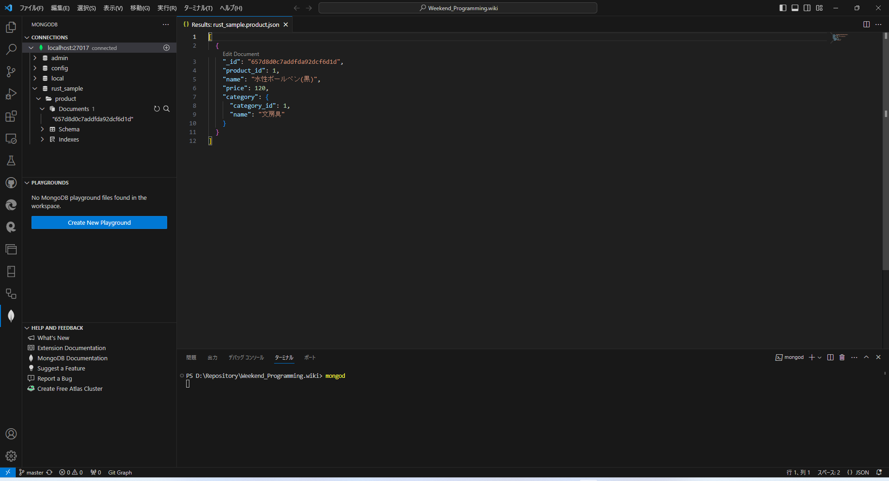
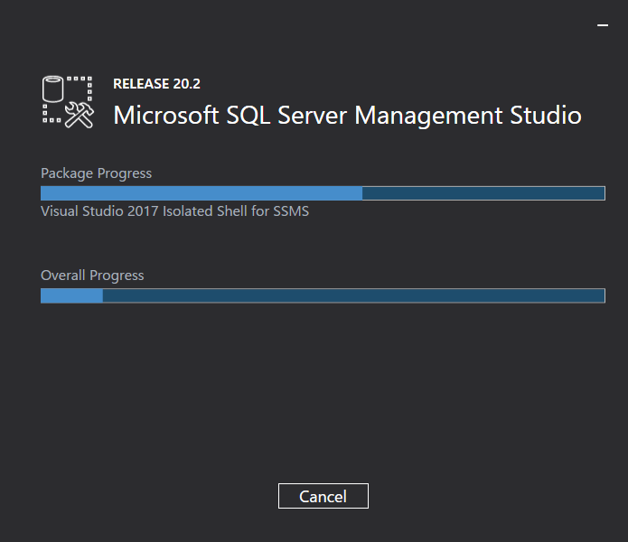
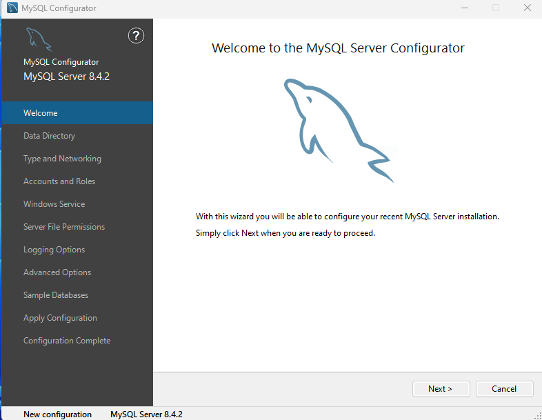
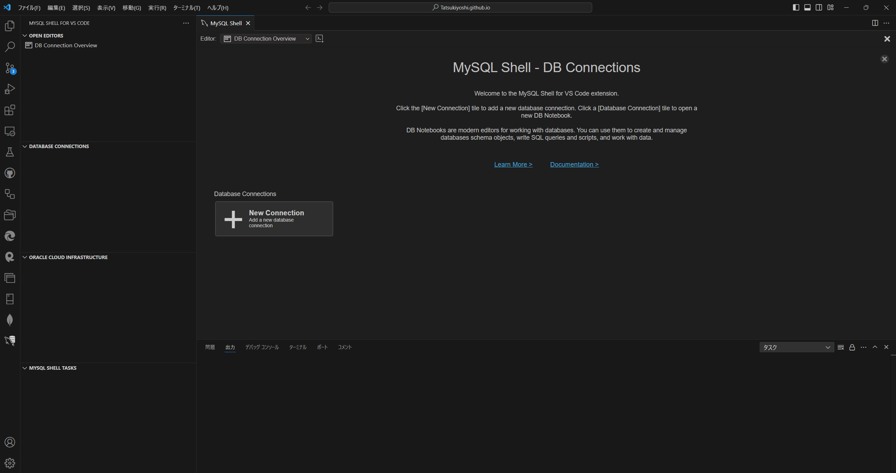
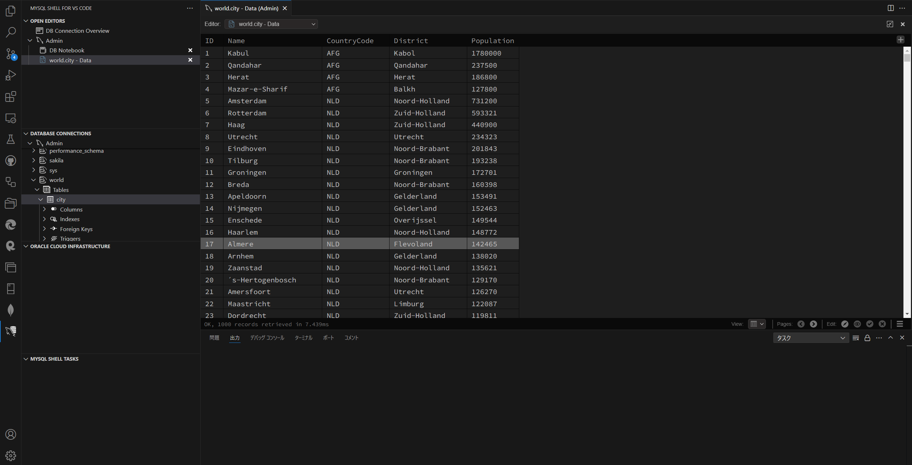

# Database & SQL

##  環境

  |端末      |環境／FW                                              |最終更新
  |----------|-----------------------------------------------------|----------
  |Mini-S12  |[SQL Server 2022 Developer 16.0.4135.4](#sql-server) |[2024/08/24](https://www.microsoft.com/ja-jp/sql-server/sql-server-2022)
  |          |- SQL Server Management Studio 20.2.3                |2024/08/24
  |          |[PostgreSQL 17.0](#postgresql)                       |[2024/09/27](https://www.postgresql.org/download/windows/)
  |          |MongoDB 8.0.1                                        |2024/10/19
  |          |- Mongodump                                          |[2024/10/19](https://www.mongodb.com/ja-jp/docs/database-tools/mongodump/mongodump-compatibility-and-installation/#std-label-mongodump-compatibility-and-installation)
  |          |MySQL Community Server 8.4.2                         |2024/08/24
  |IdeaPad   |PostgreSQL 16.4                                      |2024/08/24

##  ノウハウ
### データベース全般
  - [データベースを作成し、テーブルを追加する](https://docs.microsoft.com/ja-jp/visualstudio/data-tools/create-a-sql-database-by-using-a-designer?view=vs-2019)
  - [大量データの作成、日付の加工](https://www.excellence-blog.com/2017/06/01/sql-server%E3%81%B8%E5%A4%A7%E9%87%8F%E3%81%AE%E3%83%87%E3%83%BC%E3%82%BF%E3%82%92%E9%AB%98%E9%80%9F%E3%81%A7%E8%BF%BD%E5%8A%A0%E3%81%99%E3%82%8B/)
### MongoDB
  - インストール
    1.  Scoopのインストール
        ```sh
        Set-ExecutionPolicy RemoteSigned -scope CurrentUser
        iex (new-object net.webclient).downloadstring('https://get.scoop.sh') 
        ```
    1.  MongoDBのインストール
        ```sh
        scoop install mongodb
        ```
    1.  MongoDB起動
        ```sh
        mongod
        ```
    1.  接続文字列
        ```
        mongodb://localhost:27017
        ```
    1.  バックアップとリストア
        - バックアップは実行時のカレントディレクトリのdumpディレクトリに作成される
        - バックアップ
          ```
          mongodump
          ```
        - リストア
          ```
          mongorestore
          ```
    1.  MongoDBのアップデート
        ```sh
        scoop update mongodb
        ```
        1.  8.0 への移行
          - 8.0 で互換性を保証するバージョンは、"7.0","7.3","8.0"であるため、"featureCompatibilityVersion"はそのいずれかにしておく必要あり
            ```json
            {
              "_id": "featureCompatibilityVersion",
              "version": "7.0"
            }
            ```
            - 今回、7.1.1から移行する際、上述の"featureCompatibilityVersion"が"7.1"となっており、8.0を起動できなかった。
  - MongoDB for VS Codeをインストールしておくとよい
    
### [SQL Server](https://www.microsoft.com/ja-jp/sql-server/sql-server-2022)
  - [接続文字列](https://learn.microsoft.com/ja-jp/sql/connect/ado-net/connection-string-syntax?view=sql-server-ver16)
    ```
    Server=localhost;Database=master;Trusted_Connection=True;
    ```
  - [データベース ユーザーの作成](https://learn.microsoft.com/ja-jp/sql/relational-databases/security/authentication-access/create-a-database-user?view=sql-server-ver16)
    - admin/sqlsuper
  - [エラー:18456 でログインできない場合](https://qiita.com/sugasaki/items/a95c2495085e32851707)
    - サーバ認証について、Windows認証モードとSQL Server認証モードが選択されているかを確認する
    - SQL Serverを再起動する
  - [SSMS(SQL Server Management Studio)](https://learn.microsoft.com/ja-jp/sql/ssms/download-sql-server-management-studio-ssms?view=sql-server-ver16)
    - SSMS 20.2.3
      
      - アップデート後の初回起動時に旧バージョンから設定をインポートできる
  - [特定の位置にカラムを追加する](https://urashita.com/archives/13652)
### PostgreSQL
  - PgAdmin対応表
    PostgreSQL | PgAdmin4
    -----------|-----------
    17.0       | 8.12
    16.4       | 8.10
    16.1       | 7.8
    16         | 7.6
  - postgres/pgsuper
  - [リリース間移行](https://www.postgresql.jp/docs/9.0/migration.html)
    - 並行稼働のため、新バージョンは現行バージョンとは異なるポート番号とする（現行：5432、新：5433）
    - 現行バージョンのバックアップ
      ```
      set PGCLIENTENCODING="UTF8"
      pg_dumpall -p 5432 --username=postgres > <BackupFile>
      ```
    - ロケールの編集（データベース作成部分）
      - バックアップされた内容例
        ```sql
        CREATE DATABASE batch WITH TEMPLATE = template0 ENCODING = 'UTF8' LOCALE_PROVIDER = libc LOCALE = 'Japanese_Japan.932';
        ```
      - 編集後の内容例
        ```sql
        CREATE DATABASE batch WITH TEMPLATE = template0 ENCODING = 'UTF8' LC_COLLATE = 'Japanese_Japan.932' LC_CTYPE = 'Japanese_Japan.932';
        ```
    - 新バージョンへのリストア
      ```
      set PGCLIENTENCODING="UTF8"
      type <Edited_BackupFile> | psql -d postgres -p 5433 --username=postgres
      ```
  - タイムアウト時間の設定（マシン性能の問題等で、PgAdminを起動できない場合の対応）
    - サーバとの接続がタイムアウトしているため、タイムアウト時間を延ばす
  - コマンドラインでのSQL
    - psqlにPATHが設定されていないので、追加する必要あり
  - 参照専用ユーザの作成
    - データを更新することはなく、参照だけできれば良い場合
      運用時のユーザや開発者向けユーザとは別に、参照専用のユーザがあると有効
    - PostgreSQL 14以降の場合、データの参照向けロールがあるので、そのロールを設定すればよい。
      ```
      >grant pg_read_all_data to <User>
      ```
  - [PHP + Apache + PostgreSQL](./Php.md#postgresql)
### MySQL
  - MySQL Community Server 8.4.2 (LTS)
    - Oracleプロファイル作成のうえ、ダウンロード
    - インストールすると、MySQL Configuratorで設定する
      
      root/mysqlsuper

    <details>
    <summary>Configulation Log</summary>

    ```
    Beginning configuration step: Writing configuration file

    Saving my.ini configuration file...
    Saved my.ini configuration file.
    Ended configuration step: Writing configuration file

    Beginning configuration step: Updating Windows Firewall rules

    Adding a Windows Firewall rule for MySQL84 on port 3306.
    Attempting to add a Windows Firewall rule with command: netsh.exe advfirewall firewall add rule name="Port 3306" protocol=TCP localport=3306 dir=in action=allow
    Ok.


    Successfully added the Windows Firewall rule.
    Adding a Windows Firewall rule for MySQL84 on port 33060.
    Attempting to add a Windows Firewall rule with command: netsh.exe advfirewall firewall add rule name="Port 33060" protocol=TCP localport=33060 dir=in action=allow
    Ok.


    Successfully added the Windows Firewall rule.
    Ended configuration step: Updating Windows Firewall rules

    Beginning configuration step: Adjusting Windows service

    Attempting to grant the required filesystem permissions to the 'NT AUTHORITY\NetworkService' account.
    Granted permissions to the data directory.
    Granted permissions to the install directory.
    Adding new service
    New service added
    Ended configuration step: Adjusting Windows service

    Beginning configuration step: Initializing database (may take a long time)

    Attempting to run MySQL Server with --initialize-insecure option...
    Starting process for MySQL Server 8.4.2...
    Starting process with command: C:\Program Files\MySQL\MySQL Server 8.4\bin\mysqld.exe --defaults-file="C:\ProgramData\MySQL\MySQL Server 8.4\my.ini" --console --initialize-insecure=on --lower-case-table-names=1...
    MySQL Server Initialization - start.
    C:\Program Files\MySQL\MySQL Server 8.4\bin\mysqld.exe (mysqld 8.4.2) initializing of server in progress as process 15752
    InnoDB initialization has started.
    InnoDB initialization has ended.
    root@localhost is created with an empty password ! Please consider switching off the --initialize-insecure option.
    MySQL Server Initialization - end.
    Process for mysqld, with ID 15752, was run successfully and exited with code 0.
    Successfully started process for MySQL Server 8.4.2.
    MySQL Server 8.4.2 intialized the database successfully.
    Ended configuration step: Initializing database (may take a long time)

    Beginning configuration step: Updating permissions for the data folder and related server files

    Attempting to update the permissions for the data folder and related server files...
    Inherited permissions have been converted to explicit permissions.
    Full control permissions granted to: NETWORK SERVICE.
    Full control permissions granted to: Administrators.
    Full control permissions granted to: CREATOR OWNER.
    Full control permissions granted to: SYSTEM.
    Access to the data directory is removed for the users group.
    Permissions for the data folder and related server files are updated correctly.
    Ended configuration step: Updating permissions for the data folder and related server files

    Beginning configuration step: Starting the server

    Attempting to start service MySQL84...
    MySQL Server - start.
    C:\Program Files\MySQL\MySQL Server 8.4\bin\mysqld.exe (mysqld 8.4.2) starting as process 13844
    InnoDB initialization has started.
    InnoDB initialization has ended.
    CA certificate ca.pem is self signed.
    Channel mysql_main configured to support TLS. Encrypted connections are now supported for this channel.
    X Plugin ready for connections. Bind-address: '::' port: 33060
    C:\Program Files\MySQL\MySQL Server 8.4\bin\mysqld.exe: ready for connections. Version: '8.4.2'  socket: ''  port: 3306  MySQL Community Server - GPL.
    Successfully started service MySQL84.
    Waiting until a connection to MySQL Server 8.4.2 can be established (with a maximum of 10 attempts)...
    Retry 1: Attempting to connect to Mysql@localhost:3306 with user root with no password...
    Successfully connected to MySQL Server 8.4.2.
    Ended configuration step: Starting the server

    Beginning configuration step: Applying security settings

    Attempting to update security settings.
    Updated security settings.
    Ended configuration step: Applying security settings

    Beginning configuration step: Updating the Start menu link

    Attempting to verify command-line client shortcut.
    Verified command-line client shortcut.
    Verified command-line client shortcut.
    Ended configuration step: Updating the Start menu link

    Beginning configuration step: Updating example databases

    Updating example databases...
    Ended configuration step: Updating example databases
    ```
    </details>
  - MySQL Shell for VS Code
    - VSCodeユーザ向けにもユーティリティがある！
      
    - 簡単にテーブルのデータを確認できる
      
  - MySQL 8.0.28
    - ZIPファイルを任意のディレクトリに展開する
    - my.iniを展開したディレクトリに作成する
      ```ini
      [mysqld]
      # set basedir to your installation path
      basedir=D:\mysql-8.0.28-winx64
      # set datadir to the location of your data directory
      datadir=D:\mysql-8.0.28-winx64\data
      ```
    - データディレクトリを初期化する（パスワード生成せず）
      ```
      mysqld.exe --initialize-insecure --console
      ```
    - MySQL Server を起動する（パスワードなし）
      ```
      mysql.exe -u root --skip-password
      ```
    - MySQLをサービスに登録する
      ```
      D:\mysql-8.0.28-winx64\bin\mysqld --install MYSQL80
      ```
    - MySQLのサービスを開始する
      ```
      net start MYSQL80
      ```
    - DDL
      * rootパスワードの変更
        ```
        mysql> ALTER USER root@localhost IDENTIFIED BY "root";
        ```
      * ユーザの追加およびパスワードの登録
        ```
        mysql> CREATE USER taish;
        mysql> ALTER USER taish@localhost IDENTIFIED BY "taishow";
        ```
