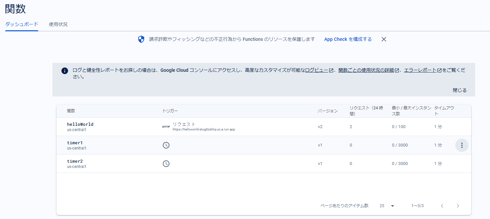
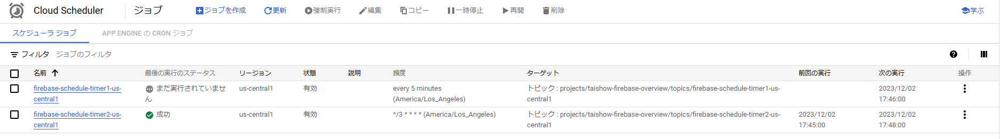
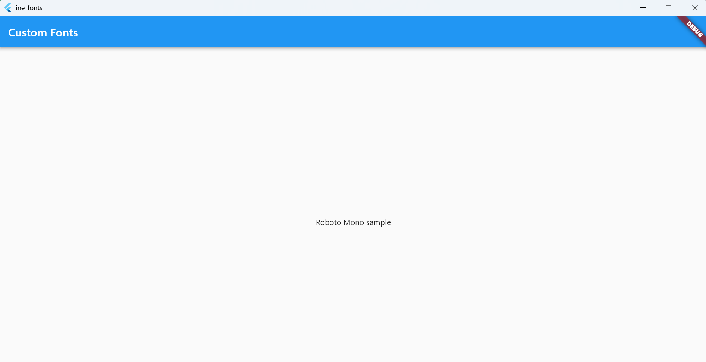

# Dart & Flutter

##  独学書
  |テキスト                                                                             |日付      |進捗状況
  |------------------------------------------------------------------------------------|----------|---
  |[動かして学ぶ！Flutter開発入門](https://www.shoeisha.co.jp/book/detail/9784798177366) |2023/12/23|Chapter 4 Firebaseとの連携 <span style="color: red;">*finished*</span> ->[コード](https://github.com/Tatsukiyoshi/Weekend_Programming/tree/main/flutter/introduction)

##  コンテンツ
  |コンテンツ                                                                         |日付     |進捗状況
  |----------------------------------------------------------------------------------|---------|---
  |[Flutterで始めるモバイルアプリ開発](https://codezine.jp/article/corner/830)         |2024/05/19|第27回 FlutterのCanvasを使ってみよう！ 基本的な使い方から簡単なチャート作成まで解説<span style="color: red;">*finished*</span>

##  環境
  |端末       |環境／FW                                                                  |最終更新
  |-----------|-------------------------------------------------------------------------|----------
  |Mini-S12   |Flutter 3.24.3                                                           |[2024/10/12](https://docs.flutter.dev/get-started/install)
  |           |[Android Studio Ladybug 2024.2.1](./Kotlin.md#android-studio)            |2024/10/04
  |           |[Visual Studio Community 2022 17.11.5](./NET.md#visual-studio--プレビュー)|2024/07/13

##  ノウハウ
  - flutter dev
    -  [Get started](https://docs.flutter.dev/get-started/install)
    -  myapp - flutter demo
    -  Startup namer
  - flutter doctor -v
    <details>
    <summary>Mini-S12</summary>

    ```
    [√] Flutter (Channel stable, 3.24.3, on Microsoft Windows [Version 10.0.22631.4317], locale ja-JP)
        • Flutter version 3.24.3 on channel stable at C:\Src\flutter
        • Upstream repository https://github.com/flutter/flutter.git
        • Framework revision 2663184aa7 (4 weeks ago), 2024-09-11 16:27:48 -0500
        • Engine revision 36335019a8
        • Dart version 3.5.3
        • DevTools version 2.37.3

    [√] Windows Version (Installed version of Windows is version 10 or higher)

    [√] Android toolchain - develop for Android devices (Android SDK version 35.0.0)
        • Android SDK at D:\.Android\SDK
        • Platform android-35, build-tools 35.0.0
        • ANDROID_HOME = D:\.Android\SDK
        • ANDROID_SDK_ROOT = D:\.Android\SDK
        • Java binary at: C:\Program Files\Android\Android Studio\jbr\bin\java
        • Java version OpenJDK Runtime Environment (build 21.0.3+-12282718-b509.11)
        • All Android licenses accepted.

    [√] Chrome - develop for the web
        • Chrome at C:\Program Files\Google\Chrome\Application\chrome.exe

    [√] Visual Studio - develop Windows apps (Visual Studio Community 2022 17.11.5)
        • Visual Studio at C:\Program Files\Microsoft Visual Studio\2022\Community
        • Visual Studio Community 2022 version 17.11.35327.3
        • Windows 10 SDK version 10.0.22621.0

    [√] Android Studio (version 2024.2)
        • Android Studio at C:\Program Files\Android\Android Studio
        • Flutter plugin can be installed from:
          https://plugins.jetbrains.com/plugin/9212-flutter
        • Dart plugin can be installed from:
          https://plugins.jetbrains.com/plugin/6351-dart
        • Java version OpenJDK Runtime Environment (build 21.0.3+-12282718-b509.11)

    [√] VS Code (version 1.94.2)
        • VS Code at C:\Users\taish\AppData\Local\Programs\Microsoft VS Code
        • Flutter extension version 3.98.0

    [√] Connected device (3 available)
        • Windows (desktop) • windows • windows-x64    • Microsoft Windows [Version 10.0.22631.4317]
        • Chrome (web)      • chrome  • web-javascript • Google Chrome 128.0.6613.138
        • Edge (web)        • edge    • web-javascript • Microsoft Edge 129.0.2792.79

    [√] Network resources
        • All expected network resources are available.
    ```
    </details>

  - flutterの更新
    ```
    flutter upgrade
    ```
  - flutter 3.24.3 / Android Studio Ladybug
    - Java 21
    - Gradle 8.10
  - Build エラーシューティング
    - flutter環境の確認
      ```
      flutter doctor -v
      ```
    - [JavaのバージョンとGradleのバージョンの対応確認](https://docs.gradle.org/current/userguide/compatibility.html#java)
  - [動かして学ぶ！Flutter開発入門](https://www.shoeisha.co.jp/book/detail/9784798177366)
    - [firebase](https://firebase.google.com)
      - firebase（Webサイト）でプロジェクトを作成する
      - コンソールでfirebaseを利用する設定を行う
        - firebase-toolsをインストールする
          ```
          npm install -g firebase-tools
          ```
        - firebaseにログインする
          ```
          firebase login
          ```
        - firebaseCLIをインストールする
          ```
          dart pub global activate flutterfire_cli
          ```
        - flutterアプリと紐づけるため、プロジェクトを作成する
          ```
          flutter create <Project Name>
          ```
        - flutterアプリと紐づける
          ```
          cd <ProjectDirectory>
          flutterfire configure --project={firebaseのプロジェクト名}
          ```
      - Functions（関数）・・・Blazeプランに変更しないと利用できない
        - デプロイされている関数を一覧で確認
          
        - Timerトリガの関数
          - Cloud Schedulerで実行周期を確認
            
    - [flutter icon](https://icons8.jp/icons/set/flutter)
    - 64Kを超えるメソッドを使用する
      [Multidex Support](https://docs.flutter.dev/deployment/android#enabling-multidex-support)
  - カスタムフォントの利用
    [公式ドキュメント](https://docs.flutter.dev/cookbook/design/fonts)
    - Raleway and Roboto Mono(Google Fonts)
      
    - LINESeed JP
      
  - Android Studio Update
    - [Kotlin dist downloading failed](https://github.com/flutter/flutter/issues/126248)

##  アプリ作成
  1.  情報収集
      1.  株価取得
          -   [kabuステーションAPI](https://kabu.com/company/lp/lp90.html)
          -   [auカブコム証券のkabuステーションAPIを使ってみる](https://qiita.com/hmdsg/items/c6842fe87ec4e0365241)
      1.  Flutter
          -   [FlutterでAPIリクエストを行う（初心者向け）](https://qiita.com/kitanote/items/c4282b0112fa9d27dcd2)
