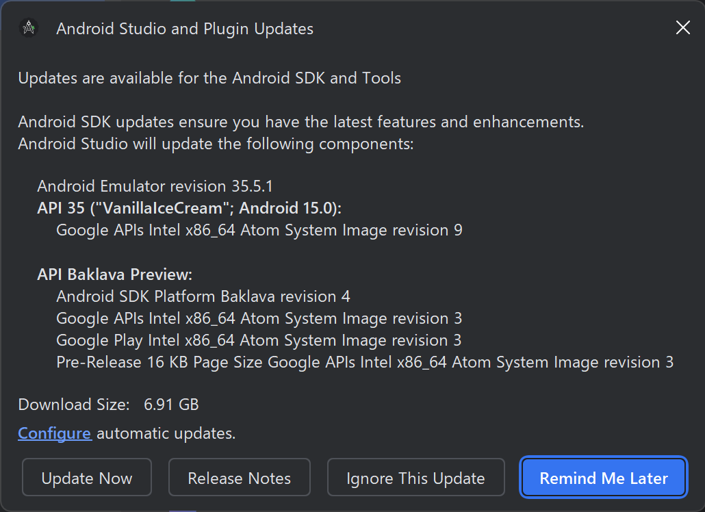
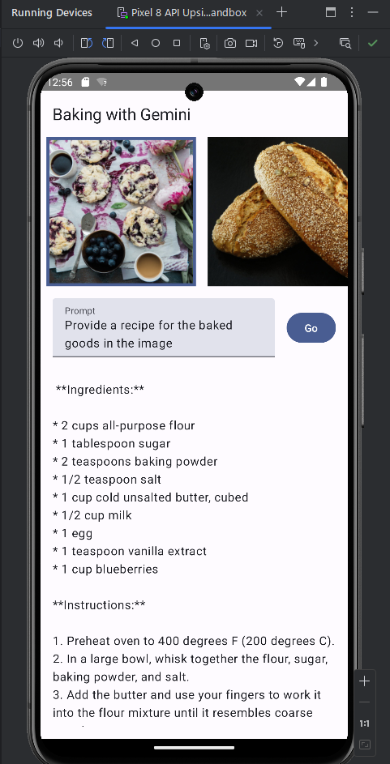

# Kotlin

##  独学書
  |テキスト                                                    |日付      |進捗状況
  |-----------------------------------------------------------|----------|---
  |Spring解体新書（バッチ編）                                   |2022/08/08|*finished* ->[コード](https://github.com/Tatsukiyoshi/Weekend_Programming/tree/main/kotlin/spring)
  |Kotlinプログラミング                                        |2019/11/13|*finished* ->[コード](https://github.com/Tatsukiyoshi/Weekend_Programming/tree/main/kotlin/programming)
  |[はじめてのAndroidプログラミング](http://isbn.sbcr.jp/95815) |2019/10/12|*finished* ->[コード](https://github.com/Tatsukiyoshi/Weekend_Programming/tree/main/kotlin/Android)

##  環境
  |端末            |環境／FW                                                     |最終更新      
  |----------------|------------------------------------------------------------|----------
  |Windows Insider |[IntelliJ IDEA 2024.3.4.1](#intellij-idea)                  |[2025/03/07](https://www.jetbrains.com/ja-jp/idea/)
  |                |- Kotlin 2.1.10                                             |[2025/02/01](https://kotlinlang.org/docs/home.html)
  |                |- PostgreSQL JDBC Driver 42.7.5                             |[2025/03/08](https://mvnrepository.com/artifact/org.postgresql/postgresql)
  |                |Amazon Coretto 22.0.2                                       |2024/11/16
  |                |[Android Studio Meerkat 2024.3.2 Canary 8](#android-studio) |[2025/03/08](https://developer.android.com/studio)
  |                |- Kotlin 2.1.10                                             |[2025/01/31](https://kotlinlang.org/docs/home.html)
  |                |- Android SDK Command-line Tools v.19                       |2025/03/14
  |                |- Android Emulator v.35.5.7                                 |2025/03/14

##  ノウハウ
### IntelliJ IDEA
- Latest Version
  - IntelliJ IDEA 2024.3.4.1 (Community Edition)
    ```
    Build #IC-243.25659.59, built on March 5, 2025
    Runtime version: 21.0.6+8-b631.39 amd64 (JCEF 122.1.9)
    VM: OpenJDK 64-Bit Server VM by JetBrains s.r.o.
    Toolkit: sun.awt.windows.WToolkit
    Windows 11.0
    GC: G1 Young Generation, G1 Concurrent GC, G1 Old Generation
    Memory: 2048M
    Cores: 8
    Registry:
      ide.experimental.ui=true
      llm.show.ai.promotion.window.on.start=false
    Non-Bundled Plugins:
      Dart (243.23654.44)
      Lombook Plugin (243.23654.189)
      org.jetbrains.android (243.25659.59)
    Kotlin: 243.25659.59-IJ
    ```
- History
  - IntelliJ IDEA 2024.3.4.1
    - Update PostgreSQL JDBC Driver
      ```kts
      dependencies {
        ...
        runtimeOnly("org.postgresql:postgresql:42.7.5")
        ...
      }
      ```
  - IntelliJ IDEA 2024.3.2.2
    - Mockito as agent over jdk 21
      - [Support configuring Mockito java agent in java 21+](https://github.com/spring-io/initializr/issues/1590)
        ```kts
        var mockitoAgent = configurations.create("mockitoAgent")

        dependencies {
          ...
          testImplementation("org.mockito.kotlin:mockito-kotlin:5.4.0")
          mockitoAgent("org.mockito:mockito-core") { isTransitive = false }
        }

        tasks {
          test {
            jvmArgs("-javaagent:${mockitoAgent.asPath}")
          }
        }
        ```
  - IntelliJ IDEA 2024.3
    - Kotlin 2.1.0
      ```kts
      plugins {
        ...
        kotlin("jvm") version "2.1.0"
        ...
      }
      ```
  - IntelliJ IDEA 2024.2.3
    - Kotlin 2.0.20
      - kotlinOptions Deprecated - https://kotlinlang.org/docs/gradle-compiler-options.html#target-the-jvm
        ```kts
        tasks.named("compileKotlin", org.jetbrains.kotlin.gradle.tasks.KotlinCompilationTask::class.java) {
          compilerOptions {
            freeCompilerArgs.add("-Xjsr305=strict")
            apiVersion.set(org.jetbrains.kotlin.gradle.dsl.KotlinVersion.KOTLIN_2_0)
          }
        }
        ```
  - IntelliJ IDEA 2024.2.0.2
    - PostgreSQL 16.4
    - Gradle 8.8
  - Kotlin 2.0.0
    - Compose Multiplatform
      
  - Intellij IDEA 2024.1.1
    - Kotlin 1.9.24
  - Intellij IDEA 2023.3.6
    - Kotlin 1.9.23
      ```
      plugins {
        ...
        kotlin("jvm") version "1.9.23"
        ...
      }
      ```
  - Intellij IDEA 2023.3.4
    - Kotlin 1.9.22
      
      
      - kotlinc.xml
        ```xml
        <?xml version="1.0" encoding="UTF-8"?>
        <project version="4">
          <component name="Kotlin2JvmCompilerArguments">
            <option name="jvmTarget" value="21" />
          </component>
          <component name="KotlinJpsPluginSettings">
            <option name="version" value="1.9.22-release-704" />
          </component>
        </project>
        ```
  - [履歴](../history/IntelliIDEA.md)
###	Visual Studio Code
  - 環境は、Android Studioをインストールし、同時にインストールしたkotlinを利用する
    1. PATH環境変数にJDKおよびkotlinのパスを設定する
        - E200HA
          - F:\ProgramData\jdk-12.0.1\bin
          - F:\Program Files\Android\Android Studio\plugins\Kotlin\kotlinc\bin
        - E230MA
          - C:\Users\taish\AppData\Local\Programs\AdoptOpenJDK\bin
          - C:\Program Files\Android\Android Studio\plugins\Kotlin\kotlinc\bin
    1. VSCodeにcode-runnerをインストールし、code-runnerにkotlinの呼び出しを記述する
        ```
        "kotlin": "cd $dir && kotlinc-jvm.bat $fileName -include-runtime -d $fileNameWithoutExt.jar && java -jar $fileNameWithoutExt.jar"
        ```
### [Spring解体新書（バッチ編）](https://www.amazon.co.jp/gp/product/B09D3ZTJTB/ref=dbs_a_def_rwt_hsch_vapi_tkin_p1_i1)
  - IntelliJ IDEA
  - [Gradle 8.8](https://gradle.org/releases/)
  - [Kotlin 2.0.20](https://kotlinlang.org/docs/home.html)
  - Amazon Coretto 22.0.1 + 言語レベル 21
  - Graal VM Java17-22.2.0
  - [Spring Boot 3.4.0](https://spring.io/projects/spring-boot) <span style="color: red;">*2024/12/14 updated from 3.3.4*</span>
  - Spring Boot 3.2.0/Spring Batch 5.1/Spring Framework 6.1
    - [Spring Boot 3.0 Migration Guide](https://github.com/spring-projects/spring-boot/wiki/Spring-Boot-3.0-Migration-Guide)
    - [Spring Batch 5.0 migration guide](https://github.com/spring-projects/spring-batch/wiki/Spring-Batch-5.0-Migration-Guide)
    - [MyBatis](http://mybatis.org/spring-boot-starter/mybatis-spring-boot-autoconfigure/)
  - [PostgreSQL](Database.md#postgresql)
### Kotlinプログラミング
  - Android
    - Chapter 22 coroutines
    - Chapter 21 [New Character UI](https://www.bignerdranch.com/assets/solutions/activity_new_character.xml)
  - [mavenでマニフェストを作成する方法](https://www.codeflow.site/ja/article/maven__how-to-create-a-manifest-file-with-maven)
  - Hint of Challenges
    - [Tavern Challenge 19](https://forums.bignerdranch.com/t/tavern-challenge/15141/2)
    - [Challenge: Tavern.kt Part 2](https://forums.bignerdranch.com/t/challenge-tavern-kt-part-2/16695)
  - [Lombokを利用する方法](https://stackoverflow.com/questions/60419699)
    ```
    companion object {
        private val log: Logger = LoggerFactory.getLogger(this::class.java)
    }
    ```
  - [Spring Batch+Kotlinの事例](https://nulab.com/ja/blog/nulab/spring-boot-batch/)
### Android Studio
  - Android Studio Meerkat Feature Drop | 2024.3.2 Canary 8
    ```
    Build #AI-243.24978.46.2432.13174079, built on March 7, 2025
    Runtime version: 21.0.6+-13119726-b895.91 amd64
    VM: OpenJDK 64-Bit Server VM by JetBrains s.r.o.
    Toolkit: sun.awt.windows.WToolkit
    Windows 11.0
    Kotlin plugin: K2 mode
    GC: G1 Young Generation, G1 Concurrent GC, G1 Old Generation
    Memory: 2048M
    Cores: 8
    Registry:
      ide.experimental.ui=true
    Non-Bundled Plugins:
      Dart (243.23654.44)
      io.flutter (83.0.4)
    ```
  - バージョン共通
    - [開発者向けオプション](https://developer.android.com/studio/debug/dev-options?hl=ja)
    - Android Studioの日本語化
      - [JetBrains公式サイト](https://plugins.jetbrains.com/plugin/13964-japanese-language-pack------/versions)からダウンロードする。
    - [Android VersionとAPIの対応](https://developer.android.com/guide/topics/manifest/uses-sdk-element#api-level-table)
    - Gradle設定
      - Gradleに関する設定は、環境変数GRADLE_USER_HOMEで設定したディレクトリを参照するため、変更したい場合、格納先のディレクトリを設定する
    - Android SDK設定
      
    - エミュレータのイメージ退避
      1.  エミュレータのイメージは、ユーザの.androidディレクトリに格納されるため、移動する
      1.  以下のように、イメージの管理ファイル(.ini)にある格納先を変更する
          ```
          path=F:\Program\.android\avd\Nexus_5X_API_28.avd
          ```
    - Junit 5
      - [AndroidStudioでJUnit5のテスト(ParameterizedTest)を実行する](https://tiratom.hatenablog.com/entry/2024/01/13/145809)
        - build.gradle(app)
          ```
          testImplementation 'org.junit.jupiter:junit-jupiter-api:5.10.2'
          testImplementation 'org.testng:testng:7.10.2'
          testRuntimeOnly 'org.junit.jupiter:junit-jupiter-engine:5.10.2'
          testImplementation 'org.junit.jupiter:junit-jupiter-params:5.10.2'
          ```
  - バージョン対応履歴
    - Meerkat
      - Meerkat Feature Drop Canary 8
        - Android Gradle Plugin 8.8.2 -> 8.9.0
      - Meerkat Feature Drop Canary 7
        - Android Gradle Plugin 8.8.1 -> 8.8.2
      - Meerkat Feature Drop Canary 5
        - Android Gradle Plugin 8.8.0 -> 8.8.1
      - Meerkat Feature Drop Canary 2
        - Kotlin 2.1.0 -> 2.1.10
        - Update SDK
          
      - Meerkat Canary 9 対応
        - Android Gradle Plugin 8.7.3 -> 8.8.0
      - Meerkat Canary 4 対応
        - Kotlin 2.1.0
        - Gradle 8.10 -> 8.11.1
        - Android Gradle Plugin 8.7.2 -> 8.7.3
        - Android Emulator v35.4.3
      - Meerkat Canary 3 対応
        - Android Baklava (=Android 16) Preview
        - Android Emulator v35.4.2
    - Ladybug 対応
      - 2024.2.1 Patch 2 対応
        - Android Gradle Plugin 8.7.1 -> 8.7.2
        - CompileSdk 34 -> 35
          - core-ktx および core 1.15.0 は、バージョン35以上のSDKでビルドする必要あり
      - 2024.2.1 Patch 1 対応
        - Android Gradle Plugin 8.7.0 -> 8.7.1
        - Kotlin Gradle Plugin 2.0.20 -> 2.0.21
      - 2024.2.1 対応
        - Android Gradle Plugin 8.6.1 -> 8.7.0
        - Gradle 8.8 -> 8.9 -> 8.10
    - Koala 対応
      - Feature Drop 2024.1.2 Patch 1 対応
        - Android Gradle Plugin 8.6.0 -> 8.6.1
      - Feature Drop 2024.1.2 対応
        - Android Gradle Plugin 8.5.2 -> 8.6.0
        - Kotlin Gradle Plugin 2.0.10 -> 2.0.20
          - Plugin更新には、Gradle 8.8 以上への更新必須
      - 2024.1.1 Patch 2 対応
        - Android Gradle Plugin 8.5.1 -> 8.5.2
        - Kotlin Gradle Plugin 2.0 -> 2.0.10
      - Gradle ビルドエラー
        - Gradle 8.8
          - Gradle 8.7 で metadata.binが見つからないエラーでビルドできないケースがあり、V8.8に更新することで解消
      - 2024.1.1 Patch 1 対応
        - Android Gradle Plugin 8.5.0 -> 8.5.1
      - 2024.1.1 対応
        - Android Gradle Plugin 8.4.1 -> 8.5.0
          - Gradle 8.7
        - Android Gradle Plugin 8.5.0 rc01 -> 8.5.0
        - Android API 35
        - Android SDK Built-Tools 35.0.0
      - RC 1 対応
        - Kotlin 2.0.0
          - [Compose Compiler Gradle plugin](https://developer.android.com/develop/ui/compose/compiler) に従って、Gradle設定ファイルを改修
        - Android Gradle Plugin 8.5.0 beta02 -> 8.5.0 rc01
      - Beta 2 対応
        - Android Gradle Plugin 8.5.0 beta01 -> 8.5.0 beta02
      - Gemini 1.5
        - 実行時に制限抵触に関する警告メッセージが出て、結果を取得できない
          
      - Beta 1 対応
        - Android Gradle Plugin 8.5.0 alpha05 -> 8.5.0 beta01
        - Gradle 8.6 -> 8.7 <BR />
          
      - Canary 5 対応
        - Android Gradle Plugin 8.5.0 alpha04 -> 8.5.0 alpha05
      - Gemini 1.0 Pro
        
        
        
    - Jellyfish 対応 <BR />
      
      - Android Gradle Plugin 8.3.2 -> 8.4.0
        - Gradle 8.6
    - Iguana Patch 2 対応
      - Android Gradle Plugin 8.3.1 -> 8.3.2
      - junit4が廃要素になったための変更（junit-ktx）
        ```xml
        dependencies {
            ...
            implementation 'androidx.test.ext:junit-ktx:1.1.5'
            testImplementation 'junit:junit:4.13.2'
            ...
        }
        ```
    - Iguana Patch 1 対応
      - Android Gradle Plugin 8.3.0 -> 8.3.1
    - Iguana 対応
      - Android Gradle Plugin 8.2.2 -> 8.3.0
    - Hedgehog Patch 1 対応
      - Android Gradle Plugin 8.2 -> 8.2.1
        - Gradle 8.4
      - Kotlin Gradle Plugin 1.9.21 -> 1.9.22
        - Java 21
          
    - Hedgehog 対応
      - Android Gradle Plugin 8.2
        - Gradle 8.4
    - Giraffe 対応
      - Android Gradle Plugin 8.1
    - Flamingo 対応
      - Gradle 8.0 and Android Gradle Plugin 8.0
        - AGPが使用するJVMバージョンが17になるため、プロジェクトのJVMバージョンを変更する必要あり
          プロジェクトのJVMバージョンは、Project Structureで設定する
          
          設定によって出力される build.gradle は、下記の通り
          ```
          compileOptions {
              sourceCompatibility JavaVersion.VERSION_17
              targetCompatibility JavaVersion.VERSION_17
          }
          ```
        - MySchedulerのみGradle 7.xで据え置き
          - Realm-AndroidがGradle 8.0で廃止になるTransform APIを使用しているため
      - Kotlin 1.8.20
    - Electric Eel 対応
      - Gradle 7.5 and Android Gradle Plugin 7.4.0
      - Kotlin 1.8
    - Dolphin 対応
      - Gradle 7.4.2 and Android Gradle Plugin 7.3.0
      - アップデート対応 **@2022/09/25**
        * 起動時例外発生
          ```
              内部エラーが発生しました。Please refer to https://code.google.com/p/android/issues

          com.intellij.ide.plugins.StartupAbortedException: UI initialization failed
              at com.intellij.idea.StartupUtil.lambda$start$15(StartupUtil.java:268)
              at java.base/java.util.concurrent.CompletableFuture.uniExceptionally(CompletableFuture.java:986)
              at java.base/java.util.concurrent.CompletableFuture$UniExceptionally.tryFire(CompletableFuture.java:970)
              at java.base/java.util.concurrent.CompletableFuture.postComplete(CompletableFuture.java:506)
              at java.base/java.util.concurrent.CompletableFuture.postFire(CompletableFuture.java:610)
              at java.base/java.util.concurrent.CompletableFuture$UniRun.tryFire(CompletableFuture.java:791)
              at java.base/java.util.concurrent.CompletableFuture$Completion.run(CompletableFuture.java:478)
              at java.desktop/java.awt.event.InvocationEvent.dispatch(InvocationEvent.java:313)
              at java.desktop/java.awt.EventQueue.dispatchEventImpl(EventQueue.java:776)
              at java.desktop/java.awt.EventQueue$4.run(EventQueue.java:727)
              at java.desktop/java.awt.EventQueue$4.run(EventQueue.java:721)
              at java.base/java.security.AccessController.doPrivileged(Native Method)
              at java.base/java.security.ProtectionDomain$JavaSecurityAccessImpl.doIntersectionPrivilege(ProtectionDomain.java:85)
              at java.desktop/java.awt.EventQueue.dispatchEvent(EventQueue.java:746)
              at java.desktop/java.awt.EventDispatchThread.pumpOneEventForFilters(EventDispatchThread.java:203)
              at java.desktop/java.awt.EventDispatchThread.pumpEventsForFilter(EventDispatchThread.java:124)
              at java.desktop/java.awt.EventDispatchThread.pumpEventsForHierarchy(EventDispatchThread.java:113)
              at java.desktop/java.awt.EventDispatchThread.pumpEvents(EventDispatchThread.java:109)
              at java.desktop/java.awt.EventDispatchThread.pumpEvents(EventDispatchThread.java:101)
              at java.desktop/java.awt.EventDispatchThread.run(EventDispatchThread.java:90)
          Caused by: java.util.concurrent.CompletionException: java.lang.VerifyError: Expecting a stack map frame
          Exception Details:
          Location:
              com/intellij/openapi/util/text/StringUtil.pluralize(Ljava/lang/String;I)Ljava/lang/String; @7: nop
          Reason:
              Expected stackmap frame at this location.
          Bytecode:
              0000000: 2ab0 0000 a7ff fe00 bf00 00a7 fffe     
          Stackmap Table:
              same_frame(@2)
              same_frame(@9)

              at java.base/java.util.concurrent.CompletableFuture.encodeThrowable(CompletableFuture.java:314)
              at java.base/java.util.concurrent.CompletableFuture.completeThrowable(CompletableFuture.java:319)
              at java.base/java.util.concurrent.CompletableFuture$UniRun.tryFire(CompletableFuture.java:787)
              ... 14 more
          Caused by: java.lang.VerifyError: Expecting a stack map frame
          Exception Details:
          Location:
              com/intellij/openapi/util/text/StringUtil.pluralize(Ljava/lang/String;I)Ljava/lang/String; @7: nop
          Reason:
              Expected stackmap frame at this location.
          Bytecode:
              0000000: 2ab0 0000 a7ff fe00 bf00 00a7 fffe     
          Stackmap Table:
              same_frame(@2)
              same_frame(@9)

              at com.intellij.openapi.util.SystemInfo.isOsVersionAtLeast(SystemInfo.java:51)
              at com.intellij.openapi.util.SystemInfo.<clinit>(SystemInfo.java:54)
              at com.intellij.ui.JreHiDpiUtil.isJreHiDPIEnabled(JreHiDpiUtil.java:58)
              at com.intellij.ui.scale.JBUIScale.getOrComputeUserScaleFactor(JBUIScale.java:190)
              at com.intellij.ui.scale.JBUIScale.scale(JBUIScale.java:314)
              at com.intellij.ui.scale.UserScaleContext.<init>(UserScaleContext.java:26)
              at com.intellij.util.ui.JBUI$BaseScaleContext.<init>(JBUI.java:1408)
              at com.intellij.ui.scale.ScaleContext.<init>(ScaleContext.java:32)
              at com.intellij.ui.scale.ScaleContext.create(ScaleContext.java:108)
              at com.intellij.ui.scale.ScaleContextSupport.<init>(ScaleContextSupport.java:11)
              at com.intellij.openapi.util.IconLoader$CachedImageIcon.<init>(IconLoader.java:702)
              at com.intellij.ui.CoreIconManager$IconWithToolTipImpl.<init>(CoreIconManager.java:91)
              at com.intellij.ui.CoreIconManager.loadRasterizedIcon(CoreIconManager.java:61)
              at com.intellij.icons.AllIcons.load(AllIcons.java:17)
              at com.intellij.icons.AllIcons.<clinit>(AllIcons.java:670)
              at com.intellij.icons.AllIcons$Nodes.<clinit>(AllIcons.java:719)
              at com.intellij.ide.ui.laf.IdeaLaf.initIdeaDefaults(IdeaLaf.java:74)
              at com.intellij.ide.ui.laf.IdeaLaf.initComponentDefaults(IdeaLaf.java:35)
              at java.desktop/javax.swing.plaf.basic.BasicLookAndFeel.getDefaults(BasicLookAndFeel.java:150)
              at java.desktop/javax.swing.plaf.metal.MetalLookAndFeel.getDefaults(MetalLookAndFeel.java:1560)
              at com.intellij.idea.StartupUtil.lambda$scheduleInitUi$21(StartupUtil.java:476)
              at com.intellij.ui.scale.JBUIScale.computeSystemFontData(JBUIScale.java:69)
              at com.intellij.ui.scale.JBUIScale.getSystemFontData(JBUIScale.java:360)
              at com.intellij.idea.StartupUtil.lambda$scheduleInitUi$22(StartupUtil.java:474)
              at java.base/java.util.concurrent.CompletableFuture$UniRun.tryFire(CompletableFuture.java:783)
              ... 14 more

          -----
          Your JRE: 11.0.13+0-b1751.21-8125866 amd64 (JetBrains s.r.o.)
          D:\Program Files\Android\Android Studio\jre
          ```
        * 原因
          非推奨になった日本語化パッケージを適用していたため
        * 対策
          - 一旦、旧バージョンに戻し、公式情報に従って、日本語化パッケージを無効化
            [IntelliJ IDEA 日本語化マニュアル](https://pleiades.io/pages/pleiades_jetbrains_manual.html)
          - アンインストールのうえ、ユーザフォルダ配下にあるファイルを削除
          - 新規インストールを行い、起動確認
          - JetBrainsの日本語化パッケージを適用
            [Android Studio Dolphin 日本語化を行いました（Mac）](https://zenn.dev/kurayasu/articles/c2d3bd2a046596)
    - Chipmunk 対応
      - Gradle 7.3.3 and Android Gradle Plugin 7.2.0
    - Arctic Fox 対応として吸収すべき課題 **@2021/11/23** <span style="color: red;">*updated!*</span>
      - Android Studio Arctic Fox 2020.3.1 (based IntelliJ 2020.3) <span style="color: red;">*Wrote first at 2021.8.20*</span>
        - 環境刷新
          - Kotlin 1.6.0 <span style="color: red;">*Update at 2021.11.23*</span><BR>
          Build.gradleでKotlinバージョンを変更
          - Gradle V7.0 <BR>
          Project Referenceで使用するGradleのバージョンを変更
              - Android Gradle Plugin Version: 7.0.3 <span style="color: red;">*Update at 2021.11.23*</span>
              - Gradle Version: 7.0.2
          - JDK 11 <BR>
          Android Studioに含まれるJDKがJDK11に変更になり、同じJDKをGradle実行にも使用するため、Gradle SettingでAndroid Studioに含まれるJDKを使用するように変更する

          build.gradle(project) <span style="color: red;">*Update at 2021.8.20*</span>
          ```
          buildscript {
              ext.kotlin_version = '1.5.21'
              repositories {
                  google()
                  mavenCentral()
              }
              dependencies {
                  classpath "com.android.tools.build:gradle:7.0.1"
                  classpath "org.jetbrains.kotlin:kotlin-gradle-plugin:$kotlin_version"
              }
          }
          ```
### Android
  - Android 15 (API 35)
    - Android Studio Koala / Android SDK 35等を配置し、実行確認
      
    - レイアウトが崩れる事象
      - [Behavior changes: Apps targeting Android 15 or higher](https://developer.android.com/about/versions/15/behavior-changes-15) を参照のうえ、見直す
  - Android 12 / 非互換として吸収すべき課題
    - SDKバージョン範囲の見直し <span style="color: red;">*Update at 2021.8.20*</span>
      - ビルド時に下記メッセージが出るため、SDKバージョンを26以上にする
        - "Invoke-customs are only supported starting with Android O (--min-api 26)"
        - "Default interface methods are only supported starting with Android N (--min-api 24)
        - "Static interface methods are only supported starting with Android N (--min-api 24)
    - マニフェスト <span style="color: red;">*Update at 2021.8.20*</span>
      - [アクティビティのエクスポート](https://developer.android.com/guide/topics/manifest/activity-element#exported)
        - manifestでintent-filterを使っている場合、android:exportedをtrueにする必要あり
          ```xml
          <activity android:name=".MainActivity" android:exported="true">
              <intent-filter>
              ...
              </intent-filter>
          </activity>
          ```
    - [ビューバインディング](https://developer.android.com/topic/libraries/view-binding?hl=ja)
      - Android 3.5までの実装を変更する
      - ビューバインディングの使用を宣言する <BR>
        - build.gradle(app)
          ```json
          android {
              viewBinding {
                  enabled = true
              }
          }
          ```
      - ビューバインディング使用により、不要になるkotlin-android-extensionsプラグインを削除する（削除すると、下記のようになる）
        ```json
        plugins {
            id 'com.android.application'
            id 'kotlin-android'
        }
        ```
      - 要素に応じた修正を行う
        1.  アクティビティの場合
            - アクティビティにバインディングクラスのインスタンス変数を追加する
              ```
              class MainActivity : AppCompatActivity() {
                  private lateinit var binding: ActivityMainBinding
                  ...
              }
              ```
            - インポートする名前空間を変更する（上記の変数を追加するとIDEからメッセージが出る）
              ```
              import kotlinx.android.synthetic.main.activity_main.*
              ```
              ```
              import com.example.helloandroid.databinding.ActivityMainBinding
              ```
            - 初期化時にバインディングクラスのインスタンス変数を初期化し、ルートビューへの参照を取得する
              ```
              override fun onCreate(savedInstanceState: Bundle?) {
                  super.onCreate(savedInstanceState)
                  binding = ActivityMainBinding.inflate(layoutInflater)
                  val view = binding.root
                  setContentView(view)
                  ...
              }
              ```
            - アクティビティ内の項目へのアクセスを変更する
              ```
              override fun onCreate(savedInstanceState: Bundle?) {
                  ...
                  tapHere.setOnClickListener {
                      textView.text = "ボタンがタップされました"
                  }
              }
              ```
              ↓
              ```
              override fun onCreate(savedInstanceState: Bundle?) {
                  ...
                  binding.tapHere.setOnClickListener {
                      binding.textView.text = "ボタンがタップされました"
                  }
              }
              ```
        1.  フラグメントの場合
            - フラグメントにバインディングクラスのインスタンス変数を追加する
              ```kt
              private var _binding: ResultProfileBinding? = null
              // This property is only valid between onCreateView and
              // onDestroyView.
              private val binding get() = _binding!!
              ```
            - フラグメントの初期化時にバインディングクラスのインスタンス変数を初期化し、ルートビューへの参照を取得する
              ```kt
              override fun onCreateView(
                  inflater: LayoutInflater,
                  container: ViewGroup?,
                  savedInstanceState: Bundle?
              ): View {
                  _binding = ResultProfileBinding.inflate(inflater, container, false)
                  val view = binding.root
                  return view
              }
              ```
            - フラグメントの破棄時にバインディングクラスのインスタンス変数を解放する
              ```kt
              override fun onDestroyView() {
                  super.onDestroyView()
                  _binding = null
              }
              ```
            - フラグメント内の項目への参照を変更する
              ```kt
              name.text = viewModel.name
              button.setOnClickListener { viewModel.userClicked() }
              ```
              ↓
              ```kt
              binding.name.text = viewModel.name
              binding.button.setOnClickListener { viewModel.userClicked() }
              ```
            - [フラグメントをアクティビティ内で機能させる](https://developer.android.com/guide/fragments/fragmentmanager) <span style="color: red;">*Update at 2021.8.21*</span>              
              - フラグメント生成
                ```kt
                val fragment = TitleFragment()
                fragment.setTitle("フラグメント動物図鑑")
                ```
              - フラグメントマネージャーの取得
                ```kt
                val fragmentManeger = this.supportFragmentManager
                ```
              - トランザクション実行
                - 下記例では、トランザクション開始～フラグメント追加～トランザクション終了（コミット）を一連のブロック(commitブロック)で実行する
                  ```kt
                  supportFragmentManager.commit {
                      replace(R.id.fragmentContainerView, fragment)
                      addToBackStack("name") // name can be null
                  }
                  ```
    - 共有プリファレンス
      - build.gradle(app)に以下を追加する        
        ```json
        dependencies {
            ...
            implemetation 'androidx.preference:preference-ktx:1.1.0'
            ...
        }
        ```
      - FragmentStatePagerAdapterの置換 <span style="color: red;">*Update at 2021.8.22*</span>
        - アダプタの継承クラスのコンストラクタの継承元をFragmentStateAdapterに置き換える
          - https://developer.android.com/reference/androidx/fragment/app/FragmentStatePagerAdapter
            ```kt
            class MyAdapter(fm: FragmentManager) : FragmentStatePagerAdapter(fm){
                ...
                override fun getCount(): Int {
                    ...
                }
            }
            ```
          - https://developer.android.com/reference/androidx/viewpager2/adapter/FragmentStateAdapter
            ```kt
            class MyAdapter(fa: FragmentActivity) : FragmentStateAdapter(fa){
                ...
                override fun getItemCount(): Int {
                    ...
                }
            }
            ```
        - アクティビティでのアダプタへのアクセスを変更する
          ```kt
          binding.pager.adapter = MyAdapter(supportFragmentManager)
          ```
          ↓
          ```kt
          binding.pager.adapter = MyAdapter(this)
          ```
      - [タイマ処理におけるハンドラ周りを見直す](https://developer.android.com/reference/kotlin/android/os/Handler?hl=en) <span style="color: red;">*Update at 2021.8.22*</span>
        - ハンドラ生成の見直し
          ```kt
          var handler = Handler()
          ```
          ↓
          ```kt
          Looper.prepare()
          val handler = Looper.myLooper()?.let { Handler(it, null) }
          ```
        - ハンドラ利用の見直し（セーフアクセス修飾子）
          ```kt
          timer(period = 5000){
              handler.post {
                  ...
              }
          }
          ```
          ↓
          ```kt
          timer(period = 5000){
              handler?.post {
                  ...
              }
          }
          ```
      - フラグメント作成後の処理手続きの変更 <span style="color: red;">*Update at 2021.8.22*</span>
        - onActivityCreatedメソッドでの実行は非推奨となったため、フラグメントのビューをタッチするコードは、onActivityCreatedメソッドの実行直前に呼び出されるonViewCreatedメソッドでの実行に変更。その他の初期化コードは onCreate() 内での実行に変更。
          ```kt
          override fun onActivityCreated(...){
              ...
          }
          ```
          ↓
          ```kt
          override fun onViewCreated(...){
              ...
          }
          ```
      - [SoundPool(Lollipopで非推奨)](https://developer.android.com/reference/kotlin/android/media/SoundPool?hl=en) <span style="color: red;">*Update at 2021.8.25*</span>
        ```kt
        soundPool = SoundPool.Builder()
                    .setMaxStreams(1)
                    .setAudioAttributes(audioAttributes)
                    .build()
        ```
      - PendingIntent.getBroadcast <span style="color: red;">*Update at 2021.8.25*</span>
        - lintでMuttable Flagを指定されていないと指摘されるため、指定するように変更
      - SimpleDateFormat <span style="color: red;">*Update at 2021.8.25*</span>
        - lintでロケールを指定するよう指摘されるため、ロケールを指定するように変更
      - [Realm 環境の更新](https://docs.mongodb.com/realm/sdk/android/install/) <span style="color: red;">*Update at 2021.8.28*</span>
        - build.gradle(project)
          ```json
          buildscript {
              repositories {
                  google()
                  mavenCentral()
                  jcenter()
              }
              dependencies {
                  classpath "com.android.tools.build:gradle:7.0.1"
                  classpath "io.realm:realm-gradle-plugin:10.7.0"
              }
          }
          allprojects {
              repositories {
                  google()
                  mavenCentral()
                  jcenter()
              }
              dependencies {
              }
          }
          task clean(type: Delete) {
              delete rootProject.buildDir
          }
          ```
        - build.gradle(app)
          ```json
          plugins {
              id 'kotlin-kapt'
              id 'realm-android'
          }
          ...
          realm {
              syncEnabled = true
          }
          ```
### Androidプログラミング
  - プロジェクト残課題状況
    - AnimalBook
      - [起動時にNullPointerExceptionが発生し、起動できない](https://github.com/Tatsukiyoshi/Weekend_Programming/issues/654) *Fixed*
    - MyCountdownTimer *No Problem*
      - リセット時に3:00に表示が戻らない
        - リセット後、すぐにカウントダウンするため、2:59になることで問題なし
    - MyScheduler
      - [入力したスケジュールが保存できない](https://github.com/Tatsukiyoshi/Weekend_Programming/issues/655)
    - MySlideshow
      - 起動時にNotImplementedErrorで起動できない *Fixed*
        - Arctic Fox対応でビューバインディングを導入した際のコード移行漏れ
