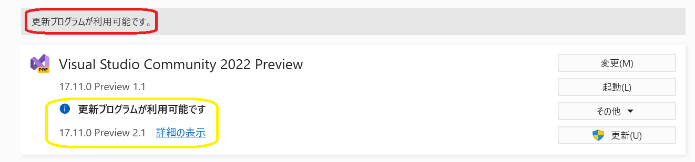
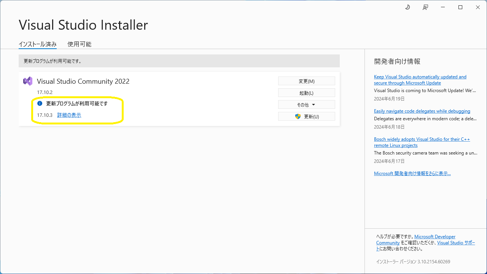
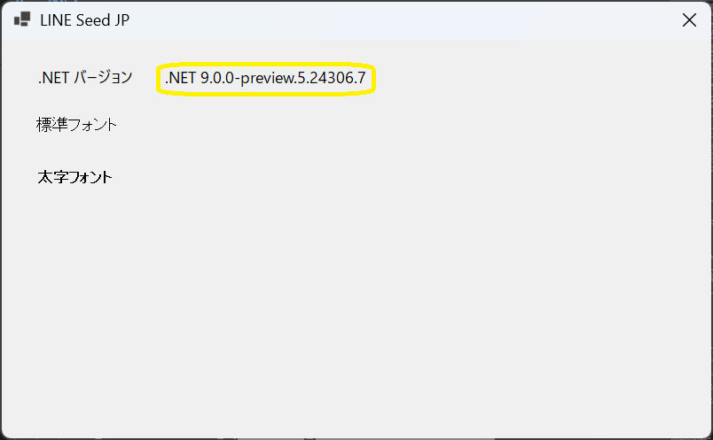
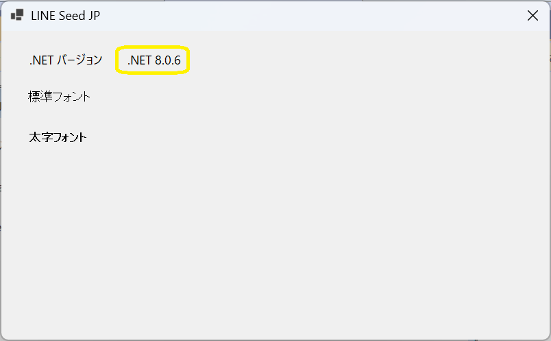

# .NET

##  独学書

  |テキスト                                                      |日付      |進捗状況
  |------------------------------------------------------------|----------|---
  |[C++ プログラミング入門](http://examples.oreilly.com/core/)    |2021/10/17|Chapter 6 コンストラクタおよびデストラクタを用いた優れた抽象化<span style="color: red;">*finished*</span>
  |[やさしいＣ＃第３版](https://isbn2.sbcr.jp/03922/)             |2022/07/16|*finished* ->[コード](https://github.com/Tatsukiyoshi/Weekend_Programming/tree/main/net/C%23/YCSSample)

##  環境
  |端末       |環境／FW                                          |最終更新
  |-----------|-------------------------------------------------|----------
  |IdeaPad    |Visual Studio Community 2022 17.11.0 Preview 2.1 |[2024/06/22](https://learn.microsoft.com/ja-jp/visualstudio/releases/2022/release-notes-preview)
  |           |- .NET 9.0 Preview 5                             |[2024/06/22](https://dotnet.microsoft.com/en-us/download/dotnet/9.0?hl=ja-JP)
  |           |- .NET 8.0.6                                     |[2024/06/22](https://dotnet.microsoft.com/ja-jp/download/dotnet)
  |Mini-S12   |Visual Studio Community 2022 17.10.3             |[2024/06/26](https://learn.microsoft.com/ja-jp/visualstudio/releases/2022/release-notes)
  |           |- .NET 8.0.6                                     |2024/06/26
  |           |- Windows App SDK 1.51                           |[2024/04/07](https://learn.microsoft.com/ja-jp/windows/apps/windows-app-sdk/downloads)

##  ノウハウ
### [Visual Studio](https://visualstudio.microsoft.com/ja/vs/) / [プレビュー](https://visualstudio.microsoft.com/ja/vs/preview/)
  - Visual Studio 2022 17.11 Preview
    
  - Visual Studio 2022 17.10
    
    - GitHub Copilotの利用
      - 早速、無料試用版の利用開始を促される <BR />
        
      - GitHub側でGitHub Copilotの利用を開始することで、Visual Studioで利用できるらしい！
        
  - [グローバル パッケージ、キャッシュ、および一時フォルダーを管理する](https://learn.microsoft.com/ja-jp/nuget/consume-packages/managing-the-global-packages-and-cache-folders)
    - NuGetパッケージは、既定では、ユーザフォルダに保存されるため、他のフォルダに保存する場合は、NUGET_PACKAGES環境変数でそのフォルダを指定する。
  - [Visual Studio Client Detector Utility](https://learn.microsoft.com/ja-jp/visualstudio/install/tools-for-managing-visual-studio-instances?view=vs-2022)
    
    -  Visual Studio のインストールを検出して管理するために使用できるツールらしい！
  - Shift-JISで作成していたはずのソースがUnicodeに変換される？
    
  - パッケージ管理
    - NuGetパッケージ管理画面にて、「更新プログラム」に表示されるパッケージを更新する
    
  - 注目した変更
    - GitHub Copilot (*17.10 Preview 3.0-*) <BR/>
          
    - ようこそ画面 (*17.6 Preview 2.0-*)
      ダイアログではなく、IDEにクイックアクションなどをまとめたようこそ画面が。
      
    - スペルチェッカ (*17.5 Preview 5.0-*)
      単語レベルでの間違いを指摘し、修正候補を提示する。
      
### .NET
  - [.NET での破壊的変更](https://learn.microsoft.com/ja-jp/dotnet/core/compatibility/breaking-changes)
  - [.NET 9.0 Preview 5](https://dotnet.microsoft.com/en-us/download/dotnet/9.0?hl=ja-JP)(*2024/06/22* <span style="color: red;">Updated!</span>)
    - ターゲットフレームワークに".NET 9.0"を指定することで実現
      
    - ターゲットフレームワークである".NET 9.0"のバージョンが表示できる
      
  - [.NET 8.0](https://dotnet.microsoft.com/ja-jp/download/dotnet/8.0)(*2024/06/22* <span style="color: red;">Updated!</span>)
    - ターゲットフレームワークに".NET 8.0"を指定していれば、".NET 8.0"のバージョンが表示できる
      

  - .NET 環境情報
  ```
  dotnet --info
  ```
  <details>
  <summary>IdeaPad</summary>

  ```
  .NET SDK:
  Version:           9.0.100-preview.5.24307.3
  Commit:            35b2c21ea6
  Workload version:  9.0.100-manifests.6407b7e4
  MSBuild version:   17.11.0-preview-24279-02+b963c24ef

  ランタイム環境:
  OS Name:     Windows
  OS Version:  10.0.26120
  OS Platform: Windows
  RID:         win-x64
  Base Path:   C:\Program Files\dotnet\sdk\9.0.100-preview.5.24307.3\

  インストール済みの .NET ワークロード:
  Configured to use loose manifests when installing new manifests.
  表示するインストール済みワークロードはありません。

  Host:
    Version:      9.0.0-preview.5.24306.7
    Architecture: x64
    Commit:       a5cc707d97

  .NET SDKs installed:
    8.0.300 [C:\Program Files\dotnet\sdk]
    8.0.302 [C:\Program Files\dotnet\sdk]
    9.0.100-preview.5.24307.3 [C:\Program Files\dotnet\sdk]

  .NET runtimes installed:
    Microsoft.AspNetCore.App 8.0.5 [C:\Program Files\dotnet\shared\Microsoft.AspNetCore.App]
    Microsoft.AspNetCore.App 8.0.6 [C:\Program Files\dotnet\shared\Microsoft.AspNetCore.App]
    Microsoft.AspNetCore.App 9.0.0-preview.5.24306.11 [C:\Program Files\dotnet\shared\Microsoft.AspNetCore.App]
    Microsoft.NETCore.App 8.0.5 [C:\Program Files\dotnet\shared\Microsoft.NETCore.App]
    Microsoft.NETCore.App 8.0.6 [C:\Program Files\dotnet\shared\Microsoft.NETCore.App]
    Microsoft.NETCore.App 9.0.0-preview.5.24306.7 [C:\Program Files\dotnet\shared\Microsoft.NETCore.App]
    Microsoft.WindowsDesktop.App 8.0.5 [C:\Program Files\dotnet\shared\Microsoft.WindowsDesktop.App]
    Microsoft.WindowsDesktop.App 8.0.6 [C:\Program Files\dotnet\shared\Microsoft.WindowsDesktop.App]
    Microsoft.WindowsDesktop.App 9.0.0-preview.5.24306.8 [C:\Program Files\dotnet\shared\Microsoft.WindowsDesktop.App]

  Other architectures found:
    x86   [C:\Program Files (x86)\dotnet]
      registered at [HKLM\SOFTWARE\dotnet\Setup\InstalledVersions\x86\InstallLocation]

  Environment variables:
    Not set

  global.json file:
    Not found

  Learn more:
    https://aka.ms/dotnet/info

  Download .NET:
    https://aka.ms/dotnet/download
  ```
  </details>
  <details>
  <summary>Mini-S12</summary>

  ```
  .NET SDK:
  Version:           8.0.302
  Commit:            ef14e02af8
  Workload version:  8.0.300-manifests.5273bb1c
  MSBuild version:   17.10.4+10fbfbf2e

  ランタイム環境:
  OS Name:     Windows
  OS Version:  10.0.22631
  OS Platform: Windows
  RID:         win-x64
  Base Path:   C:\Program Files\dotnet\sdk\8.0.302\

  インストール済みの .NET ワークロード:
  [android]
    インストール ソース: VS 17.10.35013.160
    マニフェストのバージョン:    34.0.95/8.0.100
    マニフェスト パス:       C:\Program Files\dotnet\sdk-manifests\8.0.100\microsoft.net.sdk.android\34.0.95\WorkloadManifest.json
    インストールの種類:        FileBased

  [maccatalyst]
    インストール ソース: VS 17.10.35013.160
    マニフェストのバージョン:    17.2.8053/8.0.100
    マニフェスト パス:       C:\Program Files\dotnet\sdk-manifests\8.0.100\microsoft.net.sdk.maccatalyst\17.2.8053\WorkloadManifest.json
    インストールの種類:        FileBased

  [maui-windows]
    インストール ソース: VS 17.10.35013.160
    マニフェストのバージョン:    8.0.40/8.0.100
    マニフェスト パス:       C:\Program Files\dotnet\sdk-manifests\8.0.100\microsoft.net.sdk.maui\8.0.40\WorkloadManifest.json
    インストールの種類:        FileBased

  [ios]
    インストール ソース: VS 17.10.35013.160
    マニフェストのバージョン:    17.2.8053/8.0.100
    マニフェスト パス:       C:\Program Files\dotnet\sdk-manifests\8.0.100\microsoft.net.sdk.ios\17.2.8053\WorkloadManifest.json
    インストールの種類:        FileBased


  Host:
    Version:      8.0.6
    Architecture: x64
    Commit:       3b8b000a0e

  .NET SDKs installed:
    6.0.423 [C:\Program Files\dotnet\sdk]
    8.0.302 [C:\Program Files\dotnet\sdk]

  .NET runtimes installed:
    Microsoft.AspNetCore.App 6.0.31 [C:\Program Files\dotnet\shared\Microsoft.AspNetCore.App]
    Microsoft.AspNetCore.App 8.0.6 [C:\Program Files\dotnet\shared\Microsoft.AspNetCore.App]
    Microsoft.NETCore.App 6.0.31 [C:\Program Files\dotnet\shared\Microsoft.NETCore.App]
    Microsoft.NETCore.App 8.0.6 [C:\Program Files\dotnet\shared\Microsoft.NETCore.App]
    Microsoft.WindowsDesktop.App 6.0.31 [C:\Program Files\dotnet\shared\Microsoft.WindowsDesktop.App]
    Microsoft.WindowsDesktop.App 8.0.6 [C:\Program Files\dotnet\shared\Microsoft.WindowsDesktop.App]

  Other architectures found:
    x86   [C:\Program Files (x86)\dotnet]
      registered at [HKLM\SOFTWARE\dotnet\Setup\InstalledVersions\x86\InstallLocation]

  Environment variables:
    Not set

  global.json file:
    Not found

  Learn more:
    https://aka.ms/dotnet/info

  Download .NET:
    https://aka.ms/dotnet/download
  ```
  </details>

### Windows App SDK
  - NET 8.0
    - [.NET SDK で小さい RID グラフを使う](https://learn.microsoft.com/ja-jp/dotnet/core/compatibility/sdk/8.0/rid-graph)
      ```xml
      <PropertyGroup>
        ...
        <RuntimeIdentifier>win-x64</RuntimeIdentifier>
      </PropertyGroup>
      ```

### MAUI
  - Visual Studio
    - 17.10.3 / MAUI 8.0.40(SP5)
      - 8.0.40同梱で、Androidエミュレータでの実行確認
        
    - 17.9.6
      - エミュレータを動作させるには、Hyper-Vの有効化が必要 <BR />
        
        
      - デバイスマネージャーでAndroid Studioで作成したイメージは使えず、新たにイメージを作成
        
      - サンプルコードのままでは、Androidターゲットはビルドできない (*2024/04/12*)
  - Visual Studio Code
    - [.NET MAUI 拡張機能](https://marketplace.visualstudio.com/items?itemName=ms-dotnettools.dotnet-maui)
    - MAUIワークロードのインストール
      ```
      dotnet workload install maui
      ```
    - ビルド
      ```
      dotnet build -t:Run -f net8.0-android -p:AndroidSdkDirectory=D:\AndroidSdk
      ```
    - Androidエミュレータ
      ```
      D:\AndroidSdk\emulator\emulator.exe -avd Pixel_3a_API_34_extension_level_7_x86_64
      ```
### ASP.NET MVC
  - [ASP.NET MVC でCRUD](https://qiita.com/zaburo/items/610bd34df3c819c67551)
### Azure
  - [Azureポータル](https://portal.azure.com/#home)
  - [Visual Studio Code を使用して Azure Functions を開発する](https://learn.microsoft.com/ja-jp/azure/azure-functions/functions-develop-vs-code?tabs=csharp)
    
### Blazor
  - [Blazor WebAssembly アプリケーションプログラミング自習書](https://qiita.com/jsakamoto/items/244163860b4626c02ba0)
  - [Getting Started with Blazor Scheduler Component](https://blazor.syncfusion.com/documentation/scheduler/getting-started)
    
  - Blazor入門（日経ソフトウェア 2021年9月号）**@2021/09/26** <span style="color: red;">*finished*</span>
### C#
  - [やさしいＣ＃第３版](https://isbn2.sbcr.jp/03922/)
    - [サポートページ](http://mana.on.coocan.jp/yasacs.html)
  - ノウハウ
    - フリーアイコン
      - GO(https://www.flaticon.com/free-icon/go_652364)
      - GoBack(https://www.flaticon.com/free-icon/back-button_93634?term=back&page=1&position=6&page=1&position=6&related_id=93634&origin=search)
    - [アプリケーション構成ファイル](https://www.fenet.jp/dotnet/column/language/9654/)
    - ColorDialog
    - [Using custom fonts on a Label on Winforms](https://stackoverflow.com/questions/1297264/using-custom-fonts-on-a-label-on-winforms)
      
  - リソースファイル（XML形式）の解析
    - [C#でのXML読み込み方法とは](https://www.fenet.jp/dotnet/column/language/8240/)
      ```
      <data name="LINESeedJP_TTF_Bd" type="System.Resources.ResXFileRef, System.Windows.Forms">
        <value>..\Fonts\LINESeedJP_TTF_Bd.ttf;System.Byte[], mscorlib, Version=4.0.0.0, Culture=neutral, PublicKeyToken=b77a5c561934e089</value>
      </data>
      <data name="LINESeedJP_TTF_Rg" type="System.Resources.ResXFileRef, System.Windows.Forms">
        <value>..\Fonts\LINESeedJP_TTF_Rg.ttf;System.Byte[], mscorlib, Version=4.0.0.0, Culture=neutral, PublicKeyToken=b77a5c561934e089</value>
      </data>
      ```
      
### C++
  - C11/C++17 - [C++環境設定](https://code.visualstudio.com/docs/cpp/config-msvc)
    - HelloWorld
    - [Learn C++](https://www.learncpp.com/) **@2019/10/22** 1.5 Introduction to iostream
