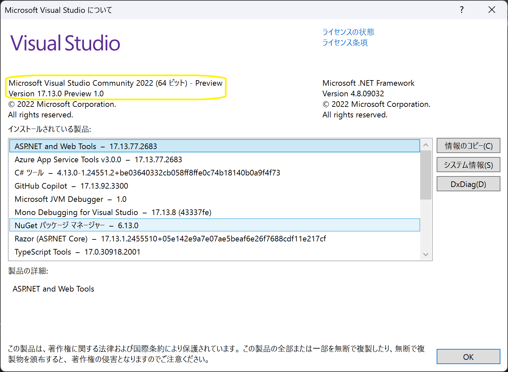
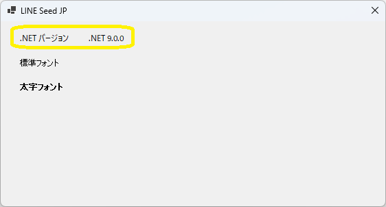
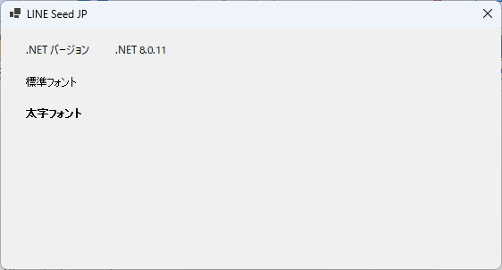

# .NET

##  独学書

  |テキスト                                                      |日付      |進捗状況
  |-------------------------------------------------------------|----------|---
  |[C++ プログラミング入門](http://examples.oreilly.com/core/)     |2021/10/17|Chapter 6 コンストラクタおよびデストラクタを用いた優れた抽象化<span style="color: red;">*finished*</span>
  |[やさしいＣ＃第３版](https://isbn2.sbcr.jp/03922/)              |2022/07/16|*finished* ->[コード](https://github.com/Tatsukiyoshi/Weekend_Programming/tree/main/net/C%23/YCSSample)

##  環境
  |端末       |環境／FW                                          |最終更新
  |-----------|-------------------------------------------------|----------
  |InsiderDev |Visual Studio Community 2022 17.13.0 Preview 1.0 |[2024/11/15](https://learn.microsoft.com/ja-jp/visualstudio/releases/2022/release-notes-preview)
  |           |- .NET 9.0.0 rc.2                                |[2024/10/11](https://dotnet.microsoft.com/en-us/download/dotnet/9.0?hl=ja-JP)
  |           |- .NET 8.0.10                                    |2024/10/11
  |Windows    |Visual Studio Community 2022 17.12.3             |[2024/12/06](https://learn.microsoft.com/en-us/visualstudio/releases/2022/release-notes)
  |           |- .NET 9.0                                       |[2024/11/17](https://dotnet.microsoft.com/ja-jp/download/dotnet)
  |           |  - [MAUI 9.0.12](#maui)                         |[2024/12/06](https://github.com/dotnet/maui)
  |           |- .NET 8.0.11                                    |[2024/11/17](https://dotnet.microsoft.com/ja-jp/download/dotnet)
  |           |- [Windows App SDK 1.6.3](#windows-app-sdk)      |[2024/11/23](https://learn.microsoft.com/ja-jp/windows/apps/windows-app-sdk/downloads)

##  ノウハウ
### [Visual Studio](https://visualstudio.microsoft.com/ja/vs/) / [プレビュー](https://visualstudio.microsoft.com/ja/vs/preview/)
  - Visual Studio 2022 17.13 Preview 1.0
    
  - Visual Studio 2022 17.12.3
    
  - Visual Studio 2022 17.10.3
    - GitHub Copilotの利用
      - 早速、無料試用版の利用開始を促される <BR />
        
      - GitHub側でGitHub Copilotの利用を開始することで、Visual Studioで利用できるらしい！
        
  - [グローバル パッケージ、キャッシュ、および一時フォルダーを管理する](https://learn.microsoft.com/ja-jp/nuget/consume-packages/managing-the-global-packages-and-cache-folders)
    - NuGetパッケージは、既定では、ユーザフォルダに保存されるため、他のフォルダに保存する場合は、NUGET_PACKAGES環境変数でそのフォルダを指定する。
  - [Visual Studio Client Detector Utility](https://learn.microsoft.com/ja-jp/visualstudio/install/tools-for-managing-visual-studio-instances?view=vs-2022)
    
    -  Visual Studio のインストールを検出して管理するために使用できるツールらしい！
  - Shift-JISで作成していたはずのソースがUnicodeに変換される？
    
  - パッケージ管理
    - NuGetパッケージ管理画面にて、「更新プログラム」に表示されるパッケージを更新する
    
  - 注目した変更
    - GitHub Copilot (*17.10 Preview 3.0-*) <BR/>
          
    - ようこそ画面 (*17.6 Preview 2.0-*)
      ダイアログではなく、IDEにクイックアクションなどをまとめたようこそ画面が。
      
    - スペルチェッカ (*17.5 Preview 5.0-*)
      単語レベルでの間違いを指摘し、修正候補を提示する。
      
### .NET
  - [.NET での破壊的変更](https://learn.microsoft.com/ja-jp/dotnet/core/compatibility/breaking-changes)
  - [.NET 9.0](https://dotnet.microsoft.com/en-us/download/dotnet/9.0?hl=ja-JP)(*2024/11/17* <span style="color: red;">Updated!</span>)
    - ターゲットフレームワークに".NET 9.0"を指定することで実現
      
    - ターゲットフレームワークである".NET 9.0"のバージョンが表示できる
      
  - [.NET 8.0](https://dotnet.microsoft.com/ja-jp/download/dotnet/8.0)(*2024/11/17* <span style="color: red;">Updated!</span>)
    - ターゲットフレームワークに".NET 8.0"を指定していれば、".NET 8.0"のバージョンが表示できる
      

  - .NET 環境情報
  ```
  dotnet --info
  ```
  <details>
  <summary>Visual Studio 2022 Preview＠InsiderDev</summary>

  ```
  .NET SDK:
  Version:           9.0.100-rc.2.24474.11
  Commit:            315e1305db
  Workload version:  9.0.100-manifests.4872d5d5
  MSBuild version:   17.12.0-preview-24473-03+fea15fbd1

  ランタイム環境:
  OS Name:     Windows
  OS Version:  10.0.26120
  OS Platform: Windows
  RID:         win-x64
  Base Path:   C:\Program Files\dotnet\sdk\9.0.100-rc.2.24474.11\

  インストール済みの .NET ワークロード:
  [maui-windows]
    インストール ソース: VS 17.13.35507.96
    マニフェストのバージョン:    9.0.0-rc.2.24503.2/9.0.100-rc.2
    マニフェスト パス:       C:\Program Files\dotnet\sdk-manifests\9.0.100-rc.2\microsoft.net.sdk.maui\9.0.0-rc.2.24503.2\WorkloadManifest.json
    インストールの種類:              Msi

  [maccatalyst]
    インストール ソース: VS 17.13.35507.96
    マニフェストのバージョン:    18.0.9600-net9-rc2/9.0.100-rc.2
    マニフェスト パス:       C:\Program Files\dotnet\sdk-manifests\9.0.100-rc.2\microsoft.net.sdk.maccatalyst\18.0.9600-net9-rc2\WorkloadManifest.json
    インストールの種類:              Msi

  [ios]
    インストール ソース: VS 17.13.35507.96
    マニフェストのバージョン:    18.0.9600-net9-rc2/9.0.100-rc.2
    マニフェスト パス:       C:\Program Files\dotnet\sdk-manifests\9.0.100-rc.2\microsoft.net.sdk.ios\18.0.9600-net9-rc2\WorkloadManifest.json
    インストールの種類:              Msi

  [android]
    インストール ソース: VS 17.13.35507.96
    マニフェストのバージョン:    35.0.0-rc.2.152/9.0.100-rc.2
    マニフェスト パス:       C:\Program Files\dotnet\sdk-manifests\9.0.100-rc.2\microsoft.net.sdk.android\35.0.0-rc.2.152\WorkloadManifest.json
    インストールの種類:              Msi

  新しいマニフェストをインストールするときに loose manifests を使用するように構成されています。

  Host:
    Version:      9.0.0-rc.2.24473.5
    Architecture: x64
    Commit:       990ebf52fc

  .NET SDKs installed:
    9.0.100-rc.2.24474.11 [C:\Program Files\dotnet\sdk]

  .NET runtimes installed:
    Microsoft.AspNetCore.App 8.0.10 [C:\Program Files\dotnet\shared\Microsoft.AspNetCore.App]
    Microsoft.AspNetCore.App 9.0.0-rc.2.24474.3 [C:\Program Files\dotnet\shared\Microsoft.AspNetCore.App]
    Microsoft.NETCore.App 8.0.10 [C:\Program Files\dotnet\shared\Microsoft.NETCore.App]
    Microsoft.NETCore.App 9.0.0-rc.2.24473.5 [C:\Program Files\dotnet\shared\Microsoft.NETCore.App]
    Microsoft.WindowsDesktop.App 8.0.10 [C:\Program Files\dotnet\shared\Microsoft.WindowsDesktop.App]
    Microsoft.WindowsDesktop.App 9.0.0-rc.2.24474.4 [C:\Program Files\dotnet\shared\Microsoft.WindowsDesktop.App]

  Other architectures found:
    x86   [C:\Program Files (x86)\dotnet]
      registered at [HKLM\SOFTWARE\dotnet\Setup\InstalledVersions\x86\InstallLocation]

  Environment variables:
    Not set

  global.json file:
    Not found

  Learn more:
    https://aka.ms/dotnet/info

  Download .NET:
    https://aka.ms/dotnet/download
  ```
  </details>
  <details>
  <summary>Visual Studio 2022@Windows</summary>

  ```
  .NET SDK:
  Version:           9.0.101
  Commit:            eedb237549
  Workload version:  9.0.100-manifests.4a280210
  MSBuild version:   17.12.12+1cce77968

  ランタイム環境:
  OS Name:     Windows
  OS Version:  10.0.26100
  OS Platform: Windows
  RID:         win-x64
  Base Path:   C:\Program Files\dotnet\sdk\9.0.101\

  インストール済みの .NET ワークロード:
  [maccatalyst]
    インストール ソース: VS 17.12.35527.113
    マニフェストのバージョン:    18.1.9163/9.0.100
    マニフェスト パス:       C:\Program Files\dotnet\sdk-manifests\9.0.100\microsoft.net.sdk.maccatalyst\18.1.9163\WorkloadManifest.json
    インストールの種類:              Msi

  [android]
    インストール ソース: VS 17.12.35527.113
    マニフェストのバージョン:    35.0.7/9.0.100
    マニフェスト パス:       C:\Program Files\dotnet\sdk-manifests\9.0.100\microsoft.net.sdk.android\35.0.7\WorkloadManifest.json
    インストールの種類:              Msi

  [maui-windows]
    インストール ソース: VS 17.12.35527.113
    マニフェストのバージョン:    9.0.0/9.0.100
    マニフェスト パス:       C:\Program Files\dotnet\sdk-manifests\9.0.100\microsoft.net.sdk.maui\9.0.0\WorkloadManifest.json
    インストールの種類:              Msi

  [ios]
    インストール ソース: VS 17.12.35527.113
    マニフェストのバージョン:    18.1.9163/9.0.100
    マニフェスト パス:       C:\Program Files\dotnet\sdk-manifests\9.0.100\microsoft.net.sdk.ios\18.1.9163\WorkloadManifest.json
    インストールの種類:              Msi

  新しいマニフェストをインストールするときに loose manifests を使用するように構成されています。

  Host:
    Version:      9.0.0
    Architecture: x64
    Commit:       9d5a6a9aa4

  .NET SDKs installed:
    6.0.428 [C:\Program Files\dotnet\sdk]
    9.0.101 [C:\Program Files\dotnet\sdk]

  .NET runtimes installed:
    Microsoft.AspNetCore.App 6.0.36 [C:\Program Files\dotnet\shared\Microsoft.AspNetCore.App]
    Microsoft.AspNetCore.App 8.0.11 [C:\Program Files\dotnet\shared\Microsoft.AspNetCore.App]
    Microsoft.AspNetCore.App 9.0.0 [C:\Program Files\dotnet\shared\Microsoft.AspNetCore.App]
    Microsoft.NETCore.App 6.0.36 [C:\Program Files\dotnet\shared\Microsoft.NETCore.App]
    Microsoft.NETCore.App 8.0.11 [C:\Program Files\dotnet\shared\Microsoft.NETCore.App]
    Microsoft.NETCore.App 9.0.0 [C:\Program Files\dotnet\shared\Microsoft.NETCore.App]
    Microsoft.WindowsDesktop.App 6.0.36 [C:\Program Files\dotnet\shared\Microsoft.WindowsDesktop.App]
    Microsoft.WindowsDesktop.App 8.0.11 [C:\Program Files\dotnet\shared\Microsoft.WindowsDesktop.App]
    Microsoft.WindowsDesktop.App 9.0.0 [C:\Program Files\dotnet\shared\Microsoft.WindowsDesktop.App]

  Other architectures found:
    x86   [C:\Program Files (x86)\dotnet]
      registered at [HKLM\SOFTWARE\dotnet\Setup\InstalledVersions\x86\InstallLocation]

  Environment variables:
    Not set

  global.json file:
    Not found

  Learn more:
    https://aka.ms/dotnet/info

  Download .NET:
    https://aka.ms/dotnet/download
  ```
  </details>

### Windows App SDK
  - Windows App SDK
    
  - NET 8.0
    - [.NET SDK で小さい RID グラフを使う](https://learn.microsoft.com/ja-jp/dotnet/core/compatibility/sdk/8.0/rid-graph)
      ```xml
      <PropertyGroup>
        ...
        <RuntimeIdentifier>win-x64</RuntimeIdentifier>
      </PropertyGroup>
      ```
  - バージョン確認
    ```
    get-appxpackage *appruntime.1.6*
    ```
    <details>
    <summary>Windows App SDK 1.6.3</summary>

    ```
    Name              : Microsoft.WindowsAppRuntime.1.6
    Publisher         : CN=Microsoft Corporation, O=Microsoft Corporation, L=Redmond, S=Washington, C=US
    Architecture      : X86
    ResourceId        :
    Version           : 6000.318.2304.0
    PackageFullName   : Microsoft.WindowsAppRuntime.1.6_6000.318.2304.0_x86__8wekyb3d8bbwe
    InstallLocation   : C:\Program Files\WindowsApps\Microsoft.WindowsAppRuntime.1.6_6000.318.2304.0_x86__8wekyb3d8bbwe
    IsFramework       : True
    PackageFamilyName : Microsoft.WindowsAppRuntime.1.6_8wekyb3d8bbwe
    PublisherId       : 8wekyb3d8bbwe
    IsResourcePackage : False
    IsBundle          : False
    IsDevelopmentMode : False
    NonRemovable      : False
    IsPartiallyStaged : False
    SignatureKind     : Store
    Status            : Ok

    Name              : Microsoft.WindowsAppRuntime.1.6
    Publisher         : CN=Microsoft Corporation, O=Microsoft Corporation, L=Redmond, S=Washington, C=US
    Architecture      : X64
    ResourceId        :
    Version           : 6000.318.2304.0
    PackageFullName   : Microsoft.WindowsAppRuntime.1.6_6000.318.2304.0_x64__8wekyb3d8bbwe
    InstallLocation   : C:\Program Files\WindowsApps\Microsoft.WindowsAppRuntime.1.6_6000.318.2304.0_x64__8wekyb3d8bbwe
    IsFramework       : True
    PackageFamilyName : Microsoft.WindowsAppRuntime.1.6_8wekyb3d8bbwe
    PublisherId       : 8wekyb3d8bbwe
    IsResourcePackage : False
    IsBundle          : False
    IsDevelopmentMode : False
    NonRemovable      : False
    IsPartiallyStaged : False
    SignatureKind     : Store
    Status            : Ok
    ```
    </details>

### MAUI
  - Visual Studio
    - [.NET MAUI 9](https://learn.microsoft.com/en-us/dotnet/maui/whats-new/dotnet-9?view=net-maui-8.0)
    - 17.12 / MAUI 9.0.10 / Pixel 9 Pro API 35(Android 15)
      
      <details>
      <summary>ビルドログ</summary>
      ```
      18:43 でビルドが開始されました...
      1>------ ビルド開始: プロジェクト: MauiApp9, 構成: Debug Any CPU ------
      1>ビルドの速度を上げるために、アナライザーをスキップしています。'ビルド' または '再ビルド' コマンドを実行してアナライザーを実行できます。
      1>Including assemblies for Hot Reload support
      1>MauiApp9 -> D:\Repository\Weekend_Programming\net\MAUI\MauiApp9\MauiApp9\bin\Debug\net9.0-android\MauiApp9.dll
      2>------ 配置開始: プロジェクト: MauiApp9, 構成: Debug Any CPU ------
      2>Pixel_9_Pro_API_35 に対する配置を開始しています...
      2>エミュレーターの準備ができるまで待機しています...
      2>Pixel_9_Pro_API_35 に配置しています...
      ビルドを開始しました。
      プロジェクト "MauiApp9.csproj" (Install ターゲット):
      指定された RuntimeIdentifier 'android-arm64' で利用できるアプリケーション ホストはありません。
      指定された RuntimeIdentifier 'android-x64' で利用できるアプリケーション ホストはありません。
      Found Java SDK version 17.0.12.
      Looking for Android NDK...
      Looking for Android SDK...
      Found Xamarin.Android 13.2.99.932
      MonoAndroid Tools: C:\Program Files\dotnet\packs\Microsoft.Android.Sdk.Windows\35.0.7\tools\
      Android Platform API level: 35
      TargetFrameworkVersion: v9.0
      Android NDK: 
      Android SDK: C:\Program Files (x86)\Android\android-sdk\
      Android SDK Build Tools: C:\Program Files (x86)\Android\android-sdk\build-tools\35.0.0\
      Java SDK: C:\Program Files (x86)\Android\openjdk\jdk-17.0.12\
      Application Java class: android.app.Application
      _OuterIntermediateOutputPath: 
      IntermediateOutputPath: obj\Debug
      et9.0-android\
      "obj\Debug
      et9.0-android\staticwebassets.references.upToDateCheck.txt" の 'WriteOnlyWhenDifferent' 属性は、'Overwrite="true"' の場合にのみ有効になります。
      すべての出力ファイルが入力ファイルに対して最新なので、ターゲット "_ProcessScopedCssFiles" を省略します。
      Accepted compressed asset 'D:\Repository\Weekend_Programming
      et\MAUI\MauiApp9\MauiApp9\obj\Debug
      et9.0-android\compressed\quqdvlarqf-e5tk7yf482.gz' for 'D:\Repository\Weekend_Programming
      et\MAUI\MauiApp9\MauiApp9\wwwroot\css\app.css'.
      Accepted compressed asset 'D:\Repository\Weekend_Programming
      et\MAUI\MauiApp9\MauiApp9\obj\Debug
      et9.0-android\compressed\7ezkn64cgu-6gzpyzhau4.gz' for 'D:\Repository\Weekend_Programming
      et\MAUI\MauiApp9\MauiApp9\wwwroot\css\bootstrap\bootstrap.min.css'.
      Accepted compressed asset 'D:\Repository\Weekend_Programming
      et\MAUI\MauiApp9\MauiApp9\obj\Debug
      et9.0-android\compressed\w1cn9yk6jz-8inm30yfxf.gz' for 'D:\Repository\Weekend_Programming
      et\MAUI\MauiApp9\MauiApp9\wwwroot\css\bootstrap\bootstrap.min.css.map'.
      Accepted compressed asset 'D:\Repository\Weekend_Programming
      et\MAUI\MauiApp9\MauiApp9\obj\Debug
      et9.0-android\compressed\09ivkjf474-knq8i9ludi.gz' for 'D:\Repository\Weekend_Programming
      et\MAUI\MauiApp9\MauiApp9\wwwroot\index.html'.
      Accepted compressed asset 'D:\Repository\Weekend_Programming
      et\MAUI\MauiApp9\MauiApp9\obj\Debug
      et9.0-android\compressed\at5bgn53p2-u4z5qnisnb.gz' for 'D:\Repository\Weekend_Programming
      et\MAUI\MauiApp9\MauiApp9\obj\Debug
      et9.0-android\scopedcss\bundle\MauiApp9.styles.css'.
      Accepted compressed asset 'D:\Repository\Weekend_Programming
      et\MAUI\MauiApp9\MauiApp9\obj\Debug
      et9.0-android\compressed\tshj81g4um-u4z5qnisnb.gz' for 'D:\Repository\Weekend_Programming
      et\MAUI\MauiApp9\MauiApp9\obj\Debug
      et9.0-android\scopedcss\projectbundle\MauiApp9.bundle.scp.css'.
      Resolved 6 compressed assets for 6 candidate assets.
      Processing compressed asset: D:\Repository\Weekend_Programming
      et\MAUI\MauiApp9\MauiApp9\obj\Debug
      et9.0-android\compressed\quqdvlarqf-e5tk7yf482.gz
      Processing compressed asset: D:\Repository\Weekend_Programming
      et\MAUI\MauiApp9\MauiApp9\obj\Debug
      et9.0-android\compressed\7ezkn64cgu-6gzpyzhau4.gz
      Processing compressed asset: D:\Repository\Weekend_Programming
      et\MAUI\MauiApp9\MauiApp9\obj\Debug
      et9.0-android\compressed\w1cn9yk6jz-8inm30yfxf.gz
      Processing compressed asset: D:\Repository\Weekend_Programming
      et\MAUI\MauiApp9\MauiApp9\obj\Debug
      et9.0-android\compressed\09ivkjf474-knq8i9ludi.gz
      Processing compressed asset: D:\Repository\Weekend_Programming
      et\MAUI\MauiApp9\MauiApp9\obj\Debug
      et9.0-android\compressed\at5bgn53p2-u4z5qnisnb.gz
      Processing compressed asset: D:\Repository\Weekend_Programming
      et\MAUI\MauiApp9\MauiApp9\obj\Debug
      et9.0-android\compressed\tshj81g4um-u4z5qnisnb.gz
      出力がないため、ターゲット "_BuildCopyStaticWebAssetsPreserveNewest" を省略しています。
      出力がないため、ターゲット "_BuildCopyStaticWebAssetsPreserveNewest" を省略しています。
      The asset 'D:\Repository\Weekend_Programming
      et\MAUI\MauiApp9\MauiApp9\obj\Debug
      et9.0-android\compressed\09ivkjf474-knq8i9ludi.gz' with related asset 'D:\Repository\Weekend_Programming
      et\MAUI\MauiApp9\MauiApp9\wwwroot\index.html' was detected as already compressed with format 'gzip'.
      The asset 'D:\Repository\Weekend_Programming
      et\MAUI\MauiApp9\MauiApp9\obj\Debug
      et9.0-android\compressed\7ezkn64cgu-6gzpyzhau4.gz' with related asset 'D:\Repository\Weekend_Programming
      et\MAUI\MauiApp9\MauiApp9\wwwroot\css\bootstrap\bootstrap.min.css' was detected as already compressed with format 'gzip'.
      The asset 'D:\Repository\Weekend_Programming
      et\MAUI\MauiApp9\MauiApp9\obj\Debug
      et9.0-android\compressed\at5bgn53p2-u4z5qnisnb.gz' with related asset 'D:\Repository\Weekend_Programming
      et\MAUI\MauiApp9\MauiApp9\obj\Debug
      et9.0-android\scopedcss\bundle\MauiApp9.styles.css' was detected as already compressed with format 'gzip'.
      The asset 'D:\Repository\Weekend_Programming
      et\MAUI\MauiApp9\MauiApp9\obj\Debug
      et9.0-android\compressed\quqdvlarqf-e5tk7yf482.gz' with related asset 'D:\Repository\Weekend_Programming
      et\MAUI\MauiApp9\MauiApp9\wwwroot\css\app.css' was detected as already compressed with format 'gzip'.
      The asset 'D:\Repository\Weekend_Programming
      et\MAUI\MauiApp9\MauiApp9\obj\Debug
      et9.0-android\compressed\tshj81g4um-u4z5qnisnb.gz' with related asset 'D:\Repository\Weekend_Programming
      et\MAUI\MauiApp9\MauiApp9\obj\Debug
      et9.0-android\scopedcss\projectbundle\MauiApp9.bundle.scp.css' was detected as already compressed with format 'gzip'.
      The asset 'D:\Repository\Weekend_Programming
      et\MAUI\MauiApp9\MauiApp9\obj\Debug
      et9.0-android\compressed\w1cn9yk6jz-8inm30yfxf.gz' with related asset 'D:\Repository\Weekend_Programming
      et\MAUI\MauiApp9\MauiApp9\wwwroot\css\bootstrap\bootstrap.min.css.map' was detected as already compressed with format 'gzip'.
      Ignoring asset 'D:\Repository\Weekend_Programming
      et\MAUI\MauiApp9\MauiApp9\obj\Debug
      et9.0-android\scopedcss\bundle\MauiApp9.styles.css' because it was already resolved with format 'gzip'.
      Ignoring asset 'D:\Repository\Weekend_Programming
      et\MAUI\MauiApp9\MauiApp9\obj\Debug
      et9.0-android\scopedcss\projectbundle\MauiApp9.bundle.scp.css' because it was already resolved with format 'gzip'.
      Ignoring asset 'D:\Repository\Weekend_Programming
      et\MAUI\MauiApp9\MauiApp9\wwwroot\css\app.css' because it was already resolved with format 'gzip'.
      Ignoring asset 'D:\Repository\Weekend_Programming
      et\MAUI\MauiApp9\MauiApp9\wwwroot\css\bootstrap\bootstrap.min.css' because it was already resolved with format 'gzip'.
      Ignoring asset 'D:\Repository\Weekend_Programming
      et\MAUI\MauiApp9\MauiApp9\wwwroot\css\bootstrap\bootstrap.min.css.map' because it was already resolved with format 'gzip'.
      Ignoring asset 'D:\Repository\Weekend_Programming
      et\MAUI\MauiApp9\MauiApp9\wwwroot\index.html' because it was already resolved with format 'gzip'.
      Accepted compressed asset 'D:\Repository\Weekend_Programming
      et\MAUI\MauiApp9\MauiApp9\obj\Debug
      et9.0-android\compressed\publish\at5bgn53p2-u4z5qnisnb.br' for 'D:\Repository\Weekend_Programming
      et\MAUI\MauiApp9\MauiApp9\obj\Debug
      et9.0-android\scopedcss\bundle\MauiApp9.styles.css'.
      Accepted compressed asset 'D:\Repository\Weekend_Programming
      et\MAUI\MauiApp9\MauiApp9\obj\Debug
      et9.0-android\compressed\publish\tshj81g4um-u4z5qnisnb.br' for 'D:\Repository\Weekend_Programming
      et\MAUI\MauiApp9\MauiApp9\obj\Debug
      et9.0-android\scopedcss\projectbundle\MauiApp9.bundle.scp.css'.
      Accepted compressed asset 'D:\Repository\Weekend_Programming
      et\MAUI\MauiApp9\MauiApp9\obj\Debug
      et9.0-android\compressed\publish\quqdvlarqf-e5tk7yf482.br' for 'D:\Repository\Weekend_Programming
      et\MAUI\MauiApp9\MauiApp9\wwwroot\css\app.css'.
      Accepted compressed asset 'D:\Repository\Weekend_Programming
      et\MAUI\MauiApp9\MauiApp9\obj\Debug
      et9.0-android\compressed\publish\7ezkn64cgu-6gzpyzhau4.br' for 'D:\Repository\Weekend_Programming
      et\MAUI\MauiApp9\MauiApp9\wwwroot\css\bootstrap\bootstrap.min.css'.
      Accepted compressed asset 'D:\Repository\Weekend_Programming
      et\MAUI\MauiApp9\MauiApp9\obj\Debug
      et9.0-android\compressed\publish\w1cn9yk6jz-8inm30yfxf.br' for 'D:\Repository\Weekend_Programming
      et\MAUI\MauiApp9\MauiApp9\wwwroot\css\bootstrap\bootstrap.min.css.map'.
      Accepted compressed asset 'D:\Repository\Weekend_Programming
      et\MAUI\MauiApp9\MauiApp9\obj\Debug
      et9.0-android\compressed\publish\09ivkjf474-knq8i9ludi.br' for 'D:\Repository\Weekend_Programming
      et\MAUI\MauiApp9\MauiApp9\wwwroot\index.html'.
      Resolved 6 compressed assets for 6 candidate assets.
      C:\Program Files\dotnet\dotnet.exe "C:\Program Files\dotnet\sdk\9.0.100\Sdks\Microsoft.NET.Sdk.StaticWebAssets\targets\..\tools
      et9.0\Microsoft.NET.Sdk.StaticWebAssets.Tool.dll" brotli

      Processing compressed asset: D:\Repository\Weekend_Programming
      et\MAUI\MauiApp9\MauiApp9\obj\Debug
      et9.0-android\compressed\09ivkjf474-knq8i9ludi.gz
      Processing compressed asset: D:\Repository\Weekend_Programming
      et\MAUI\MauiApp9\MauiApp9\obj\Debug
      et9.0-android\compressed\7ezkn64cgu-6gzpyzhau4.gz
      Processing compressed asset: D:\Repository\Weekend_Programming
      et\MAUI\MauiApp9\MauiApp9\obj\Debug
      et9.0-android\compressed\at5bgn53p2-u4z5qnisnb.gz
      Processing compressed asset: D:\Repository\Weekend_Programming
      et\MAUI\MauiApp9\MauiApp9\obj\Debug
      et9.0-android\compressed\quqdvlarqf-e5tk7yf482.gz
      Processing compressed asset: D:\Repository\Weekend_Programming
      et\MAUI\MauiApp9\MauiApp9\obj\Debug
      et9.0-android\compressed\tshj81g4um-u4z5qnisnb.gz
      Processing compressed asset: D:\Repository\Weekend_Programming
      et\MAUI\MauiApp9\MauiApp9\obj\Debug
      et9.0-android\compressed\w1cn9yk6jz-8inm30yfxf.gz
      Processing compressed asset: D:\Repository\Weekend_Programming
      et\MAUI\MauiApp9\MauiApp9\obj\Debug
      et9.0-android\compressed\publish\at5bgn53p2-u4z5qnisnb.br
      Processing compressed asset: D:\Repository\Weekend_Programming
      et\MAUI\MauiApp9\MauiApp9\obj\Debug
      et9.0-android\compressed\publish\tshj81g4um-u4z5qnisnb.br
      Processing compressed asset: D:\Repository\Weekend_Programming
      et\MAUI\MauiApp9\MauiApp9\obj\Debug
      et9.0-android\compressed\publish\quqdvlarqf-e5tk7yf482.br
      Processing compressed asset: D:\Repository\Weekend_Programming
      et\MAUI\MauiApp9\MauiApp9\obj\Debug
      et9.0-android\compressed\publish\7ezkn64cgu-6gzpyzhau4.br
      Processing compressed asset: D:\Repository\Weekend_Programming
      et\MAUI\MauiApp9\MauiApp9\obj\Debug
      et9.0-android\compressed\publish\w1cn9yk6jz-8inm30yfxf.br
      Processing compressed asset: D:\Repository\Weekend_Programming
      et\MAUI\MauiApp9\MauiApp9\obj\Debug
      et9.0-android\compressed\publish\09ivkjf474-knq8i9ludi.br
      すべての出力ファイルが入力ファイルに対して最新なので、ターゲット "ProcessMauiSplashScreens" を省略します。
      すべての出力ファイルが入力ファイルに対して最新なので、ターゲット "ProcessMauiFonts" を省略します。
      すべての出力ファイルが入力ファイルに対して最新なので、ターゲット "ResizetizeImages" を省略します。
      すべての出力ファイルが入力ファイルに対して最新なので、ターゲット "_ResolveLibraryProjectImports" を省略します。
      すべての出力ファイルが入力ファイルに対して最新なので、ターゲット "_BuildLibraryImportsCache" を省略します。
      すべての出力ファイルが入力ファイルに対して最新なので、ターゲット "_GenerateResourceCaseMap" を省略します。
      すべての出力ファイルが入力ファイルに対して最新なので、ターゲット "_GenerateResourceDesignerIntermediateClass" を省略します。
      出力がないため、ターゲット "_GenerateLayoutBindings" を省略しています。
      すべての出力ファイルが入力ファイルに対して最新なので、ターゲット "_ConvertResourcesCases" を省略します。
      すべての出力ファイルが入力ファイルに対して最新なので、ターゲット "_CompileResources" を省略します。
      すべての出力ファイルが入力ファイルに対して最新なので、ターゲット "_PrepareUpdateAndroidResgen" を省略します。
      すべての出力ファイルが入力ファイルに対して最新なので、ターゲット "_UpdateAndroidResgen" を省略します。
      プロジェクト "MauiApp9.csproj" (_ComputeFilesToPublishForRuntimeIdentifiers ターゲット):
      _OuterIntermediateOutputPath: obj\Debug
      et9.0-android\
      IntermediateOutputPath: obj\Debug
      et9.0-android\android-x64\
      プロジェクト "MauiApp9.csproj" のビルドが終了しました。
      すべての出力ファイルが入力ファイルに対して最新なので、ターゲット "_LinkAssembliesNoShrink" を省略します。
      すべての出力ファイルが入力ファイルに対して最新なので、ターゲット "_GenerateJavaStubs" を省略します。
      すべての出力ファイルが入力ファイルに対して最新なので、ターゲット "_ManifestMerger" を省略します。
      すべての出力ファイルが入力ファイルに対して最新なので、ターゲット "_ConvertCustomView" を省略します。
      すべての出力ファイルが入力ファイルに対して最新なので、ターゲット "_AddStaticResources" を省略します。
      すべての出力ファイルが入力ファイルに対して最新なので、ターゲット "_GenerateEmptyAndroidRemapNativeCode" を省略します。
      すべての出力ファイルが入力ファイルに対して最新なので、ターゲット "_GeneratePackageManagerJava" を省略します。
      すべての出力ファイルが入力ファイルに対して最新なので、ターゲット "_GenerateAndroidAssetsDir" を省略します。
      すべての出力ファイルが入力ファイルに対して最新なので、ターゲット "_PrepareCreateBaseApk" を省略します。
      すべての出力ファイルが入力ファイルに対して最新なので、ターゲット "_CreateBaseApk" を省略します。
      すべての出力ファイルが入力ファイルに対して最新なので、ターゲット "_CompileJava" を省略します。
      すべての出力ファイルが入力ファイルに対して最新なので、ターゲット "_CompileNativeAssemblySources" を省略します。
      すべての出力ファイルが入力ファイルに対して最新なので、ターゲット "_CreateApplicationSharedLibraries" を省略します。
      すべての出力ファイルが入力ファイルに対して最新なので、ターゲット "_CompileToDalvik" を省略します。
      "D:\Repository\Weekend_Programming
      et\MAUI\MauiApp9\MauiApp9\obj\Debug
      et9.0-android\android\bin\com.companyname.mauiapp9.apk" から "D:\Repository\Weekend_Programming
      et\MAUI\MauiApp9\MauiApp9\bin\Debug
      et9.0-android\com.companyname.mauiapp9.apk" へファイルをコピーしています。
      "AlwaysCreate" が指定されたため "obj\Debug
      et9.0-android\android_debug_keystore.flag" を作成しています。
      "obj\Debug
      et9.0-android\android_debug_keystore.flag" のタッチ タスクを実行しています。
      C:\Program Files (x86)\Android\android-sdk\build-tools\35.0.0\zipalign.exe -p 16 "obj\Debug
      et9.0-android\android\bin\com.companyname.mauiapp9.apk" "bin\Debug
      et9.0-android\\com.companyname.mauiapp9-Signed.apk" 
      C:\Program Files (x86)\Android\openjdk\jdk-17.0.12\bin\java.exe -jar "C:\Program Files (x86)\Android\android-sdk\build-tools\35.0.0\lib\apksigner.jar" sign --ks "C:\Users\taish\AppData\Local\Xamarin\Mono for Android\debug.keystore" --ks-pass pass:android --ks-key-alias androiddebugkey --key-pass pass:android --min-sdk-version 24 --max-sdk-version 35  bin\Debug
      et9.0-android\com.companyname.mauiapp9-Signed.apk 
      Signed android package 'bin\Debug
      et9.0-android\com.companyname.mauiapp9-Signed.apk'
      ディレクトリ "obj\Debug
      et9.0-android\diagnostics" を作成しています。
      Using cached value from RegisterTaskObject
      Found device: emulator-5554
      "AlwaysCreate" が指定されたため "obj\Debug
      et9.0-android\upload.flag" を作成しています。
      2>Pixel_9_Pro_API_35 に対する配置に成功しました。
      "obj\Debug
      et9.0-android\upload.flag" のタッチ タスクを実行しています。
      ディレクトリ "obj\.cache\" を作成しています。
      プロジェクト "MauiApp9.csproj" のビルドが終了しました。
      ビルドに成功しました。
      ========== ビルド: 成功 1、失敗 0、最新の状態 0、スキップ 0 ==========
      =========== ビルド は 18:46 で完了し、02:48.869 分 掛かりました ==========
      ========== 展開: 1 正常終了、0 失敗、0 スキップ ==========
      ```
      </details>
    - [履歴](../history/VisualStudio.md)      
  - Visual Studio Code
    - [.NET MAUI 拡張機能](https://marketplace.visualstudio.com/items?itemName=ms-dotnettools.dotnet-maui)
    - MAUIワークロードのインストール
      ```
      dotnet workload install maui
      ```
    - ビルド
      ```
      dotnet build -t:Run -f net8.0-android -p:AndroidSdkDirectory=D:\AndroidSdk
      ```
    - Androidエミュレータ
      ```
      D:\AndroidSdk\emulator\emulator.exe -avd Pixel_3a_API_34_extension_level_7_x86_64
      ```
    - MAUIワークロードの更新（インストール済ワークロードの更新）
      ```
      dotnet workload update
      ```
      <details>
      <summary>MAUI Update Log</summary>

      ```
      広告マニフェスト microsoft.net.workload.emscripten.net6 を更新しました。
      広告マニフェスト microsoft.net.sdk.tvos を更新しました。
      広告マニフェスト microsoft.net.workload.mono.toolchain.net8 を更新しました。
      広告マニフェスト microsoft.net.sdk.maui を更新しました。
      広告マニフェスト microsoft.net.workload.emscripten.net7 を更新しました。
      広告マニフェスト microsoft.net.workload.emscripten.net8 を更新しました。
      広告マニフェスト microsoft.net.sdk.ios を更新しました。
      広告マニフェスト microsoft.net.sdk.maccatalyst を更新しました。
      広告マニフェスト microsoft.net.workload.emscripten.current を更新しました。
      広告マニフェスト microsoft.net.sdk.android を更新しました。
      広告マニフェスト microsoft.net.workload.mono.toolchain.current を更新しました。
      広告マニフェスト microsoft.net.workload.mono.toolchain.net7 を更新しました。
      広告マニフェスト microsoft.net.workload.mono.toolchain.net6 を更新しました。
      広告マニフェスト microsoft.net.sdk.macos を更新しました。
      広告マニフェスト microsoft.net.sdk.aspire を更新しました。
      Downloading microsoft.net.sdk.android.manifest-9.0.100-rc.2.msi.x64 (35.0.0-rc.2.152)
      microsoft.net.sdk.android.manifest-9.0.100-rc.2.msi.x64 をインストールしています ..... Done
      Downloading microsoft.net.sdk.ios.manifest-9.0.100-rc.2.msi.x64 (18.0.9600-net9-rc2)
      microsoft.net.sdk.ios.manifest-9.0.100-rc.2.msi.x64 をインストールしています .... Done
      Downloading microsoft.net.sdk.maccatalyst.manifest-9.0.100-rc.2.msi.x64 (18.0.9600-net9-rc2)
      microsoft.net.sdk.maccatalyst.manifest-9.0.100-rc.2.msi.x64 をインストールしています .... Done
      Downloading microsoft.net.sdk.macos.manifest-9.0.100-rc.2.msi.x64 (15.0.9600-net9-rc2)
      microsoft.net.sdk.macos.manifest-9.0.100-rc.2.msi.x64 をインストールしています ..... Done
      Downloading microsoft.net.sdk.maui.manifest-9.0.100-rc.2.msi.x64 (9.0.0-rc.2.24503.2)
      microsoft.net.sdk.maui.manifest-9.0.100-rc.2.msi.x64 をインストールしています .... Done
      Downloading microsoft.net.sdk.tvos.manifest-9.0.100-rc.2.msi.x64 (18.0.9600-net9-rc2)
      microsoft.net.sdk.tvos.manifest-9.0.100-rc.2.msi.x64 をインストールしています .... Done
      Downloading microsoft.net.sdk.aspire.manifest-8.0.100.msi.x64 (8.2.1)
      microsoft.net.sdk.aspire.manifest-8.0.100.msi.x64 をインストールしています .... Done
      この機能バンドにはワークロードがインストールされていません。以前の SDK バージョンでインストールしたワークロードを更新す るには、--from-previous-sdk オプションを含めます。
      Visual Studio ワークロードのインストール レコードを書き込み中: 'maui-windows, maccatalyst, ios, android'
      Downloading Microsoft.Maui.Graphics.Win2D.WinUI.Desktop.Msi.x64 (9.0.0-rc.2.24503.2)
      Microsoft.Maui.Graphics.Win2D.WinUI.Desktop.Msi.x64 をインストールしています .... Done
      Downloading Microsoft.AspNetCore.Components.WebView.Maui.Msi.x64 (9.0.0-rc.2.24503.2)
      Microsoft.AspNetCore.Components.WebView.Maui.Msi.x64 をインストールしています .... Done
      Downloading Microsoft.Maui.Sdk.Msi.x64 (9.0.0-rc.2.24503.2)
      Microsoft.Maui.Sdk.Msi.x64 をインストールしています ..... Done
      Downloading Microsoft.Maui.Sdk.Msi.x64 (8.0.82)
      Downloading Microsoft.Maui.Graphics.Msi.x64 (9.0.0-rc.2.24503.2)
      Microsoft.Maui.Graphics.Msi.x64 をインストールしています ..... Done
      Downloading Microsoft.Maui.Resizetizer.Msi.x64 (9.0.0-rc.2.24503.2)
      Microsoft.Maui.Resizetizer.Msi.x64 をインストールしています ..... Done
      Downloading Microsoft.Maui.Templates.net9.Msi.x64 (9.0.0-rc.2.24503.2)
      Microsoft.Maui.Templates.net9.Msi.x64 をインストールしています .... Done
      Downloading Microsoft.Maui.Templates.net8.Msi.x64 (8.0.82)
      Downloading Microsoft.Maui.Core.Msi.x64 (9.0.0-rc.2.24503.2)
      Microsoft.Maui.Core.Msi.x64 をインストールしています ..... Done
      Downloading Microsoft.Maui.Controls.Msi.x64 (9.0.0-rc.2.24503.2)
      Microsoft.Maui.Controls.Msi.x64 をインストールしています .... Done
      Downloading Microsoft.Maui.Controls.Build.Tasks.Msi.x64 (9.0.0-rc.2.24503.2)
      Microsoft.Maui.Controls.Build.Tasks.Msi.x64 をインストールしています ..... Done
      Downloading Microsoft.Maui.Controls.Core.Msi.x64 (9.0.0-rc.2.24503.2)
      Microsoft.Maui.Controls.Core.Msi.x64 をインストールしています ..... Done
      Downloading Microsoft.Maui.Controls.Xaml.Msi.x64 (9.0.0-rc.2.24503.2)
      Microsoft.Maui.Controls.Xaml.Msi.x64 をインストールしています ..... Done
      Downloading Microsoft.Maui.Controls.Compatibility.Msi.x64 (9.0.0-rc.2.24503.2)
      Microsoft.Maui.Controls.Compatibility.Msi.x64 をインストールしています ..... Done
      Downloading Microsoft.Maui.Essentials.Msi.x64 (9.0.0-rc.2.24503.2)
      Microsoft.Maui.Essentials.Msi.x64 をインストールしています ..... Done
      Downloading Microsoft.MacCatalyst.Sdk.net9.0_18.0.Msi.x64 (18.0.9600-net9-rc2)
      Microsoft.MacCatalyst.Sdk.net9.0_18.0.Msi.x64 をインストールしています ...... Done
      Downloading Microsoft.MacCatalyst.Sdk.net8.0_17.0.Msi.x64 (17.0.8523)
      Downloading Microsoft.MacCatalyst.Sdk.net8.0_18.0.Msi.x64 (18.0.8303)
      Microsoft.MacCatalyst.Sdk.net8.0_18.0.Msi.x64 をインストールしています ..... Done
      Downloading Microsoft.MacCatalyst.Ref.net9.0_18.0.Msi.x64 (18.0.9600-net9-rc2)
      Microsoft.MacCatalyst.Ref.net9.0_18.0.Msi.x64 をインストールしています ..... Done
      Downloading Microsoft.MacCatalyst.Runtime.maccatalyst-x64.net9.0_18.0.Msi.x64 (18.0.9600-net9-rc2)
      Microsoft.MacCatalyst.Runtime.maccatalyst-x64.net9.0_18.0.Msi.x64 をインストールしています ...... Done
      Downloading Microsoft.MacCatalyst.Runtime.maccatalyst-arm64.net9.0_18.0.Msi.x64 (18.0.9600-net9-rc2)
      Microsoft.MacCatalyst.Runtime.maccatalyst-arm64.net9.0_18.0.Msi.x64 をインストールしています ...... Done
      Downloading Microsoft.MacCatalyst.Templates.Msi.x64 (18.0.9600-net9-rc2)
      Microsoft.MacCatalyst.Templates.Msi.x64 をインストールしています .... Done
      Downloading Microsoft.NETCore.App.Runtime.Mono.maccatalyst-arm64.Msi.x64 (9.0.0-rc.2.24473.5)
      Microsoft.NETCore.App.Runtime.Mono.maccatalyst-arm64.Msi.x64 をインストールしています ........ Done
      Downloading Microsoft.NETCore.App.Runtime.Mono.maccatalyst-x64.Msi.x64 (9.0.0-rc.2.24473.5)
      Microsoft.NETCore.App.Runtime.Mono.maccatalyst-x64.Msi.x64 をインストールしています ........ Done
      Downloading Microsoft.NET.Runtime.MonoAOTCompiler.Task.Msi.x64 (9.0.0-rc.2.24473.5)
      Microsoft.NET.Runtime.MonoAOTCompiler.Task.Msi.x64 をインストールしています ..... Done
      Downloading Microsoft.NET.Runtime.MonoTargets.Sdk.Msi.x64 (9.0.0-rc.2.24473.5)
      Microsoft.NET.Runtime.MonoTargets.Sdk.Msi.x64 をインストールしています ..... Done
      Downloading Microsoft.NETCore.App.Runtime.Mono.maccatalyst-arm64.Msi.x64 (8.0.10)
      Microsoft.NETCore.App.Runtime.Mono.maccatalyst-arm64.Msi.x64 をインストールしています ......... Done
      Downloading Microsoft.NETCore.App.Runtime.Mono.maccatalyst-x64.Msi.x64 (8.0.10)
      Microsoft.NETCore.App.Runtime.Mono.maccatalyst-x64.Msi.x64 をインストールしています ......... Done
      Downloading Microsoft.NET.Runtime.MonoAOTCompiler.Task.Msi.x64 (8.0.10)
      Microsoft.NET.Runtime.MonoAOTCompiler.Task.Msi.x64 をインストールしています ..... Done
      Downloading Microsoft.NET.Runtime.MonoTargets.Sdk.Msi.x64 (8.0.10)
      Microsoft.NET.Runtime.MonoTargets.Sdk.Msi.x64 をインストールしています ..... Done
      Downloading Microsoft.iOS.Sdk.net9.0_18.0.Msi.x64 (18.0.9600-net9-rc2)
      Microsoft.iOS.Sdk.net9.0_18.0.Msi.x64 をインストールしています ....... Done
      Downloading Microsoft.iOS.Sdk.net8.0_17.0.Msi.x64 (17.0.8523)
      Downloading Microsoft.iOS.Sdk.net8.0_18.0.Msi.x64 (18.0.8303)
      Microsoft.iOS.Sdk.net8.0_18.0.Msi.x64 をインストールしています ....... Done
      Downloading Microsoft.iOS.Windows.Sdk.net9.0_18.0.Msi.x64 (18.0.9600-net9-rc2)
      Microsoft.iOS.Windows.Sdk.net9.0_18.0.Msi.x64 をインストールしています ....... Done
      Downloading Microsoft.iOS.Windows.Sdk.net8.0_17.0.Msi.x64 (17.0.8523)
      Downloading Microsoft.iOS.Windows.Sdk.net8.0_18.0.Msi.x64 (18.0.8303)
      Microsoft.iOS.Windows.Sdk.net8.0_18.0.Msi.x64 をインストールしています ........ Done
      Downloading Microsoft.iOS.Ref.net9.0_18.0.Msi.x64 (18.0.9600-net9-rc2)
      Microsoft.iOS.Ref.net9.0_18.0.Msi.x64 をインストールしています ..... Done
      Downloading Microsoft.iOS.Runtime.ios-arm64.net9.0_18.0.Msi.x64 (18.0.9600-net9-rc2)
      Microsoft.iOS.Runtime.ios-arm64.net9.0_18.0.Msi.x64 をインストールしています ...... Done
      Downloading Microsoft.iOS.Runtime.iossimulator-x64.net9.0_18.0.Msi.x64 (18.0.9600-net9-rc2)
      Microsoft.iOS.Runtime.iossimulator-x64.net9.0_18.0.Msi.x64 をインストールしています ...... Done
      Downloading Microsoft.iOS.Runtime.iossimulator-arm64.net9.0_18.0.Msi.x64 (18.0.9600-net9-rc2)
      Microsoft.iOS.Runtime.iossimulator-arm64.net9.0_18.0.Msi.x64 をインストールしています ...... Done
      Downloading Microsoft.iOS.Templates.Msi.x64 (18.0.9600-net9-rc2)
      Microsoft.iOS.Templates.Msi.x64 をインストールしています .... Done
      Downloading Microsoft.NETCore.App.Runtime.Mono.ios-arm64.Msi.x64 (9.0.0-rc.2.24473.5)
      Microsoft.NETCore.App.Runtime.Mono.ios-arm64.Msi.x64 をインストールしています ........ Done
      Downloading Microsoft.NETCore.App.Runtime.Mono.iossimulator-arm64.Msi.x64 (9.0.0-rc.2.24473.5)
      Microsoft.NETCore.App.Runtime.Mono.iossimulator-arm64.Msi.x64 をインストールしています ........ Done
      Downloading Microsoft.NETCore.App.Runtime.Mono.iossimulator-x64.Msi.x64 (9.0.0-rc.2.24473.5)
      Microsoft.NETCore.App.Runtime.Mono.iossimulator-x64.Msi.x64 をインストールしています ........ Done
      Downloading Microsoft.NETCore.App.Runtime.Mono.ios-arm64.Msi.x64 (8.0.10)
      Microsoft.NETCore.App.Runtime.Mono.ios-arm64.Msi.x64 をインストールしています ......... Done
      Downloading Microsoft.NETCore.App.Runtime.Mono.iossimulator-arm64.Msi.x64 (8.0.10)
      Microsoft.NETCore.App.Runtime.Mono.iossimulator-arm64.Msi.x64 をインストールしています ......... Done
      Downloading Microsoft.NETCore.App.Runtime.Mono.iossimulator-x64.Msi.x64 (8.0.10)
      Microsoft.NETCore.App.Runtime.Mono.iossimulator-x64.Msi.x64 をインストールしています ......... Done
      Downloading Microsoft.Android.Sdk.Windows.Msi.x64 (35.0.0-rc.2.152)
      Microsoft.Android.Sdk.Windows.Msi.x64 をインストールしています ............ Done
      Downloading Microsoft.Android.Sdk.Windows.Msi.x64 (34.0.143)
      Microsoft.Android.Sdk.Windows.Msi.x64 をインストールしています ............ Done
      Downloading Microsoft.Android.Ref.35.Msi.x64 (35.0.0-rc.2.152)
      Microsoft.Android.Ref.35.Msi.x64 をインストールしています ...... Done
      Downloading Microsoft.Android.Runtime.35.android-arm.Msi.x64 (35.0.0-rc.2.152)
      Microsoft.Android.Runtime.35.android-arm.Msi.x64 をインストールしています ...... Done
      Downloading Microsoft.Android.Runtime.35.android-arm64.Msi.x64 (35.0.0-rc.2.152)
      Microsoft.Android.Runtime.35.android-arm64.Msi.x64 をインストールしています ...... Done
      Downloading Microsoft.Android.Runtime.35.android-x86.Msi.x64 (35.0.0-rc.2.152)
      Microsoft.Android.Runtime.35.android-x86.Msi.x64 をインストールしています ...... Done
      Downloading Microsoft.Android.Runtime.35.android-x64.Msi.x64 (35.0.0-rc.2.152)
      Microsoft.Android.Runtime.35.android-x64.Msi.x64 をインストールしています ...... Done
      Downloading Microsoft.Android.Templates.Msi.x64 (35.0.0-rc.2.152)
      Microsoft.Android.Templates.Msi.x64 をインストールしています ..... Done
      Downloading Microsoft.NETCore.App.Runtime.Mono.android-arm.Msi.x64 (8.0.10)
      Microsoft.NETCore.App.Runtime.Mono.android-arm.Msi.x64 をインストールしています ........ Done
      Downloading Microsoft.NETCore.App.Runtime.Mono.android-arm64.Msi.x64 (8.0.10)
      Microsoft.NETCore.App.Runtime.Mono.android-arm64.Msi.x64 をインストールしています ......... Done
      Downloading Microsoft.NETCore.App.Runtime.Mono.android-x64.Msi.x64 (8.0.10)
      Microsoft.NETCore.App.Runtime.Mono.android-x64.Msi.x64 をインストールしています ......... Done
      Downloading Microsoft.NETCore.App.Runtime.Mono.android-x86.Msi.x64 (8.0.10)
      Microsoft.NETCore.App.Runtime.Mono.android-x86.Msi.x64 をインストールしています ........ Done
      Downloading Microsoft.NETCore.App.Runtime.AOT.win-x64.Cross.android-x86.Msi.x64 (8.0.10)
      Microsoft.NETCore.App.Runtime.AOT.win-x64.Cross.android-x86.Msi.x64 をインストールしています ...... Done
      Downloading Microsoft.NETCore.App.Runtime.AOT.win-x64.Cross.android-x64.Msi.x64 (8.0.10)
      Microsoft.NETCore.App.Runtime.AOT.win-x64.Cross.android-x64.Msi.x64 をインストールしています ...... Done
      Downloading Microsoft.NETCore.App.Runtime.AOT.win-x64.Cross.android-arm.Msi.x64 (8.0.10)
      Microsoft.NETCore.App.Runtime.AOT.win-x64.Cross.android-arm.Msi.x64 をインストールしています ...... Done
      Downloading Microsoft.NETCore.App.Runtime.AOT.win-x64.Cross.android-arm64.Msi.x64 (8.0.10)
      Microsoft.NETCore.App.Runtime.AOT.win-x64.Cross.android-arm64.Msi.x64 をインストールしています ...... Done
      Downloading Microsoft.NETCore.App.Runtime.Mono.android-arm.Msi.x64 (9.0.0-rc.2.24473.5)
      Microsoft.NETCore.App.Runtime.Mono.android-arm.Msi.x64 をインストールしています ........ Done
      Downloading Microsoft.NETCore.App.Runtime.Mono.android-arm64.Msi.x64 (9.0.0-rc.2.24473.5)
      Microsoft.NETCore.App.Runtime.Mono.android-arm64.Msi.x64 をインストールしています ........ Done
      Downloading Microsoft.NETCore.App.Runtime.Mono.android-x64.Msi.x64 (9.0.0-rc.2.24473.5)
      Microsoft.NETCore.App.Runtime.Mono.android-x64.Msi.x64 をインストールしています ........ Done
      Downloading Microsoft.NETCore.App.Runtime.Mono.android-x86.Msi.x64 (9.0.0-rc.2.24473.5)
      Microsoft.NETCore.App.Runtime.Mono.android-x86.Msi.x64 をインストールしています ........ Done
      Downloading Microsoft.NETCore.App.Runtime.AOT.win-x64.Cross.android-x86.Msi.x64 (9.0.0-rc.2.24473.5)
      Microsoft.NETCore.App.Runtime.AOT.win-x64.Cross.android-x86.Msi.x64 をインストールしています ...... Done
      Downloading Microsoft.NETCore.App.Runtime.AOT.win-x64.Cross.android-x64.Msi.x64 (9.0.0-rc.2.24473.5)
      Microsoft.NETCore.App.Runtime.AOT.win-x64.Cross.android-x64.Msi.x64 をインストールしています ...... Done
      Downloading Microsoft.NETCore.App.Runtime.AOT.win-x64.Cross.android-arm.Msi.x64 (9.0.0-rc.2.24473.5)
      Microsoft.NETCore.App.Runtime.AOT.win-x64.Cross.android-arm.Msi.x64 をインストールしています ...... Done
      Downloading Microsoft.NETCore.App.Runtime.AOT.win-x64.Cross.android-arm64.Msi.x64 (9.0.0-rc.2.24473.5)
      Microsoft.NETCore.App.Runtime.AOT.win-x64.Cross.android-arm64.Msi.x64 をインストールしています ...... Done

      ワークロード maui-windows maccatalyst ios android が正常に更新されました。
      ```
      </details>
### ASP.NET MVC
  - [ASP.NET MVC でCRUD](https://qiita.com/zaburo/items/610bd34df3c819c67551)
### Azure
  - [Azureポータル](https://portal.azure.com/#home)
  - [Visual Studio Code を使用して Azure Functions を開発する](https://learn.microsoft.com/ja-jp/azure/azure-functions/functions-develop-vs-code?tabs=csharp)
    
### Blazor
  - [Blazor WebAssembly アプリケーションプログラミング自習書](https://qiita.com/jsakamoto/items/244163860b4626c02ba0)
  - [Getting Started with Blazor Scheduler Component](https://blazor.syncfusion.com/documentation/scheduler/getting-started)
    
  - Blazor入門（日経ソフトウェア 2021年9月号）**@2021/09/26** <span style="color: red;">*finished*</span>
### C#
  - [やさしいＣ＃第３版](https://isbn2.sbcr.jp/03922/)
    - [サポートページ](http://mana.on.coocan.jp/yasacs.html)
  - ノウハウ
    - フリーアイコン
      - GO(https://www.flaticon.com/free-icon/go_652364)
      - GoBack(https://www.flaticon.com/free-icon/back-button_93634?term=back&page=1&position=6&page=1&position=6&related_id=93634&origin=search)
    - [アプリケーション構成ファイル](https://www.fenet.jp/dotnet/column/language/9654/)
    - ColorDialog
    - [Using custom fonts on a Label on Winforms](https://stackoverflow.com/questions/1297264/using-custom-fonts-on-a-label-on-winforms)
      
  - リソースファイル（XML形式）の解析
    - [C#でのXML読み込み方法とは](https://www.fenet.jp/dotnet/column/language/8240/)
      ```
      <data name="LINESeedJP_TTF_Bd" type="System.Resources.ResXFileRef, System.Windows.Forms">
        <value>..\Fonts\LINESeedJP_TTF_Bd.ttf;System.Byte[], mscorlib, Version=4.0.0.0, Culture=neutral, PublicKeyToken=b77a5c561934e089</value>
      </data>
      <data name="LINESeedJP_TTF_Rg" type="System.Resources.ResXFileRef, System.Windows.Forms">
        <value>..\Fonts\LINESeedJP_TTF_Rg.ttf;System.Byte[], mscorlib, Version=4.0.0.0, Culture=neutral, PublicKeyToken=b77a5c561934e089</value>
      </data>
      ```
      
### C++
  - C11/C++17 - [C++環境設定](https://code.visualstudio.com/docs/cpp/config-msvc)
    - HelloWorld
    - [Learn C++](https://www.learncpp.com/) **@2019/10/22** 1.5 Introduction to iostream
