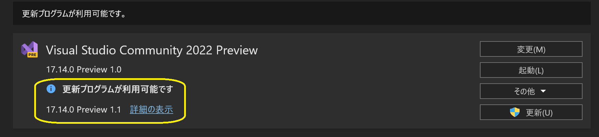

# .NET

##  独学書

  |テキスト                                                      |日付      |進捗状況
  |-------------------------------------------------------------|----------|---
  |[C++ プログラミング入門](http://examples.oreilly.com/core/)     |2021/10/17|Chapter 6 コンストラクタおよびデストラクタを用いた優れた抽象化<span style="color: red;">*finished*</span>
  |[やさしいＣ＃第３版](https://isbn2.sbcr.jp/03922/)              |2022/07/16|*finished* ->[コード](https://github.com/Tatsukiyoshi/Weekend_Programming/tree/main/net/C%23/YCSSample)

##  環境
  |端末            |環境／FW                                          |最終更新
  |----------------|-------------------------------------------------|----------
  |Windows Insider |Visual Studio Community 2022 17.14.0 Preview 1.1 |[2025/02/27](https://learn.microsoft.com/en-us/visualstudio/releases/2022/release-notes-preview)
  |                |- .NET 10.0.0-preview.1                          |[2025/02/27](https://dotnet.microsoft.com/ja-jp/download/dotnet)
  |                |  - [MAUI 10.0.0-preview.1](#maui)               |[2025/02/27](https://github.com/dotnet/maui)
  |                |  - Android Emulator v.35.3.11                   |2025/02/12
  |                |- .NET 9.0.2                                     |2025/02/12
  |                |- .NET 8.0.13                                    |2025/02/12
  |Windows         |Visual Studio Community 2022 17.13.3             |[2025/03/13](https://learn.microsoft.com/en-us/visualstudio/releases/2022/release-notes)
  |                |- .NET 9.0.3                                     |[2025/03/13](https://dotnet.microsoft.com/ja-jp/download/dotnet)
  |                |- .NET 8.0.14                                    |[2025/03/13](https://dotnet.microsoft.com/ja-jp/download/dotnet)
  |                |- [Windows App SDK 1.6.3](#windows-app-sdk)      |[2024/11/23](https://learn.microsoft.com/ja-jp/windows/apps/windows-app-sdk/downloads)

##  ノウハウ
### [Visual Studio](https://visualstudio.microsoft.com/ja/vs/) / [プレビュー](https://visualstudio.microsoft.com/ja/vs/preview/)
  - Visual Studio
    - Visual Studio 2022 17.13.3
      
  - Visual Studio Preview
    - Visual Studio 2022 17.14 Preview 1.1
      
  - [履歴](../history/VisualStudio.md)
  - [グローバル パッケージ、キャッシュ、および一時フォルダーを管理する](https://learn.microsoft.com/ja-jp/nuget/consume-packages/managing-the-global-packages-and-cache-folders)
    - NuGetパッケージは、既定では、ユーザフォルダに保存されるため、他のフォルダに保存する場合は、NUGET_PACKAGES環境変数でそのフォルダを指定する。
  - [Visual Studio Client Detector Utility](https://learn.microsoft.com/ja-jp/visualstudio/install/tools-for-managing-visual-studio-instances?view=vs-2022)
    
    -  Visual Studio のインストールを検出して管理するために使用できるツールらしい！
  - Shift-JISで作成していたはずのソースがUnicodeに変換される？
    
  - パッケージ管理
    - NuGetパッケージ管理画面にて、「更新プログラム」に表示されるパッケージを更新する
    
  - 注目した変更
    - GitHub Copilot (*17.10 Preview 3.0-*) <BR/>
          
    - ようこそ画面 (*17.6 Preview 2.0-*)
      ダイアログではなく、IDEにクイックアクションなどをまとめたようこそ画面が。
      
    - スペルチェッカ (*17.5 Preview 5.0-*)
      単語レベルでの間違いを指摘し、修正候補を提示する。
      
### .NET
  - [.NET 10.0.0-preview1](https://dotnet.microsoft.com/en-us/download/dotnet/10.0)(*2025/02/27* <span style="color: red;">Installed!</span>)
    - ターゲットフレームワークに".NET 10.0"を指定することで実現
      
    - ターゲットフレームワークである".NET 10.0"のバージョンが表示できる
      
  - [.NET 9.0.3](https://dotnet.microsoft.com/en-us/download/dotnet/9.0?hl=ja-JP)(*2025/03/13* <span style="color: red;">Updated!</span>)
    - ターゲットフレームワークに".NET 9.0"を指定することで実現
      
    - ターゲットフレームワークである".NET 9.0"のバージョンが表示できる
      
  - [.NET での破壊的変更](https://learn.microsoft.com/ja-jp/dotnet/core/compatibility/breaking-changes)
  - [.NET 8.0.14](https://dotnet.microsoft.com/ja-jp/download/dotnet/8.0)(*2025/03/13* <span style="color: red;">Updated!</span>)
    - ターゲットフレームワークに".NET 8.0"を指定していれば、".NET 8.0"のバージョンが表示できる
      

  - .NET 環境情報
  ```
  dotnet --info
  ```
  <details>
  <summary>Visual Studio 2022 Preview＠Windows Insider</summary>

  ```
  .NET SDK:
  Version:           10.0.100-preview.1.25120.13
  Commit:            ba56a99747
  Workload version:  10.0.100-manifests.bf5105ba
  MSBuild version:   17.14.0-preview-25110-01+01d0b7a93

  ランタイム環境:
  OS Name:     Windows
  OS Version:  10.0.26120
  OS Platform: Windows
  RID:         win-x64
  Base Path:   C:\Program Files\dotnet\sdk\10.0.100-preview.1.25120.13\

  インストール済みの .NET ワークロード:
  [maui-windows]
    インストール ソース: VS 17.14.35821.62
    マニフェストのバージョン:    10.0.0-preview.1.25101.2/10.0.100-preview.1
    マニフェスト パス:       C:\Program Files\dotnet\sdk-manifests\10.0.100-preview.1\microsoft.net.sdk.maui\10.0.0-preview.1.25101.2\WorkloadManifest.json
    インストールの種類:              Msi

  [maccatalyst]
    インストール ソース: VS 17.14.35821.62
    マニフェストのバージョン:    18.2.10321-net10-p1/10.0.100-preview.1
    マニフェスト パス:       C:\Program Files\dotnet\sdk-manifests\10.0.100-preview.1\microsoft.net.sdk.maccatalyst\18.2.10321-net10-p1\WorkloadManifest.json
    インストールの種類:              Msi

  [ios]
    インストール ソース: VS 17.14.35821.62
    マニフェストのバージョン:    18.2.10321-net10-p1/10.0.100-preview.1
    マニフェスト パス:       C:\Program Files\dotnet\sdk-manifests\10.0.100-preview.1\microsoft.net.sdk.ios\18.2.10321-net10-p1\WorkloadManifest.json     
    インストールの種類:              Msi

  [android]
    インストール ソース: VS 17.14.35821.62
    マニフェストのバージョン:    35.99.0-preview.1.136/10.0.100-preview.1
    マニフェスト パス:       C:\Program Files\dotnet\sdk-manifests\10.0.100-preview.1\microsoft.net.sdk.android\35.99.0-preview.1.136\WorkloadManifest.json
    インストールの種類:              Msi

  新しいマニフェストをインストールするときに loose manifests を使用するように構成されています。

  Host:
    Version:      10.0.0-preview.1.25080.5
    Architecture: x64
    Commit:       b98cabca12

  .NET SDKs installed:
    8.0.405 [C:\Program Files\dotnet\sdk]
    9.0.102 [C:\Program Files\dotnet\sdk]
    9.0.200 [C:\Program Files\dotnet\sdk]
    10.0.100-preview.1.25120.13 [C:\Program Files\dotnet\sdk]

  .NET runtimes installed:
    Microsoft.AspNetCore.App 8.0.12 [C:\Program Files\dotnet\shared\Microsoft.AspNetCore.App]
    Microsoft.AspNetCore.App 8.0.13 [C:\Program Files\dotnet\shared\Microsoft.AspNetCore.App]
    Microsoft.AspNetCore.App 9.0.1 [C:\Program Files\dotnet\shared\Microsoft.AspNetCore.App]
    Microsoft.AspNetCore.App 9.0.2 [C:\Program Files\dotnet\shared\Microsoft.AspNetCore.App]
    Microsoft.AspNetCore.App 10.0.0-preview.1.25120.3 [C:\Program Files\dotnet\shared\Microsoft.AspNetCore.App]
    Microsoft.NETCore.App 8.0.12 [C:\Program Files\dotnet\shared\Microsoft.NETCore.App]
    Microsoft.NETCore.App 8.0.13 [C:\Program Files\dotnet\shared\Microsoft.NETCore.App]
    Microsoft.NETCore.App 9.0.1 [C:\Program Files\dotnet\shared\Microsoft.NETCore.App]
    Microsoft.NETCore.App 9.0.2 [C:\Program Files\dotnet\shared\Microsoft.NETCore.App]
    Microsoft.NETCore.App 10.0.0-preview.1.25080.5 [C:\Program Files\dotnet\shared\Microsoft.NETCore.App]
    Microsoft.WindowsDesktop.App 8.0.12 [C:\Program Files\dotnet\shared\Microsoft.WindowsDesktop.App]
    Microsoft.WindowsDesktop.App 8.0.13 [C:\Program Files\dotnet\shared\Microsoft.WindowsDesktop.App]
    Microsoft.WindowsDesktop.App 9.0.1 [C:\Program Files\dotnet\shared\Microsoft.WindowsDesktop.App]
    Microsoft.WindowsDesktop.App 9.0.2 [C:\Program Files\dotnet\shared\Microsoft.WindowsDesktop.App]
    Microsoft.WindowsDesktop.App 10.0.0-preview.1.25080.4 [C:\Program Files\dotnet\shared\Microsoft.WindowsDesktop.App]

  Other architectures found:
    x86   [C:\Program Files (x86)\dotnet]
      registered at [HKLM\SOFTWARE\dotnet\Setup\InstalledVersions\x86\InstallLocation]

  Environment variables:
    Not set

  global.json file:
    Not found

  Learn more:
    https://aka.ms/dotnet/info

  Download .NET:
    https://aka.ms/dotnet/download
  ```
  </details>
  <details>
  <summary>Visual Studio 2022@Windows</summary>

  ```
  .NET SDK:
  Version:           9.0.201
  Commit:            071aaccdc2
  Workload version:  9.0.200-manifests.a3a1a094
  MSBuild version:   17.13.13+1c2026462

  ランタイム環境:
  OS Name:     Windows
  OS Version:  10.0.26100
  OS Platform: Windows
  RID:         win-x64
  Base Path:   C:\Program Files\dotnet\sdk\9.0.201\

  インストール済みの .NET ワークロード:
  表示するインストール済みワークロードはありません。
  新しいマニフェストをインストールするときに loose manifests を使用するように構成されています。

  Host:
    Version:      9.0.3
    Architecture: x64
    Commit:       831d23e561

  .NET SDKs installed:
    6.0.428 [C:\Program Files\dotnet\sdk]
    9.0.201 [C:\Program Files\dotnet\sdk]

  .NET runtimes installed:
    Microsoft.AspNetCore.App 6.0.36 [C:\Program Files\dotnet\shared\Microsoft.AspNetCore.App]
    Microsoft.AspNetCore.App 8.0.14 [C:\Program Files\dotnet\shared\Microsoft.AspNetCore.App]
    Microsoft.AspNetCore.App 9.0.3 [C:\Program Files\dotnet\shared\Microsoft.AspNetCore.App]
    Microsoft.NETCore.App 6.0.36 [C:\Program Files\dotnet\shared\Microsoft.NETCore.App]
    Microsoft.NETCore.App 8.0.14 [C:\Program Files\dotnet\shared\Microsoft.NETCore.App]
    Microsoft.NETCore.App 9.0.3 [C:\Program Files\dotnet\shared\Microsoft.NETCore.App]
    Microsoft.WindowsDesktop.App 6.0.36 [C:\Program Files\dotnet\shared\Microsoft.WindowsDesktop.App]
    Microsoft.WindowsDesktop.App 8.0.14 [C:\Program Files\dotnet\shared\Microsoft.WindowsDesktop.App]
    Microsoft.WindowsDesktop.App 9.0.3 [C:\Program Files\dotnet\shared\Microsoft.WindowsDesktop.App]

  Other architectures found:
    x86   [C:\Program Files (x86)\dotnet]
      registered at [HKLM\SOFTWARE\dotnet\Setup\InstalledVersions\x86\InstallLocation]

  Environment variables:
    Not set

  global.json file:
    Not found

  Learn more:
    https://aka.ms/dotnet/info

  Download .NET:
    https://aka.ms/dotnet/download
  ```
  </details>

### Windows App SDK
  - Windows App SDK
    
  - NET 8.0
    - [.NET SDK で小さい RID グラフを使う](https://learn.microsoft.com/ja-jp/dotnet/core/compatibility/sdk/8.0/rid-graph)
      ```xml
      <PropertyGroup>
        ...
        <RuntimeIdentifier>win-x64</RuntimeIdentifier>
      </PropertyGroup>
      ```
  - バージョン確認
    ```
    get-appxpackage *appruntime.1.6*
    ```
    <details>
    <summary>Windows App SDK 1.6.3</summary>

    ```
    Name              : Microsoft.WindowsAppRuntime.1.6
    Publisher         : CN=Microsoft Corporation, O=Microsoft Corporation, L=Redmond, S=Washington, C=US
    Architecture      : X86
    ResourceId        :
    Version           : 6000.318.2304.0
    PackageFullName   : Microsoft.WindowsAppRuntime.1.6_6000.318.2304.0_x86__8wekyb3d8bbwe
    InstallLocation   : C:\Program Files\WindowsApps\Microsoft.WindowsAppRuntime.1.6_6000.318.2304.0_x86__8wekyb3d8bbwe
    IsFramework       : True
    PackageFamilyName : Microsoft.WindowsAppRuntime.1.6_8wekyb3d8bbwe
    PublisherId       : 8wekyb3d8bbwe
    IsResourcePackage : False
    IsBundle          : False
    IsDevelopmentMode : False
    NonRemovable      : False
    IsPartiallyStaged : False
    SignatureKind     : Store
    Status            : Ok

    Name              : Microsoft.WindowsAppRuntime.1.6
    Publisher         : CN=Microsoft Corporation, O=Microsoft Corporation, L=Redmond, S=Washington, C=US
    Architecture      : X64
    ResourceId        :
    Version           : 6000.318.2304.0
    PackageFullName   : Microsoft.WindowsAppRuntime.1.6_6000.318.2304.0_x64__8wekyb3d8bbwe
    InstallLocation   : C:\Program Files\WindowsApps\Microsoft.WindowsAppRuntime.1.6_6000.318.2304.0_x64__8wekyb3d8bbwe
    IsFramework       : True
    PackageFamilyName : Microsoft.WindowsAppRuntime.1.6_8wekyb3d8bbwe
    PublisherId       : 8wekyb3d8bbwe
    IsResourcePackage : False
    IsBundle          : False
    IsDevelopmentMode : False
    NonRemovable      : False
    IsPartiallyStaged : False
    SignatureKind     : Store
    Status            : Ok
    ```
    </details>

### MAUI
  - [.NET MAUI 10](https://learn.microsoft.com/en-us/dotnet/maui/whats-new/dotnet-10?view=net-maui-9.0)
    - MAUIワークロードのインストール
      ```
      dotnet workload install maui
      ```
    - MAUIワークロードの一覧
      ```
      dotnet workload list
      ```
    - ビルド
      ```
      dotnet build -t:Run -f net8.0-android -p:AndroidSdkDirectory=D:\AndroidSdk
      ```
    - Androidエミュレータ
      ```
      D:\AndroidSdk\emulator\emulator.exe -avd Pixel_3a_API_34_extension_level_7_x86_64
      ```
    - MAUIワークロードの更新（インストール済ワークロードの更新）
      ```
      dotnet workload update --from-previous-sdk
      ```
      <details>
      <summary>MAUI Update Log</summary>

      ```

      .NET 10.0 へようこそ!
      ---------------------
      SDK バージョン: 10.0.100-preview.1.25120.13

      テレメトリ
      ---------
      .NET ツールは、エクスペリエンスの向上のために利用状況データを収集します。データは Microsoft によって収集され、コミュニティと共有されます。テレメトリをオプトアウトするには、好みのシェルを使用して、DOTNET_CLI_TELEMETRY_OPTOUT 環境変数を '1' または 'true' に設定できます。

      .NET CLI ツールのテレメトリの詳細をご覧ください: https://aka.ms/dotnet-cli-telemetry

      ----------------
      ASP.NET Core HTTPS 開発証明書をインストールしました。
      証明書を信頼するには、'dotnet dev-certs https --trust' を実行します
      HTTPS の詳細情報: https://aka.ms/dotnet-https

      ----------------
      最初のアプリを作成するには、https://aka.ms/dotnet-hello-world を参照してください
      最新情報については、https://aka.ms/dotnet-whats-new を参照してください
      ドキュメントを探すには、https://aka.ms/dotnet-docs を参照してください
      GitHub で問題の報告とソースの検索を行うには、https://github.com/dotnet/core を参照してください
      'dotnet --help' を使用して使用可能なコマンドを確認するか、https://aka.ms/dotnet-cli にアクセスしてください
      --------------------------------------------------------------------------------------

      広告マニフェスト microsoft.net.workload.emscripten.net7 を更新しました。
      広告マニフェスト microsoft.net.sdk.maui を更新しました。
      広告マニフェスト microsoft.net.workload.emscripten.net6 を更新しました。
      広告マニフェスト microsoft.net.sdk.android を更新しました。
      広告マニフェスト microsoft.net.workload.emscripten.current を更新しました。
      広告マニフェスト microsoft.net.workload.mono.toolchain.current を更新しました。
      広告マニフェスト microsoft.net.workload.emscripten.net9 を更新しました。
      広告マニフェスト microsoft.net.sdk.macos を更新しました。
      広告マニフェスト microsoft.net.workload.mono.toolchain.net7 を更新しました。
      広告マニフェスト microsoft.net.sdk.maccatalyst を更新しました。
      広告マニフェスト microsoft.net.workload.mono.toolchain.net9 を更新しました。
      広告マニフェスト microsoft.net.workload.mono.toolchain.net6 を更新しました。
      広告マニフェスト microsoft.net.sdk.ios を更新しました。
      広告マニフェスト microsoft.net.sdk.tvos を更新しました。
      広告マニフェスト microsoft.net.workload.emscripten.net8 を更新しました。
      広告マニフェスト microsoft.net.sdk.aspire を更新しました。
      広告マニフェスト microsoft.net.workload.mono.toolchain.net8 を更新しました。
      Downloading microsoft.net.sdk.android.manifest-10.0.100-preview.1.msi.x64 (35.99.0-preview.1.140)
      microsoft.net.sdk.android.manifest-10.0.100-preview.1.msi.x64 をインストールしています ..... Done
      Downloading microsoft.net.sdk.ios.manifest-10.0.100-preview.1.msi.x64 (18.2.10322-net10-p1)
      microsoft.net.sdk.ios.manifest-10.0.100-preview.1.msi.x64 をインストールしています .... Done
      Downloading microsoft.net.sdk.maccatalyst.manifest-10.0.100-preview.1.msi.x64 (18.2.10322-net10-p1)
      microsoft.net.sdk.maccatalyst.manifest-10.0.100-preview.1.msi.x64 をインストールしています ..... Done
      Downloading microsoft.net.sdk.macos.manifest-10.0.100-preview.1.msi.x64 (15.2.10322-net10-p1)
      microsoft.net.sdk.macos.manifest-10.0.100-preview.1.msi.x64 をインストールしています ..... Done
      Downloading microsoft.net.sdk.maui.manifest-10.0.100-preview.1.msi.x64 (10.0.0-preview.1.25122.6)
      microsoft.net.sdk.maui.manifest-10.0.100-preview.1.msi.x64 をインストールしています ..... Done
      Downloading microsoft.net.sdk.tvos.manifest-10.0.100-preview.1.msi.x64 (18.2.10322-net10-p1)
      microsoft.net.sdk.tvos.manifest-10.0.100-preview.1.msi.x64 をインストールしています ..... Done
      Downloading Microsoft.Android.Sdk.Windows.Msi.x64 (35.99.0-preview.1.140)
      Microsoft.Android.Sdk.Windows.Msi.x64 をインストールしています ................ Done
      Downloading Microsoft.Android.Ref.35.Msi.x64 (35.99.0-preview.1.140)
      Microsoft.Android.Ref.35.Msi.x64 をインストールしています ...... Done
      Downloading Microsoft.Android.Runtime.Mono.35.android-arm.Msi.x64 (35.99.0-preview.1.140)
      Microsoft.Android.Runtime.Mono.35.android-arm.Msi.x64 をインストールしています ....... Done
      Downloading Microsoft.Android.Runtime.Mono.35.android-arm64.Msi.x64 (35.99.0-preview.1.140)
      Microsoft.Android.Runtime.Mono.35.android-arm64.Msi.x64 をインストールしています ....... Done
      Downloading Microsoft.Android.Runtime.Mono.35.android-x86.Msi.x64 (35.99.0-preview.1.140)
      Microsoft.Android.Runtime.Mono.35.android-x86.Msi.x64 をインストールしています ....... Done
      Downloading Microsoft.Android.Runtime.Mono.35.android-x64.Msi.x64 (35.99.0-preview.1.140)
      Microsoft.Android.Runtime.Mono.35.android-x64.Msi.x64 をインストールしています ...... Done
      Downloading Microsoft.Android.Templates.Msi.x64 (35.99.0-preview.1.140)
      Microsoft.Android.Templates.Msi.x64 をインストールしています ..... Done
      Downloading Microsoft.NETCore.App.Runtime.Mono.android-arm.Msi.x64 (9.0.0)
      Microsoft.NETCore.App.Runtime.Mono.android-arm.Msi.x64 をインストールしています ........ Done
      Downloading Microsoft.NETCore.App.Runtime.Mono.android-arm64.Msi.x64 (9.0.0)
      Microsoft.NETCore.App.Runtime.Mono.android-arm64.Msi.x64 をインストールしています ......... Done
      Downloading Microsoft.NETCore.App.Runtime.Mono.android-x64.Msi.x64 (9.0.0)
      Microsoft.NETCore.App.Runtime.Mono.android-x64.Msi.x64 をインストールしています ........ Done
      Downloading Microsoft.NETCore.App.Runtime.Mono.android-x86.Msi.x64 (9.0.0)
      Microsoft.NETCore.App.Runtime.Mono.android-x86.Msi.x64 をインストールしています ........ Done
      Downloading Microsoft.NET.Runtime.MonoAOTCompiler.Task.Msi.x64 (9.0.0)
      Microsoft.NET.Runtime.MonoAOTCompiler.Task.Msi.x64 をインストールしています ..... Done
      Downloading Microsoft.NET.Runtime.MonoTargets.Sdk.Msi.x64 (9.0.0)
      Microsoft.NET.Runtime.MonoTargets.Sdk.Msi.x64 をインストールしています ..... Done
      Downloading Microsoft.NETCore.App.Runtime.AOT.win-x64.Cross.android-x86.Msi.x64 (9.0.0)
      Microsoft.NETCore.App.Runtime.AOT.win-x64.Cross.android-x86.Msi.x64 をインストールしています ........ Done
      Downloading Microsoft.NETCore.App.Runtime.AOT.win-x64.Cross.android-x64.Msi.x64 (9.0.0)
      Microsoft.NETCore.App.Runtime.AOT.win-x64.Cross.android-x64.Msi.x64 をインストールしています ....... Done
      Downloading Microsoft.NETCore.App.Runtime.AOT.win-x64.Cross.android-arm.Msi.x64 (9.0.0)
      Microsoft.NETCore.App.Runtime.AOT.win-x64.Cross.android-arm.Msi.x64 をインストールしています ....... Done
      Downloading Microsoft.NETCore.App.Runtime.AOT.win-x64.Cross.android-arm64.Msi.x64 (9.0.0)
      Microsoft.NETCore.App.Runtime.AOT.win-x64.Cross.android-arm64.Msi.x64 をインストールしています ....... Done
      Downloading Microsoft.NETCore.App.Runtime.Mono.android-arm.Msi.x64 (10.0.0-preview.1.25080.5)
      Microsoft.NETCore.App.Runtime.Mono.android-arm.Msi.x64 をインストールしています ......... Done
      Downloading Microsoft.NETCore.App.Runtime.Mono.android-arm64.Msi.x64 (10.0.0-preview.1.25080.5)
      Microsoft.NETCore.App.Runtime.Mono.android-arm64.Msi.x64 をインストールしています ......... Done
      Downloading Microsoft.NETCore.App.Runtime.Mono.android-x64.Msi.x64 (10.0.0-preview.1.25080.5)
      Microsoft.NETCore.App.Runtime.Mono.android-x64.Msi.x64 をインストールしています ......... Done
      Downloading Microsoft.NETCore.App.Runtime.Mono.android-x86.Msi.x64 (10.0.0-preview.1.25080.5)
      Microsoft.NETCore.App.Runtime.Mono.android-x86.Msi.x64 をインストールしています ........ Done
      Downloading Microsoft.NET.Runtime.MonoAOTCompiler.Task.Msi.x64 (10.0.0-preview.1.25080.5)
      Microsoft.NET.Runtime.MonoAOTCompiler.Task.Msi.x64 をインストールしています ..... Done
      Downloading Microsoft.NET.Runtime.MonoTargets.Sdk.Msi.x64 (10.0.0-preview.1.25080.5)
      Microsoft.NET.Runtime.MonoTargets.Sdk.Msi.x64 をインストールしています ..... Done
      Downloading Microsoft.NETCore.App.Runtime.AOT.win-x64.Cross.android-x86.Msi.x64 (10.0.0-preview.1.25080.5)
      Microsoft.NETCore.App.Runtime.AOT.win-x64.Cross.android-x86.Msi.x64 をインストールしています ....... Done
      Downloading Microsoft.NETCore.App.Runtime.AOT.win-x64.Cross.android-x64.Msi.x64 (10.0.0-preview.1.25080.5)
      Microsoft.NETCore.App.Runtime.AOT.win-x64.Cross.android-x64.Msi.x64 をインストールしています ....... Done
      Downloading Microsoft.NETCore.App.Runtime.AOT.win-x64.Cross.android-arm.Msi.x64 (10.0.0-preview.1.25080.5)
      Microsoft.NETCore.App.Runtime.AOT.win-x64.Cross.android-arm.Msi.x64 をインストールしています ....... Done
      Downloading Microsoft.NETCore.App.Runtime.AOT.win-x64.Cross.android-arm64.Msi.x64 (10.0.0-preview.1.25080.5)
      Microsoft.NETCore.App.Runtime.AOT.win-x64.Cross.android-arm64.Msi.x64 をインストールしています ....... Done
      Downloading Microsoft.iOS.Sdk.net10.0_18.2.Msi.x64 (18.2.10322-net10-p1)
      Microsoft.iOS.Sdk.net10.0_18.2.Msi.x64 をインストールしています ......... Done
      Downloading Microsoft.iOS.Sdk.net8.0_18.0.Msi.x64 (18.0.8314)
      Microsoft.iOS.Sdk.net8.0_18.0.Msi.x64 をインストールしています ........ Done
      Downloading Microsoft.iOS.Windows.Sdk.net10.0_18.2.Msi.x64 (18.2.10322-net10-p1)
      Microsoft.iOS.Windows.Sdk.net10.0_18.2.Msi.x64 をインストールしています ........ Done
      Downloading Microsoft.iOS.Windows.Sdk.net8.0_18.0.Msi.x64 (18.0.8314)
      Microsoft.iOS.Windows.Sdk.net8.0_18.0.Msi.x64 をインストールしています ......... Done
      Downloading Microsoft.iOS.Ref.net10.0_18.2.Msi.x64 (18.2.10322-net10-p1)
      Microsoft.iOS.Ref.net10.0_18.2.Msi.x64 をインストールしています ..... Done
      Downloading Microsoft.iOS.Runtime.ios-arm64.net10.0_18.2.Msi.x64 (18.2.10322-net10-p1)
      Microsoft.iOS.Runtime.ios-arm64.net10.0_18.2.Msi.x64 をインストールしています ....... Done
      Downloading Microsoft.iOS.Runtime.iossimulator-x64.net10.0_18.2.Msi.x64 (18.2.10322-net10-p1)
      Microsoft.iOS.Runtime.iossimulator-x64.net10.0_18.2.Msi.x64 をインストールしています ....... Done
      Downloading Microsoft.iOS.Runtime.iossimulator-arm64.net10.0_18.2.Msi.x64 (18.2.10322-net10-p1)
      Microsoft.iOS.Runtime.iossimulator-arm64.net10.0_18.2.Msi.x64 をインストールしています ....... Done
      Downloading Microsoft.iOS.Templates.Msi.x64 (18.2.10322-net10-p1)
      Microsoft.iOS.Templates.Msi.x64 をインストールしています ..... Done
      Downloading Microsoft.NETCore.App.Runtime.Mono.ios-arm64.Msi.x64 (10.0.0-preview.1.25080.5)
      Microsoft.NETCore.App.Runtime.Mono.ios-arm64.Msi.x64 をインストールしています ......... Done
      Downloading Microsoft.NETCore.App.Runtime.Mono.iossimulator-arm64.Msi.x64 (10.0.0-preview.1.25080.5)
      Microsoft.NETCore.App.Runtime.Mono.iossimulator-arm64.Msi.x64 をインストールしています ......... Done
      Downloading Microsoft.NETCore.App.Runtime.Mono.iossimulator-x64.Msi.x64 (10.0.0-preview.1.25080.5)
      Microsoft.NETCore.App.Runtime.Mono.iossimulator-x64.Msi.x64 をインストールしています ......... Done
      Downloading Microsoft.NETCore.App.Runtime.Mono.ios-arm64.Msi.x64 (8.0.8)
      Microsoft.NETCore.App.Runtime.Mono.ios-arm64.Msi.x64 をインストールしています .......... Done
      Downloading Microsoft.NETCore.App.Runtime.Mono.iossimulator-arm64.Msi.x64 (8.0.8)
      Microsoft.NETCore.App.Runtime.Mono.iossimulator-arm64.Msi.x64 をインストールしています ........... Done
      Downloading Microsoft.NETCore.App.Runtime.Mono.iossimulator-x64.Msi.x64 (8.0.8)
      Microsoft.NETCore.App.Runtime.Mono.iossimulator-x64.Msi.x64 をインストールしています ......... Done
      Downloading Microsoft.NET.Runtime.MonoAOTCompiler.Task.Msi.x64 (8.0.8)
      Microsoft.NET.Runtime.MonoAOTCompiler.Task.Msi.x64 をインストールしています ..... Done
      Downloading Microsoft.NET.Runtime.MonoTargets.Sdk.Msi.x64 (8.0.8)
      Microsoft.NET.Runtime.MonoTargets.Sdk.Msi.x64 をインストールしています ..... Done
      Downloading Microsoft.MacCatalyst.Sdk.net10.0_18.2.Msi.x64 (18.2.10322-net10-p1)
      Microsoft.MacCatalyst.Sdk.net10.0_18.2.Msi.x64 をインストールしています ...... Done
      Downloading Microsoft.MacCatalyst.Sdk.net8.0_18.0.Msi.x64 (18.0.8314)
      Microsoft.MacCatalyst.Sdk.net8.0_18.0.Msi.x64 をインストールしています ...... Done
      Downloading Microsoft.MacCatalyst.Ref.net10.0_18.2.Msi.x64 (18.2.10322-net10-p1)
      Microsoft.MacCatalyst.Ref.net10.0_18.2.Msi.x64 をインストールしています ..... Done
      Downloading Microsoft.MacCatalyst.Runtime.maccatalyst-x64.net10.0_18.2.Msi.x64 (18.2.10322-net10-p1)
      Microsoft.MacCatalyst.Runtime.maccatalyst-x64.net10.0_18.2.Msi.x64 をインストールしています ...... Done
      Downloading Microsoft.MacCatalyst.Runtime.maccatalyst-arm64.net10.0_18.2.Msi.x64 (18.2.10322-net10-p1)
      Microsoft.MacCatalyst.Runtime.maccatalyst-arm64.net10.0_18.2.Msi.x64 をインストールしています ....... Done
      Downloading Microsoft.MacCatalyst.Templates.Msi.x64 (18.2.10322-net10-p1)
      Microsoft.MacCatalyst.Templates.Msi.x64 をインストールしています .... Done
      Downloading Microsoft.NETCore.App.Runtime.Mono.maccatalyst-arm64.Msi.x64 (10.0.0-preview.1.25080.5)
      Microsoft.NETCore.App.Runtime.Mono.maccatalyst-arm64.Msi.x64 をインストールしています ......... Done
      Downloading Microsoft.NETCore.App.Runtime.Mono.maccatalyst-x64.Msi.x64 (10.0.0-preview.1.25080.5)
      Microsoft.NETCore.App.Runtime.Mono.maccatalyst-x64.Msi.x64 をインストールしています ......... Done
      Downloading Microsoft.NETCore.App.Runtime.Mono.maccatalyst-arm64.Msi.x64 (8.0.8)
      Microsoft.NETCore.App.Runtime.Mono.maccatalyst-arm64.Msi.x64 をインストールしています ......... Done
      Downloading Microsoft.NETCore.App.Runtime.Mono.maccatalyst-x64.Msi.x64 (8.0.8)
      Microsoft.NETCore.App.Runtime.Mono.maccatalyst-x64.Msi.x64 をインストールしています .......... Done
      Downloading Microsoft.Maui.Graphics.Win2D.WinUI.Desktop.Msi.x64 (10.0.0-preview.1.25122.6)
      Microsoft.Maui.Graphics.Win2D.WinUI.Desktop.Msi.x64 をインストールしています ..... Done
      Downloading Microsoft.AspNetCore.Components.WebView.Maui.Msi.x64 (10.0.0-preview.1.25122.6)
      Microsoft.AspNetCore.Components.WebView.Maui.Msi.x64 をインストールしています ..... Done
      Downloading Microsoft.Maui.Sdk.Msi.x64 (10.0.0-preview.1.25122.6)
      Microsoft.Maui.Sdk.Msi.x64 をインストールしています ..... Done
      Downloading Microsoft.Maui.Sdk.Msi.x64 (9.0.0)
      Microsoft.Maui.Sdk.Msi.x64 をインストールしています ..... Done
      Downloading Microsoft.Maui.Graphics.Msi.x64 (10.0.0-preview.1.25122.6)
      Microsoft.Maui.Graphics.Msi.x64 をインストールしています ..... Done
      Downloading Microsoft.Maui.Resizetizer.Msi.x64 (10.0.0-preview.1.25122.6)
      Microsoft.Maui.Resizetizer.Msi.x64 をインストールしています ...... Done
      Downloading Microsoft.Maui.Templates.net10.Msi.x64 (10.0.0-preview.1.25122.6)
      Microsoft.Maui.Templates.net10.Msi.x64 をインストールしています ..... Done
      Downloading Microsoft.Maui.Templates.net9.Msi.x64 (9.0.0)
      Microsoft.Maui.Templates.net9.Msi.x64 をインストールしています ..... Done
      Downloading Microsoft.Maui.Core.Msi.x64 (10.0.0-preview.1.25122.6)
      Microsoft.Maui.Core.Msi.x64 をインストールしています ..... Done
      Downloading Microsoft.Maui.Controls.Msi.x64 (10.0.0-preview.1.25122.6)
      Microsoft.Maui.Controls.Msi.x64 をインストールしています ..... Done
      Downloading Microsoft.Maui.Controls.Build.Tasks.Msi.x64 (10.0.0-preview.1.25122.6)
      Microsoft.Maui.Controls.Build.Tasks.Msi.x64 をインストールしています ..... Done
      Downloading Microsoft.Maui.Controls.Core.Msi.x64 (10.0.0-preview.1.25122.6)
      Microsoft.Maui.Controls.Core.Msi.x64 をインストールしています ..... Done
      Downloading Microsoft.Maui.Controls.Xaml.Msi.x64 (10.0.0-preview.1.25122.6)
      Microsoft.Maui.Controls.Xaml.Msi.x64 をインストールしています ..... Done
      Downloading Microsoft.Maui.Controls.Compatibility.Msi.x64 (10.0.0-preview.1.25122.6)
      Microsoft.Maui.Controls.Compatibility.Msi.x64 をインストールしています ..... Done
      Downloading Microsoft.Maui.Essentials.Msi.x64 (10.0.0-preview.1.25122.6)
      Microsoft.Maui.Essentials.Msi.x64 をインストールしています ..... Done
      Microsoft.NET.Sdk.iOS.Manifest-9.0.100.Msi.x64 を削除しています ..... Done
      Microsoft.NET.Sdk.MacCatalyst.Manifest-9.0.100.Msi.x64 を削除しています ..... Done
      Microsoft.NET.Sdk.macOS.Manifest-9.0.100.Msi.x64 を削除しています ..... Done
      Microsoft.NET.Sdk.tvOS.Manifest-9.0.100.Msi.x64 を削除しています ..... Done
      Microsoft.Android.Ref.35.Msi.x64 を削除しています ..... Done
      Microsoft.Android.Ref.35.Msi.x64 を削除しています ..... Done
      Microsoft.Android.Runtime.35.android-arm.Msi.x64 を削除しています ..... Done
      Microsoft.Android.Runtime.35.android-arm64.Msi.x64 を削除しています ..... Done
      Microsoft.Android.Runtime.35.android-x64.Msi.x64 を削除しています ..... Done
      Microsoft.Android.Runtime.35.android-x86.Msi.x64 を削除しています ..... Done
      Microsoft.Android.Runtime.Mono.35.android-arm.Msi.x64 を削除しています ..... Done
      Microsoft.Android.Runtime.Mono.35.android-arm64.Msi.x64 を削除しています ..... Done
      Microsoft.Android.Runtime.Mono.35.android-x64.Msi.x64 を削除しています ..... Done
      Microsoft.Android.Runtime.Mono.35.android-x86.Msi.x64 を削除しています ..... Done
      Microsoft.Android.Sdk.Windows.Msi.x64 を削除しています ......... Done
      Microsoft.Android.Sdk.Windows.Msi.x64 を削除しています .......... Done
      Microsoft.Android.Sdk.Windows.Msi.x64 を削除しています ........ Done
      Microsoft.Android.Templates.Msi.x64 を削除しています ..... Done
      Microsoft.Android.Templates.Msi.x64 を削除しています ..... Done
      Microsoft.AspNetCore.Components.WebView.Maui.Msi.x64 を削除しています ..... Done
      Microsoft.iOS.Ref.net10.0_18.2.Msi.x64 を削除しています ..... Done
      Microsoft.iOS.Ref.net9.0_18.2.Msi.x64 を削除しています ..... Done
      Microsoft.iOS.Runtime.ios-arm64.net10.0_18.2.Msi.x64 を削除しています ..... Done
      Microsoft.iOS.Runtime.ios-arm64.net9.0_18.2.Msi.x64 を削除しています ..... Done
      Microsoft.iOS.Runtime.iossimulator-arm64.net10.0_18.2.Msi.x64 を削除しています ..... Done
      Microsoft.iOS.Runtime.iossimulator-arm64.net9.0_18.2.Msi.x64 を削除しています ..... Done
      Microsoft.iOS.Runtime.iossimulator-x64.net10.0_18.2.Msi.x64 を削除しています ..... Done
      Microsoft.iOS.Runtime.iossimulator-x64.net9.0_18.2.Msi.x64 を削除しています ..... Done
      Microsoft.iOS.Sdk.net10.0_18.2.Msi.x64 を削除しています ....... Done
      Microsoft.iOS.Sdk.net8.0_18.0.Msi.x64 を削除しています ....... Done
      Microsoft.iOS.Sdk.net9.0_18.2.Msi.x64 を削除しています ........ Done
      Microsoft.iOS.Templates.Msi.x64 を削除しています ..... Done
      Microsoft.iOS.Templates.Msi.x64 を削除しています ..... Done
      Microsoft.iOS.Windows.Sdk.net10.0_18.2.Msi.x64 を削除しています ...... Done
      Microsoft.iOS.Windows.Sdk.net8.0_18.0.Msi.x64 を削除しています ....... Done
      Microsoft.iOS.Windows.Sdk.net9.0_18.2.Msi.x64 を削除しています ....... Done
      Microsoft.MacCatalyst.Ref.net10.0_18.2.Msi.x64 を削除しています ..... Done
      Microsoft.MacCatalyst.Ref.net9.0_18.2.Msi.x64 を削除しています ..... Done
      Microsoft.MacCatalyst.Runtime.maccatalyst-arm64.net10.0_18.2.Msi.x64 を削除しています ..... Done
      Microsoft.MacCatalyst.Runtime.maccatalyst-arm64.net9.0_18.2.Msi.x64 を削除しています ..... Done
      Microsoft.MacCatalyst.Runtime.maccatalyst-x64.net10.0_18.2.Msi.x64 を削除しています ..... Done
      Microsoft.MacCatalyst.Runtime.maccatalyst-x64.net9.0_18.2.Msi.x64 を削除しています ..... Done
      Microsoft.MacCatalyst.Sdk.net10.0_18.2.Msi.x64 を削除しています ...... Done
      Microsoft.MacCatalyst.Sdk.net8.0_18.0.Msi.x64 を削除しています ..... Done
      Microsoft.MacCatalyst.Sdk.net9.0_18.2.Msi.x64 を削除しています ....... Done
      Microsoft.MacCatalyst.Templates.Msi.x64 を削除しています .... Done
      Microsoft.MacCatalyst.Templates.Msi.x64 を削除しています ..... Done
      Microsoft.Maui.Controls.Msi.x64 を削除しています .... Done
      Microsoft.Maui.Controls.Build.Tasks.Msi.x64 を削除しています ..... Done
      Microsoft.Maui.Controls.Compatibility.Msi.x64 を削除しています ..... Done
      Microsoft.Maui.Controls.Core.Msi.x64 を削除しています .... Done
      Microsoft.Maui.Controls.Xaml.Msi.x64 を削除しています .... Done
      Microsoft.Maui.Core.Msi.x64 を削除しています .... Done
      Microsoft.Maui.Essentials.Msi.x64 を削除しています .... Done
      Microsoft.Maui.Graphics.Msi.x64 を削除しています ..... Done
      Microsoft.Maui.Graphics.Win2D.WinUI.Desktop.Msi.x64 を削除しています .... Done
      Microsoft.Maui.Resizetizer.Msi.x64 を削除しています ..... Done
      Microsoft.Maui.Sdk.Msi.x64 を削除しています ..... Done
      Microsoft.Maui.Sdk.Msi.x64 を削除しています ..... Done
      Microsoft.Maui.Templates.net10.Msi.x64 を削除しています ..... Done
      Microsoft.Maui.Templates.net9.Msi.x64 を削除しています .... Done
      Microsoft.NET.Runtime.MonoAOTCompiler.Task.Msi.x64 を削除しています ..... Done
      Microsoft.NET.Runtime.MonoAOTCompiler.Task.Msi.x64 を削除しています ..... Done
      Microsoft.NET.Runtime.MonoAOTCompiler.Task.Msi.x64 を削除しています ..... Done
      Microsoft.NET.Runtime.MonoAOTCompiler.Task.Msi.x64 を削除しています ..... Done
      Microsoft.NET.Runtime.MonoAOTCompiler.Task.Msi.x64 を削除しています ..... Done
      Microsoft.NET.Runtime.MonoTargets.Sdk.Msi.x64 を削除しています ..... Done
      Microsoft.NET.Runtime.MonoTargets.Sdk.Msi.x64 を削除しています ..... Done
      Microsoft.NET.Runtime.MonoTargets.Sdk.Msi.x64 を削除しています ..... Done
      Microsoft.NET.Runtime.MonoTargets.Sdk.Msi.x64 を削除しています ..... Done
      Microsoft.NET.Runtime.MonoTargets.Sdk.Msi.x64 を削除しています ..... Done
      Microsoft.NETCore.App.Runtime.AOT.win-x64.Cross.android-arm.Msi.x64 を削除しています ..... Done
      Microsoft.NETCore.App.Runtime.AOT.win-x64.Cross.android-arm.Msi.x64 を削除しています ..... Done
      Microsoft.NETCore.App.Runtime.AOT.win-x64.Cross.android-arm.Msi.x64 を削除しています ..... Done
      Microsoft.NETCore.App.Runtime.AOT.win-x64.Cross.android-arm.Msi.x64 を削除しています ..... Done
      Microsoft.NETCore.App.Runtime.AOT.win-x64.Cross.android-arm64.Msi.x64 を削除しています ..... Done
      Microsoft.NETCore.App.Runtime.AOT.win-x64.Cross.android-arm64.Msi.x64 を削除しています ..... Done
      Microsoft.NETCore.App.Runtime.AOT.win-x64.Cross.android-arm64.Msi.x64 を削除しています ..... Done
      Microsoft.NETCore.App.Runtime.AOT.win-x64.Cross.android-arm64.Msi.x64 を削除しています ..... Done
      Microsoft.NETCore.App.Runtime.AOT.win-x64.Cross.android-x64.Msi.x64 を削除しています .... Done
      Microsoft.NETCore.App.Runtime.AOT.win-x64.Cross.android-x64.Msi.x64 を削除しています ..... Done
      Microsoft.NETCore.App.Runtime.AOT.win-x64.Cross.android-x64.Msi.x64 を削除しています ..... Done
      Microsoft.NETCore.App.Runtime.AOT.win-x64.Cross.android-x64.Msi.x64 を削除しています ..... Done
      Microsoft.NETCore.App.Runtime.AOT.win-x64.Cross.android-x86.Msi.x64 を削除しています .... Done
      Microsoft.NETCore.App.Runtime.AOT.win-x64.Cross.android-x86.Msi.x64 を削除しています ..... Done
      Microsoft.NETCore.App.Runtime.AOT.win-x64.Cross.android-x86.Msi.x64 を削除しています .... Done
      Microsoft.NETCore.App.Runtime.AOT.win-x64.Cross.android-x86.Msi.x64 を削除しています ..... Done
      Microsoft.NETCore.App.Runtime.Mono.android-arm.Msi.x64 を削除しています ......... Done
      Microsoft.NETCore.App.Runtime.Mono.android-arm.Msi.x64 を削除しています ......... Done
      Microsoft.NETCore.App.Runtime.Mono.android-arm.Msi.x64 を削除しています ........ Done
      Microsoft.NETCore.App.Runtime.Mono.android-arm.Msi.x64 を削除しています ........ Done
      Microsoft.NETCore.App.Runtime.Mono.android-arm64.Msi.x64 を削除しています ........ Done
      Microsoft.NETCore.App.Runtime.Mono.android-arm64.Msi.x64 を削除しています ........ Done
      Microsoft.NETCore.App.Runtime.Mono.android-arm64.Msi.x64 を削除しています ........ Done
      Microsoft.NETCore.App.Runtime.Mono.android-arm64.Msi.x64 を削除しています .......... Done
      Microsoft.NETCore.App.Runtime.Mono.android-x64.Msi.x64 を削除しています ........ Done
      Microsoft.NETCore.App.Runtime.Mono.android-x64.Msi.x64 を削除しています ......... Done
      Microsoft.NETCore.App.Runtime.Mono.android-x64.Msi.x64 を削除しています .......... Done
      Microsoft.NETCore.App.Runtime.Mono.android-x64.Msi.x64 を削除しています ......... Done
      Microsoft.NETCore.App.Runtime.Mono.android-x86.Msi.x64 を削除しています ........ Done
      Microsoft.NETCore.App.Runtime.Mono.android-x86.Msi.x64 を削除しています ........ Done
      Microsoft.NETCore.App.Runtime.Mono.android-x86.Msi.x64 を削除しています ........... Done
      Microsoft.NETCore.App.Runtime.Mono.android-x86.Msi.x64 を削除しています ........... Done
      Microsoft.NETCore.App.Runtime.Mono.ios-arm64.Msi.x64 を削除しています ......... Done
      Microsoft.NETCore.App.Runtime.Mono.ios-arm64.Msi.x64 を削除しています .......... Done
      Microsoft.NETCore.App.Runtime.Mono.ios-arm64.Msi.x64 を削除しています ......... Done
      Microsoft.NETCore.App.Runtime.Mono.ios-arm64.Msi.x64 を削除しています ........... Done
      Microsoft.NETCore.App.Runtime.Mono.iossimulator-arm64.Msi.x64 を削除しています .......... Done
      Microsoft.NETCore.App.Runtime.Mono.iossimulator-arm64.Msi.x64 を削除しています ......... Done
      Microsoft.NETCore.App.Runtime.Mono.iossimulator-arm64.Msi.x64 を削除しています .......... Done
      Microsoft.NETCore.App.Runtime.Mono.iossimulator-arm64.Msi.x64 を削除しています ......... Done
      Microsoft.NETCore.App.Runtime.Mono.iossimulator-x64.Msi.x64 を削除しています ........ Done
      Microsoft.NETCore.App.Runtime.Mono.iossimulator-x64.Msi.x64 を削除しています .......... Done
      Microsoft.NETCore.App.Runtime.Mono.iossimulator-x64.Msi.x64 を削除しています ........... Done
      Microsoft.NETCore.App.Runtime.Mono.iossimulator-x64.Msi.x64 を削除しています .......... Done
      Microsoft.NETCore.App.Runtime.Mono.maccatalyst-arm64.Msi.x64 を削除しています ......... Done
      Microsoft.NETCore.App.Runtime.Mono.maccatalyst-arm64.Msi.x64 を削除しています .......... Done
      Microsoft.NETCore.App.Runtime.Mono.maccatalyst-arm64.Msi.x64 を削除しています .......... Done
      Microsoft.NETCore.App.Runtime.Mono.maccatalyst-arm64.Msi.x64 を削除しています ......... Done
      Microsoft.NETCore.App.Runtime.Mono.maccatalyst-x64.Msi.x64 を削除しています ......... Done
      Microsoft.NETCore.App.Runtime.Mono.maccatalyst-x64.Msi.x64 を削除しています ........ Done
      Microsoft.NETCore.App.Runtime.Mono.maccatalyst-x64.Msi.x64 を削除しています ........ Done
      Microsoft.NETCore.App.Runtime.Mono.maccatalyst-x64.Msi.x64 を削除しています ........ Done

      ワークロード android ios maccatalyst maui-windows が正常に更新されました。
      ```
      </details>
    - [履歴](../history/MAUI.md)
  - Visual Studio
    - 17.14 Preview 1.1 / MAUI 10.0.0-preview.1.25122.6 / Pixel 9 API 35(Android 15)
      
    - [履歴](../history/VisualStudio.md)
  - Visual Studio Code
    - [.NET MAUI 拡張機能](https://marketplace.visualstudio.com/items?itemName=ms-dotnettools.dotnet-maui)
### ASP.NET MVC
  - [ASP.NET MVC でCRUD](https://qiita.com/zaburo/items/610bd34df3c819c67551)
### Azure
  - [Azureポータル](https://portal.azure.com/#home)
  - [Visual Studio Code を使用して Azure Functions を開発する](https://learn.microsoft.com/ja-jp/azure/azure-functions/functions-develop-vs-code?tabs=csharp)
    
### Blazor
  - [Blazor WebAssembly アプリケーションプログラミング自習書](https://qiita.com/jsakamoto/items/244163860b4626c02ba0)
  - [Getting Started with Blazor Scheduler Component](https://blazor.syncfusion.com/documentation/scheduler/getting-started)
    
  - Blazor入門（日経ソフトウェア 2021年9月号）**@2021/09/26** <span style="color: red;">*finished*</span>
### C#
  - [やさしいＣ＃第３版](https://isbn2.sbcr.jp/03922/)
    - [サポートページ](http://mana.on.coocan.jp/yasacs.html)
  - ノウハウ
    - フリーアイコン
      - GO(https://www.flaticon.com/free-icon/go_652364)
      - GoBack(https://www.flaticon.com/free-icon/back-button_93634?term=back&page=1&position=6&page=1&position=6&related_id=93634&origin=search)
    - [アプリケーション構成ファイル](https://www.fenet.jp/dotnet/column/language/9654/)
    - ColorDialog
    - [Using custom fonts on a Label on Winforms](https://stackoverflow.com/questions/1297264/using-custom-fonts-on-a-label-on-winforms)
      
  - リソースファイル（XML形式）の解析
    - [C#でのXML読み込み方法とは](https://www.fenet.jp/dotnet/column/language/8240/)
      ```
      <data name="LINESeedJP_TTF_Bd" type="System.Resources.ResXFileRef, System.Windows.Forms">
        <value>..\Fonts\LINESeedJP_TTF_Bd.ttf;System.Byte[], mscorlib, Version=4.0.0.0, Culture=neutral, PublicKeyToken=b77a5c561934e089</value>
      </data>
      <data name="LINESeedJP_TTF_Rg" type="System.Resources.ResXFileRef, System.Windows.Forms">
        <value>..\Fonts\LINESeedJP_TTF_Rg.ttf;System.Byte[], mscorlib, Version=4.0.0.0, Culture=neutral, PublicKeyToken=b77a5c561934e089</value>
      </data>
      ```
      
### C++
  - C11/C++17 - [C++環境設定](https://code.visualstudio.com/docs/cpp/config-msvc)
    - HelloWorld
    - [Learn C++](https://www.learncpp.com/) **@2019/10/22** 1.5 Introduction to iostream
