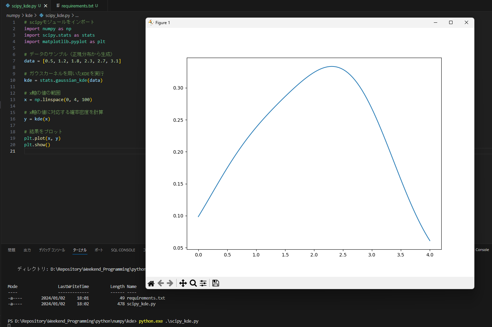
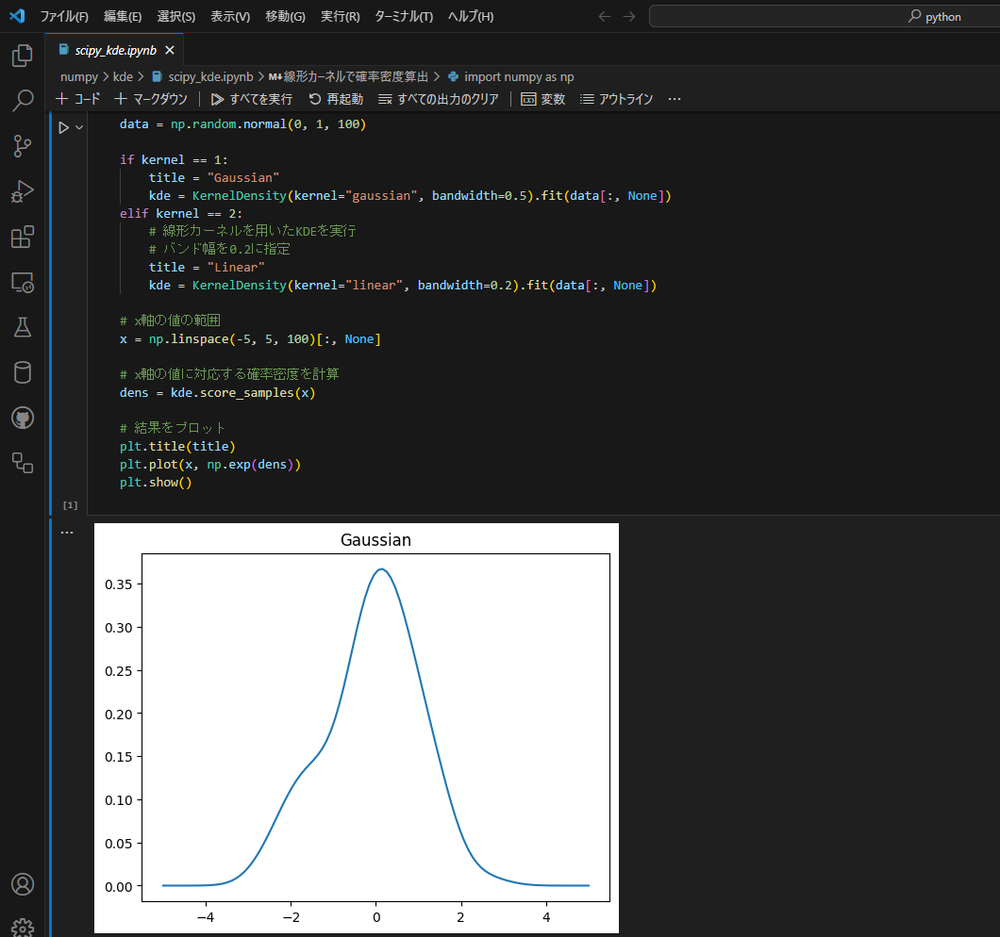

# Python

##  独学書

  |テキスト                                             |日付      |進捗状況
  |-----------------------------------------------------|----------|----
  |[独学プログラマー](http://theselftaughtprogrammer.io/)|2019/10/05|<span style="color: red;">*finished*</span>

##  環境

  |端末       |環境／FW                  |最終更新      
  |-----------|-------------------------|----------
  |IdeaPad    |[Python 3.12](#python-1) |[2023/11/03](https://www.python.org/downloads/)
  |           |[Django 4.2.7](#django)  |[2023/11/04](https://docs.djangoproject.com/ja/4.1)
  |           |[Flet 0.3.2](#flet)      |[2023/01/12](https://flet.dev/)

##  ノウハウ
### Python
  - インストール後の対応
    - 下記をPATHに追加する。
      ```
      C:\Users\taish\AppData\Local\Programs\Python\Python312
      ```
    - Djangoをインストールする
      ```
      python -m pip install django
      ```
### numpy/scikit-learn
  - VSCodeで実行してみた
    
  - Jupyter Notebookを使ってみた
    
### Django
  - [Django Tutorial](https://docs.djangoproject.com/ja/4.1/intro/tutorial01/)
    **@2022/08/27** その７ adminフォームのカスタマイズ <span style="color: red;">*finished*</span>
  - 日本語に変える方法
    - https://codor.co.jp/django/how-change-language
  - Djangoのソースディレクトリを確認する方法
    ```
    py -c "import django; print(django.__path__)"
    ```
  - Djangoのバージョン確認
    ```
    py -m django --version
    ```
  - Djangoのアップグレード
    ```
    py -m pip install --upgrade Django
    ```
  - Python/Djangoのテスト
    ```
    py -Wa manage.py test
    ```
  - チュートリアル
    - サーバ起動
      ```
      python manage.py runserver
      ```
    - SHELLでの確認
      ```
      python manage.py shell
      ```
    - テストコードの実行
      ```
      python manage.py test polls
      ```
    - URL
      サイト|パス
      ------|----
      投票  |localhost:8000/polls
      管理  |localhost:8000/admin

    - 管理サイトのパスワード
      admin / djangoadmin
### Flet
  - [Flet-Counter](https://github.com/Tatsukiyoshi/Flet-Counter)

##  雑誌記事
  - nsw
    - 202005 : 日経ソフトウェア2020年5月号 **@2020/08/10**
  - pygame2 : 5日でできる！Pythonでゲーム作成入門（日経ソフトウェア2020年5月号）
    - [ケニーのサイト](https://kenney.nl/assets/space-shooter-extension)
    - ３日目：迷路 **@2020/06/29 -> 2020/07/25**
    - ４日目：月面着陸ゲーム **@2020/07/26 -> 2020/08/01**
    - ５日目：シューティングゲーム **@2020/08/10**
  - pygame : Pygame Zero ゲームプログラミング入門（日経ソフトウェア2020年3月号）
    - jumpgame **@2020/04/11**
    - shooting **@2020/04/12**
  - reversi : PythonでAIと対戦できるリバーシを作ろう
    - データ構造とUI編（日経ソフトウェア2019年9月号）
      - **@2019/09/28**コンピュータが隅に優先して石を打つよう改良
      - **@2019/10/04**コンピュータが隅を優先して石を打つかを変更するチェックボックス追加
    - AI(人工知能編)（日経ソフトウェア2019年11月号）<BR>
      - ミニマックス法
      - アルファベータ法
  - ginza - Universal Dependenciesに基づくオープンソース日本語NLPライブラリ
    ```
    pip install "https://github.com/megagonlabs/ginza/releases/download/v1.0.2/ja_ginza_nopn-1.0.2.tgz"
    ```
  - flask - 日経ソフトウェア 2019年3月号/5月号
  - opencv - ５日でわかるOpenCVプログラミング入門（日経ソフトウェア2019年3月号特別付録２）
    ```
    pip install opencv-python
    ```
  - [鎖プログラム](https://pg-chain.com/)
