# TypeScript & JavaScript

##  独学書

  |テキスト                                      |日付      |進捗状況
  |---------------------------------------------|----------|-------
  |Angularアプリケーションプログラミング             |2023/09/23|*finished* ->[コード](https://github.com/Tatsukiyoshi/Weekend_Programming/tree/main/js/angular/practice)
  |モダンJavaScriptの基本から始めるReact実践の教科書  |2022/07/02|*finished* ->[コード](https://github.com/Tatsukiyoshi/Weekend_Programming/tree/main/js/react/practice)

##  コンテンツ

  |コンテンツ                                                                                       |日付      |進捗状況
  |-----------------------------------------------------------------------------------------------|----------|-------
  |[Vercel＋Next.jsを活用したWebアプリケーション開発入門](https://codezine.jp/article/corner/925)       |2022/11/03|第4回 ブログを作りながら学ぶ、Next.jsの便利な4つの機能（グローバル設定、プリレンダリング、動的ルート、サーバーレス）
  |[TypeScriptで学ぶJavaScriptフレームワーク「Vue.js」の利用法](https://codezine.jp/article/corner/878)|2024/05/22|第8回 TypeScriptとも相性抜群なライブラリ──Vue.jsで状態管理を行う新定番「Pinia」を解説！ <span style="color: red;">*finished*</span>

##  環境

  1.  ホスティング・サービス
  
      |ホスト                          |FW              |最終更新      
      |-------------------------------|----------------|----------
      |[Vercel](https://vercel.com/)  |Next.js 15.0.2  |2024/11/02
      |                               |Astro 4.16.8    |2024/11/02

  1.  Windows
      |端末       |FW                      |最終更新      
      |-----------|------------------------|----------
      |Windows    |Node.js 20.17.0         |[2024/09/08](https://nodejs.org/en)
      |           |React 19 RC             |[2024/06/08](https://19.react.dev/)
      |           |- Bun 1.1.12            |2024/05/30
      |           |React 18.3.1            |[2024/05/30](https://ja.react.dev/)
      |           |- Bun 1.1.22            |2024/08/10
      |           |- Vite 5.4.0            |2024/08/10
      |           |Astro 4.16.7            |[2024/10/26](https://astro.build/)
      |           |+ Astro 5.0.0-beta.6    |2024/11/02
      |           |- Bun 1.1.34-canary.13  |2024/10/26
      |           |- React 18.3.1          |2024/05/30
      |           |Next.js 15.0.1          |[2024/10/26](https://nextjs.org/)
      |           |Nuxt 3.13.2             |[2024/10/05](https://nuxt.com/)
      |           |Vue 3.5.13              |[2024/11/29](https://jp.vuejs.org/)
      |           |- Deno 2.1.2            |[2024/11/30](https://deno.land/)
      |           |- Vite 6.0.1            |[2024/11/29](https://vitejs.dev/)
      |           |- Bun 1.1.38            |[2024/11/29](https://bun.sh/)
      |           |Deno 2.1.2              |2024/11/30
      |           |- fresh 1.7.3           |[2024/10/26](https://fresh.deno.dev/)
      |           |React Native 0.73.1     |[2024/01/07](https://reactnative.dev/)
      |           |- for Windows 0.73.2    |2024/01/07
      |InsiderDev |Node.js 22.11.0         |2024/11/26
      |           |Angular 19.0.1          |[2024/11/30](https://angular.dev/)

##  ノウハウ
### TypeScript
  - アーキテクチャを理解する <span style="color: red;">**Checked Out! 2024/08/25**</span>
    - [React/Nexjs ユーザーに向けた Astro 入門](https://zenn.dev/overflow_offers/articles/20230330-intro-to-astro-for-react-nexjs-users)
    - [【Next.js】App RouterとRSCによるアーキテクチャ設計](https://zenn.dev/kiwichan101kg/articles/b44305e3049bac)
  - [Visual Studio Code 用 Microsoft Edge DevTools 拡張機能](https://learn.microsoft.com/ja-jp/microsoft-edge/visual-studio-code/microsoft-edge-devtools-extension)
  - [Visual Studio Code で TypeScript の開発環境を構築する](https://maku.blog/p/ak7u3h3/)
  - [node.js](https://nodejs.org/en)/[nvm](https://github.com/nvm-sh/nvm)
    - インストール
      - 古いバージョンをアンインストールするなら、下記ディレクトリのライブラリ(node-modules)は整理した後で！（グローバルにインストールしていなければ、問題なし）
        - ユーザディレクトリのAppData\Roaming\npm
        - ユーザディレクトリのAppData\Roaming\npm-cache
    - バージョンアップ
      - [Windowsでnode.jsやnpmのバージョンをアップデート・変更する方法｜バージョンが切り替わらないときの対処法（nodistの使い方）](https://prograshi.com/framework/nodejs/upgrade-or-change-node-version-in-windows/)
    - トラブルシューティング
      - node.js 17以降で実行時エラーとなる（OpenSSL関連）
        - スクリプト実行時にnodeのopenssl-legacy-providerオプションを有効化するよう、package.jsonを書き換える
          [参考](https://howtojs.io/how-to-solve-digital-envelope-routines-unsupported-or-err_ossl_evp_unsupported-error-when-running-angular-application/)
        - npx create-react-app "package-name"(npm install)でmissing dependenciesエラー <BR>
          - 実行時に見つからないパッケージが表示されたら、そのパッケージをインストールする
          ```sh
          npm install --save "@xxx"
          ```
        - npm startでエラー
          - 以下のコマンドで解決するらしい
            ```sh
            npm config set scripts-prepend-node-path true
            ```
### Runtime
  - [Bun](https://bun.sh/)
    - Install
      - Windows
        ```
        powershell -c "irm bun.sh/install.ps1 | iex"
        ```
      - WSL2
        ```sh
        curl -fsSL https://bun.sh/install | bash
        ```
        - unzip is required to install bun (see: https://github.com/oven-sh/bun#unzip-is-required)
          ```sh
          sudo apt install unzip
          ```
    - Run
      ```sh
      bun run
      ```
    - Update
      ```sh
      bun upgrade
      ```
  - [Deno](https://deno.land/)
    - Denoを試してみる
      - インストール
        - Windows
          ```sh
          iwr https://deno.land/install.ps1 -useb | iex
          ```
          <details>
          <summary>インストール結果</summary>

          ```
            % Total    % Received % Xferd  Average Speed   Time    Time     Time  Current
                                          Dload  Upload   Total   Spent    Left  Speed
            0     0    0     0    0     0      0      0 --:--:-- --:--:-- --:--:--     0
            0     0    0     0    0     0      0      0 --:--:-- --:--:-- --:--:--     0
          100 32.4M  100 32.4M    0     0  15.0M      0  0:00:02  0:00:02 --:--:-- 57.0M
          Deno was installed successfully to C:\Users\taish\.deno\bin\deno.exe
          Run 'deno --help' to get started
          Stuck? Join our Discord https://discord.gg/deno        
          ```
          </details>

          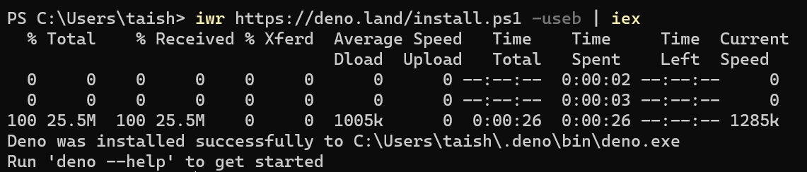
        - Chrome OS Flex
          ```sh
          curl -fsSL https://deno.land/x/install/install.sh | sh
          ```
      - Deno更新
        ```sh
        deno upgrade
        ```
    - [fresh 1.6.3](https://fresh.deno.dev/)
      - [Get Started](https://fresh.deno.dev/docs/getting-started)
        ```
        deno run -A -r https://fresh.deno.dev my-project
        cd my-project
        deno task start
        ```
      - Update
        ```
        deno run -Ar https://fresh.deno.dev/update
        ```
### ORM
  - [Prisma](https://www.prisma.io/)
    - [Start from scratch](https://www.prisma.io/docs/getting-started/setup-prisma/start-from-scratch)
    - Prisma Studio - Prismaを使うプロジェクト配下でデータベースを参照することができるWebアプリケーション
      - 起動
        ```sh
        npx prisma studio
        ```
        プロジェクトのディレクトリで上記コマンドを実行すると、Webブラウザが起動される。
        接続するデータベースは、.envの設定を使って接続し、
        テーブルは、schema.prismaを参照しているらしい。
        ```
        Environment variables loaded from .env
        Prisma schema loaded from prisma\schema.prisma
        Prisma Studio is up on http://localhost:5555
        ```
      - トップ画面
        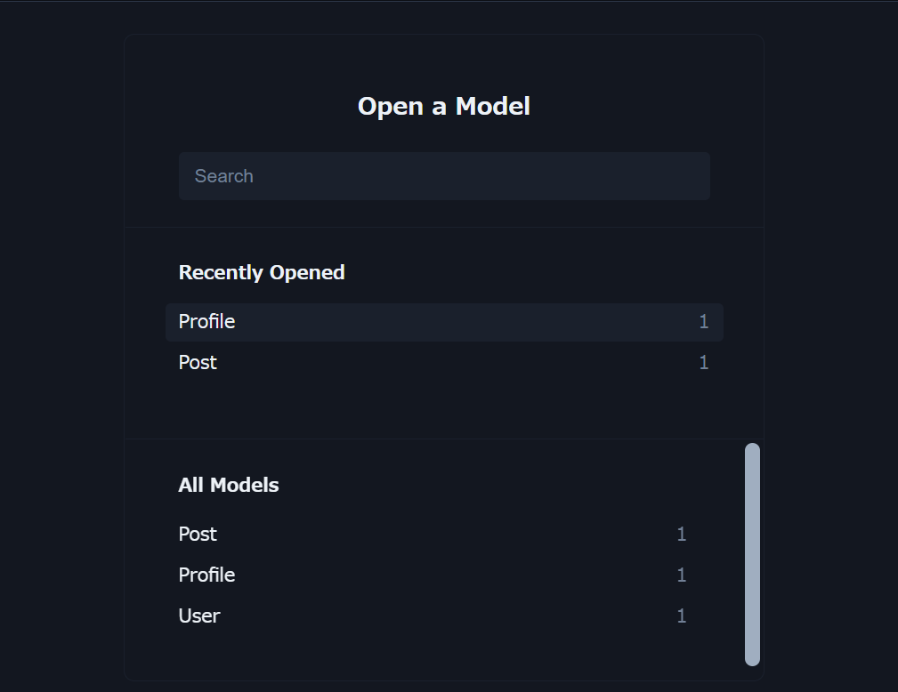
      - テーブルビュー
        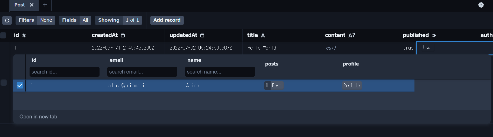
  - [Sequelize](https://sequelize.org/)
    - [Sequelizeを使用してデータベースを操作するための基本的な情報(2020.09更新）](https://qiita.com/mima_ita/items/014dcb42872f3a10855b)
### Framework
  - マルチプラットフォーム（モバイル/デスクトップ）
    - React Native
      - [Configuring Metro](https://reactnative.dev/docs/metro)
      - [Expo](https://expo.dev/)
      - React Nativeで開発したアプリの実行
        - Android SDK配下にあるエミュレータを起動する
        - あらかじめ、SDKインストールディレクトリを確認すること
        - AVD Managerでイメージを作成しておくこと
          ```sh
          <Android SDKインストールディレクトリ>\emulator\emulator.exe -avd Nexus_5X_API_29_x86
          ```
        - プロジェクトをビルドする（ビルド後、APがエミュレータにインストールされる）
          ```sh
          react-native run-android
          ```
      - [React Native for Windows](https://learn.microsoft.com/ja-jp/windows/dev-environment/javascript/react-native-for-windows)
        - 前提条件
          - Node.js development
          - .NET Desktop development
          - Desktop development with C++
          - Universal Windows Platform development
          - Windows 10 SDK
        - 作成
          ```sh
          npx react-native init <projectName>
          ```
        - Windowsターゲット追加
          ```sh
          cd projectName
          npx react-native-windows-init --overwrite
          ```
        - 実行
          ```sh
          npx react-native run-windows
          ```
          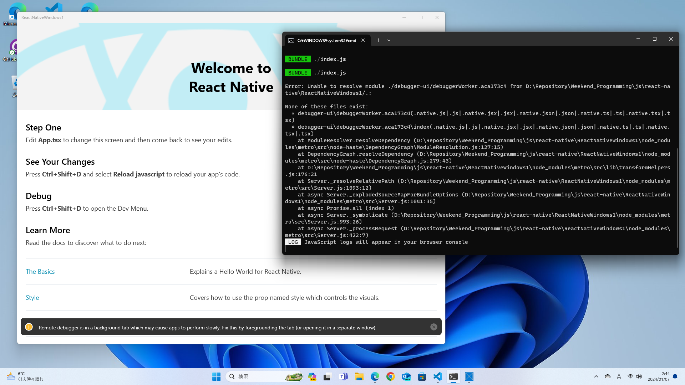
    - [Gluon](https://gluonjs.org/)
  - [Astro](https://astro.build/)
    - [Astro 5.0 beta](https://5-0-0-beta.docs.astro.build/en/guides/upgrade-to/v5/)
      - Upgrade
        ```
        npx @astrojs/upgrade beta
        ```
        <details>
        <summary>Upgrade Log</summary>

        ```sh
        Need to install the following packages:
        @astrojs/upgrade@0.3.3
        Ok to proceed? (y) y


        astro   Integration upgrade in progress.

              ●  @astrojs/check will be updated to v0.9.4
              ●  @astrojs/react will be updated to v
              ▲  astro will be updated to  v5.0.0-beta.3 

          wait   One package has breaking changes. Continue?
                Yes

        check   Be sure to follow the CHANGELOG.
                astro https://github.com/withastro/astro/blob/next/packages/astro/CHANGELOG.md#500-beta3

        ██████  Installing dependencies with bun...

        +—————+  Houston:
        | ^ u ^  Have fun building!
        +—————+
        ```
    - Astro 4.2
      - Upgrade
        ```
        npx @astrojs/upgrade
        ```
        <details>
        <summary>Upgrade Log</summary>

        ```sh
        Need to install the following packages:
          @astrojs/upgrade@0.2.2
        Ok to proceed? (y) y

        astro   Integration upgrade in progress.

              ◼  @astrojs/react is up to date on v3.0.9
              ●  astro will be updated to v4.2.1
              ●  @astrojs/check will be updated to v0.4.1

              ✔  Installed dependencies!

        ╭─────╮  Houston:
        │ ◠ ◡ ◠  See you around, astronaut.
        ╰─────╯
        npm notice
        npm notice New major version of npm available! 9.6.7 -> 10.3.0
        npm notice Changelog: https://github.com/npm/cli/releases/tag/v10.3.0
        npm notice Run npm install -g npm@10.3.0 to update!
        npm notice
        ```
        </details>
    - Astroプロジェクト作成
      - [With Bun](https://docs.astro.build/en/recipes/bun)
        ```
        https://docs.astro.build/en/recipes/bun/#_top
        ```
        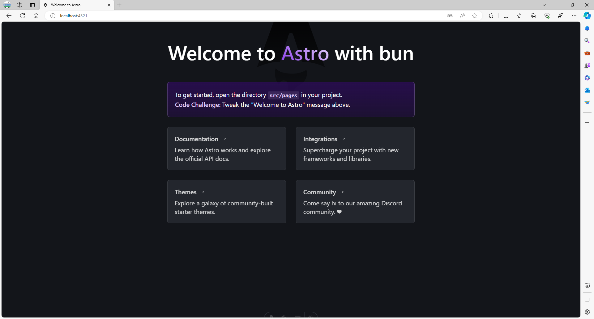
  - [jQuery 3.7.1](https://jquery.com/)
    - [Chart.js 4.4.1](https://www.chartjs.org/docs/latest/)
      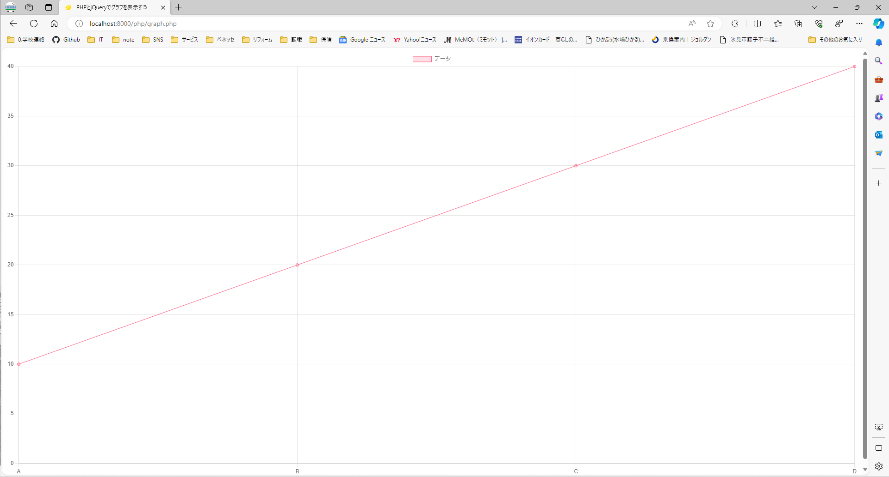
  - [Babylon.JS 6.0](https://www.babylonjs.com/)
    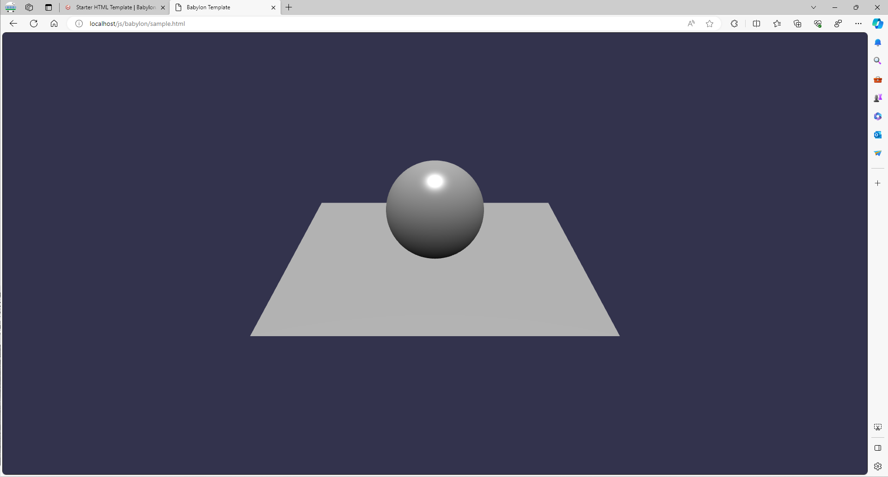
  - [Next.js](https://nextjs.org/) / [Vercel](https://vercel.com/)
    - [Nextjs-blog](https://github.com/Tatsukiyoshi/nextjs-blog)
    - [Vercel](https://vercel.com/tatsukiyoshi/)
    - Vercelホスティングサービス
      - プロジェクト（ローカルリポジトリ）の作成
        ```sh
        npx create-next-app nextjs-blog --use-npm --example "https://github.com/vercel/next-learn/tree/master/basics/learn-starter"
        ```
      - Githubリポジトリ作成
      - Githubへプッシュする
        ```sh
        git remote add origin https://github.com/Tatsukiyoshi/nextjs-blog.git
        git push -u origin main
        ```
      - DPS Workflow
        Pull Requestを発行すると、VercelでPreviewすることができ、Mergeすると、正式サイト（Production）に昇格する。<BR>
        Develop -> Preview -> Ship
    - [Next.js and Bun](https://bun.sh/guides/ecosystem/nextjs)
      ```
      bun create next-app
      ```
    - Next.js 13新機能
      - Appフォルダ
        ```
        npx create-next-app nextjs13-sample --ts --experimental-app --use-npm
        ```
        [（参考）Next.js 13 で開発方法はどう変わる？](https://zenn.dev/jtakahashi64/articles/a9d2ae3285ceb6)
        - Error対策
          - https://nextjs.org/docs/messages/link-no-children
          - https://nextjs.org/docs/messages/react-hydration-error
      - TurboPack
        ```sh
        npx create-next-app --ts --example with-turbopack
        ```
        [Next.js 13の新機能のTurbopackを試してみる](https://zenn.dev/saltedlemon/articles/fa4104d5041a26)
        ↓
        これであれば、Appフォルダも使えるようになっていた。
  - T3 Stack
    - [Drizzle + PostgreSQL](https://github.com/EthanAmato/T3-Postgres-Drizzle-Template)
  - React
    - React 19
      - Install
        ```
        npm install react@rc react-dom@rc
        ```
      - Update package.json for using typescript
        ```json
        {
          "dependencies": {
            ...
            "@types/react": "npm:types-react@rc",
            "@types/react-dom": "npm:types-react-dom@rc"
            ...
          },
          "overrides": {
            "@types/react": "npm:types-react@rc",
            "@types/react-dom": "npm:types-react-dom@rc"
          }
        }
        ```
      - Migration
        ```
        npx codemod@latest react/19/migration-recipe
        ```
        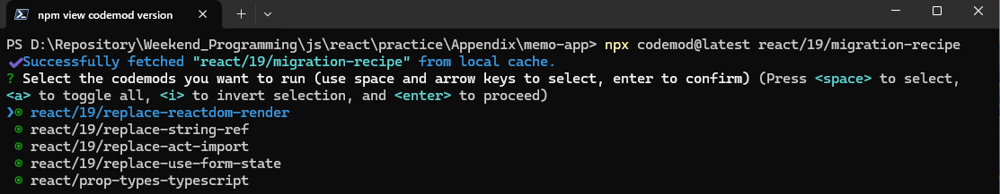
        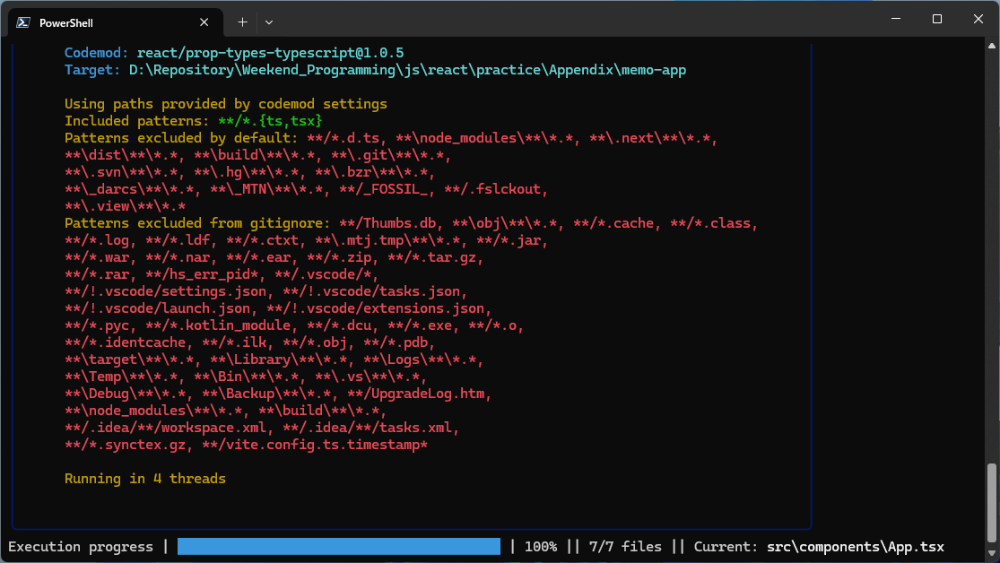
        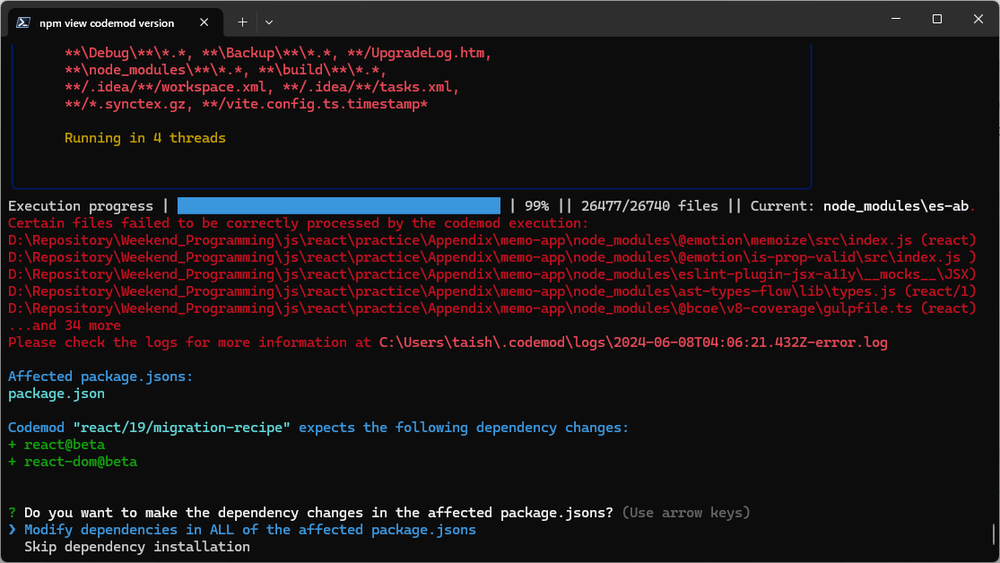

        - node_modules等は、除外するとメッセージしておきながら、ファイルがあると走査対象になり、しまいには、エラーとなる始末。
          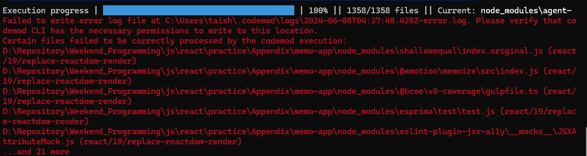
          なので、node_modulesは削除して実行しましょう！ <BR />
          そうすれば、package.jsonによるDependencyの更新も行わない。
    - React 18.3.1
      - browserslistの更新
        ```
        bun add update-browserslist-db@latest
        ```
      - web-vitals は更新せず
    - [ReactGrid](https://reactgrid.com/) - 表形式でのデータ表示・更新が可能なライブラリ
      ```
      bun create vite <Project Name>
      bun install @silevis/reactgrid
      ```
    - [react-chartjs-2](https://react-chartjs-2-two.vercel.app/) - 多彩なグラフ表示が可能なライブラリ
      ```
      bun create vite <Project Name>
      bun add chart.js react-chartjs-2
      ```
    - モダンJavaScriptの基礎から始める挫折しないためのReact入門＠Udemy
    - [Tutorial](https://ja.reactjs.org/tutorial/tutorial.html) **@2021/10/10** <span style="color: red;">*Finished!*</span>
  - [Svelte](https://svelte.dev/)
    - [SvelteとReactの基本を比較](https://www.twilio.com/blog/react-svelte-comparing-basics-jp)
    - [Svelteのポート番号変更](https://stackoverflow.com/questions/57578775/how-to-change-the-default-port-5000-in-svelte)
    - ポート番号変更(package.json)
      ```json
      "scripts": {
        "build": "rollup -c",
        "dev": "rollup -c -w",
        "start": "sirv public --no-clear --port 8083",
        "check": "svelte-check --tsconfig ./tsconfig.json",
        "tauri": "tauri"
      },
      ```
  - [Angular](https://angular.dev/)
    - [Angular日本語ドキュメンテーション―ローカル環境とワークスペースのセットアップ](https://angular.jp/guide/setup-local)
    - ノウハウ
      1.  コマンド
          * ng &lt;command&gt;
            - Commands:
              |Command | |
              |-|-|
              |ng analytics                  |Configures the gathering of Angular CLI usage metrics. &lt;BR&gt;See https://angular.io/cli/usage-analytics-gathering|
              |ng completion                 |Set up Angular CLI autocompletion for your terminal.
              |ng config [json-path] [value] |Retrieves or sets Angular configuration values in the angular.json file for the workspace.
              |ng doc &lt;keyword&gt;              |Opens the official Angular documentation (angular.io) in a browser, and searches for a given keyword.  [aliases: d]
              |ng new [name]                 |Creates a new Angular workspace.  [aliases: n]
              |ng version                    |Outputs Angular CLI version.  [aliases: v]
            - Options:
              | | |
              |-|-|
              |--help  |Shows a help message for this command in the console.  [boolean]

              The above commands are available when running the Angular CLI outside a workspace.More commands are available when running inside a workspace.
              For more information, see https://angular.io/cli/.
      1.  Quick Start
          ```sh
          git clone https://github.com/angular/quickstart.git
          ```
      1.  Angular 19対応
          - Update Dependencies
            |Component            |Version
            |---------------------|--------
            |rxjs                 |7.8.1
            |tslib                |2.8.1
            |zone.js              |0.15.0
            |@types/jasmine       |5.1.5
            |jasmine-core         |5.4.0
            |karma                |6.4.4
            |karma-chrome-launcher|3.2.0
            |karma-coverage       |2.2.1
            |karma-jasmine        |5.1.0
          - [Migration to Standalone](https://angular.dev/reference/migrations/standalone)
            ```
            ng generate @angular/core:standalone
            ```
          - Additional actions
            - import FormsModule
              ```js
              import { FormsModule } from '@angular/forms';

              @Component({
                imports: [FormsModule],
                ...
              })
              ```
              - conditions
                - ngModel
                  ```html
                  <input id="name" name="name" type="text" autocomplete="additional-name" [(ngModel)]="myName" />
                  ```
            - import CommonModule
              ```js
              import { CommonModule } from '@angular/common';
              
              @Component({
                imports: [CommonModule],
                ...
              })
              ```
              - conditions
                - pipe
                  ```html
                  <li>{{ary | slice: 3}}</li>
                  ```
                - NgClass
                  ```html
                  <div [ngClass]="styles">
                  ```
                - NgFor
                  ```html
                  <tr *ngFor="let b of books">
                  ```
                - NgIf
                - NgPlural
                - NgStyle
                - NgSwitch
                - NgTemplateOutlet
            - import ReactiveFormsModule
              ```js
              import { FormGroup, FormControl,
                FormBuilder, Validators, 
                ReactiveFormsModule} from '@angular/forms'

              @Component({
                imports: [CommonModule, ReactiveFormsModule],
                ...
              })
              ```
          - Trouble Shooting
            - NG8002: Can’t bind to ‘ngModel’ since it isn’t a known property of ‘input’.
              - FormsModuleをインポートする
                ```js
                import { FormsModule } from '@angular/forms';

                @Component({
                  imports: [FormsModule],
                  ...
                })
                ```
            - NG8004: No pipe found with name ‘...’.
              - CommonModuleをインポートする
                ```js
                import { Component } from '@angular/core';
                
                @Component({
                  imports: [CommonModule],
                  ...
                })
                ```
      1.  Angular 18対応
          - [Update Guide](https://angular.dev/update-guide)
            - プロジェクトのルートで下記を実行する <BR />
              配下のファイルをリポジトリからチェックアウトした状態で実行すること
              ```
              ng update @angular/core@18 @angular/cli@18
              ```
          - AbstractControlをFormControlにキャストする
            ```
            [formControl]="$any(myForm).controls['mail']"
            ```
          - angular-in-memory-web-apiの更新
            ```json
            "dependencies": {
              ...
              "angular-in-memory-web-api": "^0.18.0",
              ...
            },
            ```
      1.  Angular 17対応
          - ライブラリのバージョン変更
            |ライブラリ                  |バージョン|
            |---------------------------|----------|
            |zone.js                    |0.14.0
            |typescript                 |5.2.2
      1.  Angular 16対応
          - esbuild対応(angular.json)
            ```json
            "architect": {
              "build": {
                "builder": "@angular-devkit/build-angular:browser-esbuild",
              }
            }
            ```
          - ライブラリのバージョン変更
            |ライブラリ                  |バージョン|
            |---------------------------|----------|
            |zone.js                    |0.13.0
            |typescript                 |4.9.3
      1.  Angular 15対応
          - ライブラリのバージョン変更
            |ライブラリ                  |バージョン|
            |---------------------------|----------|
            |zone.js                    |0.12.0
            |@types/jasmine             |4.3.0
            |jasmine-core               |4.5.0
            |karma                      |6.4.0
            |karma-chrome-launcher      |3.1.0
            |karma-coverage             |2.2.0
            |karma-jasmine              |5.1.0
            |karma-jasmine-html-reporter|2.0.0
            |typescript                 |4.8.2
          - ECMA Version
            tsconfig.jsonにて、targetをES2022にしていない場合、
            ```json
            "target": "es2020",
            ```
            実行時（ng serve）に下記警告メッセージが出力される。
            ```
            TypeScript compiler options "target" and "useDefineForClassFields" are set to "ES2022" and "false" respectively by the Angular CLI. To control ECMA version and features use the Browerslist configuration. For more information, see https://angular.io/guide/build#configuring-browser-compatibility
            ```
      1.  [ngx-bootstrap](https://valor-software.com/ngx-bootstrap)
          [Get Started](https://valor-software.com/ngx-bootstrap/#/documentation#getting-started)

      1.  [ng2-validation](https://github.com/yuyang041060120/ng2-validation)
      1.  [国際化対応](https://angular.jp/guide/i18n-common-overview)
          - 設定ファイル（Angular.json）
            - 作成した翻訳ファイルの格納場所を設定する
              ```json
              "i18n": {
                "locales": {
                  "ja": {
                    "translation": "src/locale/messages.ja.xlf"
                  }
                }
              }
              ```
            - 国際化対応を含むこと、および対応するロケールを明示する
              ```json
              "build": {
                "builder": "@angular-devkit/build-angular:browser",
                "options": {
                  "localize": true,
                  ...
                },
                "configurations": {
                  "ja": {
                    "localize": ["ja"]
                  },
                }
              }
              ```
            - 開発サーバは、１つのロケールしか扱えないため、そのロケールを明示する
              ```json
              "serve": {
                "builder": "@angular-devkit/build-angular:dev-server",
                "configurations": {
                  "ja": {
                    "browserTarget": "i18n:build:development,ja"
                  },
                }
              }
              ```
          - 開発サーバの起動（Configurationを指定する）
            ```
            ng serve -c "ja"
            ```
      1.  in-memory-web-api
          - [Angular in-memory-web-api を使う](https://watermargin.net/programming/angular/in-memory-web-api/)
      1.  rxjs
          - [【Rxjs基礎講座】RxJSのMap系メソッドをコーディングしながら具体的にどう違うか考えてみる](https://deep.tacoskingdom.com/blog/53)
          - [Property 'of' does not exist on type 'typeof Observable [duplicate]](https://stackoverflow.com/questions/38067580/property-of-does-not-exist-on-type-typeof-observable)
      1.  Karma + Jasmine
          - 結果サンプル
            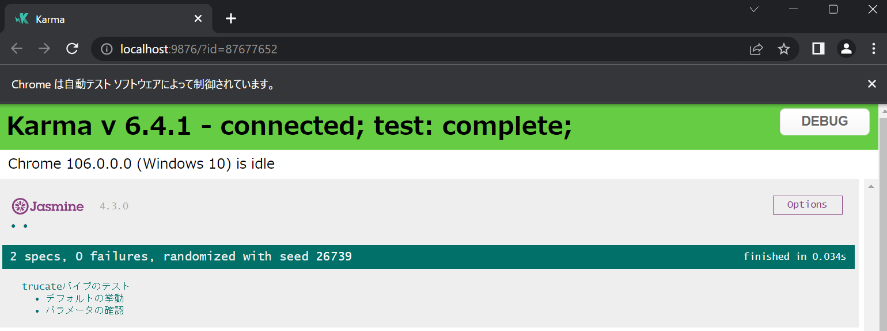

      <details>
      <summary>トラブルシューティング</summary>

      1.  パッケージインストールでのエラー 
          ```
          npm WARN EBADENGINE Unsupported engine {
          npm WARN EBADENGINE   package: 'karma@1.7.1',
          npm WARN EBADENGINE   required: { node: '0.10 || 0.12 || 4 || 5 || 6 || 7 || 8' },
          npm WARN EBADENGINE   current: { node: 'v16.15.0', npm: '8.5.5' }
          npm WARN EBADENGINE }
          npm WARN EBADENGINE Unsupported engine {
          npm WARN EBADENGINE   package: 'karma-cli@1.0.1',
          npm WARN EBADENGINE   required: { node: '0.10 || 0.12 || 4 || 5 || 6' },
          npm WARN EBADENGINE   current: { node: 'v16.15.0', npm: '8.5.5' }
          npm WARN EBADENGINE }
          npm WARN deprecated source-map-url@0.4.1: See https://github.com/lydell/source-map-url#deprecated
          npm WARN deprecated urix@0.1.0: Please see https://github.com/lydell/urix#deprecated
          npm WARN deprecated har-validator@5.1.5: this library is no longer supported
          npm WARN deprecated json3@3.3.2: Please use the native JSON object instead of JSON 3
          npm WARN deprecated chokidar@1.7.0: Chokidar 2 will break on node v14+. Upgrade to chokidar 3 with 15x less dependencies.
          npm WARN deprecated source-map-resolve@0.5.3: See https://github.com/lydell/source-map-resolve#deprecated
          npm WARN deprecated resolve-url@0.2.1: https://github.com/lydell/resolve-url#deprecated
          npm WARN deprecated minimatch@0.3.0: Please update to minimatch 3.0.2 or higher to avoid a RegExp DoS issue
          npm WARN deprecated uuid@3.4.0: Please upgrade  to version 7 or higher.  Older versions may use Math.random() in certain circumstances, which is known to be problematic.  See https://v8.dev/blog/math-random for details.
          npm WARN deprecated request@2.88.2: request has been deprecated, see https://github.com/request/request/issues/3142    
          npm WARN deprecated @angular/http@4.3.6: Package no longer supported. Use @angular/common instead, see https://angular.io/guide/deprecations#angularhttp
          npm WARN deprecated core-js@2.6.12: core-js@<3.4 is no longer maintained and not recommended for usage due to the number of issues. Because of the V8 engine whims, feature detection in old core-js versions could cause a slowdown up to 100x even if nothing is polyfilled. Please, upgrade your dependencies to the actual version of core-js.
          ```
      1.  ビルドエラー
          ```
          PS D:\Repository\Tatsukiyoshi\Weekend_Programming\js\angular\quickstart> npm run build

          > agular-quickstart@1.0.0 build
          > tsc -p src/

          node_modules/@types/component-emitter/index.d.ts(8,25): error TS1005: ',' expected.
          node_modules/@types/cors/index.d.ts(41,52): error TS1005: ',' expected.
          node_modules/@types/cors/index.d.ts(47,44): error TS1005: ',' expected.
          node_modules/@types/cors/index.d.ts(47,47): error TS1005: ',' expected.
          node_modules/@types/node/index.d.ts(20,1): error TS1084: Invalid 'reference' directive syntax.
          ```
      1.  ビルドエラーに対する対策
          1.  バリデーションチェックの記述
          * プロパティアクセスの記述が変更になり、古い記述だとエラーになる。
            ```
            error TS4111: Property 'minlength' comes from an index signature, so it must be accessed with ['minlength'].
            ```
              *   旧型式
                  ```
                      <span *ngIf="mail.errors?.required">メールアドレスは必須です。</span>
                  ```
              *   新形式
                  ```
                      <span *ngIf="mail.errors?.['required']">メールアドレスは必須です。</span>
                  ```
      1.  depandapotによる依存関係更新後のビルド確認
          1.  パッケージ再インストール <BR />
              そもそも、Windows 10の再セットアップ後、@angularをセットアップしていなかったので、再セットアップ
              ```
              npm install -g @angular/xxx
              ```
          1.  ビルド実行
              ```
              > ng build
              You seem to not be depending on "@angular/core" and/or "rxjs". This is an error.
              ```
          1.  ビルドエラーに対する対策
              https://stackoverflow.com/questions/49537782/you-seem-to-not-be-depending-on-angular-core
              ```
              > npm update @angular/core
              ```
              > npm install -g webpack-dev-server
              ```
              > npm install -g webpack
              ```
          1.  キャッシュのクリア
              ```
              >npm cache clean
              npm ERR! As of npm@5, the npm cache self-heals from corruption issues and data extracted from the cache is guaranteed to be valid. If you want to make sure everything is consistent, use 'npm cache verify' instead. On the other hand, if you're debugging an issue with the installer, you can use `npm install --cache /tmp/empty-cache` to use a temporary cache instead of nuking the actual one.
              npm ERR!
              npm ERR! If you're sure you want to delete the entire cache, rerun this command with --force.
              npm ERR! A complete log of this run can be found in:
              npm ERR!     C:\Users\taish\AppData\Roaming\npm-cache\_logs\2019-06-23T06_53_10_230Z-debug.log

              >npm\ cache clean --force
              npm WARN using --force I sure hope you know what you are doing.
              [..................] / : WARN using --force I sure hope you know what you are doing.                                    
              ```
          1.  ビルド後の確認
              1.  http-serverのインストール
                  ```
                  > npm install -g http-server
                  ```
              1.  http-serverの起動
                  ```
                  > http-server .\dist\vs-angular -p3000 -c-1 -o
                  ```
      </details>
    - vs-angular
      - VSCodeを使おう（日経ソフトウェア 2019年7月号）
      - [Angularプロジェクトの作成](https://qiita.com/KaoruIto76/items/272c7724aa8bbc45d591)
    - basic_20190223
      - AngularによるモダンWeb開発 基礎編 第2版 ダイジェスト版（日経ソフトウェア 2019年5月号 付録）
  - [Vue.js](https://jp.vuejs.org/index.html)
    - [eslint-plugin-vue](https://eslint.vuejs.org/)
    - [Vue3 + TypeScript + Prettier に対応した ESLint Flat Config の最小構成](https://zenn.dev/shun91/articles/min-eslint-flat-config-for-vue3-ts-prettier)
    - [TypeScriptで学ぶJavaScriptフレームワーク「Vue.js」の利用法](https://codezine.jp/article/detail/14451)
    - プロジェクト作成
      - TypeScriptのインストール
        ```
        npm install --save-dev typescript
        ```
      - @vue/cliのインストール
        ```
        npm install -g @vue/cli
        ```
      - Vue/cliでのプロジェクト作成
        ```
        vue create <プロジェクト名>
        ```
    - Vite 6
      - [Vite CJS Node API deprecated](https://vite.dev/guide/troubleshooting.html#vite-cjs-node-api-deprecated)
    - Viteでのプロジェクト作成
      ```
      npm init vite@latest
      ```
      - プロジェクト名を入力
      - Vueを選択
      - TypeScriptを選択
    - Denoでのプロジェクト作成
      ```
      $ deno run -A npm:create-vite-extra --template deno-vue
      ```
    - nuxt.jsでのプロジェクト作成
      ```
      npx create-nuxt-app <project-name>
      ```
    - nuxt.jsでのアップデート
      ```
      npx nuxi upgrade
      ```
### Others
- electron
  - [Electronでアプリケーションを作ってみよう](https://qiita.com/Quramy/items/a4be32769366cfe55778)
- ml5 - 日経ソフトウェア 2019年5月号
- jskanji - VSCodeを使おう（日経ソフトウェア 2019年7月号）
