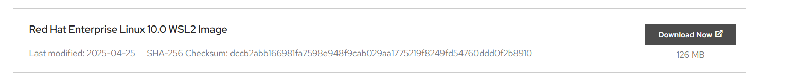

# RHEL10 on WSL

- Red Hat Developerへの登録
  - [Subscription](https://access.redhat.com/management/subscriptions)
    - Red Hat Developer Subscription for Individuals が有効になっていることを確認

- [WSL2 イメージのダウンロード](https://access.redhat.com/downloads/content/479/ver=/rhel---10/10.0/x86_64/product-software)
  

- WSLイメージのインポート
  - 管理者でPowerShellを起動して実行する
    ```
    wsl --import RHEL10 D:\work\wsl_distros\rhel10 C:\Users\taish\Downloads\rhel-10-wsl.tar.gz --version 2
    ```

- RHEL10の初回起動
  ```
  wsl -d RHEL10
  ```

  - RHELの登録とサブスクリプションの有効化
    ```
    sudo subscription-manager register
    ```
    - Red Hatのアカウントとパスワードを入力する

  - サブスクリプションの確認
    ```
    sudo subscription-manager status
    ```
    - 下記のように出力されれば、問題なし
      ```sh
      +-------------------------------------------+
        System Status Details
      +-------------------------------------------+
      Overall Status: Registered
      ```

  - バージョン確認
    ```
    cat /etc/os-release
    ```

  - システムの更新
    ```
    sudo dnf update -y
    ```

  - 非特権ユーザの作成
    ```
    useradd -m -G wheel <あなたのユーザー名>
    ```
  - パスワードの設定
    ```
    passwd <あなたのユーザー名>
    ```

- RHEL10の起動
  ```
  wsl -d RHEL10 -u <あなたのユーザー名>
  ```
  - ターミナルのプロファイルに登録しておくとよい
