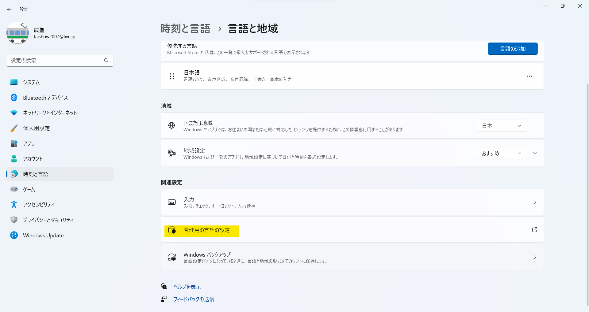
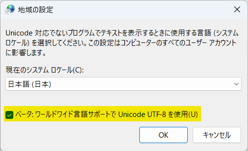

#   ノウハウ

1.  [USBメモリの復旧](https://jp.easeus.com/partition-manager/fix-usb-drive-incorrect-size.html)
1.  [Dev Channelへの変更](https://mitomoha.hatenablog.com/entry/2023/08/11/010623)
1.  システムロケールの変更 <BR>
    VSCodeでターミナル等の出力が化ける場合、システムロケールとしてUTF-8を使用する設定を有効にする
    1.  設定アプリで言語と地域を開き、管理用の言語の設定をクリック
        
    1.  地域ダイアログの「システムロケールの変更」をクリック
        
    1.  地域の設定ダイアログの「ベータ：ワールドワイド言語サポートでUnicode UTF-8を使用」にチェック
        
    1.  再起動するまで変更が有効にならないので、再起動する
1.  PowerShell
    - 環境変数の確認
      ```shell
      $env:Path.Split(";")
      ```
    - [文字エンコードについて](https://learn.microsoft.com/ja-jp/powershell/module/microsoft.powershell.core/about/about_character_encoding?view=powershell-7.3)
      - PowerShell上でUTF-8(BOMなし)に変更する
        ```shell
        $PSDefaultParameterValues['Out-File:Encoding'] = 'utf8'
        ```
      - VSCodeでPowerShellを開くときに変更するよう設定する
        ```json
            "terminal.integrated.profiles.windows": {
                "PowerShell": {
                    "source": "PowerShell",
                    "icon": "terminal-powershell",
                    "args": [
                        "-Command",
                        "$PSDefaultParameterValues['Out-File:Encoding'] = 'utf8'"
                    ]
                },
                "Command Prompt": {
                    "path": [
                        "${env:windir}\\Sysnative\\cmd.exe",
                        "${env:windir}\\System32\\cmd.exe"
                    ],
                    "args": [],
                    "icon": "terminal-cmd"
                },
                "Git Bash": {
                    "source": "Git Bash"
                }
            },
        ```
