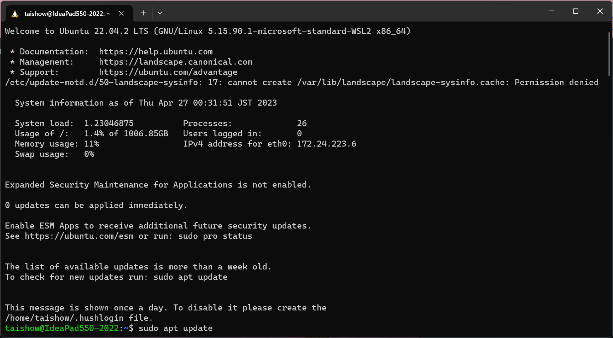

-   Ubuntu 22.04.3
    
-   Ubuntu 22.04.2
    
    ```
    PRETTY_NAME="Ubuntu 22.04.2 LTS"
    NAME="Ubuntu"
    VERSION_ID="22.04"
    VERSION="22.04.2 LTS (Jammy Jellyfish)"
    VERSION_CODENAME=jammy
    ID=ubuntu
    ID_LIKE=debian
    HOME_URL="https://www.ubuntu.com/"
    SUPPORT_URL="https://help.ubuntu.com/"
    BUG_REPORT_URL="https://bugs.launchpad.net/ubuntu/"
    PRIVACY_POLICY_URL="https://www.ubuntu.com/legal/terms-and-policies/privacy-policy"
    UBUNTU_CODENAME=jammy
    ```
